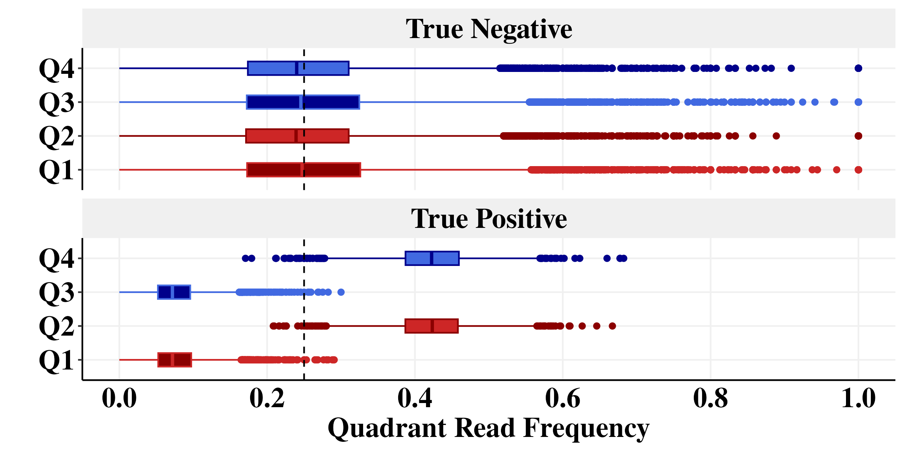

```{r, include = FALSE}
knitr::opts_chunk$set(
  collapse = TRUE,
  comment = "#>",
  fig.path = "Figures/Figure1-",
  out.width = "100%", 
  eval = FALSE
)
```

```{r}
library(foreach)
library(GenomicRanges)
library(readr)
library(rtracklayer)
library(scales)
library(plyranges)
library(nlme)
library(lme4)
library(viridis)
library(ggridges)
library(RColorBrewer)
library(cowplot)
library(gridExtra)
library(doParallel)
library(data.table)
library(Signac)
library(plyr)
library(dplyr)
library(ggplot2)
library(tidyverse)

num_cores = 8
registerDoParallel(cores=num_cores)
```

# Set the path
This is where we stored all those files in the protocol.
```{r}
path <- "/aryeelab/users/corri/data/replicate_FF_results/"
```

# Figure 2A

```{r}
chr <- "chr1"
pairs <- readRDS(paste0("/aryeelab/users/corri/data/CTCF_chr_pairs/k562_ctcf_",chr, ".RDS"))
pairs_CTCF<- pairs
```


```{r}
ctcf_gr <- readRDS(file = "/aryeelab/users/corri/data/ALL_FIMO_CTCF_hg38.RDS")
```

```{r}
ctcf_loc <- (30779763+30779781)/2
pairs <- pairs_CTCF
print("Index pairs")
left_anchor <- pairs %>% 
  dplyr::select(chr1, pos1, strand1) %>% 
  rename(chr = chr1, pos = pos1, strand = strand1) 
right_anchor <- pairs %>% 
  dplyr::select(chr2, pos2, strand2) %>% 
  rename(chr = chr2, pos = pos2, strand = strand2) 
pairs_no_direction <- rbind(left_anchor, right_anchor)
pairs <- pairs_no_direction


r1_gr <- GRanges(pairs$chr, IRanges(pairs$pos, pairs$pos))

width <- 1250
right_anchor <- GRanges("chr1", IRanges(ctcf_loc - width, ctcf_loc + width))

idx2 <- queryHits(findOverlaps(r1_gr, right_anchor))
```

```{r, fig.width =8,fig.height = 4}
ctcf_df <- ctcf_gr %>% subsetByOverlaps(c(right_anchor)) %>% as.data.frame() %>%
  mutate(direction_symbol =  ifelse(strand=="+", ">", "<"),
         y_adjust = ifelse(strand=="+", 1, 0.9))

bin_size <- 5

summ <- pairs[idx2,] %>% 
  mutate(pos = round(pos/bin_size)*bin_size) %>%
  group_by(pos, strand) %>%
  summarize(n=n()) %>% mutate(n=n*ifelse(strand=="+", 1, -1))
# Fill in zero reads for missing positions (i.e. those with no reads to summarize)
x <- seq(start(right_anchor), end(right_anchor), bin_size)
summ <- rbind(summ, 
              data.frame(pos=x, strand="+", n=0), 
              data.frame(pos=x, strand="-", n=0)) %>%
  group_by(pos, strand) %>% 
  summarize(n=sum(n))

arrow_MNase_NO_filt <- -max(abs(summ$n))

p1 <- summ %>%
  mutate(pos = pos- ctcf_loc) %>% 
  ggplot(aes(pos, n)) + geom_line(aes(color=strand), size=0.5) +
  scale_x_continuous(labels = comma_format(), limits=c(-1250,1250),breaks = seq(-1000,1000,500)) +
  scale_y_continuous(labels = comma_format(), limits=c( -max(abs(summ$n)), max(abs(summ$n))),
                     breaks = seq(- 400,400,200)) +
  annotate("text", x = 0, y = arrow_MNase_NO_filt, label = "<", color="black",family = "Times New Roman",size = 8,fontface =2) +
  annotate("text", x = -1100, y = arrow_MNase_NO_filt, label = "CTCF",family = "Times New Roman",size = 5,fontface =2) +
  annotate("text", x = -1100, y = 0.75*max(abs(summ$n)), label = "+ Reads", color="darkred",family = "Times New Roman",size = 5,fontface =2) +
  annotate("text", x = -1100, y = -0.75*max(abs(summ$n)), label = "- Reads", color="darkblue",family = "Times New Roman",size = 5,fontface =2) +
  scale_color_manual(values=c("+"="darkred", "-"="darkblue")) +
  theme(legend.position = "none") +
  ggtitle("All reads") +
  theme_classic()+
  theme(panel.grid.major = element_line(color = "#f0f0f0",
                                        size = 0.5))+
  theme(plot.title = element_text(color = "black", family = "Times New Roman", size = 18, face = "bold"),
        axis.text.x = element_text(color = "black", family = "Times New Roman", size = 18,face = "bold"),
        axis.text.y = element_text(color = "black", family = "Times New Roman", size = 18,face = "bold"),
        axis.title.x = element_text(color = "black", family = "Times New Roman", size = 18,face = "bold"),
        axis.title.y = element_text(color = "black", family = "Times New Roman", size = 18,face = "bold"),
        axis.ticks.x=element_blank(),
        legend.text=element_text(color = "black", family = "Times New Roman", size =18,face = "bold"),
        legend.title=element_text(color = "black", family = "Times New Roman", size = 18,face = "bold"),
        strip.text.x = element_text(color = "black", family = "Times New Roman", size = 18,face = "bold"),
        strip.background=element_rect(colour="#f0f0f0",fill="#f0f0f0"))+
  xlab("Distance from CTCF Motif") +
  theme(legend.position = "none")+
  geom_vline(xintercept = 0, col = "magenta", linetype=2) +
  geom_vline(xintercept = 0, col = "magenta", linetype = "dashed")

p1
ggsave(paste0(path,"2A_all_fragments.png"), width=8, height=4)
```


# Figure 2B
```{r}
ctcf_loc <- (30779763+30779781)/2
pairs <- pairs_CTCF 
print("Index pairs")

left_anchor <- pairs %>% 
  filter(type %in% c("uu", "uU", "UR")) %>% 
  select(chr1, pos1, strand1, type) %>% 
  rename(chr = chr1, pos = pos1, strand = strand1) 

right_anchor <- pairs %>% 
  filter(type %in% c("uu", "Uu", "RU")) %>% 
  select(chr2, pos2, strand2, type) %>% 
  rename(chr = chr2, pos = pos2, strand = strand2) 

pairs_no_direction <- rbind(left_anchor, right_anchor)
pairs <- pairs_no_direction

r1_gr <- GRanges(pairs$chr, IRanges(pairs$pos, pairs$pos))

width <- 1250

left_anchor <- GRanges("chr1", IRanges(ctcf_loc - width, ctcf_loc + width))
right_anchor <- GRanges("chr1", IRanges(ctcf_loc - width, ctcf_loc + width))

idx2 <- queryHits(findOverlaps(r1_gr, right_anchor))
```


```{r, fig.width = 8, fig.height = 4}
ctcf_loc <- (30779763	+30779781)/2

ctcf_df <- ctcf_gr %>% subsetByOverlaps(c(left_anchor, right_anchor)) %>% as.data.frame() %>%
  mutate(direction_symbol =  ifelse(strand=="+", ">", "<"),
         y_adjust = ifelse(strand=="+", 1, 0.9))

bin_size <- 5

summ <- pairs[idx2,] %>% 
  mutate(pos = round(pos/bin_size)*bin_size) %>%
  group_by(pos, strand) %>%
  summarize(n=n()) %>% mutate(n=n*ifelse(strand=="+", 1, -1))
# Fill in zero reads for missing positions (i.e. those with no reads to summarize)
x <- seq(start(right_anchor), end(right_anchor), bin_size)
summ <- rbind(summ, 
              data.frame(pos=x, strand="+", n=0), 
              data.frame(pos=x, strand="-", n=0)) %>%
  group_by(pos, strand) %>% 
  summarize(n=sum(n))
arrow_MNase_filt <- -max(abs(summ$n))

p2 <- summ %>%
  mutate(pos = pos- ctcf_loc) %>% 
  ggplot(aes(pos, n)) + geom_line(aes(color=strand), size=0.5) +
  scale_x_continuous(labels = comma_format(), limits=c(-1250,1250),breaks = seq(-1000,1000,500)) +
  scale_y_continuous(labels = comma_format(), limits=c( -max(abs(summ$n)), max(abs(summ$n))),
                     breaks = seq(- 400,400,200)) +
  annotate("text", x = 0, y = arrow_MNase_filt, label = "<", color="black",family = "Times New Roman",size = 8,fontface =2) +
  annotate("text", x = -1100, y = arrow_MNase_filt, label = "CTCF",family = "Times New Roman",size = 5,fontface =2) +
  annotate("text", x = -1100, y = 0.75*max(abs(summ$n)), label = "+ Reads", color="darkred",family = "Times New Roman",size = 5,fontface =2) +
  annotate("text", x = -1100, y = -0.75*max(abs(summ$n)), label = "- Reads", color="darkblue",family = "Times New Roman",size = 5,fontface =2) +
  
  scale_color_manual(values=c("+"="darkred", "-"="darkblue")) +
  ggtitle("Short fragments") +
  xlab("Distance from CTCF Motif") +
  geom_vline(xintercept = - 75, col = "black", linetype=2) +
  geom_vline(xintercept = 75, col = "black", linetype=2) +
  annotate("text",x = 300, y = -175, label = "150 bp", size=5, col = "black",family = "Times New Roman",fontface =2)+
  annotate("segment", x=-75, xend=75, y = -175, yend=-175, colour = "black", arrow=arrow(ends='both',length = unit(0.2,"cm")))+
  geom_vline(xintercept = 0, col = "magenta", linetype = "dashed")+
  theme_classic()+
  theme(panel.grid.major = element_line(color = "#f0f0f0",
                                        size = 0.5))+
  theme(plot.title = element_text(color = "black", family = "Times New Roman", size = 18, face = "bold"),
        axis.text.x = element_text(color = "black", family = "Times New Roman", size = 18,face = "bold"),
        axis.text.y = element_text(color = "black", family = "Times New Roman", size = 18,face = "bold"),
        axis.title.x = element_text(color = "black", family = "Times New Roman", size = 18,face = "bold"),
        axis.title.y = element_text(color = "black", family = "Times New Roman", size = 18,face = "bold"),
        axis.ticks.x=element_blank(),
        legend.text=element_text(color = "black", family = "Times New Roman", size =18,face = "bold"),
        legend.title=element_text(color = "black", family = "Times New Roman", size = 18,face = "bold"),
        strip.text.x = element_text(color = "black", family = "Times New Roman", size = 18,face = "bold"),
        strip.background=element_rect(colour="#f0f0f0",fill="#f0f0f0"))+
  theme(legend.position = "none") 

p2
ggsave(paste0(path,"2C_short_fragments.png"), width=8, height=4)
```


# Figure 2C

Figure 2C is a schematic made in biorender, so no R code is required. (Inserted below for reference.)


# Figure 2D, 2F

```{r}
ctcf_loc <- (30779763	+30779781)/2

r1_gr <- GRanges(pairs$chr, IRanges(pairs$pos, pairs$pos))

right_anchor <- GRanges("chr1", IRanges(ctcf_loc - 200, ctcf_loc + 200))
idx2 <- queryHits(findOverlaps(r1_gr, right_anchor))


summ <- pairs[idx2,] %>%
  mutate(pos2 = pos- ctcf_loc)

check <- density(summ$pos2[summ$strand == "+"])
check_neg <- (density(summ$pos2[summ$strand == "-"]))

# plot the results of the density call
ctcf_150 <- ggplot(data.frame(x = check$x, y = check$y)) + 
  aes(x = x, y = y) + 
  geom_line(color = "darkred") +
  geom_line(aes(x = check_neg$x, y = -1 * check_neg$y), color="darkblue") +
  geom_vline(xintercept = 75, linetype = "dashed") +
  geom_vline(xintercept = -75, linetype = "dashed") +
  annotate("text", x = -180, y = -0.025, label = "CTCF",family = "Times New Roman",size = 5,fontface =2) +
  annotate("text", x = -180, y = 0.015, label = "+ Reads", color="darkred",family = "Times New Roman",size = 5,fontface =2) +
  annotate("text", x = -180, y = -0.015, label = "- Reads", color="darkblue",family = "Times New Roman",size = 5,fontface =2) +
  xlab("Distance from CTCF Motif") +
  ylab("Density") +
  annotate("text", x = 0, y = -0.025, label = "<", color="black",family = "Times New Roman",size = 8,fontface =2) +
  geom_hline(yintercept = 0, linetype=2) +
  scale_x_continuous(labels = comma_format(), limits=c(-200,200),breaks = c(-150,-75,0,75,150)) +
  
  annotate("text",x = 60, y = 0.015, label = "Q1", size=5, col = "darkred",family = "Times New Roman",fontface =2) + 
  annotate("text",x = -60, y = 0.015, label = "Q2", size=5, col = "darkred",family = "Times New Roman",fontface =2) + 
  annotate("text",x = -60, y = -0.015, label = "Q3", size=5, col = "darkblue",family = "Times New Roman",fontface =2) + 
  annotate("text",x = 60, y = -0.015, label = "Q4", size=5, col = "darkblue",family = "Times New Roman",fontface =2)  +
  
  annotate("text",x = -100, y = -0.005, label = "-75", size=5, col = "black",family = "Times New Roman",fontface =2)+
  annotate("text",x = 100, y = -0.005, label = "+75", size=5, col = "black",family = "Times New Roman",fontface =2)+
  
  annotate("text",x = 0, y = -0.034, label = "150 bp", size=5, col = "black",family = "Times New Roman",fontface =2)+
  annotate("segment", x=-75, xend=75, y = -0.04, yend=-0.04, colour = "black", arrow=arrow(ends='both'),size = 2)+
  ylim(c( -0.04, 0.04))+
  theme_classic()+
  theme(panel.grid.major = element_line(color = "#f0f0f0",
                                        size = 0.5))+
  theme(plot.title = element_text(color = "black", family = "Times New Roman", size = 18, face = "bold"),
        axis.text.x = element_text(color = "black", family = "Times New Roman", size = 18,face = "bold"),
        axis.text.y = element_text(color = "black", family = "Times New Roman", size = 18,face = "bold"),
        axis.title.x = element_text(color = "black", family = "Times New Roman", size = 18,face = "bold"),
        axis.title.y = element_text(color = "black", family = "Times New Roman", size = 18,face = "bold"),
        axis.ticks.x=element_blank(),
        legend.text=element_text(color = "black", family = "Times New Roman", size =18,face = "bold"),
        legend.title=element_text(color = "black", family = "Times New Roman", size = 18,face = "bold"),
        strip.text.x = element_text(color = "black", family = "Times New Roman", size = 18,face = "bold"),
        strip.background=element_rect(colour="#f0f0f0",fill="#f0f0f0"))
```

```{r}
script_dir <- "/aryeelab/users/corri/code/mnase-hichip/code/"
```


```{r}
ctcf_loc <- (30779763	+30779781)/2
source(paste0(script_dir,"get_quadrants_function.R"))
regions <- data.frame(chr1 = "chr1", s1 = ctcf_loc-width, e1 = ctcf_loc+width)
path <- "/aryeelab/users/corri/data/replicate_FF_results/"
pval_table <- paste0(path, "df_p_1e8.RDS")

reads <- get_quadrant_reads(regions = regions, step = 1, pairs = pairs_CTCF, num_cores=8, pval_table)
```

```{r}
linecol <- "magenta"

MM_plot <- reads%>% 
  mutate(pos = window_mid- ctcf_loc) %>% 
  ggplot(mapping = aes(x = pos, y = min_max)) +
  scale_x_continuous(labels = comma_format(), limits=c(-200,200),breaks = c(-150,-75,0,75,150)) +
  geom_point(col = "black", size = 0.5) +
  theme_classic()+
  theme(panel.grid.major = element_line(color = "#f0f0f0",
                                        size = 0.5))+
  theme(plot.title = element_text(color = "black", family = "Times New Roman", size = 18, face = "bold"),
        axis.text.x = element_text(color = "black", family = "Times New Roman", size = 18,face = "bold"),
        axis.text.y = element_text(color = "black", family = "Times New Roman", size = 18,face = "bold"),
        axis.title.x = element_text(color = "black", family = "Times New Roman", size = 18,face = "bold"),
        axis.title.y = element_text(color = "black", family = "Times New Roman", size = 18,face = "bold"),
        axis.ticks.x=element_blank(),
        legend.text=element_text(color = "black", family = "Times New Roman", size =18,face = "bold"),
        legend.title=element_text(color = "black", family = "Times New Roman", size = 18,face = "bold"),
        strip.text.x = element_text(color = "black", family = "Times New Roman", size = 18,face = "bold"),
        strip.background=element_rect(colour="#f0f0f0",fill="#f0f0f0"))+
  xlab("Distance from CTCF Motif ")+
  ylab("min/max")  +
  annotate("text", x = 0, y = 0, label = "<", color="black",family = "Times New Roman",size = 8,fontface =2) 

```


```{r, fig.height = 8, fig.width= 8}
linecol <-"magenta"
plot_grid(plotlist=list(ctcf_150+
                          geom_vline(xintercept = 0, col = linecol, linetype = "dashed"),
                        MM_plot+
                          geom_vline(xintercept = 0, col = linecol, linetype = "dashed")+
                          geom_hline(yintercept = 1, col = "black")), 
          ncol=1, align="hv", axis="tblr")

ggsave(paste0(path,"2E_G_density_pval.png"), width=8, height=8)

```


# Figure 2E
Look at Figure3.Rmd for how to generate Figure 2E - to make Figure 2E, you need datasets made in Figure 3 plots. For reference, this is what Figure 2E looks like:




