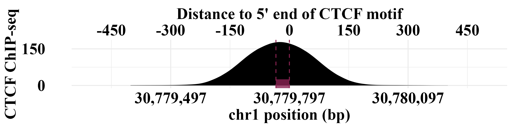
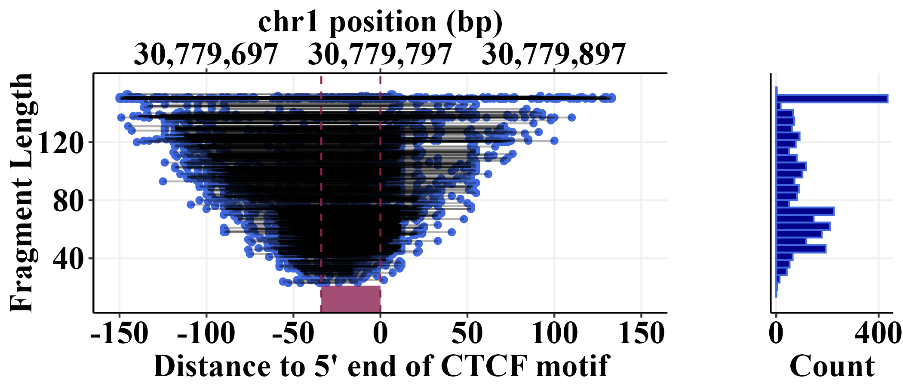
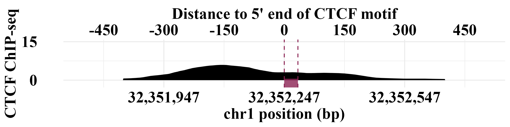
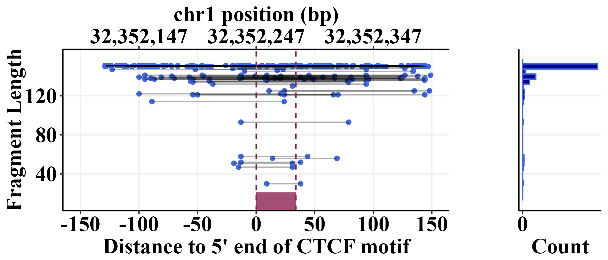
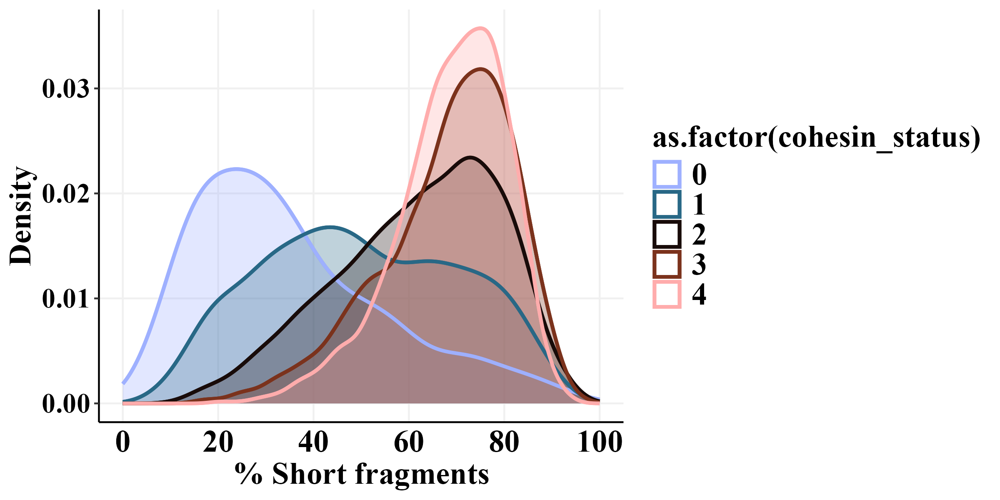
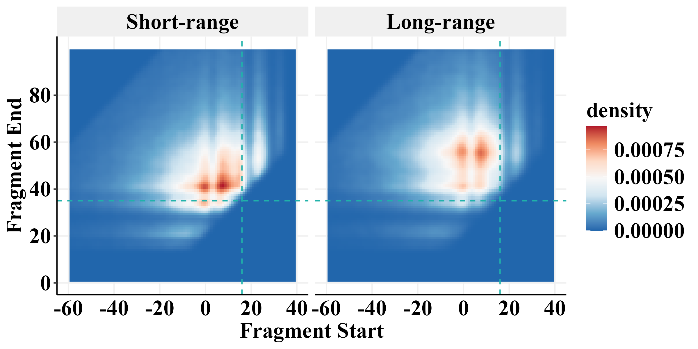
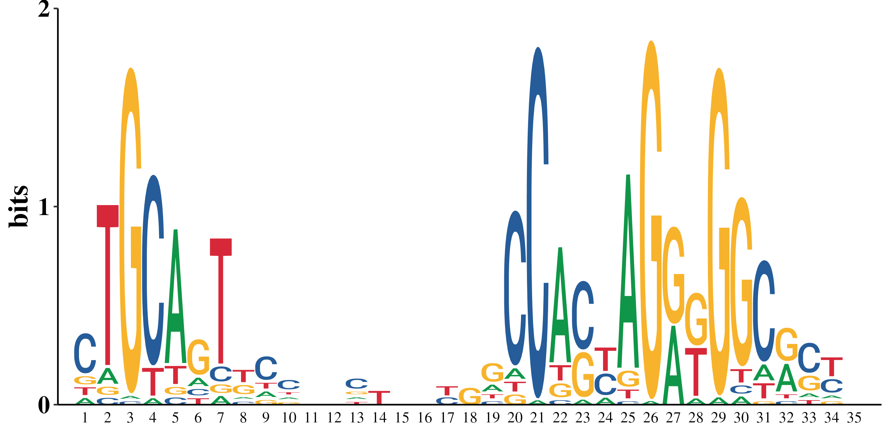
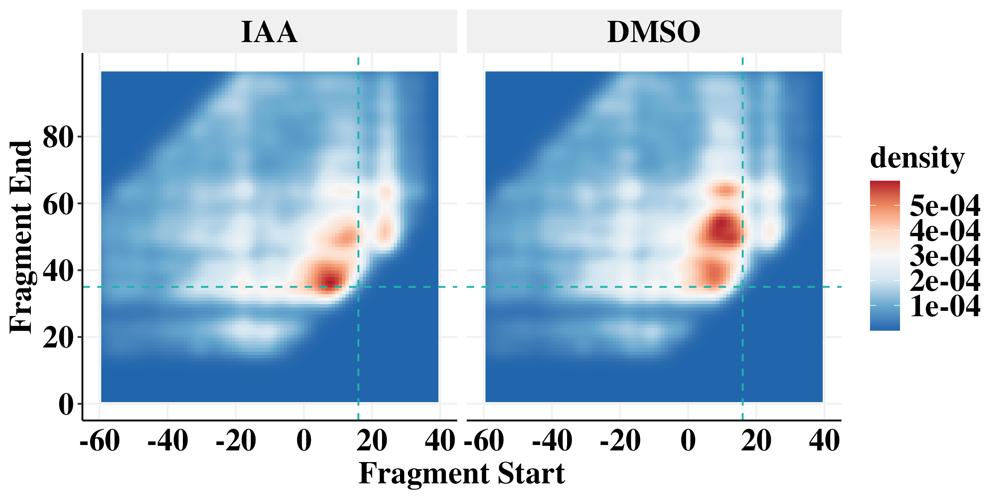
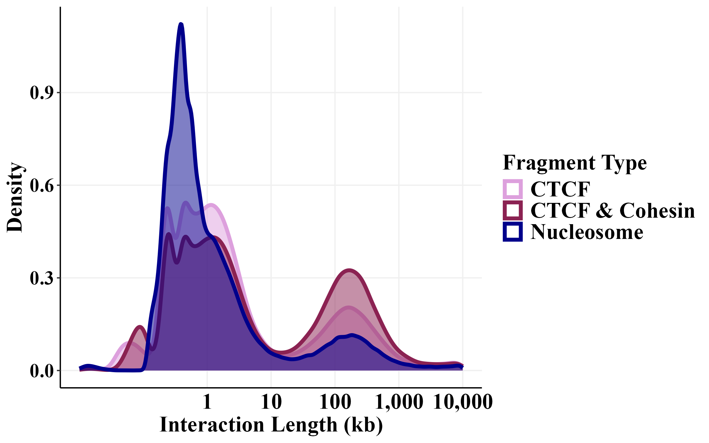
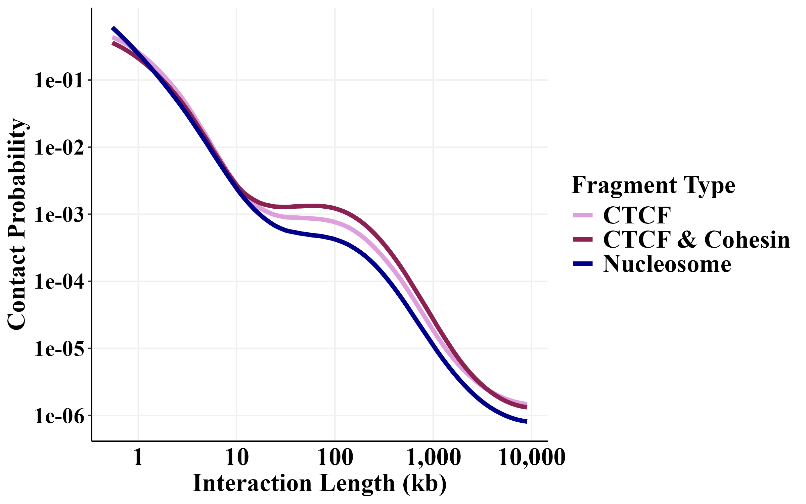

```{r, include = FALSE}
knitr::opts_chunk$set(
  collapse = TRUE,
  comment = "#>",
  out.width = "100%", 
  eval = FALSE
)
```

```{r}
library(foreach)
library(GenomicRanges)
library(readr)
library(rtracklayer)
library(scales)
library(plyranges)
library(nlme)
library(lme4)
library(viridis)
library(ggridges)
library(RColorBrewer)
library(cowplot)
library(gridExtra)
library(doParallel)
library(data.table)
library(Signac)
library(plyr)
library(memes)
library(universalmotif)
library(scico)
library(dplyr)
library(ggplot2)
library(tidyverse)

num_cores = 8
registerDoParallel(cores=num_cores)
```

# Set the theme
```{r}
my_theme <-   theme_classic() +
  theme(panel.grid.major = element_line(color = "#f0f0f0",
                                        size = 0.5))+
  theme(plot.title = element_text(color = "black", family = "Times New Roman", size = 18, face = "bold"),
        axis.text.x = element_text(color = "black", family = "Times New Roman", size = 18,face = "bold"),
        axis.text.y = element_text(color = "black", family = "Times New Roman", size = 18,face = "bold"),
        axis.title.x = element_text(color = "black", family = "Times New Roman", size = 18,face = "bold"),
        axis.title.y = element_text(color = "black", family = "Times New Roman", size = 18,face = "bold"),
        legend.text=element_text(color = "black", family = "Times New Roman", size =18,face = "bold"),
        legend.title=element_text(color = "black", family = "Times New Roman", size = 18,face = "bold"),
        strip.text.x = element_text(color = "black", family = "Times New Roman", size = 18,face = "bold"),
        strip.text.y = element_text(color = "black", family = "Times New Roman", size = 18,face = "bold"),
        strip.background=element_rect(colour="#f0f0f0",fill="#f0f0f0"))
```

# Set the path
This is where we stored all those files in the protocol.
```{r}
path <- "/aryeelab/users/corri/data/replicate_FF_results/"
```

# Figure 4A (CTCF occupancy)

### High CTCF occupancy
```{r}
ctcf_motifs<- readRDS(file = "/aryeelab/users/corri/data/ALL_FIMO_CTCF_hg38.RDS")
ctcf_motifs$motif_mid <- round( ( start(ctcf_motifs) + end(ctcf_motifs) )/2)
# Remove overlapping motifs
keep <- countOverlaps(ctcf_motifs, ctcf_motifs, ignore.strand=TRUE)==1 
table(keep)
ctcf_motifs <- ctcf_motifs[keep]
print("read pairs")
pairs <- readRDS("/aryeelab/users/corri/data/k562_ctcf_mapped.pairs.rds")
print("done reading pairs")
pairs <- pairs %>% 
  filter(chr1 == "chr1") %>% 
  filter(chr2 == "chr1")
# left fragment
gr_fragment1 <- makeGRangesFromDataFrame(pairs,
                                         seqnames.field="chr1",
                                         start.field="start1",
                                         end.field="end1")
# right fragment
gr_fragment2 <- makeGRangesFromDataFrame(pairs,
                                         seqnames.field="chr2",
                                         start.field="start2",
                                         end.field="end2")
gr_fragment <- c(gr_fragment1, gr_fragment2)
```

```{r}
library(AnnotationHub)
ah <- AnnotationHub()
#> snapshotDate(): 2022-12-16
query_data <- subset(ah, preparerclass == "CTCF")
CTCF_hg38_all <- query_data[["AH104727"]]
table(width(CTCF_hg38_all))
table(CTCF_hg38_all$name)

data.frame(CTCF_hg38_all) %>% 
  filter(seqnames == "chr1") %>% 
  filter(dplyr::between(start, 30779762 - 500,  30779762 + 500))
```

chr1	30779763	30779797	35	-
5' end: 30779797

High CTCF occupancy example
```{r}
ctcf_motifs<- readRDS(file = "/aryeelab/users/corri/data/ALL_FIMO_CTCF_hg38.RDS")
ctcf_motifs$motif_mid <- round( ( start(ctcf_motifs) + end(ctcf_motifs) )/2)
# Remove overlapping motifs
keep <- countOverlaps(ctcf_motifs, ctcf_motifs, ignore.strand=TRUE)==1 
table(keep)
ctcf_motifs <- ctcf_motifs[keep]

# CBS (-) located at chr1: 30779763-30779781
motif <- ctcf_motifs %>% 
  filter(seqnames == "chr1") %>% 
  filter(dplyr::between(start, 30779762 - 500,  30779762 + 500))
```

```{r}
ctcf_loc <- 30779797
chip <- read_tsv("/aryeelab/users/corri/data/K562_CTCF_peaks_ENCFF736NYC.bed", col_names = FALSE)
colnames(chip) <- c("chr", "start", "end", "name", "score", "strand", "signalValue", "pval", "qval", "peak")
chip_gr <- makeGRangesFromDataFrame(chip)
chip_gr$qval <- chip$qval
chip_gr$peak_mid <- (start(chip_gr) + end(chip_gr))/2

data.frame(chip_gr) %>% 
  filter(seqnames == "chr1") %>% 
  filter(dplyr::between(peak_mid, ctcf_loc - 500,   ctcf_loc + 500))
```

```{r,fig.width=8,fig.height=2}
bw.plot <- BigwigTrack(
  region =  GRanges("chr1", IRanges(ctcf_loc - 500, ctcf_loc + 500)),
  bigwig = list(" " = paste0(path,"K562_CTCF_signal_pval_ENCFF168IFW.bigWig")))

bw.plot+
  ylab("Coverage") +
  scale_fill_manual(values=c("black"))+
  guides(fill = "none")+
  scale_y_continuous(breaks = c(0, 150))+
  scale_x_continuous(
    labels = comma_format(),
    breaks = 30779797+c(-300, 0,   300),
    position = "bottom",
    sec.axis = sec_axis(~. - 30779797, name = "Distance to 5' end of CTCF motif",
                        breaks = c(-450, -300, -150, 0,  150, 300, 450)
    )) +
  ylab("CTCF ChIP-seq") +
  annotate(
    'segment',
    x = 30779763,
    xend = 30779797,
    y = -2,
    yend = -2,
    size = 7,
    colour = "violetred4",
    alpha=.8
  ) +
  geom_vline(xintercept = c(30779763,30779797), color = "violetred4",linetype = "dashed")+
  theme_minimal() +
  # theme(panel.grid.major = element_line(color = "#f0f0f0",
  #                                       size = 0.5))+
  theme(plot.title = element_text(color = "black", family = "Times New Roman", size = 18, face = "bold"),
        axis.text.x = element_text(color = "black", family = "Times New Roman", size = 18,face = "bold"),
        axis.text.y = element_text(color = "black", family = "Times New Roman", size = 18,face = "bold"),
        axis.title.x = element_text(color = "black", family = "Times New Roman", size = 18,face = "bold"),
        axis.title.y = element_text(color = "black", family = "Times New Roman", size = 18,face = "bold"),
        legend.text=element_text(color = "black", family = "Times New Roman", size =18,face = "bold"),
        legend.title=element_text(color = "black", family = "Times New Roman", size = 18,face = "bold"),
        strip.text.x = element_text(color = "black", family = "Times New Roman", size = 18,face = "bold"),
        strip.text.y = element_text(color = "black", family = "Times New Roman", size = 18,face = "bold"))

#ggsave(paste0(path,"Fig4_Sep2024_chip_occupied.png"), width=8, height=2)
```



30779763	30779797
```{r}

keep <- subsetByOverlaps(gr_fragment, motif, ignore.strand=TRUE) 

locus_fragments <- as.data.frame(keep) %>% 
  #cbind(motif_mid = (start(motif)+end(motif))/2) %>% 
  mutate(short_motif_start =30779781) %>% 
  mutate(long_motif_start = 30779797) %>% 
  mutate(start_centered = start-long_motif_start,
         end_centered = end - long_motif_start) 
p1 <- locus_fragments%>% 
  arrange(width) %>% 
  mutate(frag_id = row_number()) %>% 
  ggplot() + 
  geom_point(aes(x = end_centered, y = width), col = "royalblue")+
  geom_point(aes(x = start_centered, y = width), col = "royalblue")+
  geom_segment(aes(x=start_centered, xend=end_centered, y=width, yend=width), alpha = 0.3) +
  theme_bw()+
  ylab("Fragment Length")+
  xlab("Distance to 5' end of CTCF motif")+
  scale_x_continuous(
    labels = comma_format(),
    limits = c(-150,150),
    position = "bottom",
    breaks = seq(-150,150,50),
    sec.axis = sec_axis(~. + 30779797,
                        breaks = 30779797+c(-100, 0,  100),
                        labels = comma_format(),
                        name = "chr1 position (bp)")) +
  scale_y_continuous(labels = comma_format(), limits=c(10,160),breaks = seq(40,150,40))+
  my_theme+
  annotate(
    'segment',
    x = 30779763-30779797, # motif end
    xend = 0, # long motif start
    y = 12,
    yend = 12,
    size = 7,
    colour = "violetred4",
    alpha=.8
  ) +
  geom_vline(xintercept = c(30779763-30779797, 0), color = "violetred4",linetype = "dashed")

p2 <- locus_fragments %>% 
  ggplot(aes(x = width))+
  geom_histogram(fill = "darkblue",col = "royalblue")+
  theme_bw()+
  scale_x_continuous(labels = comma_format(), limits=c(10,160),breaks = seq(40,150,40))+
  scale_y_continuous(labels = comma_format(),breaks = c(0,400))+
  coord_flip()+
  xlab("")+
  ylab("Count")+
  my_theme+
  theme(axis.text.y=element_blank(),
        axis.ticks.y=element_blank()) 
```


```{r,fig.width=7,fig.height=3}
plot_grid(plotlist = list(p1,
                          p2),
          align = "hv", axis = "tblr", rel_widths = c(3,1))
#ggsave(paste0(path,"Fig4_Sep2024_fragment_occupied.png"), width=7, height=3)
```



### Low CTCF occupancy example
```{r}
chip <- read_tsv("/aryeelab/users/corri/data/K562_CTCF_peaks_ENCFF736NYC.bed", col_names = FALSE)
colnames(chip) <- c("chr", "start", "end", "name", "score", "strand", "signalValue", "pval", "qval", "peak")
chip_gr <- makeGRangesFromDataFrame(chip)
chip_gr$qval <- chip$qval
chip_gr$peak_mid <- (start(chip_gr) + end(chip_gr))/2

data.frame(chip_gr) %>% 
  filter(seqnames == "chr1") %>% 
  arrange(qval) 
ctcf_motifs<- readRDS(file = "/aryeelab/users/corri/data/ALL_FIMO_CTCF_hg38.RDS")
ctcf_motifs$motif_mid <- round( ( start(ctcf_motifs) + end(ctcf_motifs) )/2)
ovl <- findOverlaps(ctcf_motifs, chip_gr, maxgap = 0)

out <- as.data.frame(ctcf_motifs[queryHits(ovl)]) %>% 
  cbind(motif_id = queryHits(ovl),
        chip_id = subjectHits(ovl),
        chip_mid = chip_gr$peak_mid[subjectHits(ovl)],
        chip_qval = chip_gr$qval[subjectHits(ovl)]) 

out %>% 
  mutate(dist = abs(motif_mid-chip_mid)) %>% 
  filter(dist < 30) %>% 
  arrange(chip_qval) %>% 
  filter(seqnames =="chr1") %>% 
  dplyr::slice(1)

ctcf_loc <- (32352263   +32352281   )/2
motif <- ctcf_motifs %>% 
  filter(seqnames == "chr1") %>% 
  filter(dplyr::between(start, ctcf_loc - 200,  ctcf_loc + 200))
motif # chr1:32352263-32352281 (+) 
```

```{r}
ctcf_loc <- (32352263   +32352281   )/2- 25 # long motif start
```

```{r,fig.width=8,fig.height=2}
bw.plot <- BigwigTrack(
  region =  GRanges("chr1", IRanges(ctcf_loc - 500, ctcf_loc + 500)),
  bigwig = list(" " = paste0(path,"K562_CTCF_signal_pval_ENCFF168IFW.bigWig")))

bw.plot+
  ylab("Coverage") +
  scale_fill_manual(values=c("black"))+
  guides(fill = "none")+
  scale_y_continuous(breaks = c(0, 15),
                     limits = c(-2,15))+
  scale_x_continuous(
    labels = comma_format(),
    breaks = ctcf_loc+c(-300, 0,   300),
    position = "bottom",
    sec.axis = sec_axis(~. - ctcf_loc, name = "Distance to 5' end of CTCF motif",
                        breaks = c(-450, -300, -150, 0,  150, 300, 450)
    )) +
  ylab("CTCF ChIP-seq") +
  annotate(
    'segment',
    x = 32352281,
    xend = ctcf_loc,
    y = -2,
    yend = -2,
    size = 7,
    colour = "violetred4",
    alpha=.8
  ) +
  geom_vline(xintercept = c(ctcf_loc, 32352281), color = "violetred4",linetype = "dashed")+
  theme_minimal() +
  # theme(panel.grid.major = element_line(color = "#f0f0f0",
  #                                       size = 0.5))+
  theme(plot.title = element_text(color = "black", family = "Times New Roman", size = 18, face = "bold"),
        axis.text.x = element_text(color = "black", family = "Times New Roman", size = 18,face = "bold"),
        axis.text.y = element_text(color = "black", family = "Times New Roman", size = 18,face = "bold"),
        axis.title.x = element_text(color = "black", family = "Times New Roman", size = 18,face = "bold"),
        axis.title.y = element_text(color = "black", family = "Times New Roman", size = 18,face = "bold"),
        legend.text=element_text(color = "black", family = "Times New Roman", size =18,face = "bold"),
        legend.title=element_text(color = "black", family = "Times New Roman", size = 18,face = "bold"),
        strip.text.x = element_text(color = "black", family = "Times New Roman", size = 18,face = "bold"),
        strip.text.y = element_text(color = "black", family = "Times New Roman", size = 18,face = "bold"))

#ggsave(paste0(path,"Fig4_Sep2024_chip_unoccupied.png"), width=8, height=2)
```



```{r}

keep <- subsetByOverlaps(gr_fragment, motif, ignore.strand=TRUE) 

locus_fragments <- as.data.frame(keep) %>% 
  #cbind(motif_mid = (start(motif)+end(motif))/2) %>% 
  mutate(long_motif_start = ctcf_loc) %>% 
  mutate(start_centered = start-long_motif_start,
         end_centered = end - long_motif_start) 
p1 <- locus_fragments%>% 
  arrange(width) %>% 
  mutate(frag_id = row_number()) %>% 
  ggplot() + 
  geom_point(aes(x = end_centered, y = width), col = "royalblue")+
  geom_point(aes(x = start_centered, y = width), col = "royalblue")+
  geom_segment(aes(x=start_centered, xend=end_centered, y=width, yend=width), alpha = 0.3) +
  theme_bw()+
  ylab("Fragment Length")+
  xlab("Distance to 5' end of CTCF motif")+
  scale_x_continuous(
    labels = comma_format(),
    limits = c(-150,150),
    position = "bottom",
    breaks = seq(-150,150,50),
    sec.axis = sec_axis(~. + ctcf_loc,
                        breaks = ctcf_loc+c(-100, 0,  100),
                        labels = comma_format(),
                        name = "chr1 position (bp)")) +
  scale_y_continuous(labels = comma_format(), limits=c(10,160),breaks = seq(40,150,40))+
  my_theme+
  annotate(
    'segment',
    x = 34, # motif end
    xend = 0, # long motif start
    y = 12,
    yend = 12,
    size = 7,
    colour = "violetred4",
    alpha=.8
  ) +
  geom_vline(xintercept = c(34, 0), color = "violetred4",linetype = "dashed")

p2 <- locus_fragments %>% 
  ggplot(aes(x = width))+
  geom_histogram(fill = "darkblue",col = "royalblue")+
  theme_bw()+
  scale_x_continuous(labels = comma_format(), limits=c(10,160),breaks = seq(40,150,40))+
  scale_y_continuous(labels = comma_format(),breaks = c(0,400))+
  coord_flip()+
  xlab("")+
  ylab("Count")+
  my_theme+
  theme(axis.text.y=element_blank(),
        axis.ticks.y=element_blank()) 
```


```{r,fig.width=7,fig.height=3}
plot_grid(plotlist = list(p1,
                          p2),
          align = "hv", axis = "tblr", rel_widths = c(3,1))
#ggsave(paste0(path,"Fig4_Sep2024_fragment_unoccupied.png"), width=7, height=3)
```



# Figure 4B (CTCF ChIP-seq & short fragments)

```{r}
path <- "/aryeelab/users/corri/data/replicate_FF_results/"
left_plus <- readRDS(file = paste0(path, "left_plus_annot_cluster.RDS"))

left_plus <- left_plus %>% 
  mutate(short_motif_start =motif_mid - 9) %>% 
  mutate(long_motif_start = motif_mid - 25) %>% 
  mutate(motif_end= motif_mid + 9) %>% 
  mutate(start_centered = start-long_motif_start,
         end_centered = end - long_motif_start) %>% 
  filter(start_centered < (16-5)) %>% 
  filter(end_centered > (35+5)) %>% 
  mutate(short = ifelse(width <120, 1,0)) %>% 
  mutate(interaction_length = abs(end2-start))

```

```{r}
peaks <- read_tsv("/aryeelab/users/corri/data/K562_CTCF_peaks_ENCFF736NYC.bed", col_names = FALSE)
colnames(peaks) <- c("chr", "start", "end", "name", "score", "strand", "signalValue", "pval", "qval", "peak")
peaks_gr<- makeGRangesFromDataFrame(peaks, keep.extra.columns = TRUE)
peaks_gr$peak_score <- peaks$qval
peaks_gr$chip_mid <- (start(peaks_gr) + end(peaks_gr))/2

peaks_gr <- peaks_gr %>%
  plyranges::anchor_center() %>%
  plyranges::mutate(width = 601)
chip <- peaks_gr 

uniq_motif<- left_plus %>%
  group_by(motif_id) %>% 
  dplyr::mutate(num_cohesin = sum(short),
                num_fragment = max(dplyr::row_number()),
                myskew = num_cohesin / num_fragment) %>% 
  distinct(motif_id, .keep_all = TRUE) %>% 
  dplyr::select(seqnames, motif_mid, motif_id,skew,myskew,num_fragment) %>% 
  arrange(motif_id)

uniq_motif_gr <- makeGRangesFromDataFrame(uniq_motif, keep.extra.columns=TRUE,
                                          seqnames.field="seqnames",
                                          start.field="motif_mid",
                                          end.field="motif_mid")

uniq_motif_gr$motif_mid <- uniq_motif$motif_mid
```

```{r}
ovl <- findOverlaps(uniq_motif_gr, chip)

out <- as.data.frame(uniq_motif_gr[queryHits(ovl)]) %>% 
  cbind(chip_id = subjectHits(ovl),
        chip_start = start(chip)[subjectHits(ovl)],
        chip_mid = chip$chip_mid[subjectHits(ovl)],
        chip_end = end(chip)[subjectHits(ovl)],
        chip_qval = chip$peak_score[subjectHits(ovl)],
        chip_signalValue = chip$signalValue[subjectHits(ovl)],
        chip_score = chip$score[subjectHits(ovl)]) %>% 
  mutate(dist = abs(chip_mid - motif_mid))

out <- out %>% 
  dplyr::group_by(motif_id) %>% 
  dplyr::mutate(n = max(row_number())) %>% 
  dplyr::arrange(abs(dist)) %>% 
  dplyr::slice(1)

uniq_motif <- uniq_motif %>% 
  left_join(out, by = "motif_id") 

motifs <- uniq_motif

uniq_motif$dist[is.na(uniq_motif$dist)] <- 310
uniq_motif$chip_qval[is.na(uniq_motif$chip_qval)] <- 0
uniq_motif$dist <- abs(uniq_motif$dist)
```


```{r}
nocohesin <- uniq_motif %>% 
  filter(dist > 200) 

cohesin <- uniq_motif %>% 
  filter(dist < 30) 

cohesin$cohesin_status <- "CTCF ChIP-seq"
nocohesin$cohesin_status <- 0

library(Hmisc)
cohesin <- cohesin %>% 
  ungroup() %>% 
  mutate(
    cohesin_status = as.numeric(cut2(chip_signalValue, g=4)))
cohesin %>% 
  group_by(cohesin_status) %>% 
  dplyr::summarize(count = n())
```

```{r}
rbind(nocohesin,cohesin) %>% 
  filter(num_fragment.x>50) %>% 
  dplyr::group_by(cohesin_status) %>% 
  dplyr::summarize(count = n())
```


```{r,fig.width=8,fig.height=4}
rbind(nocohesin,cohesin) %>% 
  filter(num_fragment.x>50) %>% 
  ggplot(aes(x = 100*myskew.x, 
  )) +
  geom_density(aes(color = as.factor(cohesin_status),
                   fill = as.factor(cohesin_status)),alpha=0.3,
               linewidth = 1)+
  geom_density(linewidth = 1,
               aes(color = as.factor(cohesin_status)))+
  theme_bw() +
  scale_fill_scico_d(palette="berlin")+
  scale_color_scico_d(palette="berlin")+
  ylab("Density")  +
  xlab("% Short fragments")+
  guides(fill = FALSE)+
  labs(fill = "CTCF ChIP")+
  scale_x_continuous(breaks=seq(0,100,20), limits = c(0,100))+
  theme_classic() +
  theme(panel.grid.major = element_line(color = "#f0f0f0",
                                        size = 0.5))+
  theme(plot.title = element_text(color = "black", family = "Times New Roman", size = 18, face = "bold"),
        axis.text.x = element_text(color = "black", family = "Times New Roman", size = 18,face = "bold"),
        axis.text.y = element_text(color = "black", family = "Times New Roman", size = 16,face = "bold"),
        axis.title.x = element_text(color = "black", family = "Times New Roman", size = 18,face = "bold"),
        axis.title.y = element_text(color = "black", family = "Times New Roman", size = 18,face = "bold"),
        axis.ticks.x=element_blank(),
        legend.text=element_text(color = "black", family = "Times New Roman", size =18,face = "bold"),
        legend.title=element_text(color = "black", family = "Times New Roman", size = 18,face = "bold"),
        strip.text.x = element_text(color = "black", family = "Times New Roman", size = 18,face = "bold"),
        strip.text.y = element_text(color = "black", family = "Times New Roman", size = 18,face = "bold"),
        strip.background=element_rect(colour="#f0f0f0",fill="#f0f0f0"))

#ggsave(paste0(path,"Fig4_CTCF_TF_den_Sep2024.png"), width=8, height=4)
```



# Figure 4C (HiChIP 2D Density)
```{r}
path <- "/aryeelab/users/corri/data/replicate_FF_results/"
left_plus <- readRDS(file = paste0(path, "left_plus_annot.RDS"))
LR <- left_plus %>% 
  filter(width < 120) %>% 
  mutate(
    LR = ifelse(interaction_length> 10000,"Long-range","Short-range")) %>% 
  ungroup() %>% 
  mutate(short_motif_start =motif_mid - 9) %>% 
  mutate(long_motif_start = motif_mid - 25) %>% 
  mutate(motif_end= motif_mid + 9) 

LR %>% 
  dplyr::group_by(LR) %>% 
  dplyr::summarize(count = n()) %>% 
  mutate(freq = 100*(count / sum(count)))

LR
```

```{r,fig.width=8,fig.height=4}
LR %>% 
  mutate(LR =factor(LR, levels = c("Short-range","Long-range"))) %>% 
  mutate(start_centered = start-long_motif_start,
         end_centered = end - long_motif_start) %>%  
  ggplot(aes(x = start_centered, y = end_centered)) +
  stat_density_2d(aes(fill = ..density..), geom = "raster", contour = FALSE)+
  scale_fill_distiller(palette = "RdBu")+
  geom_vline(xintercept = c(16),linetype = "dashed",color="lightseagreen") +
  geom_hline(yintercept = c(35),linetype = "dashed",color="lightseagreen")+
  facet_wrap(~LR,ncol=2) + 
  scale_x_continuous(limits = c(-60,40),
                     breaks= c(-60,-40,-20,0,20,40))+
  scale_y_continuous(limits = c(0,100),
                     breaks = c(0,20,40,60,80))+
  xlab("Fragment Start")+
  ylab("Fragment End")+
  theme_classic() +
  theme(panel.grid.major = element_line(color = "#f0f0f0",
                                        size = 0.5))+
  theme(plot.title = element_text(color = "black", family = "Times New Roman", size = 18, face = "bold"),
        axis.text.x = element_text(color = "black", family = "Times New Roman", size = 18,face = "bold"),
        axis.text.y = element_text(color = "black", family = "Times New Roman", size = 18,face = "bold"),
        axis.title.x = element_text(color = "black", family = "Times New Roman", size = 18,face = "bold"),
        axis.title.y = element_text(color = "black", family = "Times New Roman", size = 18,face = "bold"),
        axis.ticks.x=element_blank(),
        legend.text=element_text(color = "black", family = "Times New Roman", size =18,face = "bold"),
        legend.title=element_text(color = "black", family = "Times New Roman", size = 18,face = "bold"),
        strip.text.x = element_text(color = "black", family = "Times New Roman", size = 18,face = "bold"),
        strip.text.y = element_text(color = "black", family = "Times New Roman", size = 18,face = "bold"),
        strip.background=element_rect(colour="#f0f0f0",fill="#f0f0f0"))

#ggsave(paste0(path,"Fig4_Cohesin_footprint_HiChIP_Sep2024.png"), width=8, height=4)
```



### Supp. hichip cohesin annotated
```{r,fig.width=8,fig.height=4}
LR %>% 
  mutate(LR =factor(LR, levels = c("Short-range","Long-range"))) %>% 
  mutate(start_centered = start-long_motif_start,
         end_centered = end - long_motif_start) %>% 
  ggplot(aes(x = start_centered, y = end_centered)) +
  stat_density_2d(aes(fill = ..density..), geom = "raster", contour = FALSE)+
  scale_fill_distiller(palette = "RdBu")+
  geom_vline(xintercept = c(16),linetype = "dashed",color="black") +
  geom_hline(yintercept = c(35),linetype = "dashed",color="black")+
  geom_hline(yintercept = c(35+20),linetype = "dashed",color="grey")+ # 55bp CTCF + cohesin estimate
  geom_hline(yintercept = c(35+6),linetype = "dashed",color="grey")+ # 41bp CTCF estimate
  facet_wrap(~LR,ncol=2) + 
  scale_x_continuous(limits = c(-60,40),
                     breaks= c(-60,-40,-20,0,20,40))+
  scale_y_continuous(limits = c(0,100),
                     breaks = c(0,20,40,60,80))+
  xlab("Fragment Start")+
  ylab("Fragment End")+
  theme_classic() +
  theme(panel.grid.major = element_line(color = "#f0f0f0",
                                        size = 0.5))+
  theme(plot.title = element_text(color = "black", family = "Times New Roman", size = 18, face = "bold"),
        axis.text.x = element_text(color = "black", family = "Times New Roman", size = 18,face = "bold"),
        axis.text.y = element_text(color = "black", family = "Times New Roman", size = 18,face = "bold"),
        axis.title.x = element_text(color = "black", family = "Times New Roman", size = 18,face = "bold"),
        axis.title.y = element_text(color = "black", family = "Times New Roman", size = 18,face = "bold"),
        axis.ticks.x=element_blank(),
        legend.text=element_text(color = "black", family = "Times New Roman", size =18,face = "bold"),
        legend.title=element_text(color = "black", family = "Times New Roman", size = 18,face = "bold"),
        strip.text.x = element_text(color = "black", family = "Times New Roman", size = 18,face = "bold"),
        strip.text.y = element_text(color = "black", family = "Times New Roman", size = 18,face = "bold"),
        strip.background=element_rect(colour="#f0f0f0",fill="#f0f0f0")) 

```

*CTCF and CTCF + cohesin fragment end are ~15bp apart ( (35+20) - (35+6))*

```{r,fig.width=8,fig.height=4}
LR %>% 
  mutate(LR =factor(LR, levels = c("Short-range","Long-range"))) %>% 
  mutate(start_centered = start-long_motif_start,
         end_centered = end - long_motif_start) %>% 
  ggplot(aes(x = start_centered, y = end_centered)) +
  stat_density_2d(aes(fill = ..density..), geom = "raster", contour = FALSE)+
  scale_fill_distiller(palette = "RdBu")+
  geom_vline(xintercept = c(16),linetype = "dashed",color="black") +
  geom_hline(yintercept = c(35),linetype = "dashed",color="black")+
  geom_vline(xintercept = c(16-5),color="cornflowerblue") +
  geom_hline(yintercept = c(35+5),color="cornflowerblue")+
  geom_hline(yintercept = c(35+6+(14/2)),linetype = "dashed",color="violetred4")+
  facet_wrap(~LR,ncol=2) + 
  scale_x_continuous(limits = c(-60,40),
                     breaks= c(-60,-40,-20,0,20,40))+
  scale_y_continuous(limits = c(0,100),
                     breaks = c(0,20,40,60,80))+
  xlab("Fragment Start")+
  ylab("Fragment End")+
  theme_classic() +
  theme(panel.grid.major = element_line(color = "#f0f0f0",
                                        size = 0.5))+
  theme(plot.title = element_text(color = "black", family = "Times New Roman", size = 18, face = "bold"),
        axis.text.x = element_text(color = "black", family = "Times New Roman", size = 18,face = "bold"),
        axis.text.y = element_text(color = "black", family = "Times New Roman", size = 18,face = "bold"),
        axis.title.x = element_text(color = "black", family = "Times New Roman", size = 18,face = "bold"),
        axis.title.y = element_text(color = "black", family = "Times New Roman", size = 18,face = "bold"),
        axis.ticks.x=element_blank(),
        legend.text=element_text(color = "black", family = "Times New Roman", size =18,face = "bold"),
        legend.title=element_text(color = "black", family = "Times New Roman", size = 18,face = "bold"),
        strip.text.x = element_text(color = "black", family = "Times New Roman", size = 18,face = "bold"),
        strip.text.y = element_text(color = "black", family = "Times New Roman", size = 18,face = "bold"),
        strip.background=element_rect(colour="#f0f0f0",fill="#f0f0f0")) 
#ggsave(paste0(path,"Fig4_Cohesin_footprint_HiChIP_annotated_Sep2024.png"), width=8, height=4)
```


# Figure 4D (PWM)

```{r,fig.width=8,fig.height=4}
jaspar_MA0139.1 <- read_meme("/aryeelab/users/corri/data/MA0139.1.meme")
jaspar_MA1930.1 <- read_meme("/aryeelab/users/corri/data/MA1930.1.meme")
view_motifs(list(jaspar_MA1930.1))+
  theme_classic()+
  theme(plot.title = element_text(color = "black", family = "Times New Roman", size = 18, face = "bold"),
        axis.text.x = element_text(color = "black", family = "Times New Roman", size = 10),
        axis.text.y = element_text(color = "black", family = "Times New Roman", size = 16,face = "bold"),
        axis.title.x = element_text(color = "black", family = "Times New Roman", size = 18,face = "bold"),
        axis.title.y = element_text(color = "black", family = "Times New Roman", size = 18,face = "bold"),
        axis.ticks.x=element_blank(),
        legend.text=element_text(color = "black", family = "Times New Roman", size =18,face = "bold"),
        legend.title=element_text(color = "black", family = "Times New Roman", size = 18,face = "bold"),
        strip.text.x = element_text(color = "black", family = "Times New Roman", size = 18,face = "bold"),
        strip.background=element_blank())+
  theme(legend.position = "none") 
#ggsave(paste0(path,"Fig4_MA0139.1_PWM_Sep2024.png"), width=8, height=4)
```



### Supplement: Both PWMs
```{r,fig.width=8,fig.height=4}
jaspar_MA0139.1 <- read_meme("/aryeelab/users/corri/data/MA0139.1.meme")
jaspar_MA1930.1 <- read_meme("/aryeelab/users/corri/data/MA1930.1.meme")

view_motifs(list(jaspar_MA0139.1,jaspar_MA1930.1))+
   theme_classic()+
  theme(plot.title = element_text(color = "black", family = "Times New Roman", size = 18, face = "bold"),
        axis.text.x = element_text(color = "black", family = "Times New Roman", size = 10),
        axis.text.y = element_text(color = "black", family = "Times New Roman", size = 18,face = "bold"),
        axis.title.x = element_text(color = "black", family = "Times New Roman", size = 18,face = "bold"),
        axis.title.y = element_text(color = "black", family = "Times New Roman", size = 18,face = "bold"),
        axis.ticks.x=element_blank(),
        legend.text=element_text(color = "black", family = "Times New Roman", size =18,face = "bold"),
        legend.title=element_text(color = "black", family = "Times New Roman", size = 18,face = "bold"),
        strip.text.x = element_text(color = "black", family = "Times New Roman", size = 18,face = "bold"),
        strip.background=element_blank())+
  theme(legend.position = "none") 

#ggsave(paste0(path,"Supplement_both_motifs_PWM_Sep2024.png"), width=8, height=4)
```


# Figure 4E (mESC RCMC 2D Density)
```{r}
LA_gr <- readRDS("/aryeelab/users/corri/data/Hansen_RCMC/RCMC_WT_IAA_DMSO_captured_pairs_LA_gr.RDS")
motifs_gr <- readRDS("/aryeelab/users/corri/data/Hansen_RCMC/mm10_CTCF_chip_seq_motifs_gr.RDS")

motifs_gr <- motifs_gr[strand(motifs_gr)=="+"]
table(as.factor(strand(motifs_gr)))

ovl <- findOverlaps(LA_gr,motifs_gr)

out <- as.data.frame(LA_gr[queryHits(ovl)]) %>%
  cbind(motif_start = start(motifs_gr)[subjectHits(ovl)],
        motif_end = end(motifs_gr)[subjectHits(ovl)],
        motif_strand = strand(motifs_gr)[subjectHits(ovl)])

max(width(motifs_gr))
```

*65 CTCF motifs across 3 loci*
```{r}
out %>% 
  mutate(motif_mid = (motif_start+motif_end)/2) %>% 
  mutate(start_centered = start-motif_mid) %>% 
  mutate(end_centered = end-motif_mid) %>% 
  mutate(motif_id = paste0(seqnames, ":",motif_start)) %>% 
  group_by(motif_id)

```


```{r,fig.width=8,fig.height=4}
out %>% 
  filter(sample != "WT") %>% 
  mutate(sample =factor(sample, levels = c("IAA","DMSO"))) %>% 
  filter(width< 120) %>%
  mutate(motif_mid = (motif_start+motif_end)/2) %>% 
  mutate(short_motif_start =motif_mid - 9) %>% 
  mutate(long_motif_start = motif_mid - 25) %>% 
  mutate(start_centered = start-long_motif_start,
         end_centered = end - long_motif_start) %>% 
  ggplot(aes(x = start_centered, y = end_centered)) +
  stat_density_2d(aes(fill = ..density..), geom = "raster", contour = FALSE)+
  scale_fill_distiller(palette = "RdBu")+
  geom_vline(xintercept = c(16),linetype = "dashed",color="lightseagreen") +
  geom_hline(yintercept = c(35),linetype = "dashed",color="lightseagreen")+
  #geom_hline(yintercept = c(38,52),linetype = "dashed",color="magenta")+
  facet_wrap(~sample,ncol=2) + 
  scale_x_continuous(limits = c(-60,40),
                     breaks= c(-60,-40,-20,0,20,40))+
  scale_y_continuous(limits = c(0,100),
                     breaks = c(0,20,40,60,80))+
  xlab("Fragment Start")+
  ylab("Fragment End")+
  theme_classic() +
  theme(panel.grid.major = element_line(color = "#f0f0f0",
                                        size = 0.5))+
  theme(plot.title = element_text(color = "black", family = "Times New Roman", size = 18, face = "bold"),
        axis.text.x = element_text(color = "black", family = "Times New Roman", size = 18,face = "bold"),
        axis.text.y = element_text(color = "black", family = "Times New Roman", size = 18,face = "bold"),
        axis.title.x = element_text(color = "black", family = "Times New Roman", size = 18,face = "bold"),
        axis.title.y = element_text(color = "black", family = "Times New Roman", size = 18,face = "bold"),
        axis.ticks.x=element_blank(),
        legend.text=element_text(color = "black", family = "Times New Roman", size =18,face = "bold"),
        legend.title=element_text(color = "black", family = "Times New Roman", size = 18,face = "bold"),
        strip.text.x = element_text(color = "black", family = "Times New Roman", size = 18,face = "bold"),
        strip.text.y = element_text(color = "black", family = "Times New Roman", size = 18,face = "bold"),
        strip.background=element_rect(colour="#f0f0f0",fill="#f0f0f0"))

#ggsave(paste0(path,"Fig4_Cohesin_footprint_mESC_RCMC_Sep2024.png"), width=8, height=4)
```



# Figure 4F (schematic)
Figure 4F illustrates the most common fragment types in Fig.4E. This figure panel was made in Keynote.

# Supp. short/long density
```{r,fig.width=8,fig.height=5}
path <- "/aryeelab/users/corri/data/replicate_FF_results/"
left_plus <- readRDS(file = paste0(path, "left_plus_annot_cluster.RDS"))
left_plus <- left_plus %>% 
  mutate(
    LR = ifelse(interaction_length> 10000,"Long-range","Short-range")) %>% 
  mutate(short_motif_start =motif_mid - 9) %>% 
  mutate(long_motif_start = motif_mid - 25) %>% 
  mutate(motif_end= motif_mid + 9) %>% 
  mutate(LR =factor(LR, levels = c("Short-range","Long-range"))) %>% 
  mutate(start_centered = start-long_motif_start,
         end_centered = end - long_motif_start) %>% 
  filter(start_centered < (16-5)) %>% 
  filter(end_centered > (35+5)) %>% 
  mutate(fragment_type = case_when(
    width>= 120 ~ "Long",
    width < 120 ~ "Short"
  )) %>% 
  ungroup() %>% 
  dplyr::rename(start1 = start, end1 = end)

left_plus %>%   
  ggplot(aes(interaction_length/1000, fill = fragment_type, col = fragment_type)) +
  geom_density(alpha = 0.5, linewidth = 1.5)+
  theme_classic() + 
  scale_x_log10(breaks=c(0,1,10,100,1000,10000),
                limits = c(10^-2,10^4), 
                labels=scales::comma)+
  scale_fill_manual(values=c("darkblue", "violetred4")) +
  scale_color_manual(values=c("darkblue", "violetred4")) +
  ylab("Density") +
  xlab("Interaction Length (kb)")+
  labs(color = "Fragment Type")+
  guides(fill = FALSE)+
  theme_classic() +
  theme(panel.grid.major = element_line(color = "#f0f0f0",
                                        size = 0.5))+
  theme(plot.title = element_text(color = "black", family = "Times New Roman", size = 18, face = "bold"),
        axis.text.x = element_text(color = "black", family = "Times New Roman", size = 18,face = "bold"),
        axis.text.y = element_text(color = "black", family = "Times New Roman", size = 16,face = "bold"),
        axis.title.x = element_text(color = "black", family = "Times New Roman", size = 18,face = "bold"),
        axis.title.y = element_text(color = "black", family = "Times New Roman", size = 18,face = "bold"),
        axis.ticks.x=element_blank(),
        legend.text=element_text(color = "black", family = "Times New Roman", size =18,face = "bold"),
        legend.title=element_text(color = "black", family = "Times New Roman", size = 18,face = "bold"),
        strip.text.x = element_text(color = "black", family = "Times New Roman", size = 18,face = "bold"),
        strip.text.y = element_text(color = "black", family = "Times New Roman", size = 18,face = "bold"),
        strip.background=element_rect(colour="#f0f0f0",fill="#f0f0f0"))

#ggsave(paste0(path,"S_IL_density_short_long.png"), width=8, height=5)
```


```{r}
left_plus %>% 
  filter(fragment_type == "Short") %>% 
  dplyr::group_by(LR) %>% 
  dplyr::summarize(count = n()) %>% 
  mutate(freq = 100*(count / sum(count)))
```


# Figure 4G (density)
```{r,fig.width=8,fig.height=5}
path <- "/aryeelab/users/corri/data/replicate_FF_results/"
left_plus <- readRDS(file = paste0(path, "left_plus_annot_cluster.RDS"))
left_plus <- left_plus %>% 
  mutate(
    LR = ifelse(interaction_length> 10000,"Long-range","Short-range")) %>% 
  mutate(short_motif_start =motif_mid - 9) %>% 
  mutate(long_motif_start = motif_mid - 25) %>% 
  mutate(motif_end= motif_mid + 9) %>% 
  mutate(LR =factor(LR, levels = c("Short-range","Long-range"))) %>% 
  mutate(start_centered = start-long_motif_start,
         end_centered = end - long_motif_start) %>% 
  filter(start_centered < (16-5)) %>% 
  filter(end_centered > (35+5)) %>% 
  mutate(fragment_type = case_when(
    width>= 120 ~ "Nucleosome",
    ((end_centered < 48) & (width < 120)) ~ "CTCF",
    ((end_centered >= 48) & (width < 120)) ~ "CTCF & Cohesin"
    
  )) %>% 
  ungroup() %>% 
  dplyr::rename(start1 = start, end1 = end)

left_plus %>%   
  mutate(fragment_type = factor(fragment_type, levels = c("Nucleosome", "CTCF & Cohesin", "CTCF"))) %>% 
  ggplot(aes(interaction_length/1000, fill = fragment_type, col = fragment_type)) +
  geom_density(alpha = 0.5, linewidth = 1.5)+
#  geom_vline(xintercept = c(10, 1000))+
  theme_classic() + 
  scale_x_log10(breaks=c(0,1,10,100,1000,10000),
                limits = c(10^-2,10^4), 
                labels=scales::comma)+
    scale_fill_manual(values=c("grey30","darkred","darkblue")) +
  scale_color_manual(values=c("grey30","darkred", "darkblue")) +
#  scale_fill_manual(values=c("plum","violetred4","darkblue")) +
 # scale_color_manual(values=c("plum","violetred4", "darkblue")) +
  ylab("Density") +
  xlab("Interaction Length (kb)")+
  labs(color = "Fragment Type")+
  guides(fill = FALSE)+
  theme_classic() +
  theme(panel.grid.major = element_line(color = "#f0f0f0",
                                        size = 0.5))+
  theme(plot.title = element_text(color = "black", family = "Times New Roman", size = 18, face = "bold"),
        axis.text.x = element_text(color = "black", family = "Times New Roman", size = 18,face = "bold"),
        axis.text.y = element_text(color = "black", family = "Times New Roman", size = 16,face = "bold"),
        axis.title.x = element_text(color = "black", family = "Times New Roman", size = 18,face = "bold"),
        axis.title.y = element_text(color = "black", family = "Times New Roman", size = 18,face = "bold"),
        axis.ticks.x=element_blank(),
        legend.text=element_text(color = "black", family = "Times New Roman", size =18,face = "bold"),
        legend.title=element_text(color = "black", family = "Times New Roman", size = 18,face = "bold"),
        strip.text.x = element_text(color = "black", family = "Times New Roman", size = 18,face = "bold"),
        strip.text.y = element_text(color = "black", family = "Times New Roman", size = 18,face = "bold"),
        strip.background=element_rect(colour="#f0f0f0",fill="#f0f0f0"))

ggsave(paste0(path,"Fig4_IL_density_3strata_Sep27.png"), width=8, height=5)
```



# Figure 4H (P(S))
```{r, fig.width=8,fig.height=5}
d1 <- data.frame(IL_start = seq(0, 1e7, 1000)) %>% 
  mutate(IL_mid = IL_start + 500,
         IL_end = IL_start + 1000, 
         type = "CTCF")
d2 <- data.frame(IL_start = seq(0, 1e7, 1000)) %>% 
  mutate(IL_mid = IL_start + 500,
         IL_end = IL_start + 1000, 
         type = "CTCF & Cohesin") 

d3 <- data.frame(IL_start = seq(0, 1e7, 1000)) %>% 
  mutate(IL_mid = IL_start + 500,
         IL_end = IL_start + 1000, 
         type = "Nucleosome") 

dat<- rbind(d1,d2,d3)

dat<- dat %>% 
  mutate(bin_type = paste0(type, ":", IL_mid))

check <- left_plus %>% 
  dplyr::mutate(cohesin_fragment = factor(fragment_type)) %>% 
  filter(interaction_length < 1e7) %>% 
  ungroup() %>% 
  dplyr::group_by(cohesin_fragment) %>% 
  dplyr::mutate(count_per_CA = max(row_number())) %>% 
  dplyr::mutate(interaction_length_bin = cut(interaction_length, breaks = seq(0, 1e7, 1000))) %>%
  dplyr::mutate(lower = as.numeric( sub("\\((.+),.*", "\\1", interaction_length_bin)),
         upper = as.numeric( sub("[^,]*,([^]]*)\\]", "\\1", interaction_length_bin))) %>% 
  dplyr::mutate(mid_IL_bin = (lower + upper)/2) %>% 
  dplyr::group_by(cohesin_fragment, interaction_length_bin) %>% 
  dplyr::summarize(type = dplyr::first(cohesin_fragment),
                   interaction_length_bin = dplyr::first(mid_IL_bin),
                   count = dplyr::n(),
                   count_per_CA = dplyr::first(count_per_CA),
                   count_norm = count / count_per_CA) 


check <-check %>% 
  mutate(bin_type = paste0(type, ":", interaction_length_bin))

out <- left_join(dat, check, by = "bin_type")

dat<- out %>% 
  ungroup() %>% 
  mutate(log_interaction_length = log10(IL_mid)) %>% 
  mutate(log_IL_bin = cut(log_interaction_length, breaks = 50)) %>% 
  dplyr::group_by(type.x, log_IL_bin) %>% 
  dplyr::summarize(num_bins = max(dplyr::row_number()),
                   LC_sum = sum(count_norm, na.rm = TRUE),
                   avg_LC = LC_sum / num_bins) %>% 
  mutate(lower_log_bin = as.numeric( sub("\\((.+),.*", "\\1", log_IL_bin)),
         upper_log_bin = as.numeric( sub("[^,]*,([^]]*)\\]", "\\1", log_IL_bin))) %>% 
  mutate(mid_log_bin = (lower_log_bin + upper_log_bin)/2) %>% 
  mutate(log_avg_LC = log10(avg_LC))

dat %>% 
    mutate(type.x = factor(type.x, levels = c("Nucleosome", "CTCF & Cohesin", "CTCF"))) %>% 
  mutate(bin = 10^mid_log_bin) %>% 
  ggplot(aes(x = bin/1000, y = avg_LC, color = type.x, group = type.x)) +
  geom_smooth(se = FALSE,span = 0.3, linewidth = 1.5)+
  scale_x_log10(breaks=c(1,10,100,1000,10000),labels=scales::comma)+
  scale_y_log10(breaks=c(0, 1e-1, 1e-2, 1e-3, 1e-4, 1e-5, 1e-6))+
    scale_fill_manual(values=c("grey30","darkred","darkblue")) +
  scale_color_manual(values=c("grey30","darkred", "darkblue")) +
  theme(legend.position = "none")+
  xlab("Interaction Length (kb)")+
  ylab("Contact Probability") +
  labs(color = "Fragment Type")+
  theme_classic() +
  theme(panel.grid.major = element_line(color = "#f0f0f0",
                                        size = 0.5))+
  theme(plot.title = element_text(color = "black", family = "Times New Roman", size = 18, face = "bold"),
        axis.text.x = element_text(color = "black", family = "Times New Roman", size = 18,face = "bold"),
        axis.text.y = element_text(color = "black", family = "Times New Roman", size = 16,face = "bold"),
        axis.title.x = element_text(color = "black", family = "Times New Roman", size = 18,face = "bold"),
        axis.title.y = element_text(color = "black", family = "Times New Roman", size = 18,face = "bold"),
        axis.ticks.x=element_blank(),
        legend.text=element_text(color = "black", family = "Times New Roman", size =18,face = "bold"),
        legend.title=element_text(color = "black", family = "Times New Roman", size = 18,face = "bold"),
        strip.text.x = element_text(color = "black", family = "Times New Roman", size = 18,face = "bold"),
        strip.text.y = element_text(color = "black", family = "Times New Roman", size = 18,face = "bold"),
        strip.background=element_rect(colour="#f0f0f0",fill="#f0f0f0"))

ggsave(paste0(path,"Fig4_P(S)_3strata_Sep27.png"), width=8, height=5)
```




