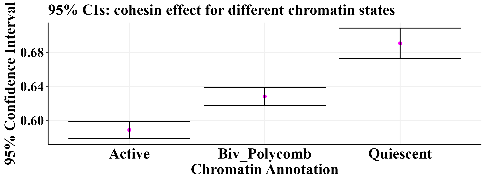
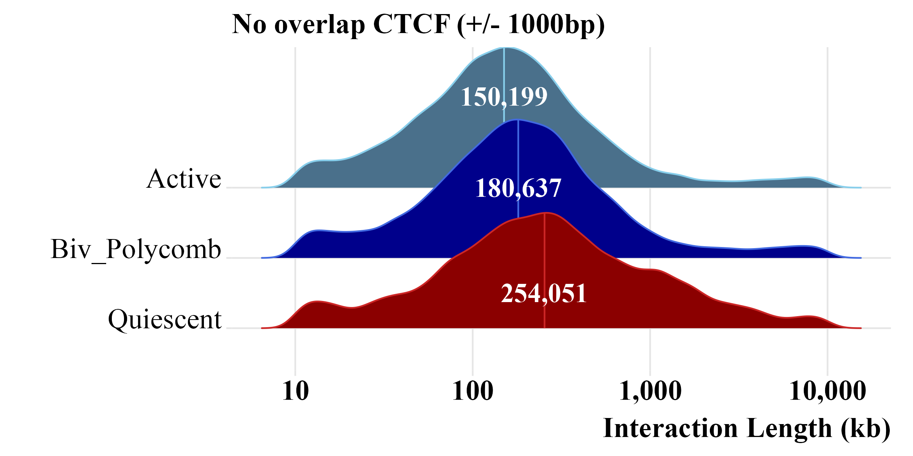
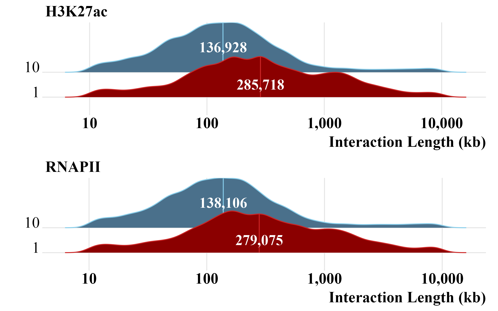

Fig. 5
================

- [Set the theme](#set-the-theme)
- [Set the path](#set-the-path)
- [5A](#5a)
- [5B](#5b)
- [5C](#5c)
  - [Supp. Ridge](#supp-ridge)
- [5D P(S)](#5d-ps)
- [Supp. LME](#supp-lme)
- [Supp. Exclude CTCF-CTCF](#supp-exclude-ctcf-ctcf)
- [5E H3K27ac, RNAPII](#5e-h3k27ac-rnapii)
  - [Supp. Exclude CTCF](#supp-exclude-ctcf)

``` r
library(foreach)
library(GenomicRanges)
library(readr)
library(rtracklayer)
library(scales)
library(plyranges)
library(nlme)
library(lme4)
library(viridis)
library(ggridges)
library(RColorBrewer)
library(cowplot)
library(gridExtra)
library(doParallel)
library(data.table)
library(Signac)
library(plyr)
library(memes)
library(universalmotif)
library(scico)
library(dplyr)
library(ggplot2)
library(tidyverse)

num_cores = 8
registerDoParallel(cores=num_cores)
```

# Set the theme

``` r
my_theme <-   theme_classic() +
  theme(panel.grid.major = element_line(color = "#f0f0f0",
                                        size = 0.5))+
  theme(plot.title = element_text(color = "black", family = "Times New Roman", size = 18, face = "bold"),
        axis.text.x = element_text(color = "black", family = "Times New Roman", size = 18,face = "bold"),
        axis.text.y = element_text(color = "black", family = "Times New Roman", size = 18,face = "bold"),
        axis.title.x = element_text(color = "black", family = "Times New Roman", size = 18,face = "bold"),
        axis.title.y = element_text(color = "black", family = "Times New Roman", size = 18,face = "bold"),
        legend.text=element_text(color = "black", family = "Times New Roman", size =18,face = "bold"),
        legend.title=element_text(color = "black", family = "Times New Roman", size = 18,face = "bold"),
        strip.text.x = element_text(color = "black", family = "Times New Roman", size = 18,face = "bold"),
        strip.text.y = element_text(color = "black", family = "Times New Roman", size = 18,face = "bold"),
        strip.background=element_rect(colour="#f0f0f0",fill="#f0f0f0"))
```

# Set the path

This is where we stored all those files in the protocol.

``` r
path <- "/aryeelab/users/corri/data/replicate_FF_results/"
```

# 5A

``` r
path <- "/aryeelab/users/corri/data/replicate_FF_results/"
left_plus <- readRDS(file = paste0(path, "left_plus_annot_cluster.RDS"))
left_plus <- left_plus %>% 
  mutate(
    LR = ifelse(interaction_length> 10000,"Long-range","Short-range")) %>% 
  mutate(short_motif_start =motif_mid - 9) %>% 
  mutate(long_motif_start = motif_mid - 25) %>% 
  mutate(motif_end= motif_mid + 9) %>% 
  mutate(LR =factor(LR, levels = c("Short-range","Long-range"))) %>% 
  mutate(start_centered = start-long_motif_start,
         end_centered = end - long_motif_start) %>% 
  filter(start_centered < (16-5)) %>% 
  filter(end_centered > (35+5)) %>% 
  mutate(fragment_type = case_when(
    width>= 120 ~ "Nucleosome",
    ((end_centered < 48) & (width < 120)) ~ "CTCF",
    ((end_centered >= 48) & (width < 120)) ~ "CTCF & Cohesin"
    
  )) %>% 
  mutate(interaction_length = abs(end2-start)) %>% 
  filter(interaction_length>10000) %>% 
  filter(fragment_type == "CTCF & Cohesin") %>% 
  ungroup() %>% 
  dplyr::rename(start1 = start, end1 = end)

table(left_plus$fragment_type)
```

``` r

gr_fragment <- makeGRangesFromDataFrame(left_plus,
                                        seqnames.field="seqnames",
                                        start.field="start2",
                                        end.field="end2", 
                                        keep.extra.columns = TRUE)

ctcf_motifs<- readRDS(file = "/aryeelab/users/corri/data/ALL_FIMO_CTCF_hg38.RDS")
minus_motifs <- ctcf_motifs[strand(ctcf_motifs)=="-"]

keep <- subsetByOverlaps(gr_fragment, minus_motifs, ignore.strand=TRUE) 

0.5* (length(keep) / length(gr_fragment)*100) # 4.5%

left_plus$convergent = 0
left_plus$convergent[left_plus$pair_ID %in% keep$pair_ID] <- 1
freq <- left_plus %>% 
  group_by(motif_id) %>% 
  summarize(type = dplyr::first(type),
            num_convergent = sum(convergent),
            num_fragments = max(row_number())) %>% 
  mutate(perc_conv = 100*(num_convergent / num_fragments)) %>% 
  filter(num_fragments>50) 

mean(0.5*freq$perc_conv)
quantile(0.5*freq$perc_conv, c(0.01, .5, 0.99)) 

left_plus %>% 
  group_by(motif_id) %>% 
  summarize(type = dplyr::first(type),
            num_convergent = sum(convergent),
            num_fragments = max(row_number())) %>% 
  mutate(perc_conv = 0.5 * (100*(num_convergent / num_fragments))) %>% 
  filter(num_fragments>50) %>% 
  ggplot(aes(x = perc_conv))+
  geom_histogram(aes(y = ..density..),
                 colour = "black", fill = "white", binwidth = 1) +
  geom_density(lwd = 1, colour = "royalblue",
               fill = "royalblue", alpha = 0.25)+
  scale_x_continuous(breaks = seq(0, 12, 5))+
  theme_classic()+
  theme(plot.title = element_text(color = "black", family = "Times New Roman", size = 18, face = "bold"),
        axis.text.x = element_text(color = "black", family = "Times New Roman", size = 18,face = "bold"),
        axis.text.y = element_text(color = "black", family = "Times New Roman", size = 18,face = "bold"),
        axis.title.x = element_text(color = "black", family = "Times New Roman", size = 18,face = "bold"),
        axis.title.y = element_text(color = "black", family = "Times New Roman", size = 18,face = "bold"),
        legend.text=element_text(color = "black", family = "Times New Roman", size =18,face = "bold"),
        legend.title=element_text(color = "black", family = "Times New Roman", size = 18,face = "bold")) +
  ylab("Density")+
  xlab("Percent fully extruded")

#ggsave(paste0(path,"Fig5perc_FE_Sep2024.png"), width=6, height=5)
```


# 5B

Figure 5B is a schematic illustrating how we annotated CBS with
chromatin annotations. I made it in Keynote, attached below for
reference:


# 5C

``` r
path <- "/aryeelab/users/corri/data/replicate_FF_results/"
left_plus <- readRDS(file = paste0(path, "left_plus_annot_cluster.RDS"))

left_plus <- left_plus %>% 
  mutate(short_motif_start =motif_mid - 9) %>% 
  mutate(long_motif_start = motif_mid - 25) %>% 
  mutate(motif_end= motif_mid + 9) %>% 
  mutate(start_centered = start-long_motif_start,
         end_centered = end - long_motif_start) %>% 
  filter(start_centered < (16-5)) %>% 
  filter(end_centered > (35+5)) %>% 
  mutate(fragment_type = case_when(
    width>= 120 ~ "Nucleosome",
    ((end_centered < 48) & (width < 120)) ~ "CTCF",
    ((end_centered >= 48) & (width < 120)) ~ "CTCF & Cohesin"
    
  )) %>% 
  mutate(interaction_length = abs(end2-start))

table(left_plus$fragment_type)
```

``` r
uniq_motif <- left_plus %>% 
  group_by(motif_id) %>% 
  dplyr::slice(1) 
probs <- quantile(uniq_motif$MB_15_Quies, probs = seq(0,1,0.1), na.rm = FALSE)
left_plus$cat <- cut(left_plus$MB_15_Quies, breaks =  probs, include.lowest = TRUE)
key <- data.frame(cbind(levels(as.factor(left_plus$cat)), 1:length(levels(as.factor(left_plus$cat)))))
colnames(key) <- c("cat", "level")
levels <- left_join(left_plus, key, by = "cat")

quiescent <- levels %>% 
  filter(level %in% c(9,10)) %>% 
  filter(cluster ==3)
#################################
uniq_motif <- left_plus %>% 
  group_by(motif_id) %>% 
  dplyr::slice(1) 

probs <- quantile(uniq_motif$Active, probs = seq(0,1,0.1), na.rm = FALSE)
left_plus$cat <- cut(left_plus$Active, breaks =  probs, include.lowest = TRUE)
key <- data.frame(cbind(levels(as.factor(left_plus$cat)), 1:length(levels(as.factor(left_plus$cat)))))
colnames(key) <- c("cat", "level")
levels <- left_join(left_plus, key, by = "cat")

active <- levels %>% 
  filter(level %in% c(9,10)) %>% 
  filter(cluster ==1)
#####################################
uniq_motif <- left_plus %>% 
  group_by(motif_id) %>% 
  dplyr::slice(1) 

probs <- quantile(uniq_motif$Biv_Polycomb, probs = seq(0,1,0.1), na.rm = FALSE)
left_plus$cat <- cut(left_plus$Biv_Polycomb, breaks =  probs, include.lowest = TRUE)
key <- data.frame(cbind(levels(as.factor(left_plus$cat)), 1:length(levels(as.factor(left_plus$cat)))))
colnames(key) <- c("cat", "level")
levels <- left_join(left_plus, key, by = "cat")

biv_poly <- levels %>% 
  filter(level %in% c(9,10)) %>% 
  filter(cluster ==2)
out <- rbind(active, quiescent,biv_poly)
```

``` r
plot_data <- out %>% 
  filter(fragment_type == "CTCF & Cohesin") %>% 
  filter(dplyr::between(interaction_length, 1e4, 1e7))

plot_data %>% 
  ggplot(aes(x = interaction_length/1000, fill = type,col = type)) +
  geom_density(alpha = 0.75) +
  theme_classic()+
  scale_fill_manual(values=c("darkred","darkblue", "skyblue4")) +
  scale_color_manual(values=c("firebrick3","royalblue", "skyblue")) +
  ylab("Density")  +
  xlab("Interaction Length (kb)")+
  labs(fill = "Chromatin annotation")+
  scale_x_log10(breaks=c(10,100,1000,10000), labels = scales::comma)+
  theme(plot.title = element_text(color = "black", family = "Times New Roman", size = 18, face = "bold"),
        axis.text.x = element_text(color = "black", family = "Times New Roman", size = 18,face = "bold"),
        axis.text.y = element_text(color = "black", family = "Times New Roman", size = 18,face = "bold"),
        axis.title.x = element_text(color = "black", family = "Times New Roman", size = 18,face = "bold"),
        axis.title.y = element_text(color = "black", family = "Times New Roman", size = 18,face = "bold"),
        legend.text=element_text(color = "black", family = "Times New Roman", size =18,face = "bold"),
        legend.title=element_text(color = "black", family = "Times New Roman", size = 18,face = "plain")) +
  theme(legend.position ="none")+
  guides(col = FALSE) 
#ggsave(paste0(path,"Fig5_density_Sep2024.png"), width=8, height=4)
```


### Supp. Ridge

``` r
med <- plot_data %>% 
  group_by(type) %>% 
  summarize(med = 10^(mean(log10(interaction_length)))) %>% 
  mutate(level = c(1,2,3))

plot_data %>% 
  ggplot(aes(x = interaction_length/1000, y = type, fill = type,col = type)) +
  stat_density_ridges(quantile_lines = TRUE, scale = 2,quantile_fun = mean)+
  theme_ridges()+
  scale_fill_manual(values=c("darkred","darkblue", "skyblue4")) +
  scale_color_manual(values=c("firebrick3","royalblue", "skyblue")) +
  ylab("")  +
  xlab("Interaction Length (kb)")+
  labs(fill = "Chromatin annotation")+
  scale_x_log10(breaks=c(10,100,1000,10000), labels = scales::comma)+
  guides(col = FALSE) +
  theme(plot.title = element_text(color = "black", family = "Times New Roman", size = 18, face = "bold"),
        axis.text.x = element_text(color = "black", family = "Times New Roman", size = 18,face = "bold"),
        axis.text.y = element_text(color = "black", family = "Times New Roman", size = 18,face = "plain"),
        axis.title.x = element_text(color = "black", family = "Times New Roman", size = 18,face = "bold"),
        axis.title.y = element_text(color = "black", family = "Times New Roman", size = 18,face = "plain"),
        legend.text=element_text(color = "black", family = "Times New Roman", size =18,face = "plain"),
        legend.title=element_text(color = "black", family = "Times New Roman", size = 18,face = "plain")) +
  theme(legend.position ="none")+
  geom_text(data = med, aes(x = med/1000, y = c(1.5,3,4.3), label = scales::comma(med)), 
            color = "white", family = "Times New Roman",size=6, fontface = "bold")

#ggsave(paste0(path,"Fig5_ridge_Sep2024.png"), width=8, height=4)
```


# 5D P(S)

``` r
out <- rbind(active, quiescent,biv_poly)
plot_data <- out %>% 
  filter(fragment_type == "CTCF & Cohesin") 

d1 <- data.frame(IL_start = seq(0, 1e7, 1000)) %>% 
  mutate(IL_mid = IL_start + 500,
         IL_end = IL_start + 1000, 
         type = "Active")

d2 <- data.frame(IL_start = seq(0, 1e7, 1000)) %>% 
  mutate(IL_mid = IL_start + 500,
         IL_end = IL_start + 1000, 
         type = "Biv_Polycomb") 

d3 <- data.frame(IL_start = seq(0, 1e7, 1000)) %>% 
  mutate(IL_mid = IL_start + 500,
         IL_end = IL_start + 1000, 
         type = "Quiescent") 
dat<- rbind(d1,d2,d3)

dat<- dat %>% 
  mutate(bin_type = paste0(type, ":", IL_mid))

check <- plot_data %>% 
  ungroup() %>% 
  group_by(type) %>% 
  mutate(count_per_CA = max(row_number())) %>% 
  filter(interaction_length < 1e7) %>% 
  mutate(interaction_length_bin = cut(interaction_length, breaks = seq(0, 1e7, 1000))) %>%
  mutate(lower = as.numeric( sub("\\((.+),.*", "\\1", interaction_length_bin)),
         upper = as.numeric( sub("[^,]*,([^]]*)\\]", "\\1", interaction_length_bin))) %>% 
  mutate(mid_IL_bin = (lower + upper)/2) %>% 
  group_by(type, interaction_length_bin) %>% 
  summarize(type = dplyr::first(type),
            interaction_length_bin = dplyr::first(mid_IL_bin),
            count = n(),
            count_per_CA = dplyr::first(count_per_CA),
            count_norm = count / count_per_CA) 


check <-check %>% 
  mutate(bin_type = paste0(type, ":", interaction_length_bin))

out <- left_join(dat, check, by = "bin_type")


dat<- out %>% 
  ungroup() %>% 
  mutate(log_interaction_length = log10(IL_mid)) %>% 
  mutate(log_IL_bin = cut(log_interaction_length, breaks = 50)) %>% 
  group_by(type.x, log_IL_bin) %>% 
  summarize(num_bins = max(row_number()),
            LC_sum = sum(count_norm, na.rm = TRUE),
            avg_LC = LC_sum / num_bins) %>% 
  mutate(lower_log_bin = as.numeric( sub("\\((.+),.*", "\\1", log_IL_bin)),
         upper_log_bin = as.numeric( sub("[^,]*,([^]]*)\\]", "\\1", log_IL_bin))) %>% 
  mutate(mid_log_bin = (lower_log_bin + upper_log_bin)/2) %>% 
  mutate(log_avg_LC = log10(avg_LC))

dat %>% 
  mutate(bin = (10^mid_log_bin)/1000) %>% 
  ggplot(aes(x = bin, y = avg_LC, color = type.x, group = type.x)) +
  # geom_point() +
  #geom_line()+
  geom_smooth(se = FALSE,span = 0.3)+
  scale_x_log10(breaks=c(1,10,100,1000,10000), labels = scales::comma)+
  scale_y_log10(breaks=c(0, 1e-1, 1e-2, 1e-3, 1e-4, 1e-5, 1e-6))+
  theme_classic() +
  scale_color_manual( values = c("skyblue", "royalblue","firebrick3"))+
  guides(col = FALSE) +
  theme(plot.title = element_text(color = "black", family = "Times New Roman", size = 18, face = "bold"),
        axis.text.x = element_text(color = "black", family = "Times New Roman", size = 18,face = "bold"),
        axis.text.y = element_text(color = "black", family = "Times New Roman", size = 18,face = "bold"),
        axis.title.x = element_text(color = "black", family = "Times New Roman", size = 18,face = "bold"),
        axis.title.y = element_text(color = "black", family = "Times New Roman", size = 18,face = "bold"),
        legend.text=element_text(color = "black", family = "Times New Roman", size =18,face = "plain"),
        legend.title=element_text(color = "black", family = "Times New Roman", size = 18,face = "plain")) +
  labs(color="Chromatin state")+
  xlab("Interaction Length (kb)")+
  ylab("Contact Probability")

#ggsave(paste0(path,"Fig5_P_S_Curve_Sep2024.png"), width=8, height=5)
```


# Supp. LME

``` r
out <- rbind(active, quiescent,biv_poly)
levels(as.factor(out$fragment_type))
plot_data <- out %>% 
  filter(fragment_type != "CTCF") %>% 
  mutate(fragment_type = factor(fragment_type, levels=c("Nucleosome", "CTCF & Cohesin")))
table(plot_data$fragment_type)
```

``` r
# plot_data <- out %>% 
#   mutate(cohesin_fragment = factor(cohesin_fragment, levels=c(0, 1)))
#######################################

temp <- plot_data %>% 
  filter(type == "Active")

m1 <-lme(log10(interaction_length+1)~ fragment_type, random=~1 | as.factor(motif_id), data = temp,
         control = lmeControl(opt = "optim"))
confint <- intervals(m1)
m1 <- data.frame(confint$fixed)[2,]
rownames(m1) <- "Active"
#######################################

temp <- plot_data %>% 
  filter(type == "Quiescent")

m2 <-lme(log10(interaction_length+1)~ fragment_type , random=~1 | as.factor(motif_id), data = temp,
         control = lmeControl(opt = "optim"))
confint <- intervals(m2)
m2 <- data.frame(confint$fixed)[2,]
rownames(m2) <- "Quiescent"
#######################################

temp <- plot_data %>% 
  filter(type == "Biv_Polycomb")

m3 <-lme(log10(interaction_length+1)~ fragment_type , random=~1 | as.factor(motif_id), data = temp,
         control = lmeControl(opt = "optim"))
confint <- intervals(m3)
m3 <- data.frame(confint$fixed)[2,]
rownames(m3) <- "Biv_Polycomb"

out <- rbind(m1,m2,m3)
out$annot <- rownames(out)
colnames(out)[2] <- "estimate"

p1 <- out %>% 
  ggplot(aes(x = annot, y = estimate)) +        # ggplot2 plot with confidence intervals
  geom_point(col = "magenta") +
  geom_errorbar(aes(ymin = lower, ymax = upper)) +
  theme_classic() +
  theme(panel.grid.major = element_line(color = "#f0f0f0",
                                        size = 0.5))+
  theme(plot.title = element_text(color = "black", family = "Times New Roman", size = 18, face = "bold"),
        axis.text.x = element_text(color = "black", family = "Times New Roman", size = 18,face = "bold"),
        axis.text.y = element_text(color = "black", family = "Times New Roman", size = 16,face = "bold"),
        axis.title.x = element_text(color = "black", family = "Times New Roman", size = 18,face = "bold"),
        axis.title.y = element_text(color = "black", family = "Times New Roman", size = 18,face = "bold"),
        axis.ticks.x=element_blank(),
        legend.text=element_text(color = "black", family = "Times New Roman", size =18,face = "bold"),
        legend.title=element_text(color = "black", family = "Times New Roman", size = 18,face = "bold"),
        strip.text.x = element_text(color = "black", family = "Times New Roman", size = 18,face = "bold"),
        strip.text.y = element_text(color = "black", family = "Times New Roman", size = 18,face = "bold"),
        strip.background=element_rect(colour="#f0f0f0",fill="#f0f0f0"))+
  ggtitle("95% CIs: cohesin effect for different chromatin states") +
  xlab("Chromatin Annotation") +
  ylab("95% Confidence Interval")
p1

#ggsave(paste0(path,"Fig5_LME_Sep2024.png"), width=8, height=3)
```



# Supp. Exclude CTCF-CTCF

``` r
path <- "/aryeelab/users/corri/data/replicate_FF_results/"
left_plus <- readRDS(file = paste0(path, "left_plus_annot_cluster.RDS"))

left_plus <- left_plus %>% 
  mutate(short_motif_start =motif_mid - 9) %>% 
  mutate(long_motif_start = motif_mid - 25) %>% 
  mutate(motif_end= motif_mid + 9) %>% 
  mutate(start_centered = start-long_motif_start,
         end_centered = end - long_motif_start) %>% 
  filter(start_centered < (16-5)) %>% 
  filter(end_centered > (35+5)) %>% 
  mutate(fragment_type = case_when(
    width>= 120 ~ "Nucleosome",
    ((end_centered < 48) & (width < 120)) ~ "CTCF",
    ((end_centered >= 48) & (width < 120)) ~ "CTCF & Cohesin"
    
  )) %>% 
  mutate(interaction_length = abs(end2-start)) %>% 
  ungroup() %>% 
  dplyr::rename(start1 = start, end1 = end)

table(left_plus$fragment_type)
```

``` r
gr_fragment <- makeGRangesFromDataFrame(left_plus,
                                        seqnames.field="seqnames",
                                        start.field="start2",
                                        end.field="end2", 
                                        keep.extra.columns = TRUE)

ctcf_motifs<- readRDS(file = "/aryeelab/users/corri/data/ALL_FIMO_CTCF_hg38.RDS")
minus_motifs <- ctcf_motifs[strand(ctcf_motifs)=="-"]

keep <- subsetByOverlaps(gr_fragment, minus_motifs, 
                         maxgap = 1000, 
                         ignore.strand=TRUE) 
left_plus <- left_plus %>% 
  filter(!(pair_ID %in% keep$pair_ID))
```

``` r
uniq_motif <- left_plus %>% 
  group_by(motif_id) %>% 
  dplyr::slice(1) 
probs <- quantile(uniq_motif$MB_15_Quies, probs = seq(0,1,0.1), na.rm = FALSE)
left_plus$cat <- cut(left_plus$MB_15_Quies, breaks =  probs, include.lowest = TRUE)
key <- data.frame(cbind(levels(as.factor(left_plus$cat)), 1:length(levels(as.factor(left_plus$cat)))))
colnames(key) <- c("cat", "level")
levels <- left_join(left_plus, key, by = "cat")

quiescent <- levels %>% 
  filter(level %in% c(9,10)) %>% 
  filter(cluster ==3)
#################################
uniq_motif <- left_plus %>% 
  group_by(motif_id) %>% 
  dplyr::slice(1) 

probs <- quantile(uniq_motif$Active, probs = seq(0,1,0.1), na.rm = FALSE)
left_plus$cat <- cut(left_plus$Active, breaks =  probs, include.lowest = TRUE)
key <- data.frame(cbind(levels(as.factor(left_plus$cat)), 1:length(levels(as.factor(left_plus$cat)))))
colnames(key) <- c("cat", "level")
levels <- left_join(left_plus, key, by = "cat")

active <- levels %>% 
  filter(level %in% c(9,10)) %>% 
  filter(cluster ==1)
#####################################
uniq_motif <- left_plus %>% 
  group_by(motif_id) %>% 
  dplyr::slice(1) 

probs <- quantile(uniq_motif$Biv_Polycomb, probs = seq(0,1,0.1), na.rm = FALSE)
left_plus$cat <- cut(left_plus$Biv_Polycomb, breaks =  probs, include.lowest = TRUE)
key <- data.frame(cbind(levels(as.factor(left_plus$cat)), 1:length(levels(as.factor(left_plus$cat)))))
colnames(key) <- c("cat", "level")
levels <- left_join(left_plus, key, by = "cat")

biv_poly <- levels %>% 
  filter(level %in% c(9,10)) %>% 
  filter(cluster ==2)
out <- rbind(active, quiescent,biv_poly)
```

``` r
plot_data <- out  %>% 
  filter(fragment_type == "CTCF & Cohesin") %>%
  filter(dplyr::between(interaction_length, 1e4, 1e7))
plot_data %>% 
  ggplot(aes(x = interaction_length/1000, fill = type,col = type)) +
  geom_density(alpha = 0.75) +
  theme_classic()+
  scale_fill_manual(values=c("darkred","darkblue", "skyblue4")) +
  scale_color_manual(values=c("firebrick3","royalblue", "skyblue")) +
  ylab("Density")  +
  xlab("Interaction Length (kb)")+
  labs(fill = "Chromatin annotation")+
  scale_x_log10(breaks=c(10,100,1000,10000), labels = scales::comma)+
  theme(plot.title = element_text(color = "black", family = "Times New Roman", size = 18, face = "bold"),
        axis.text.x = element_text(color = "black", family = "Times New Roman", size = 18,face = "bold"),
        axis.text.y = element_text(color = "black", family = "Times New Roman", size = 18,face = "bold"),
        axis.title.x = element_text(color = "black", family = "Times New Roman", size = 18,face = "bold"),
        axis.title.y = element_text(color = "black", family = "Times New Roman", size = 18,face = "bold"),
        legend.text=element_text(color = "black", family = "Times New Roman", size =18,face = "bold"),
        legend.title=element_text(color = "black", family = "Times New Roman", size = 18,face = "plain")) +
  theme(legend.position ="none")+
  guides(col = FALSE) 
```

``` r
med <- plot_data %>% 
  dplyr::group_by(type) %>% 
  dplyr::summarize(med = 10^(mean(log10(interaction_length)))) %>% 
  mutate(level = c(1,2,3))

plot_data %>% 
  ggplot(aes(x = interaction_length/1000, y = type, fill = type,col = type)) +
  stat_density_ridges(quantile_lines = TRUE, scale = 2,quantile_fun = mean)+
  theme_ridges()+
  scale_fill_manual(values=c("darkred","darkblue", "skyblue4")) +
  scale_color_manual(values=c("firebrick3","royalblue", "skyblue")) +
  ylab("")  +
  xlab("Interaction Length (kb)")+
  labs(fill = "Chromatin annotation")+
  scale_x_log10(breaks=c(10,100,1000,10000), labels = scales::comma)+
  guides(col = FALSE) +
  theme(plot.title = element_text(color = "black", family = "Times New Roman", size = 18, face = "bold"),
        axis.text.x = element_text(color = "black", family = "Times New Roman", size = 18,face = "bold"),
        axis.text.y = element_text(color = "black", family = "Times New Roman", size = 18,face = "plain"),
        axis.title.x = element_text(color = "black", family = "Times New Roman", size = 18,face = "bold"),
        axis.title.y = element_text(color = "black", family = "Times New Roman", size = 18,face = "plain"),
        legend.text=element_text(color = "black", family = "Times New Roman", size =18,face = "plain"),
        legend.title=element_text(color = "black", family = "Times New Roman", size = 18,face = "plain")) +
  theme(legend.position ="none")+
  geom_text(data = med, aes(x = med/1000, y = c(1.5,3,4.3), label = scales::comma(med)), 
            color = "white", family = "Times New Roman",size=6, fontface = "bold") +
  ggtitle("No overlap CTCF (+/- 1000bp)")


#ggsave(paste0(path,"Fig5_ridge_noCTCF_Sep2024.png"), width=8, height=4)
```



# 5E H3K27ac, RNAPII

``` bash
#RNAPII, https://www.encodeproject.org/files/ENCFF355MNE/
wget https://www.encodeproject.org/files/ENCFF355MNE/@@download/ENCFF355MNE.bed.gz
gunzip ENCFF355MNE.bed.gz
mv ENCFF355MNE.bed K562_RNAPII_peaks_ENCFF355MNE.bed

# H3K27ac, https://www.encodeproject.org/files/ENCFF544LXB/
wget https://www.encodeproject.org/files/ENCFF544LXB/@@download/ENCFF544LXB.bed.gz
gunzip ENCFF544LXB.bed.gz
mv ENCFF544LXB.bed K562_H3K27ac_peaks_ENCFF544LXB.bed
```

``` r
path <- "/aryeelab/users/corri/data/replicate_FF_results/"
#RNAPII
RNAPII <- read_tsv(paste0(path, "K562_RNAPII_peaks_ENCFF355MNE.bed"), col_names = FALSE)
colnames(RNAPII) <- c("chr", "start", "end", "name", "score", "strand", "signalValue", "pval", "qval", "peak")
RNAPII_gr <- makeGRangesFromDataFrame(RNAPII)
RNAPII_gr$qval <- RNAPII$qval
RNAPII_gr$peak_mid <- (start(RNAPII_gr) + end(RNAPII_gr))/2

# H3K27ac
H3K27ac <- read_tsv(paste0(path, "K562_H3K27ac_peaks_ENCFF544LXB.bed"), col_names = FALSE)
colnames(H3K27ac) <- c("chr", "start", "end", "name", "score", "strand", "signalValue", "pval", "qval", "peak")
H3K27ac_gr <- makeGRangesFromDataFrame(H3K27ac)
H3K27ac_gr$qval <- H3K27ac$qval
H3K27ac_gr$peak_mid <- (start(H3K27ac_gr) + end(H3K27ac_gr))/2
path <- "/aryeelab/users/corri/data/replicate_FF_results/"
left_plus <- readRDS(file = paste0(path, "left_plus_annot_cluster.RDS"))

path <- "/aryeelab/users/corri/data/replicate_FF_results/"
left_plus <- readRDS(file = paste0(path, "left_plus_annot_cluster.RDS"))

left_plus <- left_plus %>% 
  mutate(long_motif_start = motif_mid - 25) %>% 
  mutate(start_centered = start-long_motif_start,
         end_centered = end - long_motif_start) %>% 
  filter(start_centered < (16-5)) %>% 
  filter(end_centered > (35+5)) %>% 
  mutate(fragment_type = case_when(
    width>= 120 ~ "Nucleosome",
    ((end_centered < 48) & (width < 120)) ~ "CTCF",
    ((end_centered >= 48) & (width < 120)) ~ "CTCF & Cohesin"
    
  )) %>% 
  mutate(interaction_length = abs(end2-start))

uniq_motif<- left_plus %>% 
  distinct(motif_id, .keep_all = TRUE) %>% 
  dplyr::select(seqnames, motif_mid, motif_id) %>% 
  arrange(motif_id)

uniq_motif$MB <- uniq_motif$motif_mid + 1e6

uniq_motif_gr <- makeGRangesFromDataFrame(uniq_motif, keep.extra.columns=TRUE,
                                          seqnames.field="seqnames",
                                          start.field="motif_mid",
                                          end.field="MB")
```

``` r
fragment_motif_annot <- function(plus_fragment, uniq_motif_gr, chrom_stat){
  ovl <- findOverlaps(uniq_motif_gr, chrom_stat)
  chrom_stat_signal <- data.frame(
    # pairs file columns
    motif_id = uniq_motif_gr$motif_id[queryHits(ovl)],
    start_pairs = start(uniq_motif_gr)[queryHits(ovl)],
    end_pairs = end(uniq_motif_gr)[queryHits(ovl)],
    # chromatin annotation file columns
    start_chrom = start(chrom_stat)[subjectHits(ovl)],
    end_chrom = end(chrom_stat)[subjectHits(ovl)],
    qval= chrom_stat$qval[subjectHits(ovl)]) 
  
  chrom_stat_signal$start_vec <- pmax(chrom_stat_signal$start_pairs,chrom_stat_signal$start_chrom)
  chrom_stat_signal$end_vec <- pmin(chrom_stat_signal$end_pairs,chrom_stat_signal$end_chrom)
  chrom_stat_signal$width <- (chrom_stat_signal$end_vec - chrom_stat_signal$start_vec)
  
  # get total amount of each chromatin annotation for each region
  chrom_stat_signal_annot <- chrom_stat_signal %>% 
    group_by(motif_id) %>% 
    summarize(
      motif_id = dplyr::first(motif_id),
      tot_bp = sum(width),
      num_peaks = n()) %>% 
    mutate(perc_bp = 100* (tot_bp / 1e6))
  
  plus_fragment <- plus_fragment %>% 
    mutate(interaction_length = abs(end2-start))
  
  # annotate each fragment by motif-level chromatin annotation
  plus_fragment_annot <- left_join(plus_fragment,chrom_stat_signal_annot, by = "motif_id") %>% 
    arrange(motif_id)
  
  plus_fragment_annot["perc_bp"][is.na(plus_fragment_annot["perc_bp"])] <- 0
  plus_fragment_annot["num_peaks"][is.na(plus_fragment_annot["num_peaks"])] <- 0
  
  return(plus_fragment_annot)
}
```

``` r
left_plus <- fragment_motif_annot(left_plus, uniq_motif_gr, RNAPII_gr)
colnames(left_plus)[43:45] <- paste0("RNAPII_", colnames(left_plus)[43:45])

left_plus <- fragment_motif_annot(left_plus, uniq_motif_gr, H3K27ac_gr)
colnames(left_plus)[46:48] <- paste0("H3K27ac_", colnames(left_plus)[46:48])
uniq_motif <- left_plus %>% 
  group_by(motif_id) %>% 
  dplyr::slice(1)
probs <- quantile(uniq_motif$H3K27ac_perc_bp, probs = seq(0,1,0.1), na.rm = FALSE)
left_plus$cat <- cut(left_plus$H3K27ac_perc_bp, breaks =  probs, include.lowest = TRUE)
key <- data.frame(cbind(levels(as.factor(left_plus$cat)), 1:length(levels(as.factor(left_plus$cat)))))
colnames(key) <- c("cat", "level")
levels <- left_join(left_plus, key, by = "cat")

levels <- levels %>% 
  mutate(level = factor(level, levels=c(1:10))) %>% 
  filter(fragment_type == "CTCF & Cohesin") %>% 
  filter(dplyr::between(interaction_length,  1e4, 1e7)) 
med <- levels %>% 
  group_by(level) %>% 
  summarize(
    med = median((interaction_length)),
    avg = 10^(mean(log10(interaction_length))))
med<- med[c(1,10),]

ridge1 <- levels %>% 
  filter(level %in% c(1,10)) %>% 
  ggplot(aes(x = (interaction_length/1000), 
             y = level,
             fill = level,
             col=level)) +
  stat_density_ridges(quantile_lines = TRUE, scale = 2,quantile_fun = mean)+
  theme_ridges()+
  labs(fill="H3K27ac Peak Quantiles")+
  xlab("Interaction Length (kb)")+
  ylab("") +
  guides(col = FALSE) +
  scale_x_log10(breaks=c(10,100,1000,10000), labels = scales::comma)+
  scale_fill_manual(values=c("darkred", "skyblue4")) +
  scale_color_manual(values=c("firebrick3","skyblue")) +
  theme(legend.position="none")+
  ggtitle("H3K27ac")+
  geom_text(data = med, aes(x = avg/1000, y = c(1.5,3), label = scales::comma(avg)), 
            color = "white", family = "Times New Roman",size=6, fontface = "bold")+
  guides(col = FALSE) +
  theme(plot.title = element_text(color = "black", family = "Times New Roman", size = 18, face = "bold"),
        axis.text.x = element_text(color = "black", family = "Times New Roman", size = 18,face = "bold"),
        axis.text.y = element_text(color = "black", family = "Times New Roman", size = 18,face = "plain"),
        axis.title.x = element_text(color = "black", family = "Times New Roman", size = 18,face = "bold"),
        axis.title.y = element_text(color = "black", family = "Times New Roman", size = 18,face = "plain"),
        legend.text=element_text(color = "black", family = "Times New Roman", size =18,face = "plain"),
        legend.title=element_text(color = "black", family = "Times New Roman", size = 18,face = "plain")) 
uniq_motif <- left_plus %>% 
  group_by(motif_id) %>% 
  dplyr::slice(1)
probs <- quantile(uniq_motif$RNAPII_num_peaks, probs = seq(0,1,0.1), na.rm = FALSE)
left_plus$cat <- cut(left_plus$RNAPII_num_peaks, breaks =  probs, include.lowest = TRUE)
key <- data.frame(cbind(levels(as.factor(left_plus$cat)), 1:length(levels(as.factor(left_plus$cat)))))
colnames(key) <- c("cat", "level")
levels <- left_join(left_plus, key, by = "cat")

levels <- levels %>% 
  mutate(level = factor(level, levels=c(1:10))) %>% 
  filter(fragment_type == "CTCF & Cohesin") %>% 
  filter(dplyr::between(interaction_length,  1e4, 1e7)) 

med <- levels %>% 
  group_by(level) %>% 
  summarize(
    med = median((interaction_length)),
    avg = 10^(mean(log10(interaction_length))))
med<- med[c(1,10),]
ridge2 <-levels %>% 
  filter(level %in% c(1,10)) %>% 
  ggplot(aes(x = interaction_length/1000, 
             y = level,
             fill = level,
             col=level)) +
  stat_density_ridges(quantile_lines = TRUE, scale = 2,quantile_fun = mean)+
  theme_ridges()+
  labs(fill="RNAPII")+
  theme(plot.title = element_text(color = "black", family = "Times New Roman", size = 18, face = "bold"),
        axis.text.x = element_text(color = "black", family = "Times New Roman", size = 18,face = "bold"),
        axis.text.y = element_text(color = "black", family = "Times New Roman", size = 18,face = "plain"),
        axis.title.x = element_text(color = "black", family = "Times New Roman", size = 18,face = "bold"),
        axis.title.y = element_text(color = "black", family = "Times New Roman", size = 18,face = "plain"),
        legend.text=element_text(color = "black", family = "Times New Roman", size =18,face = "plain"),
        legend.title=element_text(color = "black", family = "Times New Roman", size = 18,face = "plain")) +
  xlab("Interaction Length (kb)")+
  ylab("") +
  guides(col = FALSE) +
  scale_x_log10(breaks=c(10,100,1000,10000), labels = scales::comma)+
  scale_fill_manual(values=c("darkred", "skyblue4")) +
  scale_color_manual(values=c("firebrick3","skyblue")) +
  theme(legend.position="none")+
  ggtitle("RNAPII")+
  geom_text(data = med, aes(x = avg/1000, y = c(1.5,3), label = scales::comma(avg)), 
            color = "white", family = "Times New Roman",size=6, fontface = "bold")
```

``` r
plot_grid(plotlist = list(ridge1,ridge2), align = "hv", axis = "tblr", ncol = 1)
#ggsave(paste0(path,"Fig5_K27ac_RNAPII_ridge_Sep2024.png"), width=8, height=5)
```



### Supp. Exclude CTCF

``` r
path <- "/aryeelab/users/corri/data/replicate_FF_results/"
#RNAPII
RNAPII <- read_tsv(paste0(path, "K562_RNAPII_peaks_ENCFF355MNE.bed"), col_names = FALSE)
colnames(RNAPII) <- c("chr", "start", "end", "name", "score", "strand", "signalValue", "pval", "qval", "peak")
RNAPII_gr <- makeGRangesFromDataFrame(RNAPII)
RNAPII_gr$qval <- RNAPII$qval
RNAPII_gr$peak_mid <- (start(RNAPII_gr) + end(RNAPII_gr))/2

# H3K27ac
H3K27ac <- read_tsv(paste0(path, "K562_H3K27ac_peaks_ENCFF544LXB.bed"), col_names = FALSE)
colnames(H3K27ac) <- c("chr", "start", "end", "name", "score", "strand", "signalValue", "pval", "qval", "peak")
H3K27ac_gr <- makeGRangesFromDataFrame(H3K27ac)
H3K27ac_gr$qval <- H3K27ac$qval
H3K27ac_gr$peak_mid <- (start(H3K27ac_gr) + end(H3K27ac_gr))/2
path <- "/aryeelab/users/corri/data/replicate_FF_results/"
left_plus <- readRDS(file = paste0(path, "left_plus_annot_cluster.RDS"))

path <- "/aryeelab/users/corri/data/replicate_FF_results/"
left_plus <- readRDS(file = paste0(path, "left_plus_annot_cluster.RDS"))

left_plus <- left_plus %>% 
  mutate(long_motif_start = motif_mid - 25) %>% 
  mutate(start_centered = start-long_motif_start,
         end_centered = end - long_motif_start) %>% 
  filter(start_centered < (16-5)) %>% 
  filter(end_centered > (35+5)) %>% 
  mutate(fragment_type = case_when(
    width>= 120 ~ "Nucleosome",
    ((end_centered < 48) & (width < 120)) ~ "CTCF",
    ((end_centered >= 48) & (width < 120)) ~ "CTCF & Cohesin"
    
  )) %>% 
  mutate(interaction_length = abs(end2-start))

uniq_motif<- left_plus %>% 
  distinct(motif_id, .keep_all = TRUE) %>% 
  dplyr::select(seqnames, motif_mid, motif_id) %>% 
  arrange(motif_id)

uniq_motif$MB <- uniq_motif$motif_mid + 1e6

uniq_motif_gr <- makeGRangesFromDataFrame(uniq_motif, keep.extra.columns=TRUE,
                                          seqnames.field="seqnames",
                                          start.field="motif_mid",
                                          end.field="MB")
```

``` r
left_plus <-left_plus %>% 
  dplyr::rename(start1 = start, end1 = end)
gr_fragment <- makeGRangesFromDataFrame(left_plus,
                                        seqnames.field="seqnames",
                                        start.field="start2",
                                        end.field="end2", 
                                        keep.extra.columns = TRUE)

ctcf_motifs<- readRDS(file = "/aryeelab/users/corri/data/ALL_FIMO_CTCF_hg38.RDS")
minus_motifs <- ctcf_motifs[strand(ctcf_motifs)=="-"]

keep <- subsetByOverlaps(gr_fragment, minus_motifs, 
                         maxgap = 1000, 
                         ignore.strand=TRUE) 
left_plus <- left_plus %>% 
  filter(!(pair_ID %in% keep$pair_ID)) %>% 
  dplyr::rename(start = start1, end = end1)
```

``` r
fragment_motif_annot <- function(plus_fragment, uniq_motif_gr, chrom_stat){
  ovl <- findOverlaps(uniq_motif_gr, chrom_stat)
  chrom_stat_signal <- data.frame(
    # pairs file columns
    motif_id = uniq_motif_gr$motif_id[queryHits(ovl)],
    start_pairs = start(uniq_motif_gr)[queryHits(ovl)],
    end_pairs = end(uniq_motif_gr)[queryHits(ovl)],
    # chromatin annotation file columns
    start_chrom = start(chrom_stat)[subjectHits(ovl)],
    end_chrom = end(chrom_stat)[subjectHits(ovl)],
    qval= chrom_stat$qval[subjectHits(ovl)]) 
  
  chrom_stat_signal$start_vec <- pmax(chrom_stat_signal$start_pairs,chrom_stat_signal$start_chrom)
  chrom_stat_signal$end_vec <- pmin(chrom_stat_signal$end_pairs,chrom_stat_signal$end_chrom)
  chrom_stat_signal$width <- (chrom_stat_signal$end_vec - chrom_stat_signal$start_vec)
  
  # get total amount of each chromatin annotation for each region
  chrom_stat_signal_annot <- chrom_stat_signal %>% 
    group_by(motif_id) %>% 
    summarize(
      motif_id = dplyr::first(motif_id),
      tot_bp = sum(width),
      num_peaks = n()) %>% 
    mutate(perc_bp = 100* (tot_bp / 1e6))
  
  plus_fragment <- plus_fragment %>% 
    mutate(interaction_length = abs(end2-start))
  
  # annotate each fragment by motif-level chromatin annotation
  plus_fragment_annot <- left_join(plus_fragment,chrom_stat_signal_annot, by = "motif_id") %>% 
    arrange(motif_id)
  
  plus_fragment_annot["perc_bp"][is.na(plus_fragment_annot["perc_bp"])] <- 0
  plus_fragment_annot["num_peaks"][is.na(plus_fragment_annot["num_peaks"])] <- 0
  
  return(plus_fragment_annot)
}
```

``` r
left_plus <- fragment_motif_annot(left_plus, uniq_motif_gr, RNAPII_gr)
colnames(left_plus)[43:45] <- paste0("RNAPII_", colnames(left_plus)[43:45])

left_plus <- fragment_motif_annot(left_plus, uniq_motif_gr, H3K27ac_gr)
colnames(left_plus)[46:48] <- paste0("H3K27ac_", colnames(left_plus)[46:48])
uniq_motif <- left_plus %>% 
  group_by(motif_id) %>% 
  dplyr::slice(1)
probs <- quantile(uniq_motif$H3K27ac_perc_bp, probs = seq(0,1,0.1), na.rm = FALSE)
left_plus$cat <- cut(left_plus$H3K27ac_perc_bp, breaks =  probs, include.lowest = TRUE)
key <- data.frame(cbind(levels(as.factor(left_plus$cat)), 1:length(levels(as.factor(left_plus$cat)))))
colnames(key) <- c("cat", "level")
levels <- left_join(left_plus, key, by = "cat")

levels <- levels %>% 
  mutate(level = factor(level, levels=c(1:10))) %>% 
  filter(fragment_type == "CTCF & Cohesin") %>% 
  filter(dplyr::between(interaction_length,  1e4, 1e7)) 
med <- levels %>% 
  group_by(level) %>% 
  summarize(
    med = median((interaction_length)),
    avg = 10^(mean(log10(interaction_length))))
med<- med[c(1,10),]

ridge1 <- levels %>% 
  filter(level %in% c(1,10)) %>% 
  ggplot(aes(x = (interaction_length/1000), 
             y = level,
             fill = level,
             col=level)) +
  stat_density_ridges(quantile_lines = TRUE, scale = 2,quantile_fun = mean)+
  theme_ridges()+
  labs(fill="H3K27ac Peak Quantiles")+
  xlab("Interaction Length (kb)")+
  ylab("") +
  guides(col = FALSE) +
  scale_x_log10(breaks=c(10,100,1000,10000), labels = scales::comma)+
  scale_fill_manual(values=c("darkred", "skyblue4")) +
  scale_color_manual(values=c("firebrick3","skyblue")) +
  theme(legend.position="none")+
  ggtitle("H3K27ac")+
  geom_text(data = med, aes(x = avg/1000, y = c(1.5,3), label = scales::comma(avg)), 
            color = "white", family = "Times New Roman",size=6, fontface = "bold")+
  guides(col = FALSE) +
  theme(plot.title = element_text(color = "black", family = "Times New Roman", size = 18, face = "bold"),
        axis.text.x = element_text(color = "black", family = "Times New Roman", size = 18,face = "bold"),
        axis.text.y = element_text(color = "black", family = "Times New Roman", size = 18,face = "plain"),
        axis.title.x = element_text(color = "black", family = "Times New Roman", size = 18,face = "bold"),
        axis.title.y = element_text(color = "black", family = "Times New Roman", size = 18,face = "plain"),
        legend.text=element_text(color = "black", family = "Times New Roman", size =18,face = "plain"),
        legend.title=element_text(color = "black", family = "Times New Roman", size = 18,face = "plain")) 
uniq_motif <- left_plus %>% 
  group_by(motif_id) %>% 
  dplyr::slice(1)
probs <- quantile(uniq_motif$RNAPII_num_peaks, probs = seq(0,1,0.1), na.rm = FALSE)
left_plus$cat <- cut(left_plus$RNAPII_num_peaks, breaks =  probs, include.lowest = TRUE)
key <- data.frame(cbind(levels(as.factor(left_plus$cat)), 1:length(levels(as.factor(left_plus$cat)))))
colnames(key) <- c("cat", "level")
levels <- left_join(left_plus, key, by = "cat")

levels <- levels %>% 
  mutate(level = factor(level, levels=c(1:10))) %>% 
  filter(fragment_type == "CTCF & Cohesin") %>% 
  filter(dplyr::between(interaction_length,  1e4, 1e7)) 

med <- levels %>% 
  group_by(level) %>% 
  summarize(
    med = median((interaction_length)),
    avg = 10^(mean(log10(interaction_length))))
med<- med[c(1,10),]
ridge2 <-levels %>% 
  filter(level %in% c(1,10)) %>% 
  ggplot(aes(x = interaction_length/1000, 
             y = level,
             fill = level,
             col=level)) +
  stat_density_ridges(quantile_lines = TRUE, scale = 2,quantile_fun = mean)+
  theme_ridges()+
  labs(fill="RNAPII")+
  theme(plot.title = element_text(color = "black", family = "Times New Roman", size = 18, face = "bold"),
        axis.text.x = element_text(color = "black", family = "Times New Roman", size = 18,face = "bold"),
        axis.text.y = element_text(color = "black", family = "Times New Roman", size = 18,face = "plain"),
        axis.title.x = element_text(color = "black", family = "Times New Roman", size = 18,face = "bold"),
        axis.title.y = element_text(color = "black", family = "Times New Roman", size = 18,face = "plain"),
        legend.text=element_text(color = "black", family = "Times New Roman", size =18,face = "plain"),
        legend.title=element_text(color = "black", family = "Times New Roman", size = 18,face = "plain")) +
  xlab("Interaction Length (kb)")+
  ylab("") +
  guides(col = FALSE) +
  scale_x_log10(breaks=c(10,100,1000,10000), labels = scales::comma)+
  scale_fill_manual(values=c("darkred", "skyblue4")) +
  scale_color_manual(values=c("firebrick3","skyblue")) +
  theme(legend.position="none")+
  ggtitle("RNAPII")+
  geom_text(data = med, aes(x = avg/1000, y = c(1.5,3), label = scales::comma(avg)), 
            color = "white", family = "Times New Roman",size=6, fontface = "bold")
```

``` r
plot_grid(plotlist = list(ridge1,ridge2), align = "hv", axis = "tblr", ncol = 1)
#ggsave(paste0(path,"Fig5_K27ac_RNAPII_ridge_noCTCF_Sep2024.png"), width=8, height=5)
```


