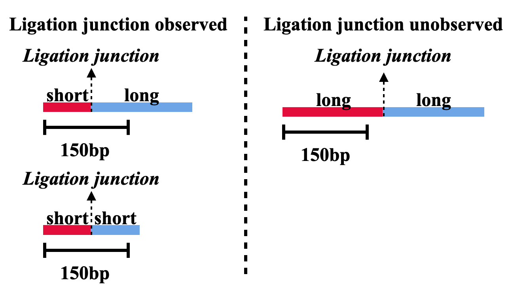
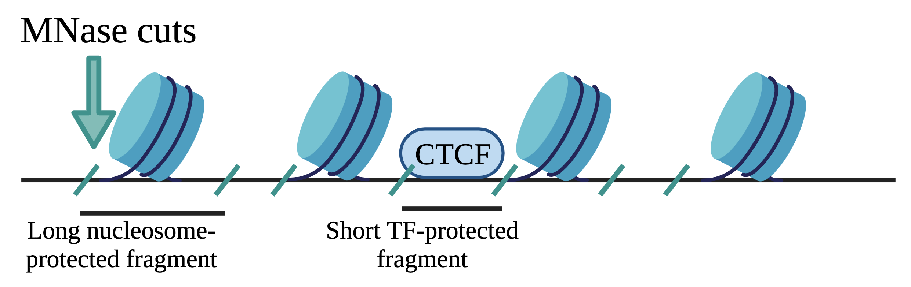
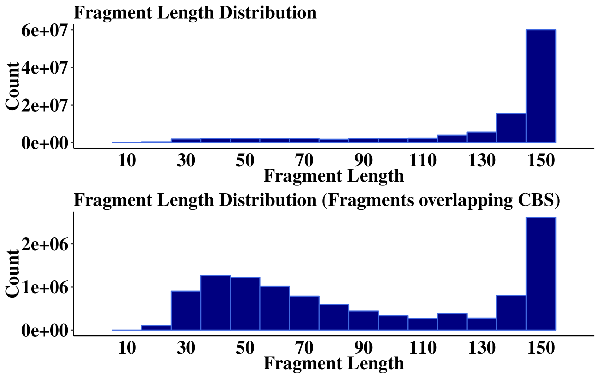
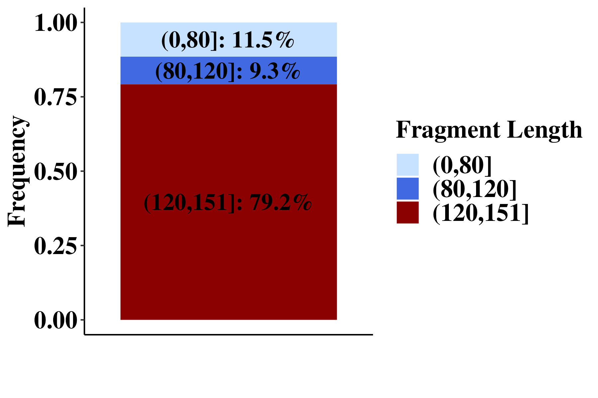
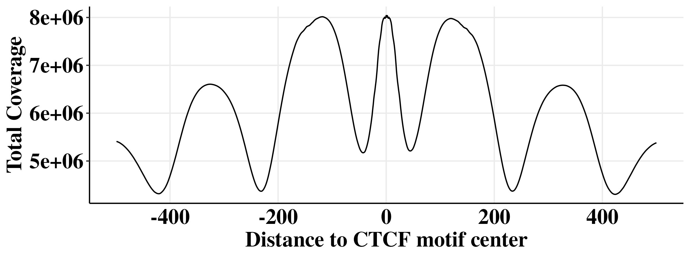
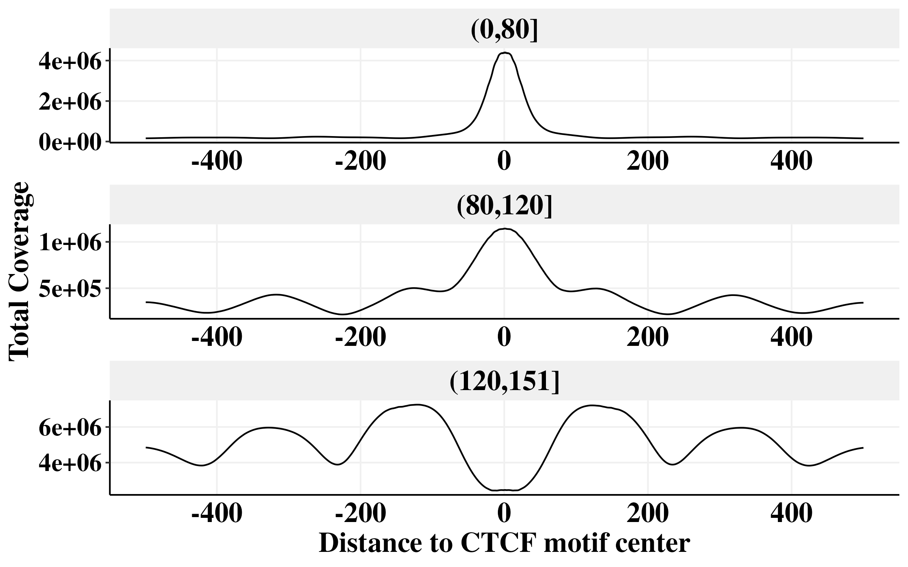

```{r, include = FALSE}
knitr::opts_chunk$set(
  collapse = TRUE,
  comment = "#>",
  out.width = "100%", 
  eval = FALSE
)
```

```{r}
library(foreach)
library(GenomicRanges)
library(readr)
library(rtracklayer)
library(scales)
library(plyranges)
library(nlme)
library(lme4)
library(viridis)
library(ggridges)
library(RColorBrewer)
library(cowplot)
library(gridExtra)
library(doParallel)
library(data.table)
library(Signac)
library(plyr)
library(dplyr)
library(ggplot2)
library(tidyverse)

num_cores = 8
registerDoParallel(cores=num_cores)
```

# Set the path
This is where we stored all those files in the protocol.
```{r}
path <- "/aryeelab/users/corri/data/replicate_FF_results/"
```

# Figure 1A
Figure 1A is a schematic made in keynote, so no R code is required. (Inserted below for reference.)



# Figure 1B
Figure 1B is a schematic made in biorender, so no R code is required. (Inserted below for reference.)




# Figure 1C
**Fragment length distribution.**

```{r}
print("read pairs")
pairs <- readRDS("/aryeelab/users/corri/data/k562_ctcf_mapped.pairs.rds")
print("done reading pairs")

nrow(pairs) # 386,874,029
```

```{r}
# left fragment
gr_fragment1 <- makeGRangesFromDataFrame(pairs,
                                         seqnames.field="chr1",
                                         start.field="start1",
                                         end.field="end1")
# right fragment
gr_fragment2 <- makeGRangesFromDataFrame(pairs,
                                         seqnames.field="chr2",
                                         start.field="start2",
                                         end.field="end2")
gr_fragment <- c(gr_fragment1, gr_fragment2)
```

```{r}
chip <- read_tsv("/aryeelab/users/corri/data/K562_CTCF_peaks_ENCFF736NYC.bed", col_names = FALSE)
colnames(chip) <- c("chr", "start", "end", "name", "score", "strand", "signalValue", "pval", "qval", "peak")
chip_gr <- makeGRangesFromDataFrame(chip)
chip_gr$qval <- chip$qval
chip_gr$peak_mid <- (start(chip_gr) + end(chip_gr))/2

anchors <- chip_gr %>% 
  plyranges::anchor_center() %>% 
  plyranges::mutate(width = 60)
```


```{r}
ctcf_motifs<- readRDS(file = "/aryeelab/users/corri/data/ALL_FIMO_CTCF_hg38.RDS")

# Subset to 19bp (vs 34bp, 35bp) CTCF motifs that overlap a hires anchor
# NOTE: In the current input file, they are all 19bp
gr_motifs <- ctcf_motifs[width(ctcf_motifs)==19]
# Remove overlapping motifs
keep <- countOverlaps(gr_motifs, gr_motifs, ignore.strand=TRUE)==1 
table(keep)
gr_motifs <- gr_motifs[keep]
keep <- countOverlaps(gr_motifs, anchors, maxgap = 0)>=1 
table(keep) 
gr_motifs <- gr_motifs[keep]
gr_motifs$motif_mid <- round(start(gr_motifs) + width(gr_motifs)/2)
```

*Note: it's much too big to try and graph the distribution of fragments for the entire genome. chr1 is a representative sample, so this is an appropriate approximation.*
```{r}
chr1 <- gr_fragment[seqnames(gr_fragment) == "chr1"]


p1 <- data.frame(wid = width(chr1)) %>% 
  ggplot(aes(x = wid))+
  geom_histogram(fill = "navy", col = "royalblue", binwidth = 10)+
  scale_x_continuous(breaks = seq(10, 150, 20), limits = c(0, 160))+
  theme_classic()+
  theme(plot.title = element_text(color = "black", family = "Times New Roman", size = 18, face = "bold"),
        axis.text.x = element_text(color = "black", family = "Times New Roman", size = 18,face = "bold"),
        axis.text.y = element_text(color = "black", family = "Times New Roman", size = 18,face = "bold"),
        axis.title.x = element_text(color = "black", family = "Times New Roman", size = 18,face = "bold"),
        axis.title.y = element_text(color = "black", family = "Times New Roman", size = 18,face = "bold"),
        axis.ticks.x=element_blank(),
        legend.text=element_text(color = "black", family = "Times New Roman", size =18,face = "bold"),
        legend.title=element_text(color = "black", family = "Times New Roman", size = 18,face = "bold")) +
  xlab("Fragment Length")+
  ylab("Count") +
  ggtitle("Fragment Length Distribution")
```

```{r}
keep <- subsetByOverlaps(gr_fragment, gr_motifs, maxgap = 0, ignore.strand=TRUE) 

p2 <- data.frame(wid = width(keep)) %>% 
  ggplot(aes(x = wid))+
  geom_histogram(fill = "navy", col = "royalblue", binwidth = 10)+
  scale_x_continuous(breaks = seq(10, 150, 20), limits = c(0, 160))+
  theme_classic()+
  theme(plot.title = element_text(color = "black", family = "Times New Roman", size = 18, face = "bold"),
        axis.text.x = element_text(color = "black", family = "Times New Roman", size = 18,face = "bold"),
        axis.text.y = element_text(color = "black", family = "Times New Roman", size = 18,face = "bold"),
        axis.title.x = element_text(color = "black", family = "Times New Roman", size = 18,face = "bold"),
        axis.title.y = element_text(color = "black", family = "Times New Roman", size = 18,face = "bold"),
        axis.ticks.x=element_blank(),
        legend.text=element_text(color = "black", family = "Times New Roman", size =18,face = "bold"),
        legend.title=element_text(color = "black", family = "Times New Roman", size = 18,face = "bold")) +
  xlab("Fragment Length")+
  ylab("Density")+
  ggtitle("Fragment Length Distribution (Fragments overlapping CBS)")
```


```{r, fig.width =8,fig.height = 5}
plot_grid(plotlist =list(p1,p2), align = "hv", axis = "tblr",ncol = 1)
ggsave(paste0(path,"1D_FL_dist.png"), width=8, height=5)
```



# Figure 1D
**Barplot of fragment length frequency.**

```{r}
print("read pairs")
pairs <- readRDS("/aryeelab/users/corri/data/k562_ctcf_mapped.pairs.rds")
print("done reading pairs")

nrow(pairs) # 386,874,029
```

```{r}
FL_1 <- pairs$end1-pairs$start1
FL_2 <- pairs$end2-pairs$start2

FL <- c(FL_1,FL_2)
FL <- data.frame(width = FL)
b <- c(0, 80, 120, 151)

FL$width_bin <- cut(FL$width, breaks=b)

freq<- FL %>% 
  filter(!is.na(width_bin)) %>% 
  group_by(width_bin) %>% 
  summarize(count = n()) %>% 
  mutate(freq = count /sum(count))
```


```{r, fig.width = 6, fig.height = 4}
freq %>% 
  ggplot( aes(x="", y=freq, fill = width_bin)) +
  geom_col() +
  geom_text(aes(label = paste0(width_bin, ": ",100*round(freq, 3), "%" )), colour = "black",position = position_stack(vjust = 0.5),
            family = "Times New Roman",size = 6, fontface = "bold") +
  theme_classic()+
  xlab("")+
  ylab("Frequency") +
  theme(plot.title = element_text(color = "black", family = "Times New Roman", size = 18, face = "bold"),
        axis.text.x = element_text(color = "black", family = "Times New Roman", size = 18,face = "bold"),
        axis.text.y = element_text(color = "black", family = "Times New Roman", size = 18,face = "bold"),
        axis.title.x = element_text(color = "black", family = "Times New Roman", size = 18,face = "bold"),
        axis.title.y = element_text(color = "black", family = "Times New Roman", size = 18,face = "bold"),
        axis.ticks.x=element_blank(),
        legend.text=element_text(color = "black", family = "Times New Roman", size =18,face = "bold"),
        legend.title=element_text(color = "black", family = "Times New Roman", size = 18,face = "bold")) +
  scale_fill_manual(values = c("slategray1", "royalblue", "darkred")) +
  guides(fill=guide_legend(title="Fragment Length"))

ggsave(paste0(path,"1_FL_bar.png"), width=6, height=4)
```



### Estimates of % overlapping CBS (defined by motifs under ChIP-seq peaks)

```{r}
# left fragment
gr_fragment1 <- makeGRangesFromDataFrame(pairs,
                                         seqnames.field="chr1",
                                         start.field="start1",
                                         end.field="end1")
# right fragment
gr_fragment2 <- makeGRangesFromDataFrame(pairs,
                                         seqnames.field="chr2",
                                         start.field="start2",
                                         end.field="end2")
gr_fragment <- c(gr_fragment1, gr_fragment2)
```

```{r}
chip <- read_tsv("/aryeelab/users/corri/data/K562_CTCF_peaks_ENCFF736NYC.bed", col_names = FALSE)
colnames(chip) <- c("chr", "start", "end", "name", "score", "strand", "signalValue", "pval", "qval", "peak")
chip_gr <- makeGRangesFromDataFrame(chip)
chip_gr$qval <- chip$qval
chip_gr$peak_mid <- (start(chip_gr) + end(chip_gr))/2

anchors <- chip_gr %>% 
  plyranges::anchor_center() %>% 
  plyranges::mutate(width = 60)
```


```{r}
ctcf_motifs<- readRDS(file = "/aryeelab/users/corri/data/ALL_FIMO_CTCF_hg38.RDS")

# Subset to 19bp (vs 34bp, 35bp) CTCF motifs that overlap a hires anchor
# NOTE: In the current input file, they are all 19bp
gr_motifs <- ctcf_motifs[width(ctcf_motifs)==19]
# Remove overlapping motifs
keep <- countOverlaps(gr_motifs, gr_motifs, ignore.strand=TRUE)==1 
table(keep)
gr_motifs <- gr_motifs[keep]
keep <- countOverlaps(gr_motifs, anchors, maxgap = 0)>=1 
table(keep) 
gr_motifs <- gr_motifs[keep]
gr_motifs$motif_mid <- round(start(gr_motifs) + width(gr_motifs)/2)
```


**Percent of short fragments (< 80bp) overlapping CBS**
```{r}
gr_fragment80 <- gr_fragment[width(gr_fragment)<=80]
keep <- subsetByOverlaps(gr_fragment80, gr_motifs, maxgap = 0, ignore.strand=TRUE) 
100*length(keep)/length(gr_fragment80)
```

*6.43%*


**Percent of mid-size fragments (80:120bp) overlapping CBS**
```{r}
gr_fragment80 <- gr_fragment[ (width(gr_fragment)>80) & (width(gr_fragment)<=120) ]
keep <- subsetByOverlaps(gr_fragment80, gr_motifs, maxgap = 0, ignore.strand=TRUE) 
100*length(keep)/length(gr_fragment80)
```

*2.11%*

**Percent of long fragments (>120bp) overlapping CBS**
```{r}
gr_fragment80 <- gr_fragment[width(gr_fragment)>120]
keep <- subsetByOverlaps(gr_fragment80, gr_motifs, maxgap = 0, ignore.strand=TRUE) 
100*length(keep)/length(gr_fragment80)
```

*0.64%*

# Figure 1E
**Fragment coverage metaplot +/- 500bp around CTCF binding sites.**

```{r}
print("read pairs")
pairs <- readRDS("/aryeelab/users/corri/data/k562_ctcf_mapped.pairs.rds")
print("done reading pairs")

nrow(pairs) # 386,874,029
```

```{r}
all_peaks <- readRDS(paste0(path, "GW_peaks_1e-05.RDS"))

all_peaks <- all_peaks %>% 
  dplyr::rename(window_mid = start) %>% 
  dplyr::select(-end)

peaks_gr <- makeGRangesFromDataFrame(all_peaks, 
                                     keep.extra.columns=FALSE,
                                     seqnames.field = "seqnames",
                                     start.field = "peak_summit", 
                                     end.field = "peak_summit")

peaks_gr$peak_mid <- start(peaks_gr)
anchors <- peaks_gr

ctcf_motifs<- readRDS(file = "/aryeelab/users/corri/data/ALL_FIMO_CTCF_hg38.RDS")
loops <- import("/aryeelab/users/corri/data/K562_CTCF_loops.bedpe")
```


```{r}
# Subset to 19bp (vs 34bp, 35bp) CTCF motifs that overlap a hires anchor
# NOTE: In the current input file, they are all 19bp
gr_motifs <- ctcf_motifs[width(ctcf_motifs)==19]
# Remove overlapping motifs
keep <- countOverlaps(gr_motifs, gr_motifs, ignore.strand=TRUE)==1 
table(keep)
gr_motifs <- gr_motifs[keep]
# subset to motifs overlapping peaks
keep <- countOverlaps(gr_motifs, anchors, maxgap = 0)==1 
table(keep)
gr_motifs <- gr_motifs[keep]
gr_motifs$motif_mid <- round( ( start(gr_motifs) + end(gr_motifs) )/2)
# Annotate motifs with loop anchor status
left_anchor <- countOverlaps(gr_motifs, loops@first)
right_anchor <- countOverlaps(gr_motifs, loops@second)
gr_motifs$loop_anchor <- "No anchor"
gr_motifs$loop_anchor[left_anchor & !right_anchor] <- "Left anchor"
gr_motifs$loop_anchor[!left_anchor & right_anchor] <- "Right anchor"
gr_motifs$loop_anchor[left_anchor & right_anchor] <- "Both anchors"

# Make windows centered on motifs
gr_motifs_window <- resize(gr_motifs, width=1000, fix="center")
# Remove overlapping windows
keep <- countOverlaps(gr_motifs_window, gr_motifs_window, ignore.strand=TRUE)==1 

gr_motifs_window <- gr_motifs_window[keep]
```

```{r}
num_cores = 8
registerDoParallel(cores=num_cores)

# Make a per-bp GRanges for the motif windows
# length(gr_motifs_window)
gr_motifs_window_bp <- foreach(i = 1:length(gr_motifs_window), .combine=c) %dopar% {
  window=gr_motifs_window[i]
  df_window <- data.frame(pos=start(window):end(window), pos_in_window=1:width(window), window_id=i, motif_strand = paste0(strand(window), " Motif"), loop_anchor=gr_motifs_window$loop_anchor[i]) 
  gr_window <- GRanges(seqnames(window), IRanges(df_window$pos, df_window$pos))
  mcols(gr_window) <- df_window[,c("window_id", "pos_in_window", "motif_strand", "loop_anchor")]
  gr_window
}

# Make sure windows don't overlap
table(countOverlaps(gr_motifs_window_bp, gr_motifs_window_bp))
```


```{r}
# Fragment 1
gr_fragment <- GRanges(pairs$chr1, IRanges(pairs$start1, pairs$end1))
gr_fragment$width_bin <- as.factor("One_bin")

cov_df1 <- foreach(size = levels(gr_fragment$width_bin), .combine=rbind) %dopar% {
  if (sum(gr_fragment$width_bin == size, na.rm=TRUE) > 10) {
    cov <- coverage(gr_fragment[which(gr_fragment$width_bin == size)])
    foreach(chr = seqlevels(gr_fragment), .combine=rbind) %do% {
      keep_pos <- gr_motifs_window_bp %>% filter(seqnames == chr) %>% start()
      x <- as.vector(cov[[chr]])
      data.frame(chr=chr, pos=keep_pos, size=size, cov=x[keep_pos], fragment="Left fragment") 
    }
  }
}
# Fragment 2
gr_fragment <- GRanges(pairs$chr2, IRanges(pairs$start2, pairs$end2))
gr_fragment$width_bin <- as.factor("One_bin")
cov_df2 <- foreach(size = levels(gr_fragment$width_bin), .combine=rbind) %dopar% {
  if (sum(gr_fragment$width_bin == size, na.rm=TRUE) > 10) {
    cov <- coverage(gr_fragment[which(gr_fragment$width_bin == size)])
    foreach(chr = seqlevels(gr_fragment), .combine=rbind) %do% {
      keep_pos <- gr_motifs_window_bp %>% filter(seqnames == chr) %>% start()
      x <- as.vector(cov[[chr]])
      data.frame(chr=chr, pos=keep_pos, size=size, cov=x[keep_pos], fragment="Right fragment") 
    }
  }
}
cov_df <- rbind(cov_df1, cov_df2)
gr_cov <- GRanges(cov_df$chr, IRanges(cov_df$pos, cov_df$pos))
```

```{r}
ovl <- findOverlaps(gr_cov, gr_motifs_window_bp)
df <- cbind(cov_df[queryHits(ovl),], 
            as.data.frame(gr_motifs_window_bp[subjectHits(ovl)])) %>%
  select(seqnames, pos, size, cov, window_id, pos_in_window, fragment, motif_strand)
df <- cbind(df, 
            motif_score=gr_motifs_window$score[df$window_id],
            loop_anchor=gr_motifs_window$loop_anchor[df$window_id])
df$size <- factor(df$size, levels=unique(df$size))
df$fragment <- factor(df$fragment, levels=unique(df$fragment))
df$loop_anchor <- factor(df$loop_anchor, levels=c("No anchor", "Left anchor", "Right anchor", "Both anchors"))
```

```{r}
saveRDS(df, file = paste0(path, "k562_ctcf_coverage_1000bp_nostratify.rds"))
```

```{r}
df <- readRDS(file = paste0(path, "k562_ctcf_coverage_1000bp_nostratify.rds"))
```


```{r,fig.width =8, fig.height = 3}
df %>% 
  mutate(dist_to_motif_center = pos_in_window-500) %>% 
  group_by(dist_to_motif_center) %>% 
  summarise(cov=sum(cov, na.rm=T)) %>% 
  ungroup() %>% 
  ggplot(aes(dist_to_motif_center, cov)) + geom_line() + 
  scale_x_continuous(breaks = seq(-400, 400, 200)) + 
  xlab("Distance to CTCF motif center") + 
  ylab("Total Coverage") +
  theme_classic()+
  theme(panel.grid.major = element_line(color = "grey92",
                                        size = 0.5))+
  theme(plot.title = element_text(color = "black", family = "Times New Roman", size = 18, face = "bold"),
        axis.text.x = element_text(color = "black", family = "Times New Roman", size = 18,face = "bold"),
        axis.text.y = element_text(color = "black", family = "Times New Roman", size = 18,face = "bold"),
        axis.title.x = element_text(color = "black", family = "Times New Roman", size = 18,face = "bold"),
        axis.title.y = element_text(color = "black", family = "Times New Roman", size = 18,face = "bold"),
        axis.ticks.x=element_blank(),
        legend.text=element_text(color = "black", family = "Times New Roman", size =18,face = "bold"),
        legend.title=element_text(color = "black", family = "Times New Roman", size = 18,face = "bold"))
ggsave(paste0(path,"1B_nofilt_Cov.png"), width=8, height=3)
```




*Approximation of nucleosome periodicity ~ 200bp*
```{r}
df %>% 
  mutate(dist_to_motif_center = pos_in_window-500) %>% 
  group_by(dist_to_motif_center) %>% 
  summarise(cov=sum(cov, na.rm=T)) %>% 
  ungroup() %>% 
  ggplot(aes(dist_to_motif_center, cov)) + geom_line() + geom_vline(xintercept = 0, color="grey") + 
  # geom_vline(xintercept = c(-60-147, -60,0,60, 60+147), color="slateblue", linetype = "dashed") + 
  theme_bw() + 
  scale_x_continuous(breaks = seq(-500, 500, 100)) + 
  xlab("Distance to CTCF motif center") + 
  ylab("Total Coverage") +
  theme(plot.title = element_text(color = "black", family = "Times New Roman", size = 16, face = "bold"),
        axis.text.x = element_text(color = "black", family = "Times New Roman", size = 16,face = "plain"),
        axis.text.y = element_text(color = "black", family = "Times New Roman", size = 16,face = "plain"),  
        axis.title.x = element_text(color = "black", family = "Times New Roman", size = 16,face = "plain"),
        axis.title.y = element_text(color = "black", family = "Times New Roman", size = 16,face = "plain"),
        legend.text=element_text(color = "black", family = "Times New Roman", size =16,face = "plain"),
        legend.title=element_text(color = "black", family = "Times New Roman", size = 16,face = "plain"))+
  geom_vline(xintercept = c(-130-200,-130, 130, 130+200), col = "red")
```

# Figure 1F
Fragment coverage metaplot +/- 500bp around CTCF binding sites stratified by fragment length. 

```{r}
print("read pairs")
pairs <- readRDS("/aryeelab/users/corri/data/k562_ctcf_mapped.pairs.rds")
print("done reading pairs")

nrow(pairs) # 386,874,029
```

```{r}
all_peaks <- readRDS(paste0(path, "GW_peaks_1e-05.RDS"))

all_peaks <- all_peaks %>% 
  dplyr::rename(window_mid = start) %>% 
  dplyr::select(-end)

peaks_gr <- makeGRangesFromDataFrame(all_peaks, 
                                     keep.extra.columns=FALSE,
                                     seqnames.field = "seqnames",
                                     start.field = "peak_summit", 
                                     end.field = "peak_summit")

peaks_gr$peak_mid <- start(peaks_gr)
anchors <- peaks_gr

ctcf_motifs<- readRDS(file = "/aryeelab/users/corri/data/ALL_FIMO_CTCF_hg38.RDS")
loops <- import("/aryeelab/users/corri/data/K562_CTCF_loops.bedpe")
```


```{r}
# Subset to 19bp (vs 34bp, 35bp) CTCF motifs that overlap a hires anchor
# NOTE: In the current input file, they are all 19bp
gr_motifs <- ctcf_motifs[width(ctcf_motifs)==19]
# Remove overlapping motifs
keep <- countOverlaps(gr_motifs, gr_motifs, ignore.strand=TRUE)==1 
table(keep)
gr_motifs <- gr_motifs[keep]
# subset to motifs overlapping peaks
keep <- countOverlaps(gr_motifs, anchors, maxgap = 0)==1 
table(keep)
gr_motifs <- gr_motifs[keep]
gr_motifs$motif_mid <- round( ( start(gr_motifs) + end(gr_motifs) )/2)
# Annotate motifs with loop anchor status
left_anchor <- countOverlaps(gr_motifs, loops@first)
right_anchor <- countOverlaps(gr_motifs, loops@second)
gr_motifs$loop_anchor <- "No anchor"
gr_motifs$loop_anchor[left_anchor & !right_anchor] <- "Left anchor"
gr_motifs$loop_anchor[!left_anchor & right_anchor] <- "Right anchor"
gr_motifs$loop_anchor[left_anchor & right_anchor] <- "Both anchors"

# Make windows centered on motifs
gr_motifs_window <- resize(gr_motifs, width=1000, fix="center")
# Remove overlapping windows
keep <- countOverlaps(gr_motifs_window, gr_motifs_window, ignore.strand=TRUE)==1 

gr_motifs_window <- gr_motifs_window[keep]
```

```{r}
num_cores = 8
registerDoParallel(cores=num_cores)

# Make a per-bp GRanges for the motif windows
# length(gr_motifs_window)
gr_motifs_window_bp <- foreach(i = 1:length(gr_motifs_window), .combine=c) %dopar% {
  window=gr_motifs_window[i]
  df_window <- data.frame(pos=start(window):end(window), pos_in_window=1:width(window), window_id=i, motif_strand = paste0(strand(window), " Motif"), loop_anchor=gr_motifs_window$loop_anchor[i]) 
  gr_window <- GRanges(seqnames(window), IRanges(df_window$pos, df_window$pos))
  mcols(gr_window) <- df_window[,c("window_id", "pos_in_window", "motif_strand", "loop_anchor")]
  gr_window
}

# Make sure windows don't overlap
table(countOverlaps(gr_motifs_window_bp, gr_motifs_window_bp))
```

*This is where things become different from the other metaplot.*
```{r}
b <- c(0, 80, 120, 151)
# Fragment 1
gr_fragment <- GRanges(pairs$chr1, IRanges(pairs$start1, pairs$end1))
gr_fragment$width_bin <- cut(width(gr_fragment), breaks=b)

cov_df1 <- foreach(size = levels(gr_fragment$width_bin), .combine=rbind) %dopar% {
  if (sum(gr_fragment$width_bin == size, na.rm=TRUE) > 10) {
    cov <- coverage(gr_fragment[which(gr_fragment$width_bin == size)])
    foreach(chr = seqlevels(gr_fragment), .combine=rbind) %do% {
      keep_pos <- gr_motifs_window_bp %>% filter(seqnames == chr) %>% start()
      x <- as.vector(cov[[chr]])
      data.frame(chr=chr, pos=keep_pos, size=size, cov=x[keep_pos], fragment="Left fragment") 
    }
  }
}
# Fragment 2
gr_fragment <- GRanges(pairs$chr2, IRanges(pairs$start2, pairs$end2))
gr_fragment$width_bin <- cut(width(gr_fragment), breaks=b)

cov_df2 <- foreach(size = levels(gr_fragment$width_bin), .combine=rbind) %dopar% {
  if (sum(gr_fragment$width_bin == size, na.rm=TRUE) > 10) {
    cov <- coverage(gr_fragment[which(gr_fragment$width_bin == size)])
    foreach(chr = seqlevels(gr_fragment), .combine=rbind) %do% {
      keep_pos <- gr_motifs_window_bp %>% filter(seqnames == chr) %>% start()
      x <- as.vector(cov[[chr]])
      data.frame(chr=chr, pos=keep_pos, size=size, cov=x[keep_pos], fragment="Right fragment") 
    }
  }
}
cov_df <- rbind(cov_df1, cov_df2)
gr_cov <- GRanges(cov_df$chr, IRanges(cov_df$pos, cov_df$pos))
length(gr_cov)/1e6
```


```{r}
ovl <- findOverlaps(gr_cov, gr_motifs_window_bp)
df <- cbind(cov_df[queryHits(ovl),], 
            as.data.frame(gr_motifs_window_bp[subjectHits(ovl)])) %>%
  select(seqnames, pos, size, cov, window_id, pos_in_window, fragment, motif_strand)
df <- cbind(df, 
            motif_score=gr_motifs_window$score[df$window_id],
            loop_anchor=gr_motifs_window$loop_anchor[df$window_id])
df$size <- factor(df$size, levels=unique(df$size))
df$fragment <- factor(df$fragment, levels=unique(df$fragment))
df$loop_anchor <- factor(df$loop_anchor, levels=c("No anchor", "Left anchor", "Right anchor", "Both anchors"))
```

```{r}
saveRDS(df, file = paste0(path, "k562_ctcf_coverage_1000bp_fragment_length.rds"))
```

```{r}
path <- "/aryeelab/users/corri/data/replicate_FF_results/"
df <- readRDS(file = paste0(path, "k562_ctcf_coverage_1000bp_fragment_length.rds"))
```


```{r, fig.width = 8, fig.height = 5}
df %>% 
  mutate(dist_to_motif_center = pos_in_window-500) %>% 
  group_by(dist_to_motif_center, size) %>% 
  summarise(cov=sum(cov, na.rm=T)) %>% 
  ungroup() %>% 
  ggplot(aes(dist_to_motif_center, cov)) + geom_line() + 
  facet_wrap(~size,ncol=1, scales = "free") +
  scale_x_continuous(breaks = seq(-400, 400, 200)) +
  scale_y_continuous(breaks = pretty_breaks(n = 3))+
  xlab("Distance to CTCF motif center") + 
  ylab("Total Coverage") +
  theme_classic()+
  theme(panel.grid.major = element_line(color = "#f0f0f0",
                                        size = 0.5))+
  theme(plot.title = element_text(color = "black", family = "Times New Roman", size = 18, face = "bold"),
        axis.text.x = element_text(color = "black", family = "Times New Roman", size = 18,face = "bold"),
        axis.text.y = element_text(color = "black", family = "Times New Roman", size = 16,face = "bold"),
        axis.title.x = element_text(color = "black", family = "Times New Roman", size = 18,face = "bold"),
        axis.title.y = element_text(color = "black", family = "Times New Roman", size = 18,face = "bold"),
        axis.ticks.x=element_blank(),
        legend.text=element_text(color = "black", family = "Times New Roman", size =18,face = "bold"),
        legend.title=element_text(color = "black", family = "Times New Roman", size = 18,face = "bold"),
        strip.text.x = element_text(color = "black", family = "Times New Roman", size = 18,face = "bold"),
        strip.background=element_rect(colour="#f0f0f0",fill="#f0f0f0"))

ggsave(paste0(path,"1C_filt_Cov.png"), width=8, height=5)
```




