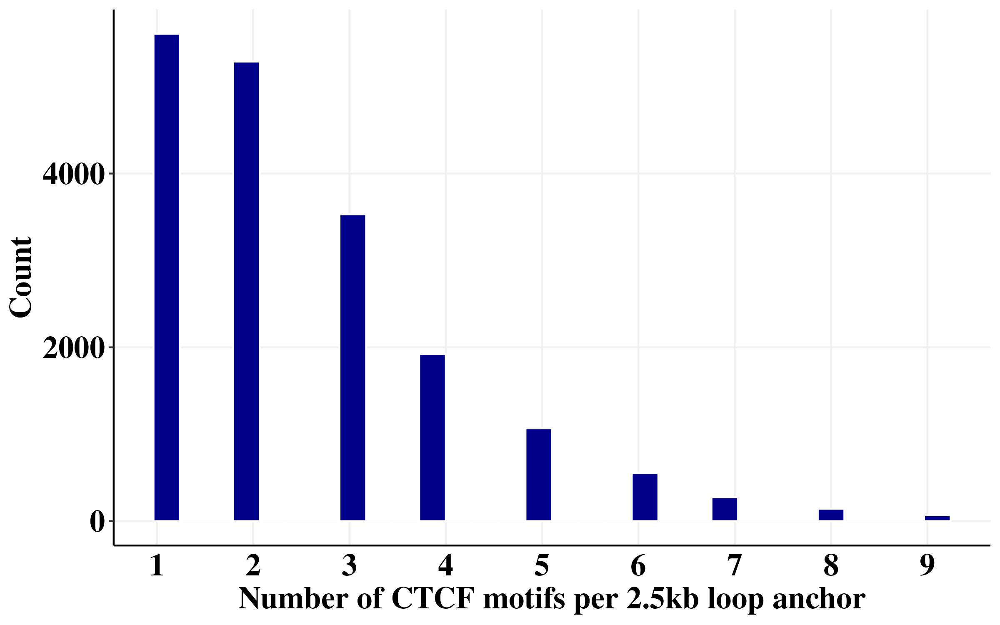
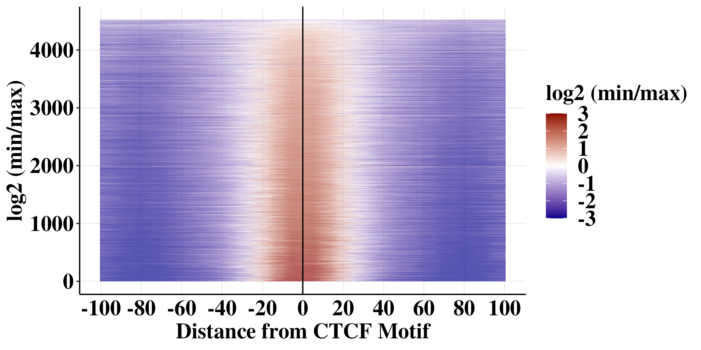
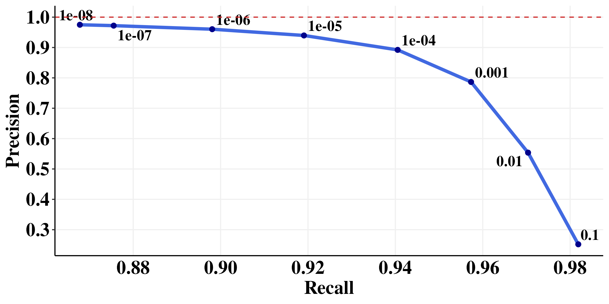
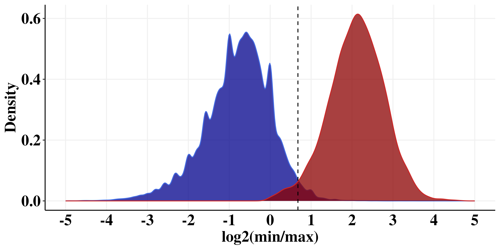
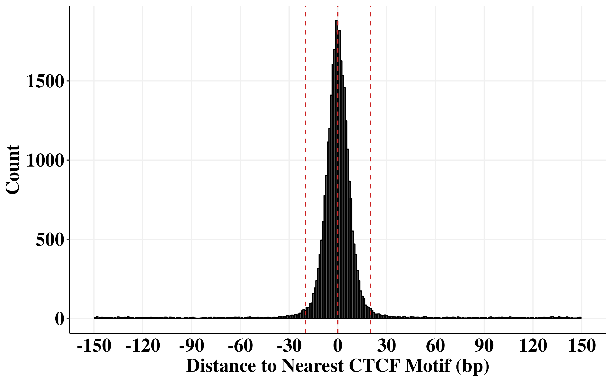
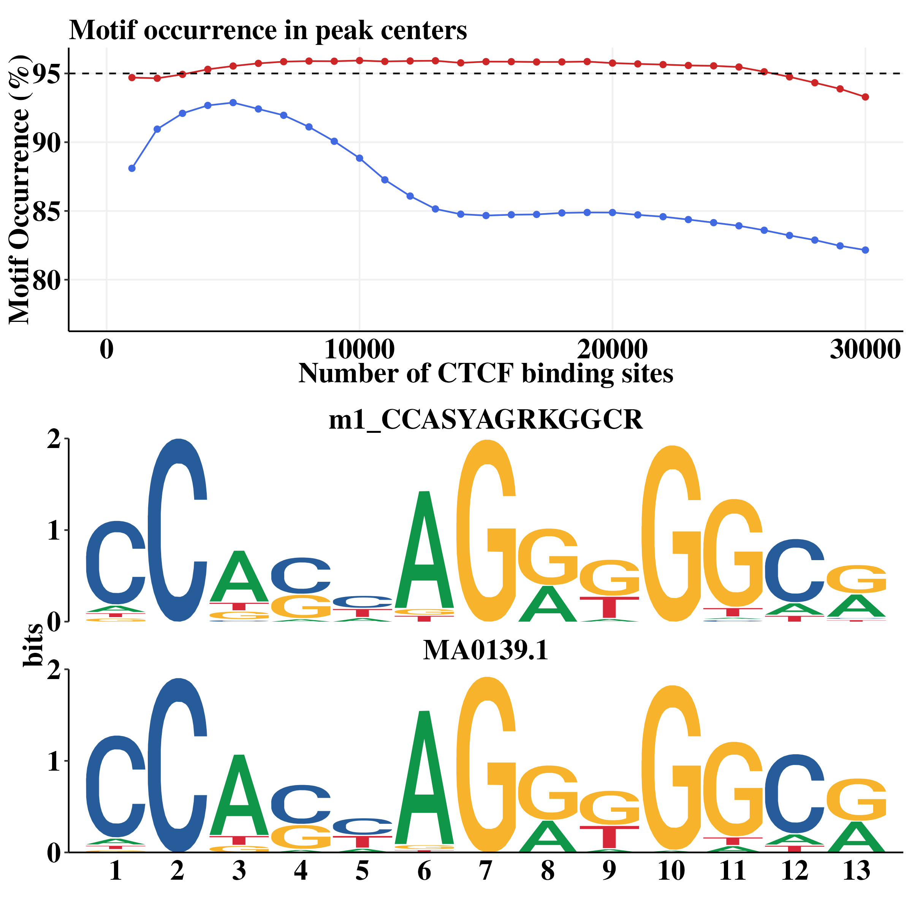

```{r, include = FALSE}
knitr::opts_chunk$set(
  collapse = TRUE,
  comment = "#>",
  out.width = "100%", 
  eval = FALSE
)
```

```{r}
library(foreach)
library(GenomicRanges)
library(readr)
library(rtracklayer)
library(scales)
library(plyranges)
library(nlme)
library(lme4)
library(viridis)
library(ggridges)
library(RColorBrewer)
library(cowplot)
library(gridExtra)
library(doParallel)
library(data.table)
library(Signac)
library(plyr)
library(dplyr)
library(ggplot2)
library(tidyverse)

num_cores = 8
registerDoParallel(cores=num_cores)
```

# Set the path
This is where we stored all those files in the protocol.
```{r}
path <- "/aryeelab/users/corri/data/replicate_FF_results/"
```

# Figure 3D

```{r}
loops <-read_tsv("/aryeelab/users/corri/data/K562_CTCF_2.5kb.interactions_FitHiC_Q0.01.bed")
loops <- loops %>% 
  filter(chr1 != "chrX") %>% 
  filter(chr2 != "chrX")

LA <- loops %>% 
  dplyr::select(chr1, s1, e1) %>% 
  dplyr::rename(chr = chr1, start = s1, end = e1)

RA <- loops %>% 
  dplyr::select(chr2, s2, e2) %>% 
  dplyr::rename(chr = chr2, start = s2, end = e2)

anchors <- rbind(LA,RA) %>% 
  mutate(loc = paste0(chr, ":",start)) %>% 
  distinct(loc, .keep_all = TRUE)

anchors_gr <- makeGRangesFromDataFrame(anchors, 
                                       keep.extra.columns = TRUE,
                                       seqnames.field = "chr",
                                       start.field = "start",
                                       end.field = "end")
```

```{r}
ctcf_motifs<- readRDS("/aryeelab/users/corri/data/ALL_FIMO_CTCF_hg38.RDS")
gr_motifs <- ctcf_motifs[width(ctcf_motifs)==19]
gr_motifs$motif_mid <- round( ( start(gr_motifs) + end(gr_motifs) )/2)
```

```{r}
ovl <- findOverlaps(gr_motifs, anchors_gr, maxgap = 0)

out <- as.data.frame(gr_motifs[queryHits(ovl)]) %>% 
  cbind(motif_id = queryHits(ovl),
        loop_id = subjectHits(ovl),
        loop_start = start(anchors_gr)[subjectHits(ovl)],
        loop_end = end(anchors_gr)[subjectHits(ovl)]) 

out %>% 
  group_by(loop_id) %>% 
  dplyr::summarize(count =dplyr::n()) %>%
  filter(count < 10) %>% 
  ggplot(aes(x = count))+
  geom_histogram(fill = "darkblue", col = "white")+
  theme_classic()+
  theme(panel.grid.major = element_line(color = "#f0f0f0",
                                        size = 0.5))+
  theme(plot.title = element_text(color = "black", family = "Times New Roman", size = 18, face = "bold"),
        axis.text.x = element_text(color = "black", family = "Times New Roman", size = 18,face = "bold"),
        axis.text.y = element_text(color = "black", family = "Times New Roman", size = 18,face = "bold"),
        axis.title.x = element_text(color = "black", family = "Times New Roman", size = 18,face = "bold"),
        axis.title.y = element_text(color = "black", family = "Times New Roman", size = 18,face = "bold"),
        axis.ticks.x=element_blank(),
        legend.text=element_text(color = "black", family = "Times New Roman", size =18,face = "bold"),
        legend.title=element_text(color = "black", family = "Times New Roman", size = 18,face = "bold"),
        strip.text.x = element_text(color = "black", family = "Times New Roman", size = 18,face = "bold"),
        strip.background=element_rect(colour="#f0f0f0",fill="#f0f0f0"))+
  xlab("Number of CTCF motifs per 2.5kb loop anchor")+
  ylab("Count") +
  scale_x_continuous(breaks=seq(1:10))

#ggsave(paste0(path,"3C_loop_hist.png"), width=8, height=5)
```



### Estimate the number of loop anchors with more than one CTCF motif
```{r}
temp<- out %>% 
  group_by(loop_id) %>% 
  dplyr::summarize(count =dplyr::n()) 

# 70% have more than one CTCF motif
temp %>% 
  filter(count >1) %>% 
  dplyr::summarize(RN = max(row_number())) %>% 
  mutate(freq = RN / nrow(temp))
```

# Figure 3A

*Filter to loop anchors with only one CTCF motif.*
```{r}
uniq<- out %>% 
  dplyr::group_by(loop_id) %>% 
  dplyr::mutate(count = max(dplyr::row_number())) %>% 
  ungroup() %>% 
  filter(count == 1) %>% 
  arrange(loop_id)

uniq_gr <- makeGRangesFromDataFrame(uniq, 
                                    keep.extra.columns = FALSE,
                                    seqnames.field = "seqnames",
                                    start.field = "start",
                                    end.field = "end")
uniq_gr$motif_mid <- uniq$motif_mid
uniq_gr$loop_start <- uniq$loop_start
uniq_gr$loop_end <- uniq$loop_end
```

*The CTCF motif has to be within 30bp of a CTCF ChIP-seq peak summit.*
```{r}
chip <- read_tsv("/aryeelab/users/corri/data/K562_CTCF_peaks_ENCFF736NYC.bed", col_names = FALSE)
colnames(chip) <- c("chr", "start", "end", "name", "score", "strand", "signalValue", "pval", "qval", "peak")
chip_gr <- makeGRangesFromDataFrame(chip)
chip_gr$qval <- chip$qval
chip_gr$peak_mid <- (start(chip_gr) + end(chip_gr))/2

anchors <- chip_gr %>% 
  plyranges::anchor_center() %>% 
  plyranges::mutate(width = 301)
```

```{r}
ovl <- findOverlaps(uniq_gr, anchors, maxgap = 0)

out <- as.data.frame(uniq_gr[queryHits(ovl)]) %>% 
  cbind(motif_id = queryHits(ovl),
        chip_id = subjectHits(ovl),
        chip_start = start(anchors)[subjectHits(ovl)],
        chip_mid = anchors$peak_mid[subjectHits(ovl)],
        chip_end = end(anchors)[subjectHits(ovl)],
        qval_score = anchors$qval[subjectHits(ovl)]) %>% 
  mutate(dist = chip_mid - motif_mid)

out <- out %>% 
  ungroup() %>% 
  group_by(chip_id) %>% 
  arrange(abs(dist)) %>% 
  dplyr::slice(1)

out <- out %>% 
  filter(abs(dist) < 30)

# going to use this dataset for precision-recall curve later
ctcf_chip <- out %>% 
  ungroup()
```


```{r}
loop_anc <- out %>%
  ungroup() %>% 
  dplyr::select(seqnames, motif_mid) %>%
  mutate(chr1 = seqnames,
         s1 = motif_mid - 100,
         e1 = motif_mid + 100)
```

```{r}
pairs <- readRDS("/aryeelab/users/corri/data/k562_ctcf_mapped.pairs_STRAND_TYPE_X.rds")
pairs <- pairs %>% 
  filter(chr1 != "chrX") # 386,874,029 rows
```

*took 5 minutes*
```{r}
source("/aryeelab/users/corri/code/mnase-hichip/code/get_quadrants_function.R")
path <- "/aryeelab/users/corri/data/replicate_FF_results/"
pval_table <- paste0(path, "df_p_1e8.RDS")
reads <- get_quadrant_reads(regions = loop_anc, step = 1, pairs = pairs, num_cores=8,pval_table)
```

```{r}
results_anc1 <- reads

results_anc1<- results_anc1 %>% 
  mutate(dist = window_mid - motif_mid)

order <- results_anc1 %>% 
  ungroup() %>% 
  dplyr::group_by(region_id) %>%
  dplyr::summarize(max_signal = max(log_min_max),
                   signal = sum(log_min_max)) %>% 
  arrange(desc(max_signal), desc(signal)) %>% 
  dplyr::mutate(order = 1:nrow(loop_anc)) # 4523

results_anc1<- left_join(results_anc1,order, by = "region_id")
```

```{r}
saveRDS(results_anc1, file = paste0(path,"heatmap_sort_readcounts.RDS"))
```

```{r, fig.width = 8, fig.height = 4}
results_anc1 <- readRDS(file = paste0(path,"heatmap_sort_readcounts.RDS"))

results_anc1$log_min_max_thresh <- results_anc1$log_min_max
results_anc1$log_min_max_thresh[results_anc1$log_min_max_thresh > 3] <- 3
results_anc1$log_min_max_thresh[results_anc1$log_min_max_thresh < -3] <- -3

results_anc1 %>% 
  ggplot(aes(dist, order, fill=log_min_max_thresh )) + 
  geom_tile() +
  ylab("log2 (min/max)")  +
  xlab("Distance from CTCF Motif")+
  labs(fill = "log2 (min/max)")+
  theme_classic()+
  theme(panel.grid.major = element_line(color = "#f0f0f0",
                                        size = 0.5))+
  theme(plot.title = element_text(color = "black", family = "Times New Roman", size = 18, face = "bold"),
        axis.text.x = element_text(color = "black", family = "Times New Roman", size = 18,face = "bold"),
        axis.text.y = element_text(color = "black", family = "Times New Roman", size = 18,face = "bold"),
        axis.title.x = element_text(color = "black", family = "Times New Roman", size = 18,face = "bold"),
        axis.title.y = element_text(color = "black", family = "Times New Roman", size = 18,face = "bold"),
        axis.ticks.x=element_blank(),
        legend.text=element_text(color = "black", family = "Times New Roman", size =18,face = "bold"),
        legend.title=element_text(color = "black", family = "Times New Roman", size = 18,face = "bold"),
        strip.text.x = element_text(color = "black", family = "Times New Roman", size = 18,face = "bold"),
        strip.background=element_rect(colour="#f0f0f0",fill="#f0f0f0"))+
  scale_fill_gradient2(
    low = "darkblue",
    mid = "white",
    high = "darkred")+
  geom_vline(xintercept = c(0))+
  scale_x_continuous(breaks=seq(-100,100,20))

ggsave(paste0(path,"3A_min_max_heatmap.png"), width=8, height=4)
```



# Figure 3B 

**precision recall curves**
NOTE: use the loop anchors with one motif (first make sure the chip-seq peak agrees with the motif to get the "true set".)


```{r}
df <- readRDS(file =paste0(path, "GW_pvals.RDS"))


peaks_gr <- makeGRangesFromDataFrame(df,
                                     seqnames.field = "chr",
                                     start.field = "window_mid",
                                     end.field = "window_mid",
                                     keep.extra.columns = TRUE)
peaks_gr$FF_pval <- df$pvalue
peaks_gr$window_mid <- df$window_mid
```

*we made this dataset in 3A*
```{r}
nrow(ctcf_chip) # 4523
```


```{r}
chip_motif <- makeGRangesFromDataFrame(ctcf_chip,
                                       seqnames.field = "seqnames",
                                       start.field = "motif_mid",
                                       end.field = "motif_mid")

ovl <- findOverlaps(chip_motif, peaks_gr, maxgap = 40)

TP <- as.data.frame(chip_motif[queryHits(ovl)]) %>% 
  cbind(motif_id = queryHits(ovl),
        peak_id = subjectHits(ovl),
        peak = start(peaks_gr)[subjectHits(ovl)],
        FF_pval = peaks_gr$FF_pval[subjectHits(ovl)],
        q1 = peaks_gr$q1[subjectHits(ovl)],
        q2 = peaks_gr$q2[subjectHits(ovl)],
        q3 = peaks_gr$q3[subjectHits(ovl)],
        q4 = peaks_gr$q4[subjectHits(ovl)],
        num_reads = peaks_gr$num_reads[subjectHits(ovl)],
        min24 = peaks_gr$min24[subjectHits(ovl)],
        max13 = peaks_gr$max13[subjectHits(ovl)],
        log_min_max = peaks_gr$log_min_max[subjectHits(ovl)]) %>% 
  mutate(dist = start-peak) %>% 
  group_by(motif_id) %>% 
  filter(abs(dist) < 30) %>% 
  arrange(desc(log_min_max)) %>% 
  dplyr::slice(1) %>% 
  ungroup()
```

```{r}
out <- ctcf_chip

out <- out %>% 
  mutate(s1 = loop_start+20,
         e1 = motif_mid - 200, 
         s2 = motif_mid + 200,
         e2 = loop_end-20) 

check <- out %>% 
  filter(s1<e1)
chip_motif1 <- makeGRangesFromDataFrame(check,
                                        seqnames.field = "seqnames",
                                        start.field = "s1",
                                        end.field = "e1")

check <- out %>% 
  filter(s2<e2)
chip_motif2 <- makeGRangesFromDataFrame(check,
                                        seqnames.field = "seqnames",
                                        start.field = "s2",
                                        end.field = "e2")

chip_motif<- c(chip_motif1, chip_motif2)

ovl <- findOverlaps(chip_motif, peaks_gr, maxgap = 0)

FP <- as.data.frame(chip_motif[queryHits(ovl)]) %>% 
  cbind(loop_id = queryHits(ovl),
        peak_id = subjectHits(ovl),
        peak = start(peaks_gr)[subjectHits(ovl)],
        FF_pval = peaks_gr$FF_pval[subjectHits(ovl)],
        q1 = peaks_gr$q1[subjectHits(ovl)],
        q2 = peaks_gr$q2[subjectHits(ovl)],
        q3 = peaks_gr$q3[subjectHits(ovl)],
        q4 = peaks_gr$q4[subjectHits(ovl)],
        num_reads = peaks_gr$num_reads[subjectHits(ovl)],
        min24 = peaks_gr$min24[subjectHits(ovl)],
        max13 = peaks_gr$max13[subjectHits(ovl)],
        log_min_max = peaks_gr$log_min_max[subjectHits(ovl)])

```


```{r}
FP$group <- floor(FP$peak/150)
FP <- FP %>% 
  mutate(group = paste0(seqnames, ":", group)) 

num_TP<- 4523 # number of TP motifs

thresh_vec <- seq(1,10, by = 1)


PR <- data.frame(thresh=  thresh_vec, 
                 lik_precision = rep(NA, length(thresh_vec)),
                 lik_recall = rep(NA, length(thresh_vec)))

iter <- 1
for (score_val in thresh_vec){
  print(score_val)
  
  thresh <- 10^(-1 * score_val)
  
  ### False positives
  num_FP_lik <- FP %>% 
    filter(FF_pval<= thresh) %>%
    group_by(group) %>%
    dplyr::slice(1) %>%
    ungroup() %>% 
    dplyr::summarize(FP = max(dplyr::row_number())) %>% 
    pull(FP) 
  
  if(num_FP_lik == "-Inf"){
    num_FP_lik <- 0
  }
  
  ### True positives
  lik_TP <- TP %>%
    filter(FF_pval <= thresh) %>% 
    dplyr::summarize(truepos = max(dplyr::row_number())) %>% 
    pull(truepos)
  
  # recall
  PR$lik_recall[iter] <- lik_recall <- lik_TP /num_TP
  
  # precision
  PR$lik_precision[iter] <- lik_prec <- lik_TP / (lik_TP + num_FP_lik)
  iter <- iter + 1
}

```

```{r, fig.width = 8,fig.height = 4}
library(ggrepel)
PR %>% 
  filter(thresh <= 8) %>% 
  ggplot(aes(x = lik_recall, y = lik_precision)) +
  geom_line(color = "royalblue", size = 1.5) +
  geom_point(color = "darkblue", size = 2) +
  geom_text_repel(aes(x = lik_recall, y = lik_precision, label = 10^(-1*thresh)),family = "Times New Roman",size = 5,fontface =2)+
  geom_hline(yintercept = 1, col = "firebrick3", linetype = "dashed") + 
  xlab("Recall") +
  ylab("Precision") +
  scale_x_continuous(breaks = c(seq(0.8,1,0.02)))+
  scale_y_continuous(breaks = c(seq(0.2,1,0.1)))+
  theme_classic()+
  theme(panel.grid.major = element_line(color = "#f0f0f0",
                                        size = 0.5))+
  theme(plot.title = element_text(color = "black", family = "Times New Roman", size = 18, face = "bold"),
        axis.text.x = element_text(color = "black", family = "Times New Roman", size = 18,face = "bold"),
        axis.text.y = element_text(color = "black", family = "Times New Roman", size = 18,face = "bold"),
        axis.title.x = element_text(color = "black", family = "Times New Roman", size = 18,face = "bold"),
        axis.title.y = element_text(color = "black", family = "Times New Roman", size = 18,face = "bold"),
        axis.ticks.x=element_blank(),
        legend.text=element_text(color = "black", family = "Times New Roman", size =18,face = "bold"),
        legend.title=element_text(color = "black", family = "Times New Roman", size = 18,face = "bold"),
        strip.text.x = element_text(color = "black", family = "Times New Roman", size = 18,face = "bold"),
        strip.background=element_rect(colour="#f0f0f0",fill="#f0f0f0"))


#ggsave(paste0(path,"3B_PR.png"), width=8, height=4)
```



# Figure 2E

We're using the same set of true positives as the previous graphs, and also getting the true negatives. The genome-wide results are filtered to min/max > 1 and read count > 5, so a lot of the null signal isn't included. 
These clearly won't be false positives, but I need all the true negatives to make the boxplots.

```{r}
out <- ctcf_chip
loop_anc <- out %>%
  dplyr::select(seqnames, loop_start, loop_end) %>%
  mutate(chr1 = seqnames,
         s1 = loop_start - 100,
         e1 = loop_end + 100)
```

```{r}
#should still have pairs read in
#pairs <- readRDS("/aryeelab/users/corri/data/k562_ctcf_mapped.pairs_STRAND_TYPE_X.rds")
nrow(pairs)
nrow(loop_anc)
```

doing 150bp step so it's not overlapping
```{r}
source("/aryeelab/users/corri/code/mnase-hichip/code/get_quadrants_function.R")
path <- "/aryeelab/users/corri/data/replicate_FF_results/"
pval_table <- paste0(path, "df_p_1e8.RDS")
reads <- get_quadrant_reads(regions = loop_anc, step = 150, pairs = pairs, num_cores=8,pval_table)
```


```{r}
saveRDS(reads, file = paste0(path,"true_negative.RDS"))
```

```{r}
reads <- readRDS(file = paste0(path,"true_negative.RDS"))
```


```{r}
results<- reads %>% 
  dplyr::select(-c(seqnames))
peaks_gr <- makeGRangesFromDataFrame(results,
                                     seqnames.field = "chr",
                                     start.field = "window_mid",
                                     end.field = "window_mid",
                                     keep.extra.columns = TRUE)
```


```{r}
out <- ctcf_chip

out <- out %>% 
  mutate(s1 = loop_start+20,
         e1 = motif_mid - 200, 
         s2 = motif_mid + 200,
         e2 = loop_end-20) 

check <- out %>% 
  filter(s1<e1)
chip_motif1 <- makeGRangesFromDataFrame(check,
                                        seqnames.field = "seqnames",
                                        start.field = "s1",
                                        end.field = "e1")

check <- out %>% 
  filter(s2<e2)
chip_motif2 <- makeGRangesFromDataFrame(check,
                                        seqnames.field = "seqnames",
                                        start.field = "s2",
                                        end.field = "e2")

chip_motif<- c(chip_motif1, chip_motif2)

ovl <- findOverlaps(chip_motif, peaks_gr, maxgap = 0)

FP <- as.data.frame(chip_motif[queryHits(ovl)]) %>% 
  cbind(loop_id = queryHits(ovl),
        peak_id = subjectHits(ovl),
        peak = start(peaks_gr)[subjectHits(ovl)],
        FF_pval = peaks_gr$pvalue[subjectHits(ovl)],
        q1 = peaks_gr$q1[subjectHits(ovl)],
        q2 = peaks_gr$q2[subjectHits(ovl)],
        q3 = peaks_gr$q3[subjectHits(ovl)],
        q4 = peaks_gr$q4[subjectHits(ovl)],
        num_reads = peaks_gr$num_reads[subjectHits(ovl)],
        min24 = peaks_gr$min24[subjectHits(ovl)],
        max13 = peaks_gr$max13[subjectHits(ovl)],
        log_min_max = peaks_gr$log_min_max[subjectHits(ovl)])
```


```{r}
dist_TP <- TP %>% 
  group_by(motif_id) %>% 
  mutate(tot_reads =  q1+q2+q3+q4) %>% 
  mutate(Q2 = q2 / tot_reads) %>% 
  mutate(Q4 = q4 / tot_reads) %>% 
  mutate(Q1 = q1  / tot_reads) %>% 
  mutate(Q3 = q3 / tot_reads) %>% 
  mutate(TP = "True Positive")


TP_annot <- dist_TP %>% 
  ungroup() %>% 
  pivot_longer(cols = c(Q2,Q4, Q1,Q3))

dist_FP <- FP %>%  
  ungroup() %>% 
  group_by(peak_id) %>% 
  mutate(tot_reads =  q1+q2+q3+q4) %>% 
  mutate(Q2 = q2 / tot_reads) %>% 
  mutate(Q4 = q4 / tot_reads) %>% 
  mutate(Q1 = q1  / tot_reads) %>% 
  mutate(Q3 = q3 / tot_reads) %>% 
  mutate(TP = "True Negative")

FP_annot <- dist_FP %>% 
  ungroup() %>% 
  pivot_longer(cols = c(Q2,Q4, Q1,Q3))

TP_annot<- TP_annot %>% 
  dplyr::select(value,name,TP)
FP_annot<- FP_annot %>% 
  dplyr::select(value,name,TP)

annot <- rbind(TP_annot,FP_annot)
```

```{r, fig.width = 8, fig.height = 4}
annot %>% 
  ggplot(aes(y = name, 
             x = value, 
             fill = name,
             col = name)) +
  geom_boxplot(width = 0.4)+
  scale_fill_manual(values = c("darkred", "firebrick3", "darkblue","royalblue")) +
  scale_color_manual(values = c("firebrick3", "darkred", "royalblue","darkblue")) +
  geom_vline(xintercept = 0.25, linetype = "dashed")+
  xlab("Quadrant Read Frequency")+
  ylab("")+
  labs(fill = "Quadrant")+
  facet_wrap(~TP,  ncol = 1) +
  guides(col = "none")+
  
  theme_classic()+
  theme(panel.grid.major = element_line(color = "#f0f0f0",
                                        size = 0.5))+
  theme(plot.title = element_text(color = "black", family = "Times New Roman", size = 18, face = "bold"),
        axis.text.x = element_text(color = "black", family = "Times New Roman", size = 18,face = "bold"),
        axis.text.y = element_text(color = "black", family = "Times New Roman", size = 18,face = "bold"),
        axis.title.x = element_text(color = "black", family = "Times New Roman", size = 18,face = "bold"),
        axis.title.y = element_text(color = "black", family = "Times New Roman", size = 18,face = "bold"),
        axis.ticks.x=element_blank(),
        legend.text=element_text(color = "black", family = "Times New Roman", size =18,face = "bold"),
        legend.title=element_text(color = "black", family = "Times New Roman", size = 18,face = "bold"),
        strip.text.x = element_text(color = "black", family = "Times New Roman", size = 18,face = "bold"),
        strip.background=element_rect(colour="#f0f0f0",fill="#f0f0f0"))+
  scale_x_continuous(breaks = seq(0,1,0.2))+
  theme(legend.position = "none")

#ggsave(paste0(path, "2F_Dist.png"), width=8, height=4)
```


# Figure 3C

*We're graphing the same set of true positives and true negatives that we graphed in 2E.*

```{r, fig.width = 8, fig.height = 4}
FP_temp <- dist_FP %>% 
  ungroup() %>% 
  dplyr::select(TP, log_min_max)

TP_temp <- dist_TP %>% 
  ungroup() %>% 
  dplyr::select(TP, log_min_max)


rbind(FP_temp,TP_temp) %>% 
  ggplot(aes(x = log_min_max, fill = as.factor(TP), col = as.factor(TP)))+
  geom_density(alpha = 0.75) +
  scale_fill_manual(values=c("darkblue", "darkred")) +
  scale_color_manual(values=c("royalblue","firebrick3")) +
  xlab("log2(min/max)")+
  ylab("Density")+
  labs(fill = "")+
  guides(col = "none")+
  geom_vline(xintercept = log2(1.6), linetype = "dashed")+
  scale_x_continuous(breaks=seq(-5,5,1), limits = c(-5,5)) +
  
  theme_classic()+
  theme(panel.grid.major = element_line(color = "#f0f0f0",
                                        size = 0.5))+
  theme(plot.title = element_text(color = "black", family = "Times New Roman", size = 18, face = "bold"),
        axis.text.x = element_text(color = "black", family = "Times New Roman", size = 18,face = "bold"),
        axis.text.y = element_text(color = "black", family = "Times New Roman", size = 18,face = "bold"),
        axis.title.x = element_text(color = "black", family = "Times New Roman", size = 18,face = "bold"),
        axis.title.y = element_text(color = "black", family = "Times New Roman", size = 18,face = "bold"),
        axis.ticks.x=element_blank(),
        legend.text=element_text(color = "black", family = "Times New Roman", size =18,face = "bold"),
        legend.title=element_text(color = "black", family = "Times New Roman", size = 18,face = "bold"),
        strip.text.x = element_text(color = "black", family = "Times New Roman", size = 18,face = "bold"),
        strip.background=element_rect(colour="#f0f0f0",fill="#f0f0f0"))+
  theme(legend.position = "none")

#ggsave(paste0(path,"3D_stat_density.png"), width=8, height=4)
```



# Figure 3E

*Entering the motif occurrence + resolution section*

```{r}
ctcf_motifs<- readRDS("/aryeelab/users/corri/data/ALL_FIMO_CTCF_hg38.RDS")
gr_motifs <- ctcf_motifs[width(ctcf_motifs)==19]
gr_motifs$motif_mid <- round( ( start(gr_motifs) + end(gr_motifs) )/2)
```


```{r}
all_peaks <- readRDS(paste0(path, "GW_peaks_1e-05.RDS"))
all_peaks <- all_peaks %>% 
  dplyr::rename(window_mid = start) %>% 
  dplyr::select(-end)

peaks_gr <- makeGRangesFromDataFrame(all_peaks, 
                                     keep.extra.columns=TRUE,
                                     seqnames.field = "seqnames",
                                     start.field = "peak_summit", 
                                     end.field = "peak_summit")

peaks_gr$peak_mid <- start(peaks_gr)

anchors <- peaks_gr %>% 
  plyranges::anchor_center() %>% 
  plyranges::mutate(width = 301)
```


```{r}
ovl <- findOverlaps(gr_motifs, anchors, maxgap = 0)

out <- as.data.frame(gr_motifs[queryHits(ovl)]) %>% 
  cbind(motif_id = queryHits(ovl),
        pval_id = subjectHits(ovl),
        pval_start = start(anchors)[subjectHits(ovl)],
        pval_mid = anchors$peak_mid[subjectHits(ovl)],
        pval_end = end(anchors)[subjectHits(ovl)],
        pval_score = anchors$pvalue[subjectHits(ovl)],
        qval_score = anchors$qval[subjectHits(ovl)]) %>% 
  mutate(dist = pval_mid - motif_mid)

out <- out %>% 
  ungroup() %>% 
  group_by(pval_id) %>% 
  arrange(abs(dist)) %>% 
  dplyr::slice(1)

out <- out %>% 
  filter(abs(dist) < 150)

```

```{r, fig.width = 8, fig.height = 5}
out %>% 
  ggplot(aes(x = dist)) +
  geom_histogram(binwidth = 1, col = "black") +
  geom_vline(xintercept = c(-20,0,20), col = "firebrick3", linetype = "dashed") +
  xlab("Distance to Nearest CTCF Motif (bp)")+
  ylab("Count")+
  scale_x_continuous(breaks=seq(-150,150,30), limits = c(-150,150)) +
  theme_classic()+
  theme(panel.grid.major = element_line(color = "#f0f0f0",
                                        size = 0.5))+
  theme(plot.title = element_text(color = "black", family = "Times New Roman", size = 18, face = "bold"),
        axis.text.x = element_text(color = "black", family = "Times New Roman", size = 18,face = "bold"),
        axis.text.y = element_text(color = "black", family = "Times New Roman", size = 18,face = "bold"),
        axis.title.x = element_text(color = "black", family = "Times New Roman", size = 18,face = "bold"),
        axis.title.y = element_text(color = "black", family = "Times New Roman", size = 18,face = "bold"),
        axis.ticks.x=element_blank(),
        legend.text=element_text(color = "black", family = "Times New Roman", size =18,face = "bold"),
        legend.title=element_text(color = "black", family = "Times New Roman", size = 18,face = "bold"),
        strip.text.x = element_text(color = "black", family = "Times New Roman", size = 18,face = "bold"),
        strip.background=element_rect(colour="#f0f0f0",fill="#f0f0f0"))

#ggsave(paste0(path,"3_FF_resolution.png"), width=8, height=5)
```



### Get the median distance b/w FactorFinder peak center and motif center
```{r}
median(abs(out$dist)) # median distance of 5bp
```

# Figure 3F, 3G (Accuracy)

### 3F
```{r}
chip_results <- out

num_peaks <- c(seq(1000, nrow(chip_results),  1000), nrow(chip_results))

output <- data.frame(num_peaks = num_peaks, motif_occurrence = rep(NA, length(num_peaks)), resolution = rep(NA, length(num_peaks)))

iter <- 1
for(num in num_peaks ){
  print(num)
  temp <- chip_results %>% 
    arrange(pval_score) %>% 
    head(num)
  
  output$motif_occurrence[iter] <- motif_occurrence <- sum(abs(temp$dist) < 20) / num
  output$resolution[iter] <- resolution <- mean(abs(temp$dist))
  
  #print(paste0("Motif occurrence ", round(motif_occurrence, 3)))
  
  #print(paste0("Resolution ", round(resolution, 4)))
  iter <- iter + 1
}
```

```{r}
FF_results <- out
FF_resolution <- output
```

**ChIP-seq resolution**

```{r}
chip <- read_tsv("/aryeelab/users/corri/data/K562_CTCF_peaks_ENCFF736NYC.bed", col_names = FALSE)
colnames(chip) <- c("chr", "start", "end", "name", "score", "strand", "signalValue", "pval", "qval", "peak")
chip_gr <- makeGRangesFromDataFrame(chip)
chip_gr$qval <- chip$qval
chip_gr$peak_mid <- (start(chip_gr) + end(chip_gr))/2

anchors <- chip_gr %>% 
  plyranges::anchor_center() %>% 
  plyranges::mutate(width = 301)
```


```{r}
ovl <- findOverlaps(gr_motifs, anchors, maxgap = 0)

out <- as.data.frame(gr_motifs[queryHits(ovl)]) %>% 
  cbind(motif_id = queryHits(ovl),
        pval_id = subjectHits(ovl),
        pval_start = start(anchors)[subjectHits(ovl)],
        pval_mid = anchors$peak_mid[subjectHits(ovl)],
        pval_end = end(anchors)[subjectHits(ovl)],
        qval_score = anchors$qval[subjectHits(ovl)]) %>% 
  mutate(dist = pval_mid - motif_mid)

out <- out %>% 
  ungroup() %>% 
  group_by(pval_id) %>% 
  arrange(abs(dist)) %>% 
  dplyr::slice(1)

out <- out %>% 
  filter(abs(dist) < 150)
```

```{r}
chip_results <- out

num_peaks <- c(seq(1000, nrow(chip_results),  1000), nrow(chip_results))

output <- data.frame(num_peaks = num_peaks, motif_occurrence = rep(NA, length(num_peaks)), resolution = rep(NA, length(num_peaks)))

iter <- 1
for(num in num_peaks ){
  print(num)
  temp <- chip_results %>% 
    arrange(desc(qval_score)) %>% 
    head(num)
  
  output$motif_occurrence[iter] <- motif_occurrence <- sum(abs(temp$dist) < 20) / num
  output$resolution[iter] <- resolution <- mean(abs(temp$dist))
  
  #  print(paste0("Motif occurrence ", round(motif_occurrence, 3)))
  
  # print(paste0("Resolution ", round(resolution, 4)))
  iter <- iter + 1
}
```

```{r}
colors <- c("Factor Finder" = "firebrick3","ChIP-seq" = "royalblue")
motif_occurrence<- output %>% 
  ggplot(aes(x = num_peaks, y = 100*motif_occurrence)) +
  geom_point(aes(color = "ChIP-seq"))+
  geom_line(aes(color = "ChIP-seq"))+
  geom_point(data = FF_resolution, aes(x = num_peaks, y = 100*motif_occurrence, col =  "Factor Finder"))+
  geom_line(data = FF_resolution, aes(x = num_peaks, y = 100*motif_occurrence, col =  "Factor Finder")) +
  scale_color_manual(values = colors)+
  geom_hline(yintercept = 95, col = "black", linetype = "dashed") +
  scale_fill_manual(values = colors) +
  xlab("Number of CTCF binding sites")+
  ylab("Motif Occurrence (%)") +
  ggtitle("Motif occurrence in peak centers") +
  labs(col = "Method")+
  xlim(c(0,30000))+
  
  theme_classic()+
  theme(panel.grid.major = element_line(color = "#f0f0f0",
                                        size = 0.5))+
  theme(plot.title = element_text(color = "black", family = "Times New Roman", size = 18, face = "bold"),
        axis.text.x = element_text(color = "black", family = "Times New Roman", size = 18,face = "bold"),
        axis.text.y = element_text(color = "black", family = "Times New Roman", size = 18,face = "bold"),
        axis.title.x = element_text(color = "black", family = "Times New Roman", size = 18,face = "bold"),
        axis.title.y = element_text(color = "black", family = "Times New Roman", size = 18,face = "bold"),
        axis.ticks.x=element_blank(),
        legend.text=element_text(color = "black", family = "Times New Roman", size =18,face = "bold"),
        legend.title=element_text(color = "black", family = "Times New Roman", size = 18,face = "bold"),
        strip.text.x = element_text(color = "black", family = "Times New Roman", size = 18,face = "bold"),
        strip.background=element_rect(colour="#f0f0f0",fill="#f0f0f0"))

```

### 3G

*meme installation*
```{bash, eval = FALSE}
# As of December 2021, version 5.4.1 is the most recent MEME-Suite version
# Please check the install guide (linked above) for more recent information
#version=5.4.1
#wget http://meme-suite.org/meme-software/$version/meme-$version.tar.gz
#tar zxf meme-$version.tar.gz
#cd meme-$version
#./configure --prefix=$HOME/meme --with-url=http://meme-suite.org/ --enable-build-libxml2 --enable-build-libxslt
#make
#make test
#make install
```

```{r}
#BiocManager::install("memes")
library(memes)
check_meme_install()
hg38.genome <- BSgenome.Hsapiens.UCSC.hg38::BSgenome.Hsapiens.UCSC.hg38
all_peaks <- readRDS(paste0(path, "GW_peaks_1e-05.RDS"))
all_peaks <- all_peaks %>% 
  dplyr::rename(window_mid = start) %>% 
  dplyr::select(-end)

peaks_gr <- makeGRangesFromDataFrame(all_peaks, 
                                     keep.extra.columns=TRUE,
                                     seqnames.field = "seqnames",
                                     start.field = "peak_summit", 
                                     end.field = "peak_summit")

peaks_gr$peak_mid <- start(peaks_gr)

summit_flank <- peaks_gr %>%
  plyranges::anchor_center() %>%
  plyranges::mutate(width = 30)
# Get sequences in peaks as Biostring::BStringSet
sequences <- summit_flank %>% 
  get_sequence(hg38.genome)
```

*We use STREME instead of DREME because DREME produces sequences that are a maximum of 8bp long, which is too short.*
```{r}
STREME_out <- runStreme(sequences,  control = "shuffle",nmotifs = 1)

library(universalmotif)
PWM <- STREME_out %>% 
  to_list() %>% 
  view_motifs()

PWM <- PWM + 
  theme(plot.title = element_text(size = 16, face = "bold",family = "Times New Roman"),
        axis.text.x = element_text(color = "black", family = "Times New Roman", size = 12,face = "plain"),
        axis.text.y = element_text(color = "black", family = "Times New Roman", size = 12,face = "plain"),  
        axis.title.x = element_text(color = "black", family = "Times New Roman", size = 12,face = "plain"),
        axis.title.y = element_text(color = "black", family = "Times New Roman", size = 12,face = "plain"),
        legend.position = "none") 
```


```{r}
jaspar_ctcf <- read_meme("/aryeelab/users/corri/data/MA0139.1.meme")
core_jaspar <- subset(jaspar_ctcf, 4:16)
```


```{r}
PWM <- STREME_out %>% 
  to_list()

motifs_plot <- view_motifs(list(PWM,core_jaspar), show.names = TRUE, dedup.names = TRUE)+
  theme_classic()+
  theme(plot.title = element_text(color = "black", family = "Times New Roman", size = 18, face = "bold"),
        axis.text.x = element_text(color = "black", family = "Times New Roman", size = 18,face = "bold"),
        axis.text.y = element_text(color = "black", family = "Times New Roman", size = 18,face = "bold"),
        axis.title.x = element_text(color = "black", family = "Times New Roman", size = 18,face = "bold"),
        axis.title.y = element_text(color = "black", family = "Times New Roman", size = 18,face = "bold"),
        axis.ticks.x=element_blank(),
        legend.text=element_text(color = "black", family = "Times New Roman", size =18,face = "bold"),
        legend.title=element_text(color = "black", family = "Times New Roman", size = 18,face = "bold"),
        strip.text.x = element_text(color = "black", family = "Times New Roman", size = 18,face = "bold"),
        strip.background=element_blank())+
  theme(legend.position = "none")
```


**Figure 3F, G**
```{r, fig.width = 8, fig.height = 8}
plot_grid(plotlist = list(motif_occurrence+
                            theme(legend.position="none"),
                          motifs_plot), 
          align = "hv", axis = "tblr", ncol = 1,
          rel_heights = c(3,4))

#ggsave(paste0(path, "3F_Motif_Occurrence.png"), width=8, height=8)
```



