Fig. 4
================

- [Set the path](#set-the-path)
- [Figure 4A](#figure-4a)
  - [High CTCF occupancy example](#high-ctcf-occupancy-example)
  - [Low CTCF occupancy example](#low-ctcf-occupancy-example)
  - [Medium CTCF occupancy example](#medium-ctcf-occupancy-example)
- [Figure 4B](#figure-4b)
- [Figure 4D](#figure-4d)
- [Figure 4C](#figure-4c)
- [Figure 4E](#figure-4e)
- [Figure 4F](#figure-4f)
- [Figure 4G](#figure-4g)
  - [Enrichment of short TF-protected fragments in long range
    interactions](#enrichment-of-short-tf-protected-fragments-in-long-range-interactions)

``` r
library(foreach)
library(GenomicRanges)
library(readr)
library(rtracklayer)
library(scales)
library(plyranges)
library(nlme)
library(lme4)
library(viridis)
library(ggridges)
library(RColorBrewer)
library(cowplot)
library(gridExtra)
library(doParallel)
library(data.table)
library(Signac)
library(plyr)
library(dplyr)
library(ggplot2)
library(tidyverse)

num_cores = 8
registerDoParallel(cores=num_cores)
```

# Set the path

This is where we stored all those files in the protocol.

``` r
path <- "/aryeelab/users/corri/data/replicate_FF_results/"
```

# Figure 4A

``` r
ctcf_motifs<- readRDS(file = "/aryeelab/users/corri/data/ALL_FIMO_CTCF_hg38.RDS")
ctcf_motifs$motif_mid <- round( ( start(ctcf_motifs) + end(ctcf_motifs) )/2)
# Remove overlapping motifs
keep <- countOverlaps(ctcf_motifs, ctcf_motifs, ignore.strand=TRUE)==1 
table(keep)
ctcf_motifs <- ctcf_motifs[keep]
```

``` r
print("read pairs")
pairs <- readRDS("/aryeelab/users/corri/data/k562_ctcf_mapped.pairs.rds")
print("done reading pairs")
pairs <- pairs %>% 
  filter(chr1 == "chr1") %>% 
  filter(chr2 == "chr1")
```

``` r
# left fragment
gr_fragment1 <- makeGRangesFromDataFrame(pairs,
                                         seqnames.field="chr1",
                                         start.field="start1",
                                         end.field="end1")
# right fragment
gr_fragment2 <- makeGRangesFromDataFrame(pairs,
                                         seqnames.field="chr2",
                                         start.field="start2",
                                         end.field="end2")
gr_fragment <- c(gr_fragment1, gr_fragment2)
```

### High CTCF occupancy example

``` r
ctcf_motifs<- readRDS(file = "/aryeelab/users/corri/data/ALL_FIMO_CTCF_hg38.RDS")
ctcf_motifs$motif_mid <- round( ( start(ctcf_motifs) + end(ctcf_motifs) )/2)
# Remove overlapping motifs
keep <- countOverlaps(ctcf_motifs, ctcf_motifs, ignore.strand=TRUE)==1 
table(keep)
ctcf_motifs <- ctcf_motifs[keep]

# CBS (-) located at chr1: 30779763-30779781
motif <- ctcf_motifs %>% 
  filter(seqnames == "chr1") %>% 
  filter(dplyr::between(start, 30779762 - 500,  30779762 + 500))

ctcf_loc <- (30779763   +30779781)/2
```

``` r
chip <- read_tsv("/aryeelab/users/corri/data/K562_CTCF_peaks_ENCFF736NYC.bed", col_names = FALSE)
colnames(chip) <- c("chr", "start", "end", "name", "score", "strand", "signalValue", "pval", "qval", "peak")
chip_gr <- makeGRangesFromDataFrame(chip)
chip_gr$qval <- chip$qval
chip_gr$peak_mid <- (start(chip_gr) + end(chip_gr))/2

data.frame(chip_gr) %>% 
  filter(seqnames == "chr1") %>% 
  filter(dplyr::between(peak_mid, ctcf_loc - 500,   ctcf_loc + 500))
```

``` r
bw.plot <- BigwigTrack(
  region =  GRanges("chr1", IRanges(ctcf_loc - 500, ctcf_loc + 500)),
  bigwig = list(" " = paste0(path,"K562_CTCF_signal_pval_ENCFF168IFW.bigWig")))

bw.plot+
  geom_vline(xintercept = ctcf_loc, col = "firebrick3") +
  ylab("Coverage") +
  scale_fill_manual(values=c("black"))+
  theme(plot.title = element_text(color = "black", family = "Times New Roman", size = 16, face = "bold"),
        axis.text.x = element_text(color = "black", family = "Times New Roman", size = 16,face = "plain"),
        axis.text.y = element_text(color = "black", family = "Times New Roman", size = 16,face = "plain"),
        axis.title.x = element_text(color = "black", family = "Times New Roman", size = 16,face = "plain"),
        axis.title.y = element_text(color = "black", family = "Times New Roman", size = 16,face = "plain"),
        legend.text=element_text(color = "black", family = "Times New Roman", size =16,face = "plain"),
        legend.title=element_text(color = "black", family = "Times New Roman", size = 16,face = "plain"),
        strip.text.x = element_text(color = "black", family = "Times New Roman", size = 16,face = "plain"),
        strip.text.y = element_text(color = "black", family = "Times New Roman", size = 16,face = "plain"))+
  guides(fill = "none")+
  scale_x_continuous(
    labels = comma_format(),
    breaks = ctcf_loc+c(-450,  0,  450),
    position = "top",
    sec.axis = sec_axis(~. - ctcf_loc, name = "Distance to CTCF motif center",
                        breaks = c(-450,-300, -150, 0, 150, 300,450))) +
  ylab("CTCF ChIP-seq Coverage")

#ggsave(paste0(path,"4_chip_occupied.png"), width=6, height=3)
```

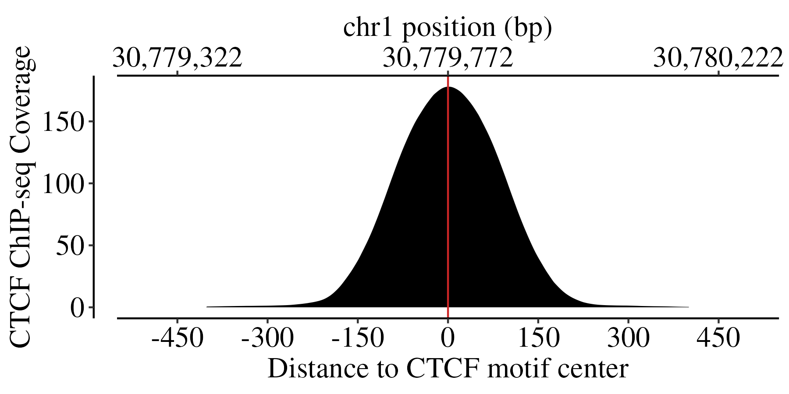

``` r
keep <- subsetByOverlaps(gr_fragment, motif, maxgap = 0, ignore.strand=TRUE) 

locus_fragments <- as.data.frame(keep) %>% 
  cbind(motif_mid = (start(motif)+end(motif))/2) %>% 
  dplyr::mutate(
    frag_id = dplyr::row_number(),
    start_centered = start - motif_mid,
    end_centered = end - motif_mid,
    num_frags_at_motif = max(dplyr::row_number()),
    downstream_frags = sum(end_centered>60),
    upstream_frags = sum(start_centered<(-60)),
    skew = log2((downstream_frags+1)/(upstream_frags+1)))
```

``` r
p1 <-locus_fragments%>% 
  arrange(width) %>% 
  mutate(frag_id = row_number()) %>% 
  ggplot() + 
  geom_point(aes(x = end_centered, y = width), col = "royalblue")+
  geom_point(aes(x = start_centered, y = width), col = "royalblue")+
  geom_segment(aes(x=start_centered, xend=end_centered, y=width, yend=width), alpha = 0.3) +
  geom_vline(xintercept = c(0), color="firebrick3") + 
  theme_bw()+
  ylab("Fragment Length")+
  xlab("Distance to CTCF motif center")+
  scale_x_continuous(
    labels = comma_format(),
    position = "top",
    breaks = seq(-150,150,50),
    sec.axis = sec_axis(~. + ctcf_loc,
                        breaks = ctcf_loc+c(-100, 0,  100),
                        labels = comma_format(),
                        name = "chr1 position (bp)")) +
  scale_y_continuous(labels = comma_format(), limits=c(20,160),breaks = seq(40,150,40))+
  theme(plot.title = element_text(color = "black", family = "Times New Roman", size = 16, face = "bold"),
        axis.text.x = element_text(color = "black", family = "Times New Roman", size = 16,face = "plain"),
        axis.text.y = element_text(color = "black", family = "Times New Roman", size = 16,face = "plain"),
        axis.title.x = element_text(color = "black", family = "Times New Roman", size = 16,face = "plain"),
        axis.title.y = element_text(color = "black", family = "Times New Roman", size = 16,face = "plain"),
        legend.text=element_text(color = "black", family = "Times New Roman", size =16,face = "plain"),
        legend.title=element_text(color = "black", family = "Times New Roman", size = 16,face = "plain"),
        strip.text.x = element_text(color = "black", family = "Times New Roman", size = 16,face = "plain"))
```

``` r
p2 <- locus_fragments %>% 
  ggplot(aes(x = width))+
  geom_histogram(fill = "darkblue",col = "royalblue")+
  theme_bw()+
  scale_x_continuous(labels = comma_format(), limits=c(20,160),breaks = seq(40,150,40))+
  scale_y_continuous(labels = comma_format(),breaks = c(0,200,400))+
  coord_flip()+
  theme(plot.title = element_text(color = "black", family = "Times New Roman", size = 16, face = "bold"),
        axis.text.x = element_text(color = "black", family = "Times New Roman", size = 16,face = "plain"),
        axis.text.y = element_text(color = "black", family = "Times New Roman", size = 16,face = "plain"),
        axis.title.x = element_text(color = "black", family = "Times New Roman", size = 16,face = "plain"),
        axis.title.y = element_text(color = "black", family = "Times New Roman", size = 16,face = "plain"),
        legend.text=element_text(color = "black", family = "Times New Roman", size =16,face = "plain"),
        legend.title=element_text(color = "black", family = "Times New Roman", size = 16,face = "plain"),
        strip.text.x = element_text(color = "black", family = "Times New Roman", size = 16,face = "plain"))+
  xlab("")+
  ylab("Count")+
  theme(axis.text.y=element_blank(),
        axis.ticks.y=element_blank())
```

``` r
plot_grid(plotlist = list(p1,p2), align = "hv", axis = "tblr", rel_widths = c(3,1))
#ggsave(paste0(path,"4_fragment_occupied.png"), width=7, height=3)
```

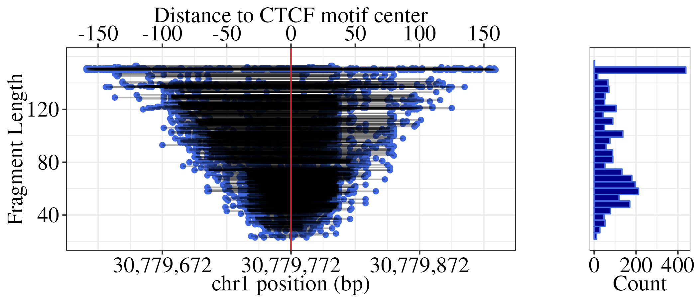

### Low CTCF occupancy example

``` r
chip <- read_tsv("/aryeelab/users/corri/data/K562_CTCF_peaks_ENCFF736NYC.bed", col_names = FALSE)
colnames(chip) <- c("chr", "start", "end", "name", "score", "strand", "signalValue", "pval", "qval", "peak")
chip_gr <- makeGRangesFromDataFrame(chip)
chip_gr$qval <- chip$qval
chip_gr$peak_mid <- (start(chip_gr) + end(chip_gr))/2

data.frame(chip_gr) %>% 
  filter(seqnames == "chr1") %>% 
  arrange(qval) 
```

``` r
ctcf_motifs<- readRDS(file = "/aryeelab/users/corri/data/ALL_FIMO_CTCF_hg38.RDS")
ctcf_motifs$motif_mid <- round( ( start(ctcf_motifs) + end(ctcf_motifs) )/2)
ovl <- findOverlaps(ctcf_motifs, chip_gr, maxgap = 0)

out <- as.data.frame(ctcf_motifs[queryHits(ovl)]) %>% 
  cbind(motif_id = queryHits(ovl),
        chip_id = subjectHits(ovl),
        chip_mid = chip_gr$peak_mid[subjectHits(ovl)],
        chip_qval = chip_gr$qval[subjectHits(ovl)]) 

out %>% 
  mutate(dist = abs(motif_mid-chip_mid)) %>% 
  filter(dist < 30) %>% 
  arrange(chip_qval) %>% 
  filter(seqnames =="chr1") %>% 
  dplyr::slice(1)

ctcf_loc <- (32352263   +32352281   )/2
```

``` r
motif <- ctcf_motifs %>% 
  filter(seqnames == "chr1") %>% 
  filter(dplyr::between(start, ctcf_loc - 200,  ctcf_loc + 200))
motif # chr1:32352263-32352281 (+) 
```

``` r
bw.plot <- BigwigTrack(
  region =  GRanges("chr1", IRanges(ctcf_loc - 500, ctcf_loc + 500)),
  bigwig = list(" " = paste0(path,"K562_CTCF_signal_pval_ENCFF168IFW.bigWig")))

bw.plot+
  geom_vline(xintercept = ctcf_loc, col = "firebrick3") +
  ylab("Coverage") +
  scale_fill_manual(values=c("black"))+
  theme(plot.title = element_text(color = "black", family = "Times New Roman", size = 16, face = "bold"),
        axis.text.x = element_text(color = "black", family = "Times New Roman", size = 16,face = "plain"),
        axis.text.y = element_text(color = "black", family = "Times New Roman", size = 16,face = "plain"),
        axis.title.x = element_text(color = "black", family = "Times New Roman", size = 16,face = "plain"),
        axis.title.y = element_text(color = "black", family = "Times New Roman", size = 16,face = "plain"),
        legend.text=element_text(color = "black", family = "Times New Roman", size =16,face = "plain"),
        legend.title=element_text(color = "black", family = "Times New Roman", size = 16,face = "plain"),
        strip.text.x = element_text(color = "black", family = "Times New Roman", size = 16,face = "plain"),
        strip.text.y = element_text(color = "black", family = "Times New Roman", size = 16,face = "plain"))+
  guides(fill = "none")+
  scale_y_continuous(limits = c(0, 150))+
  scale_x_continuous(
    labels = comma_format(),
    breaks = ctcf_loc+c(-450,  0,  450),
    position = "top",
    sec.axis = sec_axis(~. - ctcf_loc, name = "Distance to CTCF motif center",
                        breaks = c(-450,-300, -150, 0, 150, 300,450))) +
  ylab("CTCF ChIP-seq Coverage")

#ggsave(paste0(path,"4_chip_unoccupied.png"), width=6, height=3)
```

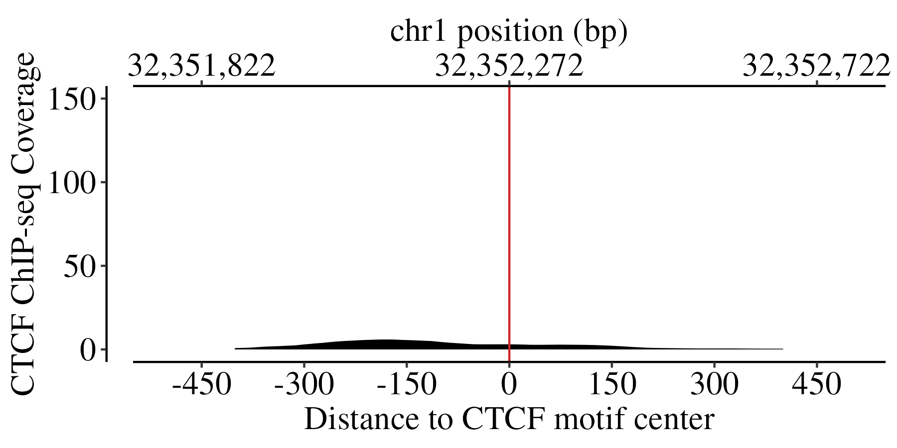

``` r
keep <- subsetByOverlaps(gr_fragment, motif, maxgap = 0, ignore.strand=TRUE) 

locus_fragments <- as.data.frame(keep) %>% 
  cbind(motif_mid = (start(motif)+end(motif))/2) %>% 
  dplyr::mutate(
    frag_id = dplyr::row_number(),
    start_centered = start - motif_mid,
    end_centered = end - motif_mid,
    num_frags_at_motif = max(dplyr::row_number()),
    downstream_frags = sum(end_centered>60),
    upstream_frags = sum(start_centered<(-60)),
    skew = log2((downstream_frags+1)/(upstream_frags+1)))
```

``` r
p1 <-locus_fragments%>% 
  arrange(width) %>% 
  mutate(frag_id = row_number()) %>% 
  ggplot() + 
  geom_point(aes(x = end_centered, y = width), col = "royalblue")+
  geom_point(aes(x = start_centered, y = width), col = "royalblue")+
  geom_segment(aes(x=start_centered, xend=end_centered, y=width, yend=width), alpha = 0.3) +
  geom_vline(xintercept = c(0), color="firebrick3") + 
  theme_bw()+
  ylab("Fragment Length")+
  xlab("Distance to CTCF motif center")+
  scale_x_continuous(
    labels = comma_format(),
    position = "top",
    breaks = seq(-150,150,50),
    sec.axis = sec_axis(~. + ctcf_loc,
                        breaks = ctcf_loc+c(-100, 0,  100),
                        labels = comma_format(),
                        name = "chr1 position (bp)")) +
  
  scale_y_continuous(labels = comma_format(), limits=c(20,160),breaks = seq(40,150,40))+
  theme(plot.title = element_text(color = "black", family = "Times New Roman", size = 16, face = "bold"),
        axis.text.x = element_text(color = "black", family = "Times New Roman", size = 16,face = "plain"),
        axis.text.y = element_text(color = "black", family = "Times New Roman", size = 16,face = "plain"),
        axis.title.x = element_text(color = "black", family = "Times New Roman", size = 16,face = "plain"),
        axis.title.y = element_text(color = "black", family = "Times New Roman", size = 16,face = "plain"),
        legend.text=element_text(color = "black", family = "Times New Roman", size =16,face = "plain"),
        legend.title=element_text(color = "black", family = "Times New Roman", size = 16,face = "plain"),
        strip.text.x = element_text(color = "black", family = "Times New Roman", size = 16,face = "plain"))
```

``` r
p2 <- locus_fragments %>% 
  ggplot(aes(x = width))+
  geom_histogram(fill = "darkblue",col = "royalblue")+
  theme_bw()+
  scale_x_continuous(labels = comma_format(), limits=c(20,160),breaks = seq(40,150,40))+
  scale_y_continuous(labels = comma_format(),breaks = c(0,50,100))+
  coord_flip()+
  theme(plot.title = element_text(color = "black", family = "Times New Roman", size = 16, face = "bold"),
        axis.text.x = element_text(color = "black", family = "Times New Roman", size = 16,face = "plain"),
        axis.text.y = element_text(color = "black", family = "Times New Roman", size = 16,face = "plain"),
        axis.title.x = element_text(color = "black", family = "Times New Roman", size = 16,face = "plain"),
        axis.title.y = element_text(color = "black", family = "Times New Roman", size = 16,face = "plain"),
        legend.text=element_text(color = "black", family = "Times New Roman", size =16,face = "plain"),
        legend.title=element_text(color = "black", family = "Times New Roman", size = 16,face = "plain"),
        strip.text.x = element_text(color = "black", family = "Times New Roman", size = 16,face = "plain"))+
  xlab("")+
  ylab("Count")+
  theme(axis.text.y=element_blank(),
        axis.ticks.y=element_blank())
```

``` r
plot_grid(plotlist = list(p1,p2), align = "hv", axis = "tblr", rel_widths = c(3,1))
#ggsave(paste0(path,"4_fragment_unoccupied.png"), width=7, height=3)
```

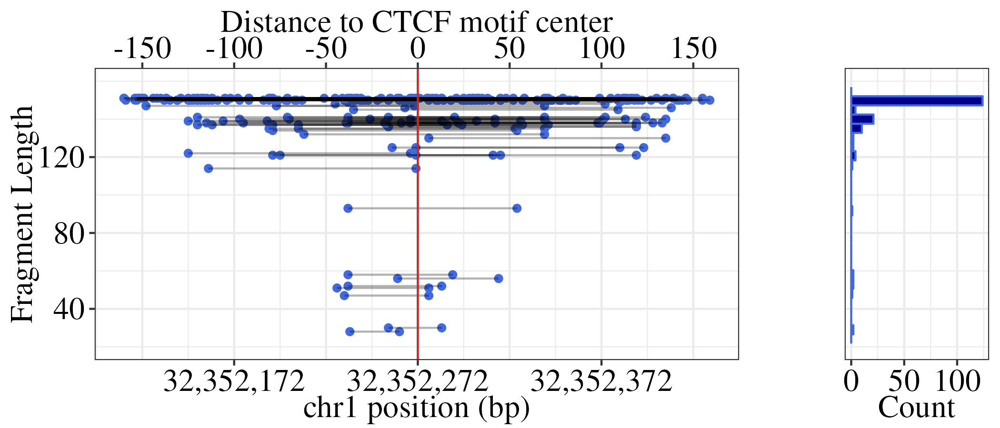

### Medium CTCF occupancy example

``` r
ctcf_motifs<- readRDS(file = "/aryeelab/users/corri/data/ALL_FIMO_CTCF_hg38.RDS")
ctcf_motifs$motif_mid <- round( ( start(ctcf_motifs) + end(ctcf_motifs) )/2)
# Remove overlapping motifs
keep <- countOverlaps(ctcf_motifs, ctcf_motifs, ignore.strand=TRUE)==1 
table(keep)
ctcf_motifs <- ctcf_motifs[keep]
```

``` r
chip <- read_tsv("/aryeelab/users/corri/data/K562_CTCF_peaks_ENCFF736NYC.bed", col_names = FALSE)
colnames(chip) <- c("chr", "start", "end", "name", "score", "strand", "signalValue", "pval", "qval", "peak")
chip_gr <- makeGRangesFromDataFrame(chip)
chip_gr$qval <- chip$qval
chip_gr$peak_mid <- (start(chip_gr) + end(chip_gr))/2

data.frame(chip_gr) %>% 
  filter(seqnames == "chr1") %>% 
  arrange(qval) 
```

``` r
ovl <- findOverlaps(ctcf_motifs, chip_gr, maxgap = 0)

out <- as.data.frame(ctcf_motifs[queryHits(ovl)]) %>% 
  cbind(motif_id = queryHits(ovl),
        chip_id = subjectHits(ovl),
        chip_mid = chip_gr$peak_mid[subjectHits(ovl)],
        chip_qval = chip_gr$qval[subjectHits(ovl)]) 

out <- out %>% 
  mutate(dist = abs(motif_mid-chip_mid)) %>% 
  filter(dist < 30) %>% 
  arrange(chip_qval) %>% 
  filter(seqnames =="chr1") %>% 
  dplyr::select(seqnames, start,end,strand,motif_mid,dist,chip_qval)

chip_motifs <- makeGRangesFromDataFrame(out,
                                        seqnames.field="seqnames",
                                        start.field="start",
                                        end.field="end",
                                        keep.extra.columns = TRUE)
```

``` r
ovl <- findOverlaps(gr_fragment, chip_motifs, maxgap = 0, ignore.strand=TRUE)

fragments <- 
  as.data.frame(gr_fragment[queryHits(ovl)]) %>% 
  cbind(motif_id = subjectHits(ovl),
        motif_mid = chip_motifs$motif_mid[subjectHits(ovl)],
        motif_strand = strand(chip_motifs)[subjectHits(ovl)],
        chip_signal = chip_motifs$chip_qval[subjectHits(ovl)],
        chip_dist = chip_motifs$dist[subjectHits(ovl)]) %>% 
  group_by(motif_id) %>% 
  dplyr::mutate(
    frag_id = dplyr::row_number(),
    start_centered = start - motif_mid,
    end_centered = end - motif_mid,
    num_frags_at_motif = max(dplyr::row_number()),
    downstream_frags = sum(end_centered>60),
    upstream_frags = sum(start_centered<(-60)),
    skew = log2((downstream_frags+1)/(upstream_frags+1)))

# mid range occupancy
fragments %>% 
  filter(width < 120) %>% 
  filter(start_centered < -15) %>% 
  filter(end_centered > 15) %>% 
  summarize(count = n(),
            num_frags_at_motif = dplyr::first(num_frags_at_motif),
            chr = dplyr::first(seqnames),
            motif_mid = dplyr::first(motif_mid),
            motif_strand = dplyr::first(motif_strand),
            chip_signal = dplyr::first(chip_signal),
            chip_dist = dplyr::first(chip_dist)) %>% 
  mutate(occupancy = 100*(count / num_frags_at_motif)) %>% 
  filter(num_frags_at_motif > 100) %>% 
  filter(dplyr::between(occupancy,30,35))
```

*I’m picking the one w/ the higher number of fragments at the CTCF motif
for the example, so we can see the trend better.*

``` r
ctcf_loc <-2382784      
motif <- ctcf_motifs %>% 
  filter(seqnames == "chr1") %>% 
  filter(dplyr::between(start, ctcf_loc - 25,   ctcf_loc + 25))
motif
```

``` r
bw.plot <- BigwigTrack(
  region =  GRanges("chr1", IRanges(ctcf_loc - 500, ctcf_loc + 500)),
  bigwig = list(" " = paste0(path,"K562_CTCF_signal_pval_ENCFF168IFW.bigWig")))

bw.plot +
  geom_vline(xintercept = ctcf_loc, col = "firebrick3") +
  ylab("Coverage") +
  scale_fill_manual(values=c("black"))+
  theme(plot.title = element_text(color = "black", family = "Times New Roman", size = 16, face = "bold"),
        axis.text.x = element_text(color = "black", family = "Times New Roman", size = 16,face = "plain"),
        axis.text.y = element_text(color = "black", family = "Times New Roman", size = 16,face = "plain"),
        axis.title.x = element_text(color = "black", family = "Times New Roman", size = 16,face = "plain"),
        axis.title.y = element_text(color = "black", family = "Times New Roman", size = 16,face = "plain"),
        legend.text=element_text(color = "black", family = "Times New Roman", size =16,face = "plain"),
        legend.title=element_text(color = "black", family = "Times New Roman", size = 16,face = "plain"),
        strip.text.x = element_text(color = "black", family = "Times New Roman", size = 16,face = "plain"),
        strip.text.y = element_text(color = "black", family = "Times New Roman", size = 16,face = "plain"))+
  
  guides(fill = "none")+
  scale_y_continuous(limits = c(0, 150))+
  scale_x_continuous(
    labels = comma_format(),
    breaks = ctcf_loc+c(-450,  0,  450),
    position = "top",
    sec.axis = sec_axis(~. - ctcf_loc, name = "Distance to CTCF motif center",
                        breaks = c(-450,-300, -150, 0, 150, 300,450))) +
  ylab("CTCF ChIP-seq Coverage")

#ggsave(paste0(path,"4_chip_midoccupied.png"), width=6, height=3)
```

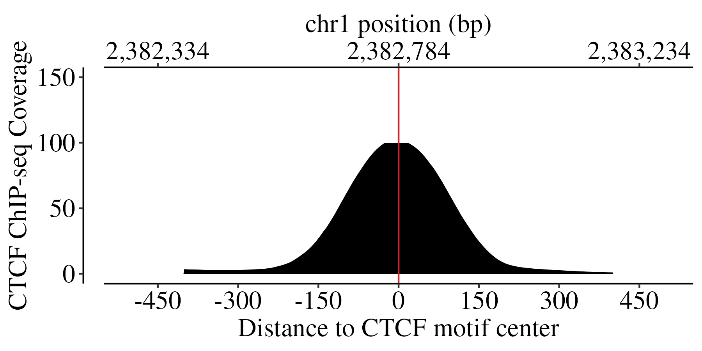

``` r
keep <- subsetByOverlaps(gr_fragment, motif, maxgap = 0, ignore.strand=TRUE) 

locus_fragments <- as.data.frame(keep) %>% 
  cbind(motif_mid = (start(motif)+end(motif))/2) %>% 
  dplyr::mutate(
    frag_id = dplyr::row_number(),
    start_centered = start - motif_mid,
    end_centered = end - motif_mid,
    num_frags_at_motif = max(dplyr::row_number()),
    downstream_frags = sum(end_centered>60),
    upstream_frags = sum(start_centered<(-60)),
    skew = log2((downstream_frags+1)/(upstream_frags+1)))
```

``` r
p1 <-locus_fragments%>% 
  arrange(width) %>% 
  mutate(frag_id = row_number()) %>% 
  ggplot() + 
  geom_point(aes(x = end_centered, y = width), col = "royalblue")+
  geom_point(aes(x = start_centered, y = width), col = "royalblue")+
  geom_segment(aes(x=start_centered, xend=end_centered, y=width, yend=width), alpha = 0.3) +
  geom_vline(xintercept = c(0), color="firebrick3") + 
  theme_bw()+
  ylab("Fragment Length")+
  xlab("Distance to CTCF motif center")+
  scale_x_continuous(
    labels = comma_format(),
    position = "top",
    breaks = seq(-150,150,50),
    sec.axis = sec_axis(~. + ctcf_loc,
                        breaks = ctcf_loc+c(-100, 0,  100),
                        labels = comma_format(),
                        name = "chr1 position (bp)")) +
  
  scale_y_continuous(labels = comma_format(), limits=c(20,160),breaks = seq(40,150,40))+
  theme(plot.title = element_text(color = "black", family = "Times New Roman", size = 16, face = "bold"),
        axis.text.x = element_text(color = "black", family = "Times New Roman", size = 16,face = "plain"),
        axis.text.y = element_text(color = "black", family = "Times New Roman", size = 16,face = "plain"),
        axis.title.x = element_text(color = "black", family = "Times New Roman", size = 16,face = "plain"),
        axis.title.y = element_text(color = "black", family = "Times New Roman", size = 16,face = "plain"),
        legend.text=element_text(color = "black", family = "Times New Roman", size =16,face = "plain"),
        legend.title=element_text(color = "black", family = "Times New Roman", size = 16,face = "plain"),
        strip.text.x = element_text(color = "black", family = "Times New Roman", size = 16,face = "plain"))
```

``` r
p2 <- locus_fragments %>% 
  ggplot(aes(x = width))+
  geom_histogram(fill = "darkblue",col = "royalblue")+
  theme_bw()+
  scale_x_continuous(labels = comma_format(), limits=c(20,160),breaks = seq(40,150,40))+
  scale_y_continuous(labels = comma_format(),breaks = c(0,125,250))+
  coord_flip()+
  theme(plot.title = element_text(color = "black", family = "Times New Roman", size = 16, face = "bold"),
        axis.text.x = element_text(color = "black", family = "Times New Roman", size = 16,face = "plain"),
        axis.text.y = element_text(color = "black", family = "Times New Roman", size = 16,face = "plain"),
        axis.title.x = element_text(color = "black", family = "Times New Roman", size = 16,face = "plain"),
        axis.title.y = element_text(color = "black", family = "Times New Roman", size = 16,face = "plain"),
        legend.text=element_text(color = "black", family = "Times New Roman", size =16,face = "plain"),
        legend.title=element_text(color = "black", family = "Times New Roman", size = 16,face = "plain"),
        strip.text.x = element_text(color = "black", family = "Times New Roman", size = 16,face = "plain"))+
  xlab("")+
  ylab("Count")+
  theme(axis.text.y=element_blank(),
        axis.ticks.y=element_blank())
```

``` r
plot_grid(plotlist = list(p1,p2), align = "hv", axis = "tblr", rel_widths = c(3,1))
#ggsave(paste0(path,"4_fragment_midoccupied.png"), width=7, height=3)
```

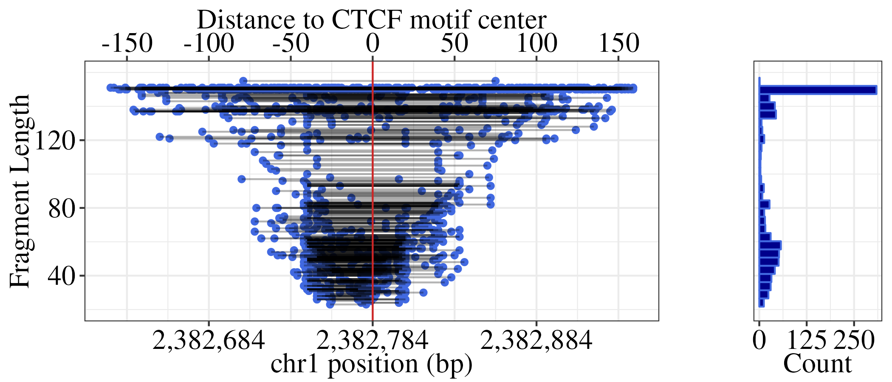

# Figure 4B

``` r
df_LR <- readRDS(file = paste0(path, "k562_ctcf_coverage_1000bp_fragment_length_LR.rds"))
```

``` r
p1 <- df_LR %>% 
  filter(seqnames == "chr1") %>% 
  filter(dplyr::between(pos, 30779763-500, 30779763+500)) %>% 
  filter(fragment == "Right fragment") %>% 
  filter(size == "(80,120]") %>% 
  mutate(dist_to_motif_center = pos_in_window-500) %>% 
  group_by(dist_to_motif_center, size, fragment) %>% 
  summarise(cov=sum(cov, na.rm=T)) %>% 
  ungroup() %>% 
  ggplot(aes(dist_to_motif_center, cov)) + 
  geom_line(linewidth = 3) + 
  geom_vline(xintercept = 0, col = "firebrick3", linewidth = 1) +
  theme_bw() +
  scale_x_continuous(breaks = seq(-80,80, 20), limits = c(-80,80)) +
  xlab("Distance to CTCF motif center") +
  ylab("Total Coverage") +
  theme_classic()+
  theme(panel.grid.major = element_line(color = "#f0f0f0",
                                        size = 0.5))+
  theme(plot.title = element_text(color = "black", family = "Times New Roman", size = 18, face = "bold"),
        axis.text.x = element_text(color = "black", family = "Times New Roman", size = 18,face = "bold"),
        axis.text.y = element_text(color = "black", family = "Times New Roman", size = 16,face = "bold"),
        axis.title.x = element_text(color = "black", family = "Times New Roman", size = 18,face = "bold"),
        axis.title.y = element_text(color = "black", family = "Times New Roman", size = 18,face = "bold"),
        axis.ticks.x=element_blank(),
        legend.text=element_text(color = "black", family = "Times New Roman", size =18,face = "bold"),
        legend.title=element_text(color = "black", family = "Times New Roman", size = 18,face = "bold"),
        strip.text.x = element_text(color = "black", family = "Times New Roman", size = 18,face = "bold"),
        strip.text.y = element_text(color = "black", family = "Times New Roman", size = 18,face = "bold"),
        strip.background=element_rect(colour="#f0f0f0",fill="#f0f0f0"))
```

``` r
p2 <- df_LR %>% 
  filter(seqnames == "chr1") %>% 
  filter(dplyr::between(pos, 30779763-500, 30779763+500)) %>% 
  filter(fragment == "Right fragment") %>% 
  filter(size == "(80,120]") %>% 
  mutate(dist_to_motif_center = pos_in_window-500) %>% 
  filter(dplyr::between(dist_to_motif_center, -150,150)) %>%
  group_by(dist_to_motif_center, motif_strand, fragment) %>% 
  summarise(cov=sum(cov, na.rm=T)) %>% 
  ungroup() %>% 
  mutate(side = ifelse(dist_to_motif_center < 0, "Negative","Positive")) %>% 
  group_by(abs(dist_to_motif_center), motif_strand, fragment) %>% 
  arrange(side) %>% # negative - positive
  mutate(perc_dif = (dplyr::first(cov) - dplyr::last(cov)) / max(dplyr::first(cov), dplyr::last(cov))) %>%
  mutate(dif = dplyr::first(cov) - dplyr::last(cov)) %>% 
  dplyr::slice(1) %>% 
  ggplot(aes(x = abs(dist_to_motif_center), y=dif)) + 
  geom_smooth(span = 0.3, se = FALSE, col = "royalblue", linewidth = 3)+
  theme_classic() +
  scale_x_continuous(breaks = seq(0,80, 20), limits = c(0,80)) +
  xlab("Absolute distance to CTCF motif center") +
  ylab("Difference in Coverage") +
  theme(panel.grid.major = element_line(color = "#f0f0f0",
                                        size = 0.5))+
  theme(plot.title = element_text(color = "black", family = "Times New Roman", size = 18, face = "bold"),
        axis.text.x = element_text(color = "black", family = "Times New Roman", size = 18,face = "bold"),
        axis.text.y = element_text(color = "black", family = "Times New Roman", size = 16,face = "bold"),
        axis.title.x = element_text(color = "black", family = "Times New Roman", size = 18,face = "bold"),
        axis.title.y = element_text(color = "black", family = "Times New Roman", size = 18,face = "bold"),
        axis.ticks.x=element_blank(),
        legend.text=element_text(color = "black", family = "Times New Roman", size =18,face = "bold"),
        legend.title=element_text(color = "black", family = "Times New Roman", size = 18,face = "bold"),
        strip.text.x = element_text(color = "black", family = "Times New Roman", size = 18,face = "bold"),
        strip.text.y = element_text(color = "black", family = "Times New Roman", size = 18,face = "bold"),
        strip.background=element_rect(colour="#f0f0f0",fill="#f0f0f0"))
```

*Figure 4B*

``` r
plot_grid(plotlist = list(p1,p2), align = "hv", axis = "tblr", ncol = 2)
#ggsave(paste0(path,"locus_cov_dif_Fig4.png"), width=10, height=4)
```

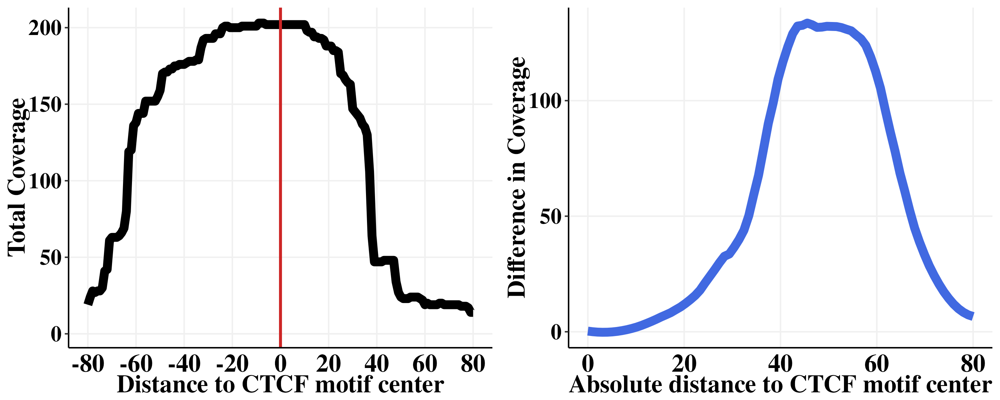

# Figure 4D

``` r
df_LR <- readRDS(file = paste0(path, "k562_ctcf_coverage_1000bp_fragment_length_LR.rds"))
```

``` r
uniq_motif <- df_LR %>% 
  filter(pos_in_window == 500) %>% 
  group_by(window_id) %>% 
  dplyr::slice(1) %>% 
  ungroup() %>% 
  dplyr::select(seqnames, pos, window_id)

uniq_motif_gr <- makeGRangesFromDataFrame(uniq_motif,
                                          seqnames.field="seqnames",
                                          start.field="pos",
                                          end.field="pos",
                                          keep.extra.columns = TRUE)

uniq_motif_gr$motif_mid <- uniq_motif$pos
```

``` r
peaks <- read_tsv("/aryeelab/users/corri/data/K562_RAD21_ChIP_ENCFF330SHG.bed", col_names = FALSE)
colnames(peaks) <- c("chr", "start", "end", "name", "score", "strand", "signalValue", "pval", "qval", "peak")
peaks_gr<- makeGRangesFromDataFrame(peaks, keep.extra.columns = TRUE)
peaks_gr$peak_score <- peaks$qval
peaks_gr$chip_mid <- (start(peaks_gr) + end(peaks_gr))/2

peaks_gr <- peaks_gr %>%
  plyranges::anchor_center() %>%
  plyranges::mutate(width = 101)

chip <- peaks_gr 

ovl <- findOverlaps(uniq_motif_gr, chip, maxgap = 0)

out <- as.data.frame(uniq_motif_gr[queryHits(ovl)]) %>% 
  cbind(chip_id = subjectHits(ovl),
        chip_start = start(chip)[subjectHits(ovl)],
        chip_mid = chip$chip_mid[subjectHits(ovl)],
        chip_end = end(chip)[subjectHits(ovl)],
        chip_qval = chip$peak_score[subjectHits(ovl)],
        chip_signalValue = chip$signalValue[subjectHits(ovl)],
        chip_score = chip$score[subjectHits(ovl)]) %>% 
  mutate(dist = abs(chip_mid - motif_mid))

out <- out %>% 
  group_by(window_id) %>% 
  mutate(n = max(row_number())) %>% 
  arrange(abs(dist)) %>% 
  dplyr::slice(1) %>% 
  dplyr::select(-c(seqnames))

df_annot <- df_LR %>% 
  left_join(out, by = "window_id") 
```

``` r
all_motifs <- df_annot %>% 
  group_by(window_id) %>% 
  dplyr::slice(1)

b <- quantile(all_motifs$chip_signalValue, na.rm = TRUE)
```

``` r
dat <- df_annot %>%
  mutate(RAD21 = cut(df_annot$chip_signalValue, breaks =  b)) %>% 
  filter(RAD21 %in% c("(18.4,165]", "(534,5.91e+03]")) %>% 
  filter(size == "(80,120]") %>% 
  mutate(dist_to_motif_center = pos_in_window-500) %>% 
  filter(dplyr::between(dist_to_motif_center, -150,150)) %>% 
  group_by(dist_to_motif_center, RAD21,motif_strand, fragment) %>% 
  summarise(cov=sum(cov, na.rm=T)) %>% 
  ungroup() %>% 
  mutate(motif_strand = factor(motif_strand, levels=c("+ Motif", "- Motif"))) %>% 
  mutate(side = ifelse(dist_to_motif_center < 0, "Negative","Positive")) %>% 
  group_by(abs(dist_to_motif_center), RAD21, motif_strand, fragment) %>% 
  arrange(side) %>% # negative - positive
  mutate(perc_dif = (dplyr::first(cov) - dplyr::last(cov)) / max(dplyr::first(cov), dplyr::last(cov))) %>%
  mutate(dif = ifelse(motif_strand == "- Motif", 
                      dplyr::first(cov) - dplyr::last(cov), 
                      dplyr::last(cov) - dplyr::first(cov))) %>% 
  arrange(side) %>% 
  dplyr::slice(1) %>% 
  mutate(type = paste0(motif_strand, ",",fragment)) %>%
  mutate(type_cat = ifelse(type %in% c("+ Motif,Left fragment", "- Motif,Right fragment"),"1","0")) %>% 
  group_by(dist_to_motif_center, RAD21, type_cat) %>% 
  mutate(dif = sum(dif)) %>% 
  dplyr::slice(1)  

dat %>%   
  mutate(type_cat = factor(type_cat, levels=c("1", "0"))) %>% 
  ggplot(aes(x = abs(dist_to_motif_center), y=dif, col = paste0(RAD21, type_cat))) + 
  geom_smooth(span = 0.7, se = FALSE, linewidth = 3)+
  theme_classic() +
  scale_x_continuous(breaks = seq(0,80, 20), limits = c(0,80)) +
  scale_y_continuous(limits = c(0, 12050))+
  xlab("Absolute distance to CTCF motif center") +
  ylab("Difference in Coverage") +
  theme(panel.grid.major = element_line(color = "#f0f0f0",
                                        size = 0.5))+
  theme(plot.title = element_text(color = "black", family = "Times New Roman", size = 18, face = "bold"),
        axis.text.x = element_text(color = "black", family = "Times New Roman", size = 18,face = "bold"),
        axis.text.y = element_text(color = "black", family = "Times New Roman", size = 16,face = "bold"),
        axis.title.x = element_text(color = "black", family = "Times New Roman", size = 18,face = "bold"),
        axis.title.y = element_text(color = "black", family = "Times New Roman", size = 18,face = "bold"),
        axis.ticks.x=element_blank(),
        legend.text=element_text(color = "black", family = "Times New Roman", size =18,face = "bold"),
        legend.title=element_text(color = "black", family = "Times New Roman", size = 18,face = "bold"),
        strip.text.x = element_text(color = "black", family = "Times New Roman", size = 18,face = "bold"),
        strip.text.y = element_text(color = "black", family = "Times New Roman", size = 18,face = "bold"),
        strip.background=element_rect(colour="#f0f0f0",fill="#f0f0f0"))+
  scale_color_manual(values = c("firebrick3","lightskyblue","darkred","royalblue"))

#ggsave(paste0(path,"cohesin_Fig1.png"), width=10, height=7)
```

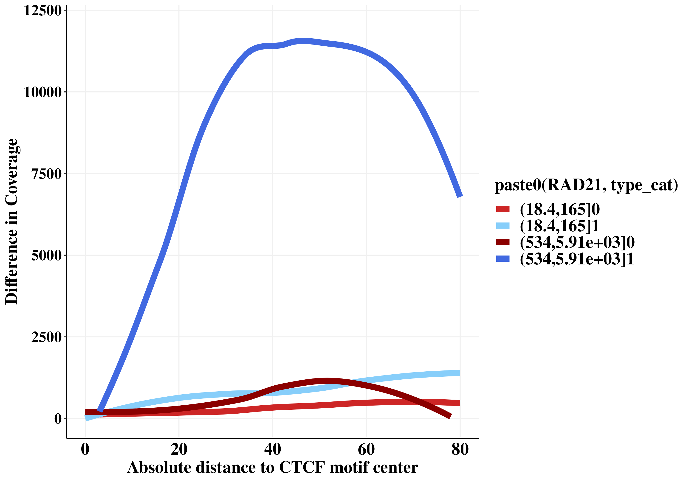

# Figure 4C

``` r
left_plus <- readRDS(file = paste0(path, "left_plus_annot.RDS"))

uniq_motif<- left_plus %>%
  dplyr::group_by(motif_id) %>% 
  distinct(motif_id, .keep_all = TRUE) %>% 
  dplyr::select(seqnames, motif_mid, motif_id) %>% 
  arrange(motif_id)

motifs <- uniq_motif

check <- left_join(left_plus, motifs, by = "motif_id")

temp <- check %>% 
  filter(start_centered < -15) %>% 
  filter(end_centered > 15) %>% 
  mutate(fragment_length = end_centered - start_centered) 

p2 <- temp %>% 
  mutate(FL_cat = cut(fragment_length, breaks = c(seq(30,150,5), 215))) %>% 
  mutate(lower = as.numeric( sub("\\((.+),.*", "\\1", FL_cat)),
         upper = as.numeric( sub("[^,]*,([^]]*)\\]", "\\1", FL_cat))) %>%
  group_by(FL_cat) %>% 
  dplyr::summarize(med = median(log10(interaction_length+1)),
                   lower = first(lower), 
                   upper = first(upper)) %>% 
  ggplot(aes(x = lower, y = med))+
  geom_point(color ="royalblue", size = 3)+
  ylab("Log10 Interaction Length")+
  xlab("Fragment Length")+
  theme_classic()+
  theme(panel.grid.major = element_line(color = "#f0f0f0",
                                        size = 0.5))+
  theme(plot.title = element_text(color = "black", family = "Times New Roman", size = 18, face = "bold"),
        axis.text.x = element_text(color = "black", family = "Times New Roman", size = 18,face = "bold"),
        axis.text.y = element_text(color = "black", family = "Times New Roman", size = 16,face = "bold"),
        axis.title.x = element_text(color = "black", family = "Times New Roman", size = 18,face = "bold"),
        axis.title.y = element_text(color = "black", family = "Times New Roman", size = 18,face = "bold"),
        axis.ticks.x=element_blank(),
        legend.text=element_text(color = "black", family = "Times New Roman", size =18,face = "bold"),
        legend.title=element_text(color = "black", family = "Times New Roman", size = 18,face = "bold"),
        strip.text.x = element_text(color = "black", family = "Times New Roman", size = 18,face = "bold"),
        strip.text.y = element_text(color = "black", family = "Times New Roman", size = 18,face = "bold"),
        strip.background=element_rect(colour="#f0f0f0",fill="#f0f0f0"))+
  scale_x_continuous(breaks=seq(0,150, 20))

p2
#ggsave(paste0(path,"4D_Log10_IL.png"), width=8, height=4)
```

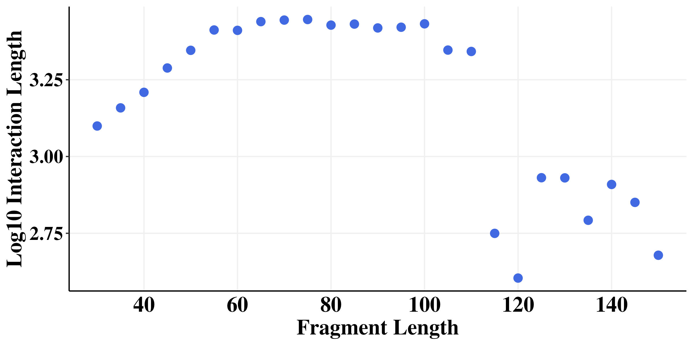

# Figure 4E

``` r
left_plus <- readRDS(file = paste0(path, "left_plus_annot.RDS"))

left_plus<- left_plus %>% 
  filter(start_centered < -15) %>% 
  filter(end_centered > 15) %>% 
  mutate(fragment_length = end_centered - start_centered) %>% 
  mutate(cohesin_fragment = ifelse(fragment_length < 115, 1, 0)) %>% 
  mutate(interaction_length = abs(end2-start))


peaks <- read_tsv("/aryeelab/users/corri/data/K562_RAD21_ChIP_ENCFF330SHG.bed", col_names = FALSE)
colnames(peaks) <- c("chr", "start", "end", "name", "score", "strand", "signalValue", "pval", "qval", "peak")
peaks_gr<- makeGRangesFromDataFrame(peaks, keep.extra.columns = TRUE)
peaks_gr$peak_score <- peaks$qval
peaks_gr$chip_mid <- (start(peaks_gr) + end(peaks_gr))/2

peaks_gr <- peaks_gr %>%
  plyranges::anchor_center() %>%
  plyranges::mutate(width = 601)
chip <- peaks_gr 

uniq_motif<- left_plus %>%
  group_by(motif_id) %>% 
  dplyr::mutate(num_cohesin = sum(cohesin_fragment),
                num_fragment = max(dplyr::row_number()),
                myskew = num_cohesin / num_fragment) %>% 
  distinct(motif_id, .keep_all = TRUE) %>% 
  dplyr::select(seqnames, motif_mid, motif_id,skew,myskew) %>% 
  arrange(motif_id)

uniq_motif_gr <- makeGRangesFromDataFrame(uniq_motif, keep.extra.columns=TRUE,
                                          seqnames.field="seqnames",
                                          start.field="motif_mid",
                                          end.field="motif_mid")

uniq_motif_gr$motif_mid <- uniq_motif$motif_mid
```

``` r
ovl <- findOverlaps(uniq_motif_gr, chip, maxgap = 0)

out <- as.data.frame(uniq_motif_gr[queryHits(ovl)]) %>% 
  cbind(chip_id = subjectHits(ovl),
        chip_start = start(chip)[subjectHits(ovl)],
        chip_mid = chip$chip_mid[subjectHits(ovl)],
        chip_end = end(chip)[subjectHits(ovl)],
        chip_qval = chip$peak_score[subjectHits(ovl)],
        chip_signalValue = chip$signalValue[subjectHits(ovl)],
        chip_score = chip$score[subjectHits(ovl)]) %>% 
  mutate(dist = abs(chip_mid - motif_mid))

out <- out %>% 
  group_by(motif_id) %>% 
  mutate(n = max(row_number())) %>% 
  arrange(abs(dist)) %>% 
  dplyr::slice(1)

uniq_motif <- uniq_motif %>% 
  left_join(out, by = "motif_id") 

motifs <- uniq_motif

uniq_motif$dist[is.na(uniq_motif$dist)] <- 310
uniq_motif$chip_qval[is.na(uniq_motif$chip_qval)] <- 0
uniq_motif$dist <- abs(uniq_motif$dist)
```

``` r
nocohesin <- uniq_motif %>% 
  filter(dist > 200) 

cohesin <- uniq_motif %>% 
  filter(dist < 50) 

cohesin$cohesin_status <- "Cohesin"
nocohesin$cohesin_status <- "No Cohesin"
rbind(cohesin,nocohesin) %>% 
  ggplot(aes(x = 100*myskew.x, fill = as.factor(cohesin_status), color = as.factor(cohesin_status))) +
  geom_density(alpha = 0.75, linewidth = 1.5)+
  theme_bw() +
  scale_fill_manual(values=c("darkred","darkblue")) +
  scale_color_manual(values=c("darkred","darkblue")) +
  ylab("Density")  +
  xlab("% TF protected fragments")+
  guides(col = FALSE)+
  labs(fill = "RAD21 ChIP")+
  geom_vline(xintercept = 55, linetype = "dashed")+
  scale_x_continuous(breaks=seq(0,100,10), limits = c(0,100))+
  theme_classic() +
  theme(panel.grid.major = element_line(color = "#f0f0f0",
                                        size = 0.5))+
  theme(plot.title = element_text(color = "black", family = "Times New Roman", size = 18, face = "bold"),
        axis.text.x = element_text(color = "black", family = "Times New Roman", size = 18,face = "bold"),
        axis.text.y = element_text(color = "black", family = "Times New Roman", size = 16,face = "bold"),
        axis.title.x = element_text(color = "black", family = "Times New Roman", size = 18,face = "bold"),
        axis.title.y = element_text(color = "black", family = "Times New Roman", size = 18,face = "bold"),
        axis.ticks.x=element_blank(),
        legend.text=element_text(color = "black", family = "Times New Roman", size =18,face = "bold"),
        legend.title=element_text(color = "black", family = "Times New Roman", size = 18,face = "bold"),
        strip.text.x = element_text(color = "black", family = "Times New Roman", size = 18,face = "bold"),
        strip.text.y = element_text(color = "black", family = "Times New Roman", size = 18,face = "bold"),
        strip.background=element_rect(colour="#f0f0f0",fill="#f0f0f0"))+
  theme(legend.position = "none")

#ggsave(paste0(path,"4F_RAD21_TF_den.png"), width=8, height=4)
```

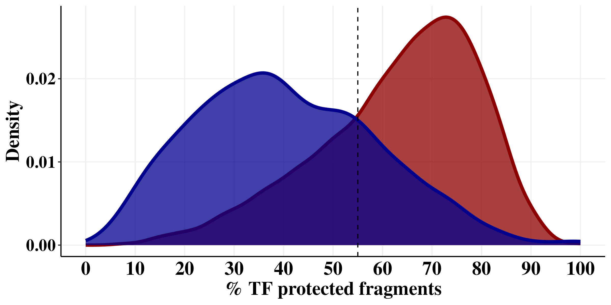

# Figure 4F

``` r
left_plus <- readRDS(file = paste0(path, "left_plus_annot.RDS"))

left_plus<- left_plus %>% 
  filter(start_centered < -15) %>% 
  filter(end_centered > 15) %>% 
  mutate(fragment_length = end_centered - start_centered) %>% 
  mutate(cohesin_fragment = ifelse(fragment_length < 115, 1, 0)) %>% 
  mutate(interaction_length = abs(end2-start))

left_plus %>% 
  mutate(cohesin_fragment = factor(cohesin_fragment, levels=c(1,0))) %>% 
  ggplot(aes(interaction_length/1000, fill = cohesin_fragment, col = cohesin_fragment)) +
  geom_density(alpha = 0.75, linewidth = 1.5)+
  theme_classic() + 
  scale_x_log10(breaks=c(1,10,100,1000,10000),limits = c(10^-2,10^4), labels=scales::comma)+
  scale_fill_manual(values=c("darkred","darkblue")) +
  scale_color_manual(values=c("darkred","darkblue")) +
  ylab("Density") +
  xlab("Interaction Length (kb)")+
  labs(fill = "TF protected Fragment")+
  guides(col = FALSE)+
  theme_classic() +
  theme(panel.grid.major = element_line(color = "#f0f0f0",
                                        size = 0.5))+
  theme(plot.title = element_text(color = "black", family = "Times New Roman", size = 18, face = "bold"),
        axis.text.x = element_text(color = "black", family = "Times New Roman", size = 18,face = "bold"),
        axis.text.y = element_text(color = "black", family = "Times New Roman", size = 16,face = "bold"),
        axis.title.x = element_text(color = "black", family = "Times New Roman", size = 18,face = "bold"),
        axis.title.y = element_text(color = "black", family = "Times New Roman", size = 18,face = "bold"),
        axis.ticks.x=element_blank(),
        legend.text=element_text(color = "black", family = "Times New Roman", size =18,face = "bold"),
        legend.title=element_text(color = "black", family = "Times New Roman", size = 18,face = "bold"),
        strip.text.x = element_text(color = "black", family = "Times New Roman", size = 18,face = "bold"),
        strip.text.y = element_text(color = "black", family = "Times New Roman", size = 18,face = "bold"),
        strip.background=element_rect(colour="#f0f0f0",fill="#f0f0f0"))+
  theme(legend.position = "none")


#ggsave(paste0(path,"4E_IL_density.png"), width=8, height=4)
```

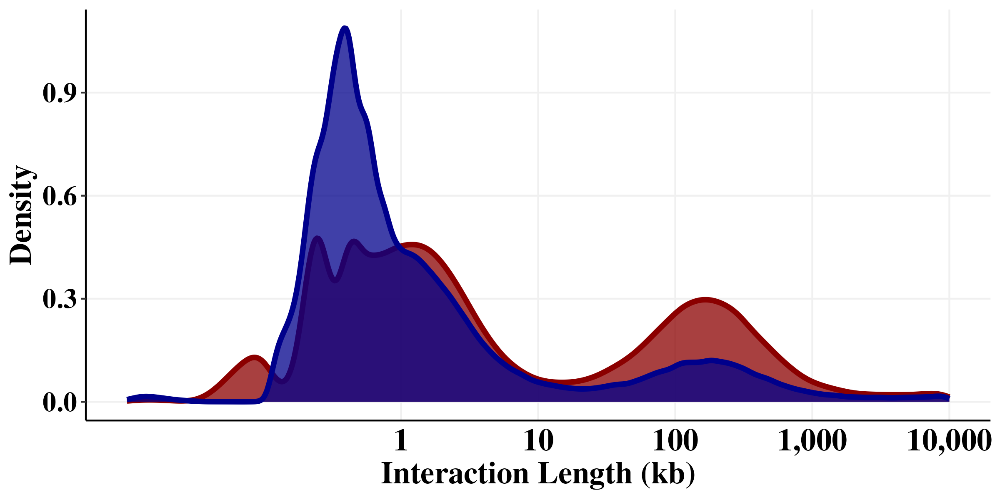

# Figure 4G

``` r
d1 <- data.frame(IL_start = seq(0, 1e7, 1000)) %>% 
  mutate(IL_mid = IL_start + 500,
         IL_end = IL_start + 1000, 
         type = "1")

d2 <- data.frame(IL_start = seq(0, 1e7, 1000)) %>% 
  mutate(IL_mid = IL_start + 500,
         IL_end = IL_start + 1000, 
         type = "0") 

dat<- rbind(d1,d2)

dat<- dat %>% 
  mutate(bin_type = paste0(type, ":", IL_mid))

check <- left_plus %>% 
  mutate(cohesin_fragment = factor(cohesin_fragment, levels=c(1,0))) %>% 
  filter(interaction_length < 1e7) %>% 
  ungroup() %>% 
  group_by(cohesin_fragment) %>% 
  mutate(count_per_CA = max(row_number())) %>% 
  mutate(interaction_length_bin = cut(interaction_length, breaks = seq(0, 1e7, 1000))) %>%
  mutate(lower = as.numeric( sub("\\((.+),.*", "\\1", interaction_length_bin)),
         upper = as.numeric( sub("[^,]*,([^]]*)\\]", "\\1", interaction_length_bin))) %>% 
  mutate(mid_IL_bin = (lower + upper)/2) %>% 
  group_by(cohesin_fragment, interaction_length_bin) %>% 
  summarize(type = dplyr::first(cohesin_fragment),
            interaction_length_bin = dplyr::first(mid_IL_bin),
            count = n(),
            count_per_CA = dplyr::first(count_per_CA),
            count_norm = count / count_per_CA) 


check <-check %>% 
  mutate(bin_type = paste0(type, ":", interaction_length_bin))

out <- left_join(dat, check, by = "bin_type")

dat<- out %>% 
  ungroup() %>% 
  mutate(log_interaction_length = log10(IL_mid)) %>% 
  mutate(log_IL_bin = cut(log_interaction_length, breaks = 50)) %>% 
  group_by(type.x, log_IL_bin) %>% 
  summarize(num_bins = max(row_number()),
            LC_sum = sum(count_norm, na.rm = TRUE),
            avg_LC = LC_sum / num_bins) %>% 
  mutate(lower_log_bin = as.numeric( sub("\\((.+),.*", "\\1", log_IL_bin)),
         upper_log_bin = as.numeric( sub("[^,]*,([^]]*)\\]", "\\1", log_IL_bin))) %>% 
  mutate(mid_log_bin = (lower_log_bin + upper_log_bin)/2) %>% 
  mutate(log_avg_LC = log10(avg_LC))

dat %>% 
  mutate(bin = 10^mid_log_bin) %>% 
  ggplot(aes(x = bin/1000, y = avg_LC, color = type.x, group = type.x)) +
  geom_smooth(se = FALSE,span = 0.3, linewidth = 1.5)+
  scale_x_log10(breaks=c(1,10,100,1000,10000),labels=scales::comma)+
  scale_y_log10(breaks=c(0, 1e-1, 1e-2, 1e-3, 1e-4, 1e-5, 1e-6))+
  scale_color_manual( values = c("royalblue","firebrick3"))+
  theme(legend.position = "none")+
  xlab("Interaction Length (kb)")+
  ylab("Contact Probability") +
  theme_classic() +
  theme(panel.grid.major = element_line(color = "#f0f0f0",
                                        size = 0.5))+
  theme(plot.title = element_text(color = "black", family = "Times New Roman", size = 18, face = "bold"),
        axis.text.x = element_text(color = "black", family = "Times New Roman", size = 18,face = "bold"),
        axis.text.y = element_text(color = "black", family = "Times New Roman", size = 16,face = "bold"),
        axis.title.x = element_text(color = "black", family = "Times New Roman", size = 18,face = "bold"),
        axis.title.y = element_text(color = "black", family = "Times New Roman", size = 18,face = "bold"),
        axis.ticks.x=element_blank(),
        legend.text=element_text(color = "black", family = "Times New Roman", size =18,face = "bold"),
        legend.title=element_text(color = "black", family = "Times New Roman", size = 18,face = "bold"),
        strip.text.x = element_text(color = "black", family = "Times New Roman", size = 18,face = "bold"),
        strip.text.y = element_text(color = "black", family = "Times New Roman", size = 18,face = "bold"),
        strip.background=element_rect(colour="#f0f0f0",fill="#f0f0f0"))+
  theme(legend.position = "none")

#ggsave(paste0(path,"4G_P(S).png"), width=8, height=5)
```


### Enrichment of short TF-protected fragments in long range interactions

``` r
left_plus <- readRDS(file = paste0(path, "left_plus_annot.RDS"))

left_plus<- left_plus %>% 
  filter(start_centered < -15) %>% 
  filter(end_centered > 15) %>% 
  mutate(fragment_length = end_centered - start_centered) %>% 
  mutate(cohesin_fragment = ifelse(fragment_length < 115, 1, 0)) %>% 
  mutate(interaction_length = abs(end2-start))

# 3.5
left_plus %>% 
  filter(interaction_length > 10000) %>% 
  group_by(cohesin_fragment) %>% 
  summarize(count = n()) %>% 
  ungroup() %>% 
  mutate(freq = count / dplyr::first(count))
```

``` r
left_plus<-left_plus %>% 
  mutate(LR = ifelse(interaction_length > 10000,1,0)) 

tbl = table(left_plus$LR, left_plus$cohesin_fragment)
#margin.table(tbl,2)
#prop.table(tbl,2)
chisq.test(tbl) # p-value < 2.2e-16
```
