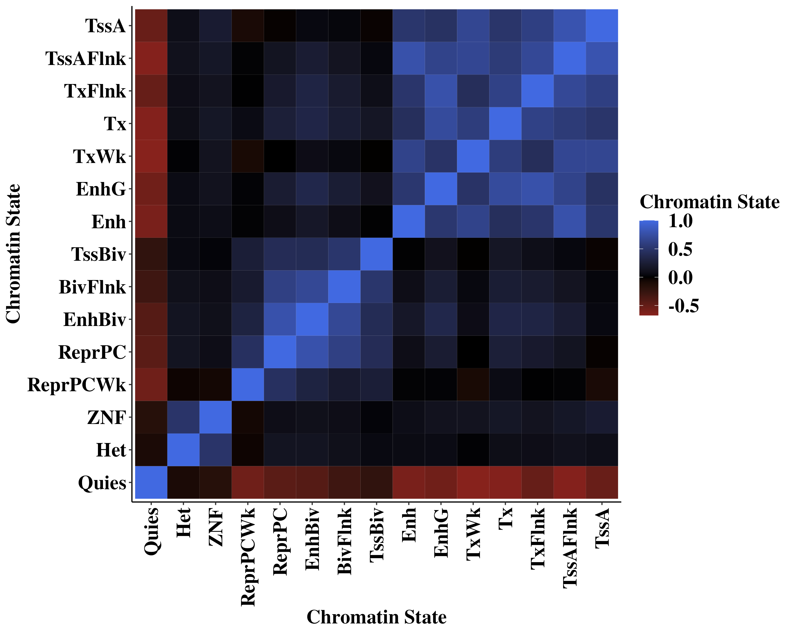

---
output:
  github_document:
    toc: true
---

```{r, include = FALSE}
knitr::opts_chunk$set(
  collapse = TRUE,
  comment = "#>",
  fig.path = "Figures/protocol-",
  out.width = "100%", 
  eval = FALSE
)
```

```{r}
library(foreach)
library(GenomicRanges)
library(readr)
library(rtracklayer)
library(scales)
library(plyranges)
library(nlme)
library(lme4)
library(viridis)
library(RColorBrewer)
library(cowplot)
library(gridExtra)
library(doParallel)
library(bumphunter)
library(plyr)
library(dplyr)
library(ggplot2)
library(tidyverse)

num_cores = 8
registerDoParallel(cores=num_cores)
```

# K562 CTCF HiChIP

### Process fastq files

Make sure to use pairtools v. 0.3.0 instead of pairtools v. 1.0; they changed the way pairtools parse works.
We used this guide to come up with the below code chunk to process our data (https://hichip.readthedocs.io/en/latest/).
The only modification we made was to add `--add-columns pos5,pos3,dist_to_5,dist_to_3,read_len` to pairtools parse (to get fragment start and end.) Otherwise, we would only have the 5' ends of the reads.

```{bash, eval = FALSE}
bwa mem -5SP -T0 -t16 hg38.fa ${filename}_R1.fastq.gz ${filename}_R2.fastq.gz | pairtools parse --min-mapq 40 --walks-policy 5unique --max-inter-align-gap 30 --add-columns pos5,pos3,dist_to_5,dist_to_3,read_len --nproc-in 8 --nproc-out 8 --chroms-path hg38.genome | pairtools sort --nproc 16 --tmpdir=/temp/ |pairtools dedup --nproc-in 8 --nproc-out 8 --mark-dups --output-stats ${filename}.stats.txt|pairtools split --nproc-in 8 --nproc-out 8 --output-pairs ${filename}.mapped.pairs --output-sam -|samtools view -bS -@16 | samtools sort -@16 -o ${filename}.mapped.PT.bam;samtools index ${filename}.mapped.PT.bam
```

We processed our files on Terra, so I'm including this code chunk where we download the combined pairs file. (All 4 replicates' pairs files were combined into one pairs file, mapped.pairs)

### Download pairs file from Terra
```{bash, eval = FALSE}
module load gsutil/default
module load python/2.7.3
which python # should give python 2.7.3

# get pairs file - this is combined replicates K562 CTCF pairs file from Terra 
gsutil cp gs://fc-13093787-99ea-4d80-a8e7-51e4fd06f3af/submissions/034d37e3-3b04-4293-8c53-4c912fd88c8b/microc/0b526188-3ee9-4976-86c0-12f850abc39d/call-microc_align/mapped.pairs .
```

### Get .pairs file in R readable format by removing the header
```{bash, eval = FALSE}
awk '{ if (($2 ~ /chr/) && ($4 ~ /chr/)) { print } }' mapped.pairs > k562_ctcf_R_mapped.pairs
```

**From this point onwards, everything is in R. Everything above this point is in bash.**

### Subset to only needed columns to reduce file size
Here, we create two different smaller RDS files to make visualization easier. (It takes a lot of memory to load in the full file to R.)

(1) This file will have the following columns: chr1, start1, end1, chr2, start2, end2. chr1, start1, and end1 correspond to left fragment, while chr2, start2, and end2 correspond to the right fragment. 

```{r}
chrs <- paste("chr", 1:22, sep="")
rds <- "/aryeelab/users/corri/data/k562_ctcf_mapped.pairs.rds"

cols <- c("chr1", "chr2", "pos5_R1", "pos5_R2", "pos3_R1", "pos3_R2")
pairs <- read_table("/data/aryee/corri/results/k562_ctcf_R_mapped.pairs", col_names = cols, comment="#",
                    col_types = "-c-c----iiii------") %>% 
  na.omit() %>% 
  filter(chr1 %in% chrs & chr2 %in% chrs & chr1==chr2) %>%
  mutate(start1 = pmin(pos3_R1, pos5_R1), end1 = pmax(pos3_R1, pos5_R1),
         start2 = pmin(pos3_R2, pos5_R2), end2 = pmax(pos3_R2, pos5_R2)) %>%
  select(chr1, start1, end1, chr2, start2, end2)

saveRDS(pairs, file = rds)

```

(2) This file will have the following columns: chr1, pos1, chr2, pos2, strand1, strand2, type. pos1 and pos2 are the 5' ends of the left and right fragments respectively. Similarly, strand1 and strand2 are the strands of the left and right fragments. type describes the ligation type between the left and right fragment in the interaction pairs.

```{r}
chrs <- paste("chr", 1:22, sep="")
chrs <- c(chrs, "chrX")
rds <- "/aryeelab/users/corri/data/k562_ctcf_mapped.pairs_STRAND_TYPE_X.rds"
cols <- c("chr1", "pos1", "chr2", "pos2", "strand1", "strand2", "type")
pairs <- read_table("/data/aryee/corri/results/k562_ctcf_R_mapped.pairs", col_names = cols, comment="#",
                    col_types = "-ciciccc----------") %>% 
  na.omit() %>% 
  filter(chr1 %in% chrs & chr2 %in% chrs & chr1==chr2)

pairs$pair_ID <- 1:nrow(pairs)

saveRDS(pairs, file = rds)
```

(3) trans contacts (supplementary figure)

*trans contacts*
```{bash, eval = FALSE}
sftp cw128@erisone.partners.org
cd /data/aryee/corri/results/
get k562_ctcf_R_mapped.pairs k562_ctcf_R_OG_mapped.pairs
```

```{r}
cols <- c("chr1", "chr2", "pos5_R1", "pos5_R2", "pos3_R1", "pos3_R2")
pairs <- read_table("/aryeelab/users/corri/data/k562_ctcf_R_OG_mapped.pairs", col_names = cols, comment="#",
                    col_types = "-c-c----iiii------") 

pairs <- pairs %>% 
  filter(chr1 != chr2)

saveRDS(pairs, "/aryeelab/users/corri/data/k562_ctcf_trans_pairs.RDS")
```

### Split pairs file by chromosome

```{r}
pairs <- readRDS("/aryeelab/users/corri/data/k562_ctcf_mapped.pairs_STRAND_TYPE_X.rds")
```

```{r}
library(tidyverse)
chrs <- paste("chr", 1:22, sep="")
chrs <- c(chrs, "chrX")

for (chr in chrs){
  print(chr)
  
  pairs_chr <- pairs %>% 
    dplyr::filter((chr1 == chr) & (chr2 == chr)) %>% 
    dplyr::select(-c(pair_ID))
  
  
  file = paste0("/aryeelab/users/corri/data/CTCF_chr_pairs/k562_ctcf_",chr, ".RDS")
  saveRDS(pairs_chr, file)  
}

```


This is where we're storing all our files that we make in this RMD file.
```{r}
# location that we want to put our results in
path <- "/aryeelab/users/corri/data/replicate_FF_results/"
# location of the scripts to run this method
code_dir <- "/aryeelab/users/corri/code/mnase-hichip/code/"
```

# Generate p-value table
*Note: we provide the p-value table in our github, this is just for reproducibility purposes.*

Running this step takes about 1.5 hours with 8 cores.
The inputs we're giving the function include: 

`path`: where we want to put our p-value table and log file.

`mm_x`: log2 min/max ratios at which to calculate p-values

`ns`: Number of reads for which to calculate p-values

`num_cores`: Number of cores we want to use

```{r}
source(paste0(code_dir, "sim_pvals.R"))

df_p <- sim_pvals(
  path = path, 
  mm_x = seq(0, 5, 0.01), 
  ns = seq(5, 500, 1),
  num_cores = 8)

```

to check progress on above code, type the following in the bash terminal (substitute in your path):
```{bash, eval = FALSE}
cat /path/log_make_pval_table.txt
```

p-value table is stored at paste0(path, "df_p_1e8.RDS")

# Run FactorFinder

We're using our pairs file that has been split up by chromosome so we can run it in parallel without having to store the entire pairs file * number of cores in memory. This avoids memory issues.

Note that we're only using autosomal chromosomes for this analysis.

*This should take roughly an hour with 8 cores and 10bp step size.*
The inputs we're giving the function include: 

`chrom_seq`: the chromosomes we want to run FactorFinder on

`dir`: the directory that we put our pairs files (split by chromosome)

`prefix`: prefix that satisfies below requirement to locate the chromosome-specific pairs files.
The pairs files need to be located at paste0(dir, prefix, "_chr", chrom_num, ".RDS")
example: /aryeelab/users/corri/data/CTCF_chr_pairs/k562_ctcf_chr1.RDS

`results_dir`: the directory we want to store the output in

`results_prefix`: prefix of results files.
Results files will be located at paste0(results_dir, results_prefix, chrom_num, ".RDS")

`step`: step size you want to run FactorFinder at (we recommend 10bp; lower than that takes up more memory and time, and doesn't improve accuracy)

`num_cores`: number of cores you want to run FactorFinder on

`pval_table`: location of the p-value table you just made (or use ours). 


```{r}
source(paste0(code_dir,"get_quadrants_function_GW.R"))

chrom_seq = c(1:22)
dir <- "/aryeelab/users/corri/data/CTCF_chr_pairs/"
prefix <- "k562_ctcf"
results_dir <- "/aryeelab/users/corri/data/replicate_FF_results/"
results_prefix <- "Read_count_quadrants_chr"
step = 10
num_cores = 8
path <- "/aryeelab/users/corri/data/replicate_FF_results/"
pval_table <- paste0(path, "df_p_1e8.RDS")

get_quadrant_reads_GW(chrom_seq, dir, prefix, results_dir, results_prefix, step, 
                      num_cores, pval_table)
```

*Read in results one chromosome at a time and combine them into one file. (Note: we filter to min max >=1 and number of reads >= 5. We're not looking for a transcription factor binding site (TFBS) if it doesn't at least meet these criteria.)*
```{r}
all_pvals <- foreach(chrom_num = chrom_seq, .combine=rbind) %dopar% {
  print(chrom_num)
  chr_reads <- readRDS(file = paste0(results_dir, results_prefix, chrom_num, ".RDS"))
  chr_reads <- chr_reads %>%
    filter(min_max >= 1) %>%
    filter(num_reads >= 5)
  
  chr_reads
}

saveRDS(all_pvals, file = paste0(path, "GW_pvals.RDS"))
```

*Obtain peaks. This should only take a few minutes*
```{r}
all_pvals <- readRDS(file =paste0(path, "GW_pvals.RDS"))

df_sig <- all_pvals %>% 
  filter(pvalue < 1e-05)

gr <- makeGRangesFromDataFrame(df_sig,
                               keep.extra.columns = TRUE,
                               seqnames.field = "chr",
                               start.field = "window_mid",
                               end.field = "window_mid"
)


groups <- clusterMaker(seqnames(gr), start(gr), assumeSorted = FALSE, maxGap = 75)
num_groups <- sum(!duplicated(groups))
gr$group <- groups
num_groups # 39,408
```

```{r}
peaks <- foreach(i = 1:num_groups, .combine=rbind) %dopar% {
  
  if(i %% 100 == 0){
    print(paste0("group ", i, " / ", num_groups))
  }
  
  group_1 <- gr[gr$group == i]
  best_score <- group_1[which(group_1$pvalue == min(group_1$pvalue))]
  
  middle = round(median(start(best_score)))
  group_1$dist_to_summit <- abs(middle - start(group_1))
  peak <- data.frame(group_1) %>% 
    arrange(dist_to_summit) %>% 
    dplyr::slice(1)
  peak$peak_summit <- middle
  
  if(nrow(peak) == 0){
    print("ERROR")
  }
  
  peak
}
```

```{r}
saveRDS(peaks, paste0(path, "GW_peaks_1e-05.RDS"))
```

```{r}
all_peaks <- readRDS(paste0(path, "GW_peaks_1e-05.RDS"))
```


# Obtain fragments overlapping motifs

*This is the pairs file with columns chr1, start1, end1, chr2, start2, end2. For this file, we need to know the start and end positions of each fragment.*
```{r}
pairs <- readRDS("/aryeelab/users/corri/data/k562_ctcf_mapped.pairs.rds")
nrow(pairs) # 386,874,029
```

**First save the CTCF motif repository**

Using the following resource (https://github.com/mdozmorov/CTCF/blob/master/README.md):

We're using the `hg38.MA0139.1` dataset, which contains CTCF sites detected using the most popular MA0139.1 CTCF PWM. 
```{r}
library(AnnotationHub)
ah <- AnnotationHub()
query_data <- subset(ah, preparerclass == "CTCF")
CTCF_hg38 <- query_data[["AH104729"]]
saveRDS(CTCF_hg38, "/aryeelab/users/corri/data/ALL_FIMO_CTCF_hg38.RDS")
```


```{r}
ctcf_motifs<- readRDS(file = "/aryeelab/users/corri/data/ALL_FIMO_CTCF_hg38.RDS")

peaks <-  readRDS(paste0(path, "GW_peaks_1e-05.RDS"))
anchors <- makeGRangesFromDataFrame(peaks, 
                                    keep.extra.columns=TRUE)
```


```{r}
# Subset to 19bp (vs 34bp, 35bp) CTCF motifs that overlap a hires anchor
# NOTE: In the current input file, they are all 19bp
gr_motifs <- ctcf_motifs[width(ctcf_motifs)==19]
# Remove overlapping motifs
keep <- countOverlaps(gr_motifs, gr_motifs, ignore.strand=TRUE)==1 
table(keep)
gr_motifs <- gr_motifs[keep]
# subset to motifs overlapping peaks
keep <- countOverlaps(gr_motifs, anchors, maxgap = 0)==1 
table(keep) # 21595
gr_motifs <- gr_motifs[keep]
gr_motifs$motif_mid <- round(start(gr_motifs) + width(gr_motifs)/2)
```

```{r}
# left fragment
gr_fragment1 <- makeGRangesFromDataFrame(pairs,
                                         seqnames.field="chr1",
                                         start.field="start1",
                                         end.field="end1",
                                         keep.extra.columns = TRUE)
# right fragment
gr_fragment2 <- makeGRangesFromDataFrame(pairs,
                                         seqnames.field="chr2",
                                         start.field="start2",
                                         end.field="end2",
                                         keep.extra.columns = TRUE)

gr_fragment1$pair_ID <- 1:nrow(pairs)
gr_fragment2$pair_ID <- 1:nrow(pairs)

# CTCF motifs on + strand
plus_motifs <- gr_motifs[strand(gr_motifs)=="+"]
# CTCF motifs on - strand
minus_motifs <- gr_motifs[strand(gr_motifs)=="-"]
```

```{r}
library(dplyr)
fragment_motif_ovl <- function(gr_fragment1, plus_motifs){
  ovl <- findOverlaps(gr_fragment1, plus_motifs)
  
  left_plus <- 
    as.data.frame(gr_fragment1[queryHits(ovl)]) %>% 
    cbind(motif_id = subjectHits(ovl),
          motif_mid = plus_motifs$motif_mid[subjectHits(ovl)]) %>% 
    group_by(motif_id) %>% 
    dplyr::mutate(
      frag_id = dplyr::row_number(),
      start_centered = start - motif_mid,
      end_centered = end - motif_mid,
      num_frags_at_motif = max(dplyr::row_number()),
      downstream_frags = sum(end_centered>60),
      upstream_frags = sum(start_centered<(-60)),
      skew = log2((downstream_frags+1)/(upstream_frags+1)))
  return(left_plus)
}
```


```{r}
left_plus <- fragment_motif_ovl(gr_fragment1, plus_motifs)
right_minus <- fragment_motif_ovl(gr_fragment2, minus_motifs)

fragment_motif <- vector(mode = "list", length = 2)

left_plus$fragment_motif <- "left_plus"
right_minus$fragment_motif <- "right_minus"

right_minus <- right_minus %>% 
  dplyr::rename(start2=start1) %>% 
  dplyr::rename(end2=end1) %>% 
  dplyr::rename(chr2=chr1)

fragment_motif[[1]] <- left_plus
fragment_motif[[2]] <- right_minus

names(fragment_motif) <- c("left_plus", "right_minus")
path <- "/aryeelab/users/corri/data/replicate_FF_results/"
saveRDS(fragment_motif, file = paste0(path, "fragment_motif.RDS"))
```

# Annotate left fragments overlapping CTCF (+) motifs
```{r}
fragment_motif_annot <- function(plus_fragment, uniq_motif_gr, chrom_stat){
  # chromatin annotation
  chrom_stat$type <- data.frame(chrom_stat) %>%
    mutate(type = name) %>%
    pull(type)
  
  ovl <- findOverlaps(uniq_motif_gr, chrom_stat)
  chrom_stat_signal <- data.frame(
    # pairs file columns
    motif_id = uniq_motif_gr$motif_id[queryHits(ovl)],
    start_pairs = start(uniq_motif_gr)[queryHits(ovl)],
    end_pairs = end(uniq_motif_gr)[queryHits(ovl)],
    # chromatin annotation file columns
    chrom_stat = chrom_stat$type[subjectHits(ovl)],
    start_chrom = start(chrom_stat)[subjectHits(ovl)],
    end_chrom = end(chrom_stat)[subjectHits(ovl)]) 
  
  chrom_stat_signal$start_vec <- pmax(chrom_stat_signal$start_pairs,chrom_stat_signal$start_chrom)
  chrom_stat_signal$end_vec <- pmin(chrom_stat_signal$end_pairs,chrom_stat_signal$end_chrom)
  chrom_stat_signal$width <- (chrom_stat_signal$end_vec - chrom_stat_signal$start_vec)
  
  # get total amount of each chromatin annotation for each region
  chrom_stat_signal_annot <- chrom_stat_signal %>% 
    group_by(motif_id, chrom_stat) %>% 
    summarize(
      motif_id = dplyr::first(motif_id),
      type = dplyr::first(chrom_stat),
      tot_bp = sum(width)) %>% 
    mutate(perc_bp = 100* (tot_bp / 1e6))
  
  # reformat so each column is one of the chromatin annotations,
  # each row is a region.
  pairs_annot <- chrom_stat_signal_annot %>% 
    ungroup() %>% 
    tidyr::pivot_wider(names_from = chrom_stat, values_from = perc_bp, values_fill = 0) %>% 
    group_by(motif_id) %>% 
    summarise_at(levels(as.factor(chrom_stat_signal_annot$type)), max) %>% 
    as.data.frame()
  
  
  plus_fragment <- plus_fragment %>% 
    mutate(interaction_length = abs(end2-start))
  
  # annotate each fragment by motif-level chromatin annotation
  plus_fragment_annot <- left_join(plus_fragment,pairs_annot, by = "motif_id") %>% 
    arrange(motif_id)
  
  colnames(plus_fragment_annot)[21:35] <-c(paste0("MB_",colnames(plus_fragment_annot[21:35])))
  colnames(plus_fragment_annot)[34] <- "MB_8_ZNF"
  
  return(plus_fragment_annot)
}
```

**Let's download the annotation chromatin state file to annotate regions.**
Data description: https://egg2.wustl.edu/roadmap/web_portal/chr_state_learning.html#core_15state

```{bash, eval = FALSE}
cd /aryeelab/users/corri/data/
wget https://egg2.wustl.edu/roadmap/data/byFileType/chromhmmSegmentations/ChmmModels/coreMarks/jointModel/final/E123_15_coreMarks_hg38lift_mnemonics.bed.gz
```


```{r}
path <- "/aryeelab/users/corri/data/replicate_FF_results/" # same directory we've been putting all our results in
fragment_motif<- readRDS(file = paste0(path, "fragment_motif.RDS"))
fragment_motif_df<- bind_rows(fragment_motif)

left_plus <- fragment_motif[[1]]
levels(as.factor(left_plus$fragment_motif))

chrom_stat <- import("/aryeelab/users/corri/data/E123_15_coreMarks_hg38lift_mnemonics.bed")
uniq_motif<- left_plus %>% 
  distinct(motif_id, .keep_all = TRUE) %>% 
  dplyr::select(seqnames, motif_mid, motif_id) %>% 
  arrange(motif_id)

uniq_motif$MB <- uniq_motif$motif_mid + 1e6

uniq_motif_gr <- makeGRangesFromDataFrame(uniq_motif, keep.extra.columns=TRUE,
                                          seqnames.field="seqnames",
                                          start.field="motif_mid",
                                          end.field="MB")

plus_fragment_annot <- fragment_motif_annot(left_plus, uniq_motif_gr, chrom_stat)
# NA means the motif + 1 MB didn't overlap with any chromatin annotations, so we're throwing those out. There's only 1 motif where this happens.
plus_fragment_annot<- plus_fragment_annot %>% 
  filter(!is.na(MB_1_TssA))
######################################################################################
path <- "/aryeelab/users/corri/data/replicate_FF_results/"
saveRDS(plus_fragment_annot, file = paste0(path, "left_plus_annot.RDS"))
```

# Classify fragments by chromatin type


```{r correlation_heatmap, fig.width = 10, fig.height = 8}
hclustfun <- function(dist_mat){
  return(hclust(dist_mat, method = 'ward.D2'))
}

path <- "/aryeelab/users/corri/data/replicate_FF_results/"
fragment_annot <- readRDS(file = paste0(path, "left_plus_annot.RDS"))

left_plus <- fragment_annot %>% 
  ungroup() %>% 
  filter(fragment_motif == "left_plus") %>% 
  group_by(motif_id) %>% 
  dplyr::slice(1)
left_plus <- left_plus %>% 
  ungroup() %>% 
  dplyr::select(MB_1_TssA,MB_2_TssAFlnk, MB_3_TxFlnk,MB_4_Tx,MB_5_TxWk,MB_6_EnhG,
                MB_7_Enh,MB_10_TssBiv,MB_11_BivFlnk,MB_12_EnhBiv,
                MB_13_ReprPC,MB_14_ReprPCWk,MB_8_ZNF,MB_9_Het,MB_15_Quies)


left_plus <- rev(left_plus)

x <- strsplit(colnames(left_plus), "_")
cols <- sapply( x, "[", 3 )
colnames(left_plus)<- cols
##########

cormat <- cor(left_plus)
melted_cormat <- reshape2::melt(cormat)

ggplot(data = melted_cormat, aes(x=Var1, y=Var2, fill=value)) + 
  geom_tile()+
  theme_classic()+
  scale_fill_gradient2(
    high = "royalblue",
    mid = "black",
    low = "firebrick3")+
  labs(fill="Chromatin State")+
  xlab("Chromatin State")+
  ylab("Chromatin State")+
  theme(plot.title = element_text(color = "black", family = "Times New Roman", size =18, face = "bold"),
        axis.text.x = element_text(color = "black", family = "Times New Roman", size = 18,face = "bold"),
        axis.text.y = element_text(color = "black", family = "Times New Roman", size = 18,face = "bold"),  
        axis.title.x = element_text(color = "black", family = "Times New Roman", size = 18,face = "bold"),
        axis.title.y = element_text(color = "black", family = "Times New Roman", size = 18,face = "bold"),
        legend.text=element_text(color = "black", family = "Times New Roman", size =18,face = "bold"),
        legend.title=element_text(color = "black", family = "Times New Roman", size = 18,face = "bold"))+
  theme(axis.text.x = element_text(angle = 90, vjust = 0.5, hjust=1))

```



*Based on this correlation heatmap, we can directly observe that Active chromatin annotations group together (TSS, Enhancer, and Transcription related, top right group.) Also, bivalent and polycomb annotations group together (middle group). Furthermore, everything is negatively correlated w/ quiescent chromatin annotation except for heterochromatin and ZNF. For that reason, I'm going to classify things into these three groups.*


### Annotate file w/ clusters

```{r}
path <- "/aryeelab/users/corri/data/replicate_FF_results/"
fragment_annot <- readRDS(file = paste0(path, "left_plus_annot.RDS"))


fragment_annot <- fragment_annot %>% 
  mutate(Active = (MB_1_TssA + MB_2_TssAFlnk+MB_3_TxFlnk+MB_4_Tx+MB_5_TxWk+MB_6_EnhG+MB_7_Enh),
         Biv_Polycomb = (MB_10_TssBiv + MB_11_BivFlnk +MB_12_EnhBiv +MB_13_ReprPC +MB_14_ReprPCWk),
         Quiescent = MB_15_Quies
  ) %>% 
  ungroup()

left_plus <- fragment_annot %>%
  ungroup() %>%
  filter(fragment_motif == "left_plus") %>%
  group_by(motif_id) %>%
  dplyr::slice(1) 

left_plus_OG <- left_plus

left_plus <- left_plus[,36:38]

LP_scaled <- as.matrix(scale(left_plus))

dist_mat <- dist(LP_scaled, method = 'euclidean')
hclust_avg <- hclustfun(dist_mat)

cut_avg <- cutree(hclust_avg, k = 3)

out <- cbind(left_plus_OG,(cut_avg))
colnames(out)[39] <- "cluster"
key <- out %>% 
  dplyr::select(motif_id, cluster) %>% 
  ungroup()

left_plus <- fragment_annot %>%
  ungroup() %>%
  filter(fragment_motif == "left_plus") 

left_plus <- left_join(left_plus, key, by = "motif_id") 

left_plus$type[left_plus$cluster == 1]<- "Active"
left_plus$type[left_plus$cluster == 2]<- "Biv_Polycomb"
left_plus$type[left_plus$cluster == 3]<- "Quiescent"
left_plus$type <- as.factor(left_plus$type)
left_plus <- left_plus %>% 
  mutate(type = factor(type, levels=c("Quiescent","Biv_Polycomb", "Active")))
```

```{r}
path <- "/aryeelab/users/corri/data/replicate_FF_results/"
saveRDS(left_plus, file = paste0(path, "left_plus_annot_cluster.RDS"))
```

*Let's plot the clusters to make sure everything worked correctly and the clusters look appropriate.*


### Plot clusters

```{r cluster_heatmap,fig.width = 12, fig.height = 7}
left_plus <- readRDS(file = paste0(path, "left_plus_annot_cluster.RDS"))
uniq_motif <- left_plus %>% 
  group_by(motif_id) %>% 
  dplyr::slice(1)

uniq_motif<- uniq_motif %>% 
  ungroup() %>% 
  arrange(type, Active) %>% 
  mutate(order = dplyr::row_number()) %>% 
  dplyr::select(order, MB_1_TssA,MB_2_TssAFlnk, MB_3_TxFlnk,MB_4_Tx,MB_5_TxWk,MB_6_EnhG,
                MB_7_Enh,MB_10_TssBiv,MB_11_BivFlnk,MB_12_EnhBiv,
                MB_13_ReprPC,MB_14_ReprPCWk,MB_8_ZNF,MB_9_Het,MB_15_Quies,type)

uniq_motif <- rev(uniq_motif)

x <- strsplit(colnames(uniq_motif)[2:16], "_")
cols <- sapply( x, "[", 3 )
colnames(uniq_motif)[2:16]<- cols
UM_scaled <- scale(uniq_motif[,2:16])
########################
temp<- data.frame(cbind(UM_scaled,uniq_motif$order, as.character(uniq_motif$type)))
colnames(temp)[16:17] <- c("order", "type")
temp %>%
  filter(type == "Quiescent") %>%
  arrange(desc(as.numeric(order))) %>% 
  dplyr::slice(1) %>% 
  pull(order) # 3595
temp %>%
  filter(type == "Biv_Polycomb") %>%
  arrange(desc(as.numeric(order))) %>% 
  dplyr::slice(1) %>% 
  pull(order) # 6751
########################
UM_scaled<- data.frame(cbind(UM_scaled,uniq_motif$order))
colnames(UM_scaled)[16] <- c("order")
UM_scaled <- UM_scaled %>% 
  pivot_longer(TssA:Quies, names_to="chrom_type")
UM_scaled$value_thresh <- UM_scaled$value
UM_scaled$value_thresh[UM_scaled$value_thresh > 2] <- 2
UM_scaled$value_thresh[UM_scaled$value_thresh < -2] <- -2

UM_scaled %>%
  mutate(chrom_type = factor(chrom_type, levels=cols)) %>% 
  ggplot(aes(chrom_type, order, fill=as.numeric(value_thresh) )) + 
  geom_tile() +
  scale_fill_gradient2(
    high = "royalblue",
    mid = "black",
    low = "firebrick3")+
  theme_classic()+
  geom_hline(yintercept = 3595, linetype = "dashed", col = "white")+
  geom_hline(yintercept = 6751, linetype = "dashed", col = "white")+
  labs(fill="Chromatin State")+
  xlab("Chromatin State")+
  ylab("Order")+
  theme(plot.title = element_text(color = "black", family = "Times New Roman", size =18, face = "bold"),
        axis.text.x = element_text(color = "black", family = "Times New Roman", size = 18,face = "bold"),
        axis.text.y = element_text(color = "black", family = "Times New Roman", size = 18,face = "bold"),  
        axis.title.x = element_text(color = "black", family = "Times New Roman", size = 18,face = "bold"),
        axis.title.y = element_text(color = "black", family = "Times New Roman", size = 18,face = "bold"),
        legend.text=element_text(color = "black", family = "Times New Roman", size =18,face = "bold"),
        legend.title=element_text(color = "black", family = "Times New Roman", size = 18,face = "bold"))+
  theme(axis.text.x = element_text(angle = 90, vjust = 0.5, hjust=1))

```


*Clusters look good!*

# Get K562 ChIP-seq files for RAD21 and CTCF from ENCODE
```{bash, eval = FALSE}
######### CTCF
#bed
wget https://www.encodeproject.org/files/ENCFF736NYC/@@download/ENCFF736NYC.bed.gz
gunzip ENCFF736NYC.bed.gz
mv ENCFF736NYC.bed K562_CTCF_peaks_ENCFF736NYC.bed

#signal pvalue
wget https://www.encodeproject.org/files/ENCFF168IFW/@@download/ENCFF168IFW.bigWig
mv ENCFF168IFW.bigWig K562_CTCF_signal_pval_ENCFF168IFW.bigWig

###### RAD21
wget https://www.encodeproject.org/files/ENCFF330SHG/@@download/ENCFF330SHG.bed.gz
gunzip ENCFF330SHG.bed.gz
mv ENCFF330SHG.bed K562_RAD21_ChIP_ENCFF330SHG.bed
```

# Replicates (K562 CTCF HiChIP)

*Pairs files were made using the same process as the other pairs files.*
```{bash, eval = FALSE}
cd /aryeelab/users/corri/data/k562_ctcf/
sftp cw128@erisone.partners.org
cd /data/aryee/corri/loop_calling/
get GW-K562-1.mapped.pairs
get GW-K562-2.mapped.pairs
get HC_deep_YET10_S2.mapped.pairs
get HC_deep_YET12_S4.mapped.pairs

ln -s GW-K562-1.mapped.pairs K562-CTCF-DTG-1.mapped.pairs
ln -s GW-K562-2.mapped.pairs K562-CTCF-DTG-2.mapped.pairs

ln -s HC_deep_YET10_S2.mapped.pairs K562-CTCF-ET-1.mapped.pairs
ln -s HC_deep_YET12_S4.mapped.pairs K562-CTCF-ET-2.mapped.pairs

awk '{ if (($2 ~ /chr/) && ($4 ~ /chr/)) { print } }' GW-K562-1.mapped.pairs > K562_CTCF_DTG_1_R.mapped.pairs
awk '{ if (($2 ~ /chr/) && ($4 ~ /chr/)) { print } }' GW-K562-2.mapped.pairs > K562_CTCF_DTG_2_R.mapped.pairs
awk '{ if (($2 ~ /chr/) && ($4 ~ /chr/)) { print } }' HC_deep_YET10_S2.mapped.pairs > K562_CTCF_ET_1_R.mapped.pairs
awk '{ if (($2 ~ /chr/) && ($4 ~ /chr/)) { print } }' HC_deep_YET12_S4.mapped.pairs > K562_CTCF_ET_2_R.mapped.pairs
```

### RDS file (chr1) all replicates

chr1 extracted for all replicates as below
```{bash, eval = FALSE}
awk '{ if (($2 == "chr1") && ($4 == "chr1")) { print } }' /data/aryee/corri/loop_calling/GW-K562-1.mapped.pairs > GW-K562-1_chr1.mapped.pairs 

```


```{r}
pairs <- foreach(sample_id = c("K562-CTCF-DTG-1","K562-CTCF-DTG-2","K562-CTCF-ET-1","K562-CTCF-ET-2"), .combine=rbind) %do%
  {
      pair_file <- paste0("/data/aryee/corri/loop_calling/", sample_id, "_chr1.mapped.pairs")
      df <- read_tsv(pair_file,
                     col_names = c("chr1", "pos1", "chr2", "pos2", "strand1", "strand2", "type"),
                     col_types = "-ciciccc")
      cbind(df, sample_id=sample_id)
  }

pairs_chr1 <- pairs %>% 
  filter(chr1 == "chr1") %>% 
  filter(chr2 == "chr1")

levels(as.factor(pairs_chr1$chr1))
levels(as.factor(pairs_chr1$chr2))

saveRDS(pairs_chr1, "/data/aryee/corri/results/pairs_CTCF_chr1_sample_id_Oct24_2022.RDS")
```

move to new cluster
```{bash, eval = FALSE}
cd /aryeelab/users/corri/data/k562_ctcf/
sftp cw128@erisone.partners.org
cd /data/aryee/corri/results/
get pairs_CTCF_chr1_sample_id_Oct24_2022.RDS
```

### re-run factor finder separately on all replicates

*split pairs file by chromosome*
going to put these in their own separate folders
```{bash, eval = FALSE}
mkdir K562_CTCF_DTG_1
mkdir K562_CTCF_DTG_2
mkdir K562_CTCF_ET_1
mkdir K562_CTCF_ET_2
```

*split each sample's pair file by chromosome*
```{r}
library(tidyverse)
sample_vec <- c("K562_CTCF_DTG_1", "K562_CTCF_DTG_2", "K562_CTCF_ET_1", "K562_CTCF_ET_2")
for (sample in sample_vec){
  print(sample)
  
  chrs <- paste("chr", 1:22, sep="")
  rds <- paste0("/aryeelab/users/corri/data/k562_ctcf/", sample, ".RDS")
  pairs_loc <-paste0("/aryeelab/users/corri/data/k562_ctcf/", sample, "_R.mapped.pairs")
  cols <- c("chr1", "pos1", "chr2", "pos2", "strand1", "strand2", "type")
  
  pairs <- read_table(pairs_loc, col_names = cols, comment="#",
                      col_types = "-ciciccc") %>% 
    na.omit() %>% 
    filter(chr1 %in% chrs & chr2 %in% chrs & chr1==chr2)
  
  pairs$pair_ID <- 1:nrow(pairs)
  #saveRDS(pairs, file = rds)
  
  for (chr in chrs){
    print(chr)
    
    
    pairs_chr <- pairs %>% 
      dplyr::filter((chr1 == chr) & (chr2 == chr)) %>% 
      dplyr::select(-c(pair_ID))
    
    file <- paste0("/aryeelab/users/corri/data/k562_ctcf/", sample, "/",sample,"_",chr, ".RDS")
    saveRDS(pairs_chr, file)  
  }
}
```

*put everything in a function*
```{r}
run_method <- function(chrom_seq, dir, prefix, results_dir, results_prefix, step, 
                       num_cores, pval_table, path){
  
  print("Get quadrant reads")
  get_quadrant_reads_GW(chrom_seq, dir, prefix, results_dir, results_prefix, step, 
                        num_cores, pval_table)
  
  print("GW p-value file")
  all_pvals <- foreach(chrom_num = chrom_seq, .combine=rbind) %dopar% {
    print(chrom_num)
    chr_reads <- readRDS(file = paste0(results_dir, results_prefix, chrom_num, ".RDS"))
    chr_reads <- chr_reads %>%
      filter(min_max >= 1) %>%
      filter(num_reads >= 5)
    
    chr_reads
  }
  
  saveRDS(all_pvals, file = paste0(path, "GW_pvals.RDS"))
  all_pvals <- readRDS(file =paste0(path, "GW_pvals.RDS"))
  
  print("Obtain peaks")
  df_sig <- all_pvals %>% 
    filter(pvalue < 1e-05)
  
  gr <- makeGRangesFromDataFrame(df_sig,
                                 keep.extra.columns = TRUE,
                                 seqnames.field = "chr",
                                 start.field = "window_mid",
                                 end.field = "window_mid"
  )
  
  
  groups <- clusterMaker(seqnames(gr), start(gr), assumeSorted = FALSE, maxGap = 75)
  num_groups <- sum(!duplicated(groups))
  gr$group <- groups
  
  
  peaks <- foreach(i = 1:num_groups, .combine=rbind) %dopar% {
    
    if(i %% 100 == 0){
      print(paste0("group ", i, " / ", num_groups))
    }
    
    group_1 <- gr[gr$group == i]
    best_score <- group_1[which(group_1$pvalue == min(group_1$pvalue))]
    
    middle = round(median(start(best_score)))
    group_1$dist_to_summit <- abs(middle - start(group_1))
    peak <- data.frame(group_1) %>% 
      arrange(dist_to_summit) %>% 
      dplyr::slice(1)
    peak$peak_summit <- middle
    
    if(nrow(peak) == 0){
      print("ERROR")
    }
    
    peak
  }
  saveRDS(peaks, paste0(path, "GW_peaks_1e-05.RDS"))
}
```


```{r}
code_dir <- "/aryeelab/users/corri/code/mnase-hichip/code/"
source(paste0(code_dir,"get_quadrants_function_GW.R"))

chrom_seq = c(1:22)
step = 10
num_cores = 8
pval_table <- "/aryeelab/users/corri/data/replicate_FF_results/df_p_1e8.RDS"

sample_vec <- c("K562_CTCF_DTG_1", "K562_CTCF_DTG_2", "K562_CTCF_ET_1", "K562_CTCF_ET_2")
for (sample in sample_vec){
  print(sample)
  dir <-  paste0("/aryeelab/users/corri/data/k562_ctcf/", sample, "/")
  prefix <- sample
  results_dir <- dir
  path <- dir
  results_prefix <- paste0(sample,"_read_count_quadrants_chr")
  
  run_method(chrom_seq, dir, prefix, results_dir, results_prefix, step, 
             num_cores, pval_table, path)
}
```

### heatmap
```{r}
loops <-read_tsv("/aryeelab/users/corri/data/K562_CTCF_2.5kb.interactions_FitHiC_Q0.01.bed")
loops <- loops %>% 
  filter(chr1 != "chrX") %>% 
  filter(chr2 != "chrX")

LA <- loops %>% 
  dplyr::select(chr1, s1, e1) %>% 
  dplyr::rename(chr = chr1, start = s1, end = e1)

RA <- loops %>% 
  dplyr::select(chr2, s2, e2) %>% 
  dplyr::rename(chr = chr2, start = s2, end = e2)

anchors <- rbind(LA,RA) %>% 
  mutate(loc = paste0(chr, ":",start)) %>% 
  distinct(loc, .keep_all = TRUE)

anchors_gr <- makeGRangesFromDataFrame(anchors, 
                                       keep.extra.columns = TRUE,
                                       seqnames.field = "chr",
                                       start.field = "start",
                                       end.field = "end")
ctcf_motifs<- readRDS("/aryeelab/users/corri/data/ALL_FIMO_CTCF_hg38.RDS")
gr_motifs <- ctcf_motifs[width(ctcf_motifs)==19]
gr_motifs$motif_mid <- round( ( start(gr_motifs) + end(gr_motifs) )/2)

ovl <- findOverlaps(gr_motifs, anchors_gr, maxgap = 0)

out <- as.data.frame(gr_motifs[queryHits(ovl)]) %>% 
  cbind(motif_id = queryHits(ovl),
        loop_id = subjectHits(ovl),
        loop_start = start(anchors_gr)[subjectHits(ovl)],
        loop_end = end(anchors_gr)[subjectHits(ovl)]) 

out %>% 
  group_by(loop_id) %>% 
  dplyr::summarize(count =dplyr::n()) %>%
  filter(count < 10) %>% 
  ggplot(aes(x = count))+
  geom_histogram(fill = "darkblue", col = "white")+
  theme_classic()+
  theme(panel.grid.major = element_line(color = "#f0f0f0",
                                        size = 0.5))+
  theme(plot.title = element_text(color = "black", family = "Times New Roman", size = 18, face = "bold"),
        axis.text.x = element_text(color = "black", family = "Times New Roman", size = 18,face = "bold"),
        axis.text.y = element_text(color = "black", family = "Times New Roman", size = 18,face = "bold"),
        axis.title.x = element_text(color = "black", family = "Times New Roman", size = 18,face = "bold"),
        axis.title.y = element_text(color = "black", family = "Times New Roman", size = 18,face = "bold"),
        axis.ticks.x=element_blank(),
        legend.text=element_text(color = "black", family = "Times New Roman", size =18,face = "bold"),
        legend.title=element_text(color = "black", family = "Times New Roman", size = 18,face = "bold"),
        strip.text.x = element_text(color = "black", family = "Times New Roman", size = 18,face = "bold"),
        strip.background=element_rect(colour="#f0f0f0",fill="#f0f0f0"))+
  xlab("Number of CTCF motifs per 2.5kb loop anchor")+
  ylab("Count") +
  scale_x_continuous(breaks=seq(1:10))

```
```{r}
temp<- out %>% 
  group_by(loop_id) %>% 
  dplyr::summarize(count =dplyr::n()) 

# 70% have more than one CTCF motif
temp %>% 
  filter(count >1) %>% 
  dplyr::summarize(RN = max(row_number())) %>% 
  mutate(freq = RN / nrow(temp))
```
*filter to loop anchors with only one CTCF motif*
```{r}
uniq<- out %>% 
  dplyr::group_by(loop_id) %>% 
  dplyr::mutate(count = max(dplyr::row_number())) %>% 
  ungroup() %>% 
  filter(count == 1) %>% 
  arrange(loop_id)

uniq_gr <- makeGRangesFromDataFrame(uniq, 
                                    keep.extra.columns = FALSE,
                                    seqnames.field = "seqnames",
                                    start.field = "start",
                                    end.field = "end")
uniq_gr$motif_mid <- uniq$motif_mid
uniq_gr$loop_start <- uniq$loop_start
uniq_gr$loop_end <- uniq$loop_end

chip <- read_tsv("/aryeelab/users/corri/data/K562_CTCF_peaks_ENCFF736NYC.bed", col_names = FALSE)
colnames(chip) <- c("chr", "start", "end", "name", "score", "strand", "signalValue", "pval", "qval", "peak")
chip_gr <- makeGRangesFromDataFrame(chip)
chip_gr$qval <- chip$qval
chip_gr$peak_mid <- (start(chip_gr) + end(chip_gr))/2

anchors <- chip_gr %>% 
  plyranges::anchor_center() %>% 
  plyranges::mutate(width = 301)

ovl <- findOverlaps(uniq_gr, anchors, maxgap = 0)

out <- as.data.frame(uniq_gr[queryHits(ovl)]) %>% 
  cbind(motif_id = queryHits(ovl),
        chip_id = subjectHits(ovl),
        chip_start = start(anchors)[subjectHits(ovl)],
        chip_mid = anchors$peak_mid[subjectHits(ovl)],
        chip_end = end(anchors)[subjectHits(ovl)],
        qval_score = anchors$qval[subjectHits(ovl)]) %>% 
  mutate(dist = chip_mid - motif_mid)

out <- out %>% 
  ungroup() %>% 
  group_by(chip_id) %>% 
  arrange(abs(dist)) %>% 
  dplyr::slice(1)

out <- out %>% 
  filter(abs(dist) < 30)

# going to use this dataset for precision-recall curve later
ctcf_chip <- out %>% 
  ungroup()

loop_anc <- out %>%
  ungroup() %>% 
  dplyr::select(seqnames, motif_mid) %>%
  mutate(chr1 = seqnames,
         s1 = motif_mid - 100,
         e1 = motif_mid + 100)
nrow(loop_anc) # 4523
```

```{r}
sample_vec <- c("K562_CTCF_DTG_1", "K562_CTCF_DTG_2", "K562_CTCF_ET_1", "K562_CTCF_ET_2")
for (sample in sample_vec){
  print(sample)
  rds <- paste0("/aryeelab/users/corri/data/k562_ctcf/", sample, ".RDS")
  pairs <- readRDS(rds)
  print(nrow(pairs))
}
```


```{r}
source("/aryeelab/users/corri/code/mnase-hichip/code/get_quadrants_function.R")
pval_table <- "/aryeelab/users/corri/data/replicate_FF_results/df_p_1e8.RDS"

sample_vec <- c("K562_CTCF_DTG_1", "K562_CTCF_DTG_2", "K562_CTCF_ET_1", "K562_CTCF_ET_2")
for (sample in sample_vec){
  print(sample)
  rds <- paste0("/aryeelab/users/corri/data/k562_ctcf/", sample, ".RDS")
  pairs <- readRDS(rds)
  
  reads <- get_quadrant_reads(regions = loop_anc, step = 1, pairs = pairs, num_cores=8,pval_table)
  
  results_anc1 <- reads
  
  results_anc1<- results_anc1 %>% 
    mutate(dist = window_mid - motif_mid)
  
  order <- results_anc1 %>% 
    ungroup() %>% 
    dplyr::group_by(region_id) %>%
    dplyr::summarize(max_signal = max(log_min_max),
                     signal = sum(log_min_max)) %>% 
    arrange(desc(max_signal), desc(signal)) %>% 
    dplyr::mutate(order = 1:nrow(loop_anc)) # 4523
  
  results_anc1<- left_join(results_anc1,order, by = "region_id")
  
  saveRDS(results_anc1, file = paste0("/aryeelab/users/corri/data/k562_ctcf/",sample,"_heatmap_sort_readcounts.RDS"))
}

```

# mESC RCMC data processing

### Process fastq files

Make sure to use pairtools v. 0.3.0 instead of pairtools v. 1.0; they changed the way pairtools parse works.
We used this guide to come up with the below code chunk to process our data (https://hichip.readthedocs.io/en/latest/).
The only modification we made was to add `--add-columns pos5,pos3,dist_to_5,dist_to_3,read_len` to pairtools parse (to get fragment start and end.) Otherwise, we would only have the 5' ends of the reads.

```{bash, eval = FALSE}
bwa mem -5SP -T0 -t16 hg38.fa ${filename}_R1.fastq.gz ${filename}_R2.fastq.gz | pairtools parse --min-mapq 40 --walks-policy 5unique --max-inter-align-gap 30 --add-columns pos5,pos3,dist_to_5,dist_to_3,read_len --nproc-in 8 --nproc-out 8 --chroms-path hg38.genome | pairtools sort --nproc 16 --tmpdir=/temp/ |pairtools dedup --nproc-in 8 --nproc-out 8 --mark-dups --output-stats ${filename}.stats.txt|pairtools split --nproc-in 8 --nproc-out 8 --output-pairs ${filename}.mapped.pairs --output-sam -|samtools view -bS -@16 | samtools sort -@16 -o ${filename}.mapped.PT.bam;samtools index ${filename}.mapped.PT.bam
```

We processed our files on Terra, so I'm including this code chunk where we download the pairs files. Note we used the same pipeline and code to make the RCMC whole-genome pairs files as the HiChIP files.

### Download pairs files from Terra
https://app.terra.bio/#workspaces/aryee-lab/cohesin_degron_microc/data

```{bash, eval = FALSE}
cd /aryeelab/users/corri/data/Hansen_RCMC
module load gsutil/default
module load python/2.7.3
which python # should give python 2.7.3

############# DMSO
gsutil cp gs://fc-ab0ed7a9-6933-4eab-beed-700e12ced218/submissions/d89339c1-266e-4453-9f62-1b4f5678505c/microc/08a7c0cf-b3a0-4940-9e77-d1085db1993e/call-merge_pairs/RCMC_3hrDMSO_TRep2.mapped.pairs .

gsutil cp gs://fc-ab0ed7a9-6933-4eab-beed-700e12ced218/submissions/d89339c1-266e-4453-9f62-1b4f5678505c/microc/c1d1e5cb-4e73-45dd-934d-8e34c470af79/call-merge_pairs/RCMC_3hrDMSO_TRep3.mapped.pairs .

############# IAA
gsutil cp gs://fc-ab0ed7a9-6933-4eab-beed-700e12ced218/submissions/d89339c1-266e-4453-9f62-1b4f5678505c/microc/26dccb0c-ca63-465d-8e9b-492fa92d4c6c/call-merge_pairs/RCMC_3hrIAA_TRep2.mapped.pairs .

gsutil cp gs://fc-ab0ed7a9-6933-4eab-beed-700e12ced218/submissions/d89339c1-266e-4453-9f62-1b4f5678505c/microc/28355def-33df-4828-b146-e3076367637c/call-merge_pairs/RCMC_3hrIAA_TRep3.mapped.pairs .

############## WT
gsutil cp gs://fc-ab0ed7a9-6933-4eab-beed-700e12ced218/submissions/d89339c1-266e-4453-9f62-1b4f5678505c/microc/3345f241-2d42-4c6f-be92-800554e2e671/call-merge_pairs/RCMC_WT_TRep2.mapped.pairs .

gsutil cp gs://fc-ab0ed7a9-6933-4eab-beed-700e12ced218/submissions/d89339c1-266e-4453-9f62-1b4f5678505c/microc/1c4a965c-d73f-45b7-9ae4-7e34ed330f1a/call-merge_pairs/RCMC_WT_TRep3.mapped.pairs .
```

### merge replicates 

```{bash, eval=FALSE}
cd /aryeelab/users/corri/data/Hansen_RCMC

conda activate pairtools
pairtools merge RCMC_WT_TRep2.mapped.pairs RCMC_WT_TRep3.mapped.pairs > RCMC_WT.mapped.pairs
pairtools merge RCMC_3hrIAA_TRep2.mapped.pairs RCMC_3hrIAA_TRep3.mapped.pairs > RCMC_3hrIAA.mapped.pairs
pairtools merge RCMC_3hrDMSO_TRep2.mapped.pairs RCMC_3hrDMSO_TRep3.mapped.pairs > RCMC_3hrDMSO.mapped.pairs
```

### make Fbn2 files
mm10 coordinates Fbn2: chr18:57899000-58901000
```{bash, eval = FALSE}
conda activate pairtools
#######################################################
pairtools select '(chrom1=="chr18") and (chrom2=="chr18") and (57899000 <= pos1 <= 58901000) and (57899000 <= pos2 <= 58901000)' RCMC_WT.mapped.pairs > RCMC_WT_Fbn2.mapped.pairs

pairtools select '(chrom1=="chr18") and (chrom2=="chr18") and (57899000 <= pos1 <= 58901000) and (57899000 <= pos2 <= 58901000)' RCMC_3hrIAA.mapped.pairs > RCMC_3hrIAA_Fbn2.mapped.pairs

pairtools select '(chrom1=="chr18") and (chrom2=="chr18") and (57899000 <= pos1 <= 58901000) and (57899000 <= pos2 <= 58901000)' RCMC_3hrDMSO.mapped.pairs > RCMC_3hrDMSO_Fbn2.mapped.pairs
#######################################################
bgzip -c RCMC_WT_Fbn2.mapped.pairs > RCMC_WT_Fbn2.mapped.pairs.gz
bgzip -c RCMC_3hrIAA_Fbn2.mapped.pairs > RCMC_3hrIAA_Fbn2.mapped.pairs.gz
bgzip -c RCMC_3hrDMSO_Fbn2.mapped.pairs > RCMC_3hrDMSO_Fbn2.mapped.pairs.gz
#######################################################
pairix RCMC_WT_Fbn2.mapped.pairs.gz
pairix RCMC_3hrIAA_Fbn2.mapped.pairs.gz
pairix RCMC_3hrDMSO_Fbn2.mapped.pairs.gz
#######################################################
conda activate cooler
cooler cload pairix -p 4 mm10.genome:1000 RCMC_WT_Fbn2.mapped.pairs.gz RCMC_WT_1kb_Fbn2.cool
cooler cload pairix -p 4 mm10.genome:1000 RCMC_3hrIAA_Fbn2.mapped.pairs.gz RCMC_3hrIAA_1kb_Fbn2.cool
cooler cload pairix -p 4 mm10.genome:1000 RCMC_3hrDMSO_Fbn2.mapped.pairs.gz RCMC_3hrDMSO_Fbn2.cool

cooler zoomify --balance -p 4 RCMC_WT_1kb_Fbn2.cool
cooler zoomify --balance -p 4 RCMC_3hrIAA_1kb_Fbn2.cool
cooler zoomify --balance -p 4 RCMC_3hrDMSO_Fbn2.cool
```

### Ppm1g files
mm10 coordinates
Ppm1g:chr5:31100000-32225000
```{bash, eval=FALSE}
cd /aryeelab/users/corri/data/Hansen_RCMC

conda activate pairtools
#######################################################
pairtools select '(chrom1=="chr5") and (chrom2=="chr5") and (31100000 <= pos1 <= 32225000) and (31100000 <= pos2 <= 32225000)' RCMC_WT.mapped.pairs > RCMC_WT_Ppm1g.mapped.pairs

pairtools select '(chrom1=="chr5") and (chrom2=="chr5") and (31100000 <= pos1 <= 32225000) and (31100000 <= pos2 <= 32225000)' RCMC_3hrIAA.mapped.pairs > RCMC_3hrIAA_Ppm1g.mapped.pairs

pairtools select '(chrom1=="chr5") and (chrom2=="chr5") and (31100000 <= pos1 <= 32225000) and (31100000 <= pos2 <= 32225000)' RCMC_3hrDMSO.mapped.pairs > RCMC_3hrDMSO_Ppm1g.mapped.pairs
#######################################################
bgzip -c RCMC_WT_Ppm1g.mapped.pairs > RCMC_WT_Ppm1g.mapped.pairs.gz
bgzip -c RCMC_3hrIAA_Ppm1g.mapped.pairs > RCMC_3hrIAA_Ppm1g.mapped.pairs.gz
bgzip -c RCMC_3hrDMSO_Ppm1g.mapped.pairs > RCMC_3hrDMSO_Ppm1g.mapped.pairs.gz
#######################################################
pairix RCMC_WT_Ppm1g.mapped.pairs.gz
pairix RCMC_3hrIAA_Ppm1g.mapped.pairs.gz
pairix RCMC_3hrDMSO_Ppm1g.mapped.pairs.gz
#######################################################
conda activate cooler
cooler cload pairix -p 4 mm10.genome:1000 RCMC_WT_Ppm1g.mapped.pairs.gz RCMC_WT_1kb_Ppm1g.cool
cooler cload pairix -p 4 mm10.genome:1000 RCMC_3hrIAA_Ppm1g.mapped.pairs.gz RCMC_3hrIAA_1kb_Ppm1g.cool
cooler cload pairix -p 4 mm10.genome:1000 RCMC_3hrDMSO_Ppm1g.mapped.pairs.gz RCMC_3hrDMSO_1kb_Ppm1g.cool

cooler zoomify --balance -p 4 RCMC_WT_1kb_Ppm1g.cool
cooler zoomify --balance -p 4 RCMC_3hrIAA_1kb_Ppm1g.cool
cooler zoomify --balance -p 4 RCMC_3hrDMSO_1kb_Ppm1g.cool
```

### Klf1 files
mm10 coordinates
Klf1:chr8:84120000-85130000
```{bash, eval=FALSE}
cd /aryeelab/users/corri/data/Hansen_RCMC

conda activate pairtools
#######################################################
pairtools select '(chrom1=="chr8") and (chrom2=="chr8") and (84120000 <= pos1 <= 85130000) and (84120000 <= pos2 <= 85130000)' RCMC_WT.mapped.pairs > RCMC_WT_Klf1.mapped.pairs

pairtools select '(chrom1=="chr8") and (chrom2=="chr8") and (84120000 <= pos1 <= 85130000) and (84120000 <= pos2 <= 85130000)' RCMC_3hrIAA.mapped.pairs > RCMC_3hrIAA_Klf1.mapped.pairs

pairtools select '(chrom1=="chr8") and (chrom2=="chr8") and (84120000 <= pos1 <= 85130000) and (84120000 <= pos2 <= 85130000)' RCMC_3hrDMSO.mapped.pairs > RCMC_3hrDMSO_Klf1.mapped.pairs
#######################################################
bgzip -c RCMC_WT_Klf1.mapped.pairs > RCMC_WT_Klf1.mapped.pairs.gz
bgzip -c RCMC_3hrIAA_Klf1.mapped.pairs > RCMC_3hrIAA_Klf1.mapped.pairs.gz
bgzip -c RCMC_3hrDMSO_Klf1.mapped.pairs > RCMC_3hrDMSO_Klf1.mapped.pairs.gz
#######################################################
pairix RCMC_WT_Klf1.mapped.pairs.gz
pairix RCMC_3hrIAA_Klf1.mapped.pairs.gz
pairix RCMC_3hrDMSO_Klf1.mapped.pairs.gz
#######################################################
conda activate cooler
cooler cload pairix -p 4 mm10.genome:1000 RCMC_WT_Klf1.mapped.pairs.gz RCMC_WT_1kb_Klf1.cool
cooler cload pairix -p 4 mm10.genome:1000 RCMC_3hrIAA_Klf1.mapped.pairs.gz RCMC_3hrIAA_1kb_Klf1.cool
cooler cload pairix -p 4 mm10.genome:1000 RCMC_3hrDMSO_Klf1.mapped.pairs.gz RCMC_3hrDMSO_1kb_Klf1.cool

cooler zoomify --balance -p 4 RCMC_WT_1kb_Klf1.cool
cooler zoomify --balance -p 4 RCMC_3hrIAA_1kb_Klf1.cool
cooler zoomify --balance -p 4 RCMC_3hrDMSO_1kb_Klf1.cool
```

### make RDS file for each perturbation (all regions)
##### WT
mm10 coordinates
Ppm1g:chr5:31100000-32225000
Klf1:chr8:84120000-85130000
Fbn2:chr18:57899000-58901000
```{r}
# WT 
cols <- c("chr1", "pos1", "chr2", "pos2", "strand1", "strand2", "type","pos5_R1", "pos5_R2", "pos3_R1", "pos3_R2")
FBN2 <- read_table("/aryeelab/users/corri/data/Hansen_RCMC/RCMC_WT_Fbn2.mapped.pairs", 
                   col_names = cols, comment="#",
                   col_types = "-ciciccciiii------") 
FBN2$locus <- "Fbn2"
Ppm1g <- read_table("/aryeelab/users/corri/data/Hansen_RCMC/RCMC_WT_Ppm1g.mapped.pairs", 
                    col_names = cols, comment="#",
                    col_types = "-ciciccciiii------") 
Ppm1g$locus <- "Ppm1g"
Klf1 <- read_table("/aryeelab/users/corri/data/Hansen_RCMC/RCMC_WT_Klf1.mapped.pairs", 
                   col_names = cols, comment="#",
                   col_types = "-ciciccciiii------")
Klf1$locus <- "Klf1"
pairs <- rbind(FBN2,Ppm1g,Klf1)


pairs_out <- pairs %>% 
  mutate(start1 = pmin(pos3_R1, pos5_R1), end1 = pmax(pos3_R1, pos5_R1),
         start2 = pmin(pos3_R2, pos5_R2), end2 = pmax(pos3_R2, pos5_R2)) %>% 
  dplyr::select(c(chr1, start1, end1, chr2, start2, end2,locus)) %>% 
  mutate(FL1 = end1-start1, 
         FL2 = end2-start2)
#saveRDS(pairs_out, file = "/aryeelab/users/corri/data/Hansen_RCMC/RCMC_WT_captured_pairs.RDS")

```

##### IAA
```{r}
cols <- c("chr1", "pos1", "chr2", "pos2", "strand1", "strand2", "type","pos5_R1", "pos5_R2", "pos3_R1", "pos3_R2")
FBN2 <- read_table("/aryeelab/users/corri/data/Hansen_RCMC/RCMC_3hrIAA_Fbn2.mapped.pairs", 
                   col_names = cols, comment="#",
                   col_types = "-ciciccciiii------") 
FBN2$locus <- "Fbn2"
Ppm1g <- read_table("/aryeelab/users/corri/data/Hansen_RCMC/RCMC_3hrIAA_Ppm1g.mapped.pairs", 
                    col_names = cols, comment="#",
                    col_types = "-ciciccciiii------") 
Ppm1g$locus <- "Ppm1g"
Klf1 <- read_table("/aryeelab/users/corri/data/Hansen_RCMC/RCMC_3hrIAA_Klf1.mapped.pairs", 
                   col_names = cols, comment="#",
                   col_types = "-ciciccciiii------")
Klf1$locus <- "Klf1"
pairs <- rbind(FBN2,Ppm1g,Klf1)


pairs_out <- pairs %>% 
  mutate(start1 = pmin(pos3_R1, pos5_R1), end1 = pmax(pos3_R1, pos5_R1),
         start2 = pmin(pos3_R2, pos5_R2), end2 = pmax(pos3_R2, pos5_R2)) %>% 
  dplyr::select(c(chr1, start1, end1, chr2, start2, end2,locus)) %>% 
  mutate(FL1 = end1-start1, 
         FL2 = end2-start2)
#saveRDS(pairs_out, file = "/aryeelab/users/corri/data/Hansen_RCMC/RCMC_3hrIAA_captured_pairs.RDS")

```

##### DMSO
```{r}
cols <- c("chr1", "pos1", "chr2", "pos2", "strand1", "strand2", "type","pos5_R1", "pos5_R2", "pos3_R1", "pos3_R2")
FBN2 <- read_table("/aryeelab/users/corri/data/Hansen_RCMC/RCMC_3hrDMSO_Fbn2.mapped.pairs", 
                   col_names = cols, comment="#",
                   col_types = "-ciciccciiii------") 
FBN2$locus <- "Fbn2"
Ppm1g <- read_table("/aryeelab/users/corri/data/Hansen_RCMC/RCMC_3hrDMSO_Ppm1g.mapped.pairs", 
                    col_names = cols, comment="#",
                    col_types = "-ciciccciiii------") 
Ppm1g$locus <- "Ppm1g"
Klf1 <- read_table("/aryeelab/users/corri/data/Hansen_RCMC/RCMC_3hrDMSO_Klf1.mapped.pairs", 
                   col_names = cols, comment="#",
                   col_types = "-ciciccciiii------")
Klf1$locus <- "Klf1"
pairs <- rbind(FBN2,Ppm1g,Klf1)


pairs_out <- pairs %>% 
  mutate(start1 = pmin(pos3_R1, pos5_R1), end1 = pmax(pos3_R1, pos5_R1),
         start2 = pmin(pos3_R2, pos5_R2), end2 = pmax(pos3_R2, pos5_R2)) %>% 
  dplyr::select(c(chr1, start1, end1, chr2, start2, end2,locus)) %>% 
  mutate(FL1 = end1-start1, 
         FL2 = end2-start2)
#saveRDS(pairs_out, file = "/aryeelab/users/corri/data/Hansen_RCMC/RCMC_3hrDMSO_captured_pairs.RDS")

```

### make combined perturbation RDS file (all captured regions)
```{r}
captured_region <- readRDS("/aryeelab/users/corri/data/Hansen_RCMC/RCMC_WT_captured_pairs.RDS")
captured_region$sample <- "WT"
captured_region_NC <- readRDS("/aryeelab/users/corri/data/Hansen_RCMC/RCMC_3hrIAA_captured_pairs.RDS")
captured_region_NC$sample <- "IAA"
captured_region_NT <- readRDS("/aryeelab/users/corri/data/Hansen_RCMC/RCMC_3hrDMSO_captured_pairs.RDS")
captured_region_NT$sample <- "DMSO"

all_pairs<- rbind(captured_region, captured_region_NC, captured_region_NT)
rm(captured_region)
rm(captured_region_NT)
rm(captured_region_NC)
LA_gr <- all_pairs %>% 
  dplyr::select(chr1, start1, end1, start2,sample) %>% 
  dplyr::rename(IP = start2) %>% 
  makeGRangesFromDataFrame(seqnames.field = "chr1",
                           start.field="start1",
                           end.field="end1",
                           keep.extra.columns = TRUE)
rm(all_pairs)

#saveRDS(LA_gr, "/aryeelab/users/corri/data/Hansen_RCMC/RCMC_WT_IAA_DMSO_captured_pairs_LA_gr.RDS")

```

### make mESC CTCF binding sites file

*download CTCF ChIP-seq*
```{bash, eval = FALSE}
wget https://ftp.ncbi.nlm.nih.gov/geo/samples/GSM3508nnn/GSM3508478/suppl/GSM3508478%5FC59%5FCTCF.bw
wget https://ftp.ncbi.nlm.nih.gov/geo/samples/GSM3508nnn/GSM3508478/suppl/GSM3508478_C59_CTCF_peaks.txt.gz
gunzip GSM3508478_C59_CTCF_peaks.txt.gz
```

*import mouse CTCF motifs (mm10)*
```{r}
suppressMessages(library(AnnotationHub))
ah <- AnnotationHub(localHub=TRUE)
#> snapshotDate(): 2022-10-31
query_data <- subset(ah, preparerclass == "CTCF")

subset(query_data, species == "Mus musculus" & genome == "mm10" & dataprovider == "JASPAR 2022")

CTCF_mm10 <- query_data[["AH104755"]]
```

*save CBS - motifs w/in 30bp of CTCF ChIP-seq peak*
```{r}
GSM3508478_C59_CTCF_peaks <- read_delim("/aryeelab/users/corri/data/Hansen_RCMC/GSM3508478_C59_CTCF_peaks.txt", 
                                        delim = "\t", escape_double = FALSE, 
                                        col_names = FALSE, trim_ws = TRUE)

GSM3508478_C59_CTCF_peaks <- GSM3508478_C59_CTCF_peaks[,1:6] %>% 
  dplyr::rename(chr = X1,
                start = X2, 
                end = X3, 
                width = X4, 
                summit = X5,
                score = X6)
chip_gr <- GSM3508478_C59_CTCF_peaks %>% 
  makeGRangesFromDataFrame(keep.extra.columns = TRUE)

ovl <- findOverlaps(CTCF_mm10,chip_gr)

out <- as.data.frame(CTCF_mm10[queryHits(ovl)]) %>%
  cbind(motif_id = queryHits(ovl),
        chip_id = subjectHits(ovl),
        chip_start = start(chip_gr)[subjectHits(ovl)],
        chip_summit = chip_gr$summit [subjectHits(ovl)],
        chip_end = end(chip_gr)[subjectHits(ovl)],
        chip_score = chip_gr$score[subjectHits(ovl)]) 

motifs <- out %>% 
  mutate(motif_mid = (start+end)/2) %>% 
  mutate(dist = abs(chip_summit-motif_mid)) %>% 
  filter(dist < 30) %>% 
  group_by(chip_id, width)  %>% 
  arrange(dist) %>% 
  dplyr::slice(1) %>% 
  group_by(chip_id) %>% 
  arrange(desc(width)) %>% 
  dplyr::slice(1) %>% 
  ungroup()

motifs_gr <- motifs  %>% 
  makeGRangesFromDataFrame(keep.extra.columns = TRUE)

#saveRDS(motifs_gr,"/aryeelab/users/corri/data/Hansen_RCMC/mm10_CTCF_chip_seq_motifs_gr.RDS")
```

### mESC ChIP-seq

```{bash, eval = FALSE}
conda create --name crossmap
conda activate crossmap
pip3 install CrossMap
```

```{bash, eval = FALSE}
cd /aryeelab/users/corri/data/Hansen_RCMC
conda activate crossmap

# CTCF (GSM3508478_C59_CTCF.bw)
wget https://ftp.ncbi.nlm.nih.gov/geo/samples/GSM3508nnn/GSM3508478/suppl/GSM3508478%5FC59%5FCTCF.bw

# ATAC
wget https://ftp.ncbi.nlm.nih.gov/geo/series/GSE98nnn/GSE98390/suppl/GSE98390%5FE14%5FATAC%5FMERGED.DANPOS.bw

# H3K27ac (GSM2417096_ESC_H3K27ac_mm10.wig.bw)
wget https://ftp.ncbi.nlm.nih.gov/geo/samples/GSM2417nnn/GSM2417096/suppl/GSM2417096%5FESC%5FH3K27ac.wig.gz
gunzip GSM2417096_ESC_H3K27ac.wig.gz
CrossMap wig mm9ToMm10.over.chain.gz GSM2417096_ESC_H3K27ac.wig GSM2417096_ESC_H3K27ac_mm10.wig

# RNAPII (MM10_GSM6809981_WT_PolII_xChIP_r2_MERGED_rmdup_downsampled.bw.bw)
CrossMap bigwig mm39ToMm10.over.chain.gz GSM6809981_WT_PolII_xChIP_r2_mm39_MERGED_rmdup_downsampled.bw MM10_GSM6809981_WT_PolII_xChIP_r2_MERGED_rmdup_downsampled.bw

# RAD21
wget https://ftp.ncbi.nlm.nih.gov/geo/series/GSE137nnn/GSE137272/suppl/GSE137272%5FRad21%2DChIPseq.bw

# SMC1A
wget https://ftp.ncbi.nlm.nih.gov/geo/series/GSE137nnn/GSE137272/suppl/GSE137272%5FSMC1A%2DChIPseq.bw
```


# Intact Hi-C and HiChIP comparison (files)
```{bash, eval = FALSE}
# rename mapped.pairs to k562_ctcf_mapped.pairs. This is the CTCF HiChIP pairs file from earlier
mv mapped.pairs k562_ctcf_mapped.pairs
```

### download intact Hi-C (K562)
https://www.encodeproject.org/experiments/ENCSR479XDG/
https://www.ncbi.nlm.nih.gov/geo/query/acc.cgi?acc=GSE237898
```{bash, eval = FALSE}
cd /aryeelab/users/corri/data/Hansen_RCMC
wget https://ftp.ncbi.nlm.nih.gov/geo/series/GSE237nnn/GSE237898/suppl/GSE237898%5FENCFF808MAG%5Fpairs%5FGRCh38.pairs.gz
wget https://ftp.ncbi.nlm.nih.gov/geo/series/GSE237nnn/GSE237898/suppl/GSE237898%5FENCFF256ZMD%5Floops%5FGRCh38.bedpe.gz
wget https://ftp.ncbi.nlm.nih.gov/geo/series/GSE237nnn/GSE237898/suppl/GSE237898%5FENCFF621AIY%5Fmapping%5Fquality%5Fthresholded%5Fcontact%5Fmatrix%5FGRCh38.hic.gz


mv GSE237898_ENCFF256ZMD_loops_GRCh38.bedpe /aryeelab/users/corri/data/

gunzip GSE237898_ENCFF808MAG_pairs_GRCh38.pairs.gz
mv GSE237898_ENCFF808MAG_pairs_GRCh38.pairs /aryeelab/users/corri/data/
mv GSE237898_ENCFF808MAG_pairs_GRCh38.pairs K562_MicroC_GSE237898.pairs
mv ENCFF621AIY.hic K562_MicroC_ENCFF621AIY.hic
```

```{bash, eval = FALSE}
cd /aryeelab/users/corri/data
conda activate pairtools
#######################################################
awk '{ if (($2 == "chr1") && ($4 == "chr1")) { print } }' K562_MicroC_GSE237898.pairs > K562_MicroC_GSE237898_chr1_R.pairs
awk '{ if (($2 == "chr1") && ($4 == "chr1")) { print } }' k562_ctcf_mapped.pairs > k562_ctcf_chr1_R.pairs 
#######################################################
bgzip -c K562_MicroC_GSE237898_chr1_R.pairs > K562_MicroC_GSE237898_chr1_R.pairs.gz
bgzip -c k562_ctcf_chr1_R.pairs > k562_ctcf_chr1_R.pairs.gz
#######################################################
pairix K562_MicroC_GSE237898_chr1_R.pairs.gz
pairix k562_ctcf_chr1_R.pairs.gz
#######################################################
conda activate cooler
cooler cload pairix -p 4 hg38.genome:1000 K562_MicroC_GSE237898_chr1_R.pairs.gz K562_MicroC_GSE237898_chr1.cool
cooler cload pairix -p 4 hg38.genome:1000 k562_ctcf_chr1_R.pairs.gz k562_ctcf_chr1.cool 
cooler zoomify --balance -p 4 K562_MicroC_GSE237898_chr1.cool
cooler zoomify --balance -p 4 k562_ctcf_chr1.cool 
#######################################################
```

# HiChIP short fragment cool file contact map

```{r}
cols <- c("READ_NAME","chr1", "pos1", "chr2", "pos2", "strand1", "strand2", "type",
          "pos5_R1", "pos5_R2", "pos3_R1", "pos3_R2")
pairs <- read_table("/aryeelab/users/corri/data/k562_ctcf_chr1_R.pairs", 
                    col_names = cols, 
                    comment="#",
                    col_types = "cciciccciiii------") 

#colnames(pairs) <- cols
pairs <- pairs %>% 
  dplyr::mutate(start1 = pmin(pos3_R1, pos5_R1), end1 = pmax(pos3_R1, pos5_R1),
                start2 = pmin(pos3_R2, pos5_R2), end2 = pmax(pos3_R2, pos5_R2)) %>%
  dplyr::mutate(FL1 = end1-start1,
                FL2 = end2-start2) %>% 
  dplyr::select(chr1, start1, end1, chr2, start2, end2, FL1, FL2, everything())  %>% 
  dplyr::filter(FL1 < 120) %>% 
  dplyr::filter(FL2 < 120) 

pairs <- pairs %>% 
  dplyr::select(READ_NAME, chr1, pos1, chr2, pos2, strand1, strand2, type)

library(caroline)
write.delim(pairs, 
            col.names = FALSE,
            file = "/aryeelab/users/corri/data/k562_ctcf_short_fragment_chr1.pairs")
```

```{bash, eval = FALSE}
conda activate pairtools
bgzip -c k562_ctcf_short_fragment_chr1.pairs > k562_ctcf_short_fragment_chr1.pairs.gz
#######################################################
pairix k562_ctcf_short_fragment_chr1.pairs.gz
#######################################################
conda activate cooler
cooler cload pairix -p 4 hg38.genome:1000 k562_ctcf_short_fragment_chr1.pairs.gz k562_ctcf_short_fragment_chr1.cool
```

# Time to visualize!
Great job, you've generated all the main files you'll need to make the figures shown in our paper! Head over to the figure RMDs to make the figures.

