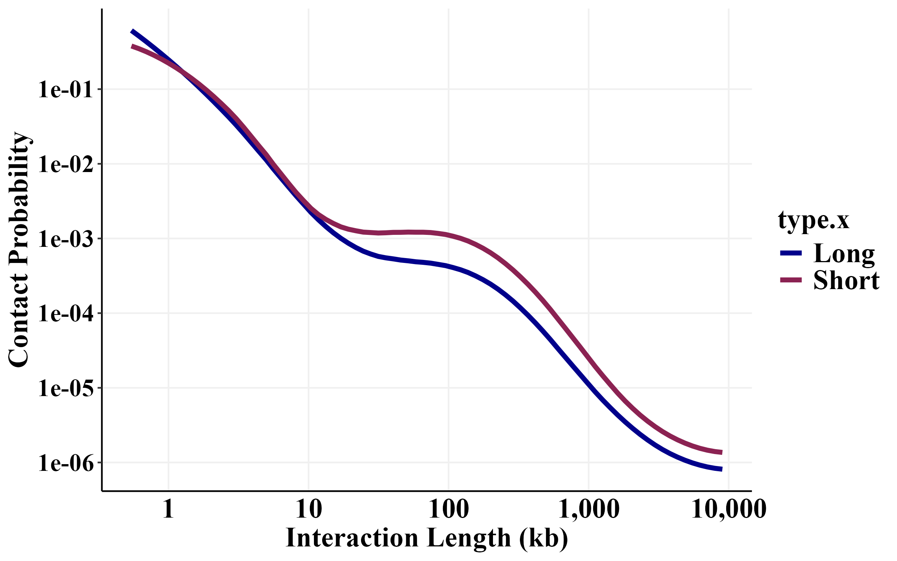

Supplement (Revisions)
================

- [Set the theme](#set-the-theme)
- [Set the path](#set-the-path)
- [S1 MNase HiChIP vs Intact Hi-C](#s1-mnase-hichip-vs-intact-hi-c)
  - [aggregated](#aggregated)
  - [numbers of loops in common](#numbers-of-loops-in-common)
  - [contact map comparison](#contact-map-comparison)
  - [scatterplot comparison](#scatterplot-comparison)
- [S2 Observed ligations](#s2-observed-ligations)
- [S3 Replicates](#s3-replicates)
  - [S3A Density](#s3a-density)
  - [S3B heatmaps](#s3b-heatmaps)
  - [S3C precision recall curves](#s3c-precision-recall-curves)
- [S4 Fig 4 companion figure](#s4-fig-4-companion-figure)
  - [4A short/long fragments](#4a-shortlong-fragments)
  - [4B PWMs](#4b-pwms)
  - [4C annotated hichip 2D density](#4c-annotated-hichip-2d-density)
- [S5 Short fragments](#s5-short-fragments)
  - [Mcool files](#mcool-files)
  - [Short fragment scatterplots](#short-fragment-scatterplots)
- [S6 Figure 5 companion figure](#s6-figure-5-companion-figure)
  - [S6A heatmap](#s6a-heatmap)
  - [S6B Ridge plot](#s6b-ridge-plot)
  - [S6C Aggregate CTCF:H3K27ac](#s6c-aggregate-ctcfh3k27ac)
  - [S6D Linear mixed effects models](#s6d-linear-mixed-effects-models)
  - [S6E (S6B) exclude CTCF-CTCF
    contacts](#s6e-s6b-exclude-ctcf-ctcf-contacts)
  - [S6F (5E) exclude CTCF-CTCF
    contacts](#s6f-5e-exclude-ctcf-ctcf-contacts)
  - [S6G CTCF motifs / loop anchor](#s6g-ctcf-motifs--loop-anchor)
  - [S6H Cis vs trans contacts](#s6h-cis-vs-trans-contacts)
- [S7 Fbn2](#s7-fbn2)
- [S8 CAMEL statistic](#s8-camel-statistic)
- [S9 Nucleosomes](#s9-nucleosomes)

``` r
library(foreach)
library(GenomicRanges)
library(readr)
library(rtracklayer)
library(scales)
library(plyranges)
library(nlme)
library(lme4)
library(viridis)
library(ggridges)
library(RColorBrewer)
library(cowplot)
library(gridExtra)
library(doParallel)
library(data.table)
library(Signac)
library(plyr)
library(memes)
library(universalmotif)
library(HiCExperiment)
library(HiContacts)
library(InteractionSet)
library(plotgardener)
library(scico)
library(dplyr)
library(ggplot2)
library(ggpointdensity)
library(ggExtra)
library(tidyverse)

num_cores = 8
registerDoParallel(cores=num_cores)
```

# Set the theme

``` r
my_theme <-   theme_classic() +
  theme(panel.grid.major = element_line(color = "#f0f0f0",
                                        size = 0.5))+
  theme(plot.title = element_text(color = "black", family = "Times New Roman", size = 18, face = "bold"),
        axis.text.x = element_text(color = "black", family = "Times New Roman", size = 18,face = "bold"),
        axis.text.y = element_text(color = "black", family = "Times New Roman", size = 18,face = "bold"),
        axis.title.x = element_text(color = "black", family = "Times New Roman", size = 18,face = "bold"),
        axis.title.y = element_text(color = "black", family = "Times New Roman", size = 18,face = "bold"),
        legend.text=element_text(color = "black", family = "Times New Roman", size =18,face = "bold"),
        legend.title=element_text(color = "black", family = "Times New Roman", size = 18,face = "bold"),
        strip.text.x = element_text(color = "black", family = "Times New Roman", size = 18,face = "bold"),
        strip.text.y = element_text(color = "black", family = "Times New Roman", size = 18,face = "bold"),
        strip.background=element_rect(colour="#f0f0f0",fill="#f0f0f0"))
```

# Set the path

This is where we stored all those files in the protocol.

``` r
path <- "/aryeelab/users/corri/data/replicate_FF_results/"
```

# S1 MNase HiChIP vs Intact Hi-C

### aggregated

``` r
K562_CTCF_2_5kb_interactions_FitHiC_Q0_01 <- read_table("/aryeelab/users/corri/data/K562_CTCF_2.5kb.interactions_FitHiC_Q0.01.bed")

top_loops <- K562_CTCF_2_5kb_interactions_FitHiC_Q0_01 %>% 
  filter(chr1 == "chr1") %>% 
  arrange(`Q-Value_Bias`)  

first <- top_loops %>% 
  makeGRangesFromDataFrame(seqnames = "chr1",
                           start.field = "s1",
                           end.field = "e1")
second <- top_loops %>% 
  makeGRangesFromDataFrame(seqnames = "chr2",
                           start.field = "s2",
                           end.field = "e2")

gi <- GInteractions(first,second)
```

``` r
hic <- import("/aryeelab/users/corri/data/K562_MicroC_GSE237898_chr1.mcool",
              format = 'mcool', focus = 'chr1:30500000-31000000',resolution = 4000)

aggr_centros <- HiContacts::aggregate(
  hic, targets = gi, 
  BPPARAM = BiocParallel::SerialParam()
  #flankingBins=20
)
#> Going through preflight checklist...
#> Parsing the entire contact matrice as a sparse matrix...
#> Modeling distance decay...
#> Filtering for contacts within provided targets...
plotMatrix(
  aggr_centros, use.scores = 'detrended', 
  limits = c(-1,1), 
  scale = 'linear', 
  cmap = bgrColors()
) +
  my_theme+
  xlab("Right Anchor (CTCF)") +
  ylab("Left Anchor (CTCF)")

#ggsave(paste0(path,"S_aggregated_intact_hic.png"), width=8, height=8)
```


### numbers of loops in common

``` r
HiC_loops <- import("/aryeelab/users/corri/data/GSE237898_ENCFF256ZMD_loops_GRCh38.bedpe")  
hichip_loops <- import("/aryeelab/users/corri/data/K562_CTCF_loops.bedpe")
```

``` r
hichip_LA <- hichip_loops@first
hichip_LA$ID <- 1:length(hichip_LA)

hichip_RA <- hichip_loops@second
hichip_RA$ID <- 1:length(hichip_RA)
###################
HIC_LA <- HiC_loops@first
HIC_LA$ID <- 1:length(HiC_loops)

HIC_RA <- HiC_loops@second
HIC_RA$ID <- 1:length(HiC_loops)
##############
length(subsetByOverlaps(hichip_LA, HIC_LA))/ length(hichip_LA)
length(subsetByOverlaps(hichip_RA, HIC_RA))/ length(hichip_RA)

LA_OVL<- subsetByOverlaps(hichip_LA, HIC_LA)
RA_OVL<- subsetByOverlaps(hichip_RA, HIC_RA)

nrow(data.frame(LA_OVL) %>% filter(ID %in% RA_OVL$ID)) / length(hichip_loops)
```

### contact map comparison

*loop observed in both datasets*

``` r
library(readr)
K562_CTCF_2_5kb_interactions_FitHiC_Q0_01 <- read_table("/aryeelab/users/corri/data/K562_CTCF_2.5kb.interactions_FitHiC_Q0.01.bed")

K562_CTCF_2_5kb_interactions_FitHiC_Q0_01 %>% 
  filter(dplyr::between(s1, 30717500,   30720000)) %>% 
  arrange(`P-Value_Bias`)

data.frame(HiC_loops) %>% 
  filter(first.seqnames == "chr1") %>% 
  filter(dplyr::between(first.start, 30717500,  30720000)) %>%
  filter(dplyr::between(second.start, 30777500, 30780000))
```

``` r
hichip_loops <- import("/aryeelab/users/corri/data/K562_CTCF_loops.bedpe")
hichip_loops <- hichip_loops[seqnames(hichip_loops@first) == "chr1"]

data.frame(hichip_loops) %>% 
  filter(dplyr::between(`first.start`, 30717500,    30720000)) %>% 
  filter(dplyr::between(`second.start`,30777500, 30780000))
```

``` r
hic_1 <- import("/aryeelab/users/corri/data/K562_MicroC_GSE237898_chr1.mcool",
                format = 'mcool', focus = 'chr1:30500000-31000000',resolution = 2000)
hic_2 <- import("/aryeelab/users/corri/data/k562_ctcf_chr1.mcool",
                format = 'mcool', focus = 'chr1:30500000-31000000',resolution = 2000)
```

``` r
bw <- import("/aryeelab/users/corri/data/K562_CTCF_pval_ENCFF168IFW.bigWig")
CTCF_bw <- data.frame(bw) %>% 
  filter(seqnames == "chr1") %>% 
  filter(dplyr::between(start, 30500000,31000000)) %>%
  ggplot(aes(x = start, y = score))+
  scale_x_continuous(labels = comma_format())+
  geom_area(color = "lightseagreen",
            fill = "lightseagreen")+
  my_theme+
  xlab("Position (chr1)") +
  ggtitle("CTCF ChIP-seq")+
  ylab("")
```

``` r
plot_grid(plotlist = list(
  plotMatrix(hic_2, 
             compare.to = hic_1,
             use.scores = 'balanced', 
             caption = FALSE,
             scale = 'log10')+
    scale_x_continuous(limits = c(30500000,31000000),
                       breaks = pretty_breaks(n =3),
                       labels = comma_format())+
    coord_cartesian(xlim = c(30500000,31000000))+
    xlab("Genomic location (chr1)")+
    ylab("Genomic location (chr1)")+
    my_theme,
  CTCF_bw +
    scale_y_continuous(breaks = pretty_breaks(n = 3))+
    ggtitle("")+
    xlab("Genomic location (chr1)")+
    my_theme+
    scale_x_continuous(limits = c(30500000,31000000),
                       breaks = pretty_breaks(n =3),
                       labels = comma_format())+
    theme(legend.position = "none")+
    coord_cartesian(xlim = c(30500000,31000000))),
  align = "hv",
  axis = "tblr",
  ncol=1,
  rel_heights = c(4,1))

#path <- "/aryeelab/users/corri/data/replicate_FF_results/"
#ggsave(paste0(path,"S_hichip_intact_hic_balanced_contact_map.png"), width=8, height=8)
```


### scatterplot comparison

``` r
ctcf_gr <- readRDS(file = "/aryeelab/users/corri/data/ALL_FIMO_CTCF_hg38.RDS")
chip <- read_tsv("/aryeelab/users/corri/data/K562_CTCF_peaks_ENCFF736NYC.bed", col_names = FALSE)
colnames(chip) <- c("chr", "start", "end", "name", "score", "strand", "signalValue", "pval", "qval", "peak")
chip_gr <- makeGRangesFromDataFrame(chip)
chip_gr$qval <- chip$qval
chip_gr$peak_mid <- (start(chip_gr) + end(chip_gr))/2

ovl <- findOverlaps(ctcf_gr,chip_gr)

out <- as.data.frame(ctcf_gr[queryHits(ovl)]) %>%
  cbind(motif_id = queryHits(ovl),
        chip_id = subjectHits(ovl),
        chip_start = start(chip_gr)[subjectHits(ovl)],
        chip_end = end(chip_gr)[subjectHits(ovl)])


motifs <- out %>% 
  mutate(motif_mid = (start+end)/2) %>% 
  mutate(chip_mid = (chip_start+chip_end)/2) %>% 
  mutate(dist = abs(chip_mid-motif_mid)) %>% 
  filter(dist < 30) %>% 
  group_by(chip_id)  %>% 
  arrange(dist) %>% 
  dplyr::slice(1) %>% 
  group_by(motif_id) %>% 
  arrange(dist) %>% 
  dplyr::slice(1) %>% 
  ungroup()

CBSPLUS <- motifs %>% 
  filter(seqnames == "chr1") %>% 
  filter(dplyr::between( start, 30717500,   30720000)) %>% 
  dplyr::pull(motif_mid)

CBSMINUS <-motifs %>% 
  filter(seqnames == "chr1") %>% 
  filter(dplyr::between( start, 30777500, 30780000)) %>% 
  filter(strand == "-") %>% 
  dplyr::pull(motif_mid)
```

``` r
#W <- 1500
W <- 5000
left_anchor <- GRanges("chr1", IRanges(CBSPLUS-W,   CBSPLUS+W))
right_anchor <- GRanges("chr1", IRanges(CBSMINUS-W, CBSMINUS+W))
```

``` r
x1 <- 30775000-1000
x2 <- 30785000+1000
```

``` r
chr <- "chr1"
pairs <- readRDS(paste0("/aryeelab/users/corri/data/CTCF_chr_pairs/k562_ctcf_",chr, ".RDS"))
```

``` r
library(ggExtra)
p <- pairs %>% 
  filter(dplyr::between(pos1, start(left_anchor), end(left_anchor))) %>% 
  filter(dplyr::between(pos2, x1,x2)) %>% 
  ggplot(aes(y = pos1, x = pos2))+
  geom_point() +
  geom_pointdensity(adjust = 1000) +
  scale_color_distiller(direction =1, palette = "Blues")+
  scale_x_continuous(limits = c(x1, x2),
                     breaks = c(30775000,30780000,30785000),
                     labels = comma_format())+
  scale_y_continuous(labels = comma_format(),
                     breaks = pretty_breaks(n = 3)) +
  geom_vline(xintercept =CBSMINUS, col = "grey") +
  geom_hline(yintercept = CBSPLUS, col = "grey") +
  #  theme(legend.position = "none")+
  my_theme +
  xlab("Right Fragment (chr1)")+
  ylab("Left Fragment (chr1)") 
coord_cartesian(xlim = c(x1, x2))

p
```

``` r
cols <- c("chr1", "pos1","chr2", "pos2")
pairs_hic <- read_table("/aryeelab/users/corri/data/K562_MicroC_GSE237898_chr1_R.pairs",
                        col_names = cols, comment="#",
                        col_types = "-cici----")
```

``` r
x1 <- 30775000-1000
x2 <- 30785000+1000

p1 <- pairs_hic %>% 
  filter(dplyr::between(pos1, start(left_anchor), end(left_anchor))) %>% 
  filter(dplyr::between(pos2, x1,x2)) %>% 
  ggplot(aes(y = pos1, x = pos2))+
  geom_point() +
  scale_x_continuous(limits = c(x1, x2),
                     breaks = c(30775000,30780000,30785000),
                     labels = comma_format())+
  coord_cartesian(xlim = c(x1, x2))+
  scale_y_continuous(labels = comma_format(),
                     breaks = pretty_breaks(n = 3)) +
  geom_pointdensity(adjust = 1000) +
  scale_color_distiller(direction =1, palette = "Blues")+
  geom_vline(xintercept =CBSMINUS, col = "grey") +
  geom_hline(yintercept = CBSPLUS, col = "grey") +
  my_theme +
  #theme(legend.position = "none")+
  xlab("Right Fragment (chr1)")+
  ylab("Left Fragment (chr1)") 
#  geom_vline(xintercept = c(30778700))
#  geom_vline(xintercept = c(30778700))
```

``` r
motifs_gr <- readRDS("/aryeelab/users/corri/data/ALL_FIMO_CTCF_hg38.RDS")
motifs <- data.frame(motifs_gr) %>%
  mutate(symbol = ifelse(strand == "+", ">", "<")) %>% 
  filter(seqnames == "chr1")  %>% 
  mutate(motif_mid = (start+end)/2)


motif_plot <-data.frame(motifs_gr) %>%
  mutate(symbol = ifelse(strand == "+", ">", "<")) %>% 
  filter(seqnames == "chr1") %>% 
  ggplot()+
  geom_text(aes(x =  (start+end)/2, y = 1, fontface=2,
                label = symbol,color=symbol),
            family = "Times New Roman", size=8)+
  theme_classic()+
  my_theme+
  xlab("")+
  scale_x_continuous(limits = c(x1,x2))+
  scale_color_manual(values = c("darkblue","darkred")) +
  theme(legend.position = "none")
```

``` r
x1 <- 30775000-1000
x2 <- 30785000+1000
bw <- import("/aryeelab/users/corri/data/K562_CTCF_pval_ENCFF168IFW.bigWig")
CTCF_bw <- data.frame(bw) %>% 
  filter(seqnames == "chr1") %>% 
  filter(dplyr::between(start, x1,x2)) %>%
  ggplot(aes(x = start, y = score))+
  scale_x_continuous(labels = comma_format())+
  geom_area(color = "lightseagreen",
            fill = "lightseagreen")+
  my_theme+
  xlab("Position (chr1)") +
  ggtitle("CTCF ChIP-seq")+
  ylab("")

bw <- import("/aryeelab/users/corri/data/K562_RNAPII_ENCFF914WIS.bigWig")
bw_RNAPII <- data.frame(bw) %>% 
  filter(seqnames == "chr1") %>% 
  filter(dplyr::between(start, x1,x2)) %>%
  ggplot(aes(x = start, y = score))+
  scale_x_continuous(labels = comma_format())+
  geom_area(color = "darkred",
            fill = "darkred")+
  my_theme+
  xlab("Position (chr1)") +
  ggtitle("RNAPII ChIP-seq")+
  ylab("")
```

``` r
x1 <- 30775000-1000
x2 <- 30785000+1000
plot_grid(plotlist = list(
  CTCF_bw +
    scale_y_continuous(breaks = pretty_breaks(n = 3))+
    ggtitle("")+
    my_theme+
    scale_x_continuous(limits = c(x1, x2),
                       breaks = c(30775000,30780000,30785000),
                       labels = comma_format())+
    theme(legend.position = "none")+
    coord_cartesian(xlim = c(x1, x2))+
    theme(plot.margin = unit(c(-0.5,-0.5,-0.5,-0.5), "cm")),
  motif_plot +
    scale_y_continuous(breaks = pretty_breaks(n = 2))+
    ggtitle("")+
    scale_x_continuous(
      breaks = c(30775000,30780000,30785000),
      limits = c(x1, x2),
      labels = comma_format())+
    coord_cartesian(xlim = c(x1, x2))+
    theme(axis.line=element_blank(),axis.text.x=element_blank(),
          axis.text.y=element_blank(),axis.ticks=element_blank(),
          axis.title.y=element_blank(),
          plot.margin = unit(c(-0.5,-0.5,-0.5,-0.5), "cm")),
  bw_RNAPII +
    ggtitle("")+
    my_theme+
    scale_y_continuous(breaks = pretty_breaks(n = 3))+
    scale_x_continuous(limits = c(x1, x2),
                       breaks = c(30775000,30780000,30785000),
                       labels = comma_format())+
    theme(legend.position = "none")+
    coord_cartesian(xlim = c(x1, x2))+
    theme(plot.margin = unit(c(-0.5,-0.5,-0.5,-0.5), "cm"))
),
align = "hv",
axis = "tblr",
ncol=1,
rel_heights = c(1,0.5,1))

#ggsave(paste0(path,"S_hichip_intact_hic_chipseq.png"), width=8, height=4)
```


``` r
plot_grid(plotlist = list(
  ggMarginal(p+
               theme(legend.position = "none"), 
             type = "density", color = "darkblue",
             fill = "royalblue",alpha = 0.5), 
  ggMarginal(p1+
               theme(legend.position = "none"), 
             type = "density", color = "darkblue",
             fill = "royalblue",alpha = 0.5) 
),
align = "hv",axis = "tblr",ncol=1)

#ggsave(paste0(path,"S_hichip_intact_hic_scatterplot_marginal.png"), width=8, height=8)
```


# S2 Observed ligations

Files I’m using: stats_50bp.txt, stats_75bp.txt, stats_100bp.txt,
stats_125bp.txt, stats_150bp.txt

Note to self: files moved from
“/data/aryee/corri/CTCF_paper_fastq_dif_length/” to
/aryeelab/users/corri/data/

``` r
dir <- "/aryeelab/users/corri/data/"

stats_files <- (vector(mode = "list", length = 5))
iter <- 1
for (read_len in c(50,75,100,125,150)){
  print(read_len)
  
  stats <- read_table2(paste0(dir,"stats_",read_len,"bp.txt"), col_names = FALSE)
  stats$read_length <- read_len
  stats_files[[iter]] <- stats
  iter <- iter + 1
}

stats_df <- bind_rows(stats_files) 
```

``` r
colnames(stats_df) <- c("Name","Number","Read_Length")


obs_lig <- stats_df %>%
  filter(Name %in% c("pair_types/uu","pair_types/Uu","pair_types/uU","pair_types/UR","pair_types/RU")) %>% 
  group_by(Read_Length) %>% 
  summarize(obs_lig = sum(Number))

unobs_lig <- stats_df %>%
  filter(Name %in% c("pair_types/UU")) %>% 
  group_by(Read_Length) %>% 
  summarize(unobs_lig = sum(Number))

all_types <- cbind(obs_lig,unobs_lig)[,c(1,2,4)]

all_types <- all_types %>% 
  mutate(obs_lig_freq = obs_lig / (obs_lig + unobs_lig))

RL_obs_lig <- all_types %>% 
  mutate(perc_obs_lig = obs_lig_freq * 100) %>% 
  ggplot(aes(x = Read_Length, y = perc_obs_lig,label =paste0(round(perc_obs_lig, 1), "%" ))) +
  geom_point(col =  "royalblue") +
  geom_text(hjust=0.5, vjust=-1.2, colour = "black", family = "Times New Roman",size = 5) +
  geom_line(col = "darkblue", linetype = "dashed") +
  xlab("Read Length (bp)") +
  ylab("Percent Observed Ligations")+
  theme_classic() +
  theme(panel.grid.major = element_line(color = "#f0f0f0",
                                        size = 0.5))+
  theme(plot.title = element_text(color = "black", family = "Times New Roman", size = 18, face = "bold"),
        axis.text.x = element_text(color = "black", family = "Times New Roman", size = 18,face = "bold"),
        axis.text.y = element_text(color = "black", family = "Times New Roman", size = 16,face = "bold"),
        axis.title.x = element_text(color = "black", family = "Times New Roman", size = 18,face = "bold"),
        axis.title.y = element_text(color = "black", family = "Times New Roman", size = 18,face = "bold"),
        axis.ticks.x=element_blank(),
        legend.text=element_text(color = "black", family = "Times New Roman", size =18,face = "bold"),
        legend.title=element_text(color = "black", family = "Times New Roman", size = 18,face = "bold"),
        strip.text.x = element_text(color = "black", family = "Times New Roman", size = 18,face = "bold"),
        strip.text.y = element_text(color = "black", family = "Times New Roman", size = 18,face = "bold"),
        strip.background=element_rect(colour="#f0f0f0",fill="#f0f0f0"))+
  ylim(c(0,37)) +
  ggtitle("% Observed Ligations Increases with Read Length")

RL_obs_lig 
#ggsave(paste0(path,"S_obs_lig.png"), width=8, height=4)
```


# S3 Replicates

### S3A Density

``` r
ctcf_motifs<- readRDS("/aryeelab/users/corri/data/ALL_FIMO_CTCF_hg38.RDS")
data.frame(ctcf_motifs) %>% 
  filter(seqnames == "chr1") %>% 
  filter(start == 30779763)
```

``` r
# PAIRS BY SAMPLE
pairs <- readRDS("/aryeelab/users/corri/data/k562_ctcf/pairs_CTCF_chr1_sample_id_Oct24_2022.RDS")

ctcf_loc <- (30779763+30779781)/2
left_anchor <- pairs %>% 
  dplyr::filter(type %in% c("uu", "uU", "UR")) %>% 
  dplyr::select(chr1, pos1, strand1, type, sample_id) %>% 
  dplyr::rename(chr = chr1, pos = pos1, strand = strand1) 

right_anchor <- pairs %>% 
  dplyr::filter(type %in% c("uu", "Uu", "RU")) %>% 
  dplyr::select(chr2, pos2, strand2, type, sample_id) %>% 
  dplyr::rename(chr = chr2, pos = pos2, strand = strand2) 

pairs <- rbind(left_anchor, right_anchor)

r1_gr <- pairs %>% 
  makeGRangesFromDataFrame(seqnames.field = "chr",
                           start.field = "pos",
                           end.field = "pos",
                           keep.extra.columns = TRUE)

width <- 200
right_anchor <- GRanges("chr1", IRanges(ctcf_loc - 200, ctcf_loc + 200))

idx2 <- queryHits(findOverlaps(r1_gr, right_anchor))
```

``` r
pos_density <- (vector(mode = "list", length = 4))
neg_density <- (vector(mode = "list", length = 4))

iter <- 1
for (sample_id1 in levels(as.factor(pairs$sample_id))){
  print(sample_id1)
  print(iter)
  
  summ <- pairs[idx2,] %>% 
    filter(sample_id == sample_id1) %>% 
    mutate(pos2 = pos- ctcf_loc)
  
  pos_density[[iter]] <- density(summ$pos2[summ$strand == "+"])
  neg_density[[iter]] <- density(summ$pos2[summ$strand == "-"])
  
  iter <- iter + 1
}
```

``` r
# plot the results of the density call
linetype <- "solid"
alpha <- 1

ggplot(data.frame(x = pos_density[[1]]$x, y = pos_density[[1]]$y)) + 
  aes(x = x, y = y) + 
  geom_line(color = "darkred", alpha = alpha, linetype = linetype) +
  geom_line(aes(x = neg_density[[1]]$x, y = -1 * neg_density[[1]]$y), color="darkblue", alpha = alpha, linetype = linetype) +
  geom_line(aes(x = neg_density[[2]]$x, y = -1 * neg_density[[2]]$y), color="darkblue", alpha = alpha, linetype = linetype) +
  geom_line(aes(x = neg_density[[3]]$x, y = -1 * neg_density[[3]]$y), color="darkblue", alpha = alpha, linetype = linetype) +
  geom_line(aes(x = neg_density[[4]]$x, y = -1 * neg_density[[4]]$y), color="darkblue", alpha = alpha, linetype = linetype) +
  
  geom_line(aes(x = pos_density[[2]]$x, y = pos_density[[2]]$y), color="darkred", alpha = alpha, linetype = linetype) +
  geom_line(aes(x = pos_density[[3]]$x, y = pos_density[[3]]$y), color="darkred", alpha = alpha, linetype = linetype) +
  geom_line(aes(x = pos_density[[4]]$x, y = pos_density[[4]]$y), color="darkred", alpha = alpha, linetype = linetype) +
  geom_vline(xintercept = 75, linetype = "dashed") +
  geom_vline(xintercept = -75, linetype = "dashed") +
  annotate("text", x = -180, y = -0.025, label = "CTCF",family = "Times New Roman",size = 5,fontface =2) +
  annotate("text", x = -180, y = 0.015, label = "+ Reads", color="darkred",family = "Times New Roman",size = 5,fontface =2) +
  annotate("text", x = -180, y = -0.015, label = "- Reads", color="darkblue",family = "Times New Roman",size = 5,fontface =2) +
  xlab("Distance from CTCF Motif") +
  ylab("Density") +
  annotate("text", x = 0, y = -0.025, label = "<", color="black",family = "Times New Roman",size = 8,fontface =2) +
  geom_hline(yintercept = 0, linetype=2) +
  scale_x_continuous(labels = comma_format(), limits=c(-200,200),breaks = c(-150,-75,0,75,150)) +
  
  annotate("text",x = 60, y = 0.015, label = "Q1", size=5, col = "darkred",family = "Times New Roman",fontface =2) + 
  annotate("text",x = -60, y = 0.015, label = "Q2", size=5, col = "darkred",family = "Times New Roman",fontface =2) + 
  annotate("text",x = -60, y = -0.015, label = "Q3", size=5, col = "darkblue",family = "Times New Roman",fontface =2) + 
  annotate("text",x = 60, y = -0.015, label = "Q4", size=5, col = "darkblue",family = "Times New Roman",fontface =2)  +
  
  annotate("text",x = -100, y = -0.005, label = "-75", size=5, col = "black",family = "Times New Roman",fontface =2)+
  annotate("text",x = 100, y = -0.005, label = "+75", size=5, col = "black",family = "Times New Roman",fontface =2)+
  
  annotate("text",x = 0, y = -0.034, label = "150 bp", size=5, col = "black",family = "Times New Roman",fontface =2)+
  annotate("segment", x=-75, xend=75, y = -0.04, yend=-0.04, colour = "black", arrow=arrow(ends='both'),size = 2)+
  ylim(c( -0.04, 0.04))+
  geom_vline(xintercept = 0, col = "magenta", linetype = "dashed")+
  theme_classic()+
  theme(panel.grid.major = element_line(color = "#f0f0f0",
                                        size = 0.5))+
  theme(plot.title = element_text(color = "black", family = "Times New Roman", size = 18, face = "bold"),
        axis.text.x = element_text(color = "black", family = "Times New Roman", size = 18,face = "bold"),
        axis.text.y = element_text(color = "black", family = "Times New Roman", size = 18,face = "bold"),
        axis.title.x = element_text(color = "black", family = "Times New Roman", size = 18,face = "bold"),
        axis.title.y = element_text(color = "black", family = "Times New Roman", size = 18,face = "bold"),
        axis.ticks.x=element_blank(),
        legend.text=element_text(color = "black", family = "Times New Roman", size =18,face = "bold"),
        legend.title=element_text(color = "black", family = "Times New Roman", size = 18,face = "bold"),
        strip.text.x = element_text(color = "black", family = "Times New Roman", size = 18,face = "bold"),
        strip.background=element_rect(colour="#f0f0f0",fill="#f0f0f0"))

#ggsave(paste0(path,"S_replicate_density.png"), width=8, height=5)
```


### S3B heatmaps

Made these files in the protocol RMD.

``` r
rep1 <- readRDS("/aryeelab/users/corri/data/k562_ctcf/K562_CTCF_DTG_1_heatmap_sort_readcounts.RDS")
rep1$sample <- "rep1"

rep2 <- readRDS("/aryeelab/users/corri/data/k562_ctcf/K562_CTCF_DTG_2_heatmap_sort_readcounts.RDS")
rep2$sample <- "rep2"

rep3 <- readRDS("/aryeelab/users/corri/data/k562_ctcf/K562_CTCF_ET_1_heatmap_sort_readcounts.RDS")
rep3$sample <- "rep3"

rep4 <- readRDS("/aryeelab/users/corri/data/k562_ctcf/K562_CTCF_ET_2_heatmap_sort_readcounts.RDS")
rep4$sample <- "rep4"

results_anc1 <- rbind(rep1,rep2,rep3,rep4)
```

``` r
#results_anc1 <- readRDS(file = paste0(path,"heatmap_sort_readcounts.RDS"))

results_anc1$log_min_max_thresh <- results_anc1$log_min_max
results_anc1$log_min_max_thresh[results_anc1$log_min_max_thresh > 3] <- 3
results_anc1$log_min_max_thresh[results_anc1$log_min_max_thresh < -3] <- -3

results_anc1 %>% 
  ggplot(aes(dist, order, fill=log_min_max_thresh )) + 
  geom_tile() +
  ylab("log2 (min/max)")  +
  xlab("Distance from CTCF Motif")+
  labs(fill = "log2 (min/max)")+
  facet_wrap(~sample)+
  theme_classic()+
  theme(panel.grid.major = element_line(color = "#f0f0f0",
                                        size = 0.5))+
  theme(plot.title = element_text(color = "black", family = "Times New Roman", size = 18, face = "bold"),
        axis.text.x = element_text(color = "black", family = "Times New Roman", size = 18,face = "bold"),
        axis.text.y = element_text(color = "black", family = "Times New Roman", size = 18,face = "bold"),
        axis.title.x = element_text(color = "black", family = "Times New Roman", size = 18,face = "bold"),
        axis.title.y = element_text(color = "black", family = "Times New Roman", size = 18,face = "bold"),
        axis.ticks.x=element_blank(),
        legend.text=element_text(color = "black", family = "Times New Roman", size =18,face = "bold"),
        legend.title=element_text(color = "black", family = "Times New Roman", size = 18,face = "bold"),
        strip.text.x = element_text(color = "black", family = "Times New Roman", size = 18,face = "bold"),
        strip.background=element_rect(colour="#f0f0f0",fill="#f0f0f0"))+
  #  scico::scale_fill_scico(palette = "vik")+
  scale_fill_gradient2(
    low = "darkblue",
    mid = "white",
    high = "darkred")+
  geom_vline(xintercept = c(0))+
  scale_x_continuous(breaks=seq(-100,100,20))

#ggsave("/aryeelab/users/corri/plots/3A_min_max_replicate_heatmap.png", width=16, height=8)
```


### S3C precision recall curves

``` r
loops <-read_tsv("/aryeelab/users/corri/data/K562_CTCF_2.5kb.interactions_FitHiC_Q0.01.bed")
loops <- loops %>% 
  filter(chr1 != "chrX") %>% 
  filter(chr2 != "chrX")

LA <- loops %>% 
  dplyr::select(chr1, s1, e1) %>% 
  dplyr::rename(chr = chr1, start = s1, end = e1)

RA <- loops %>% 
  dplyr::select(chr2, s2, e2) %>% 
  dplyr::rename(chr = chr2, start = s2, end = e2)

anchors <- rbind(LA,RA) %>% 
  mutate(loc = paste0(chr, ":",start)) %>% 
  distinct(loc, .keep_all = TRUE)

anchors_gr <- makeGRangesFromDataFrame(anchors, 
                                       keep.extra.columns = TRUE,
                                       seqnames.field = "chr",
                                       start.field = "start",
                                       end.field = "end")
ctcf_motifs<- readRDS("/aryeelab/users/corri/data/ALL_FIMO_CTCF_hg38.RDS")
gr_motifs <- ctcf_motifs[width(ctcf_motifs)==19]
gr_motifs$motif_mid <- round( ( start(gr_motifs) + end(gr_motifs) )/2)

ovl <- findOverlaps(gr_motifs, anchors_gr, maxgap = 0)

out <- as.data.frame(gr_motifs[queryHits(ovl)]) %>% 
  cbind(motif_id = queryHits(ovl),
        loop_id = subjectHits(ovl),
        loop_start = start(anchors_gr)[subjectHits(ovl)],
        loop_end = end(anchors_gr)[subjectHits(ovl)]) 

out %>% 
  group_by(loop_id) %>% 
  dplyr::summarize(count =dplyr::n()) %>%
  filter(count < 10) %>% 
  ggplot(aes(x = count))+
  geom_histogram(fill = "darkblue", col = "white")+
  theme_classic()+
  theme(panel.grid.major = element_line(color = "#f0f0f0",
                                        size = 0.5))+
  theme(plot.title = element_text(color = "black", family = "Times New Roman", size = 18, face = "bold"),
        axis.text.x = element_text(color = "black", family = "Times New Roman", size = 18,face = "bold"),
        axis.text.y = element_text(color = "black", family = "Times New Roman", size = 18,face = "bold"),
        axis.title.x = element_text(color = "black", family = "Times New Roman", size = 18,face = "bold"),
        axis.title.y = element_text(color = "black", family = "Times New Roman", size = 18,face = "bold"),
        axis.ticks.x=element_blank(),
        legend.text=element_text(color = "black", family = "Times New Roman", size =18,face = "bold"),
        legend.title=element_text(color = "black", family = "Times New Roman", size = 18,face = "bold"),
        strip.text.x = element_text(color = "black", family = "Times New Roman", size = 18,face = "bold"),
        strip.background=element_rect(colour="#f0f0f0",fill="#f0f0f0"))+
  xlab("Number of CTCF motifs per 2.5kb loop anchor")+
  ylab("Count") +
  scale_x_continuous(breaks=seq(1:10))
```

``` r
temp<- out %>% 
  group_by(loop_id) %>% 
  dplyr::summarize(count =dplyr::n()) 

# 70% have more than one CTCF motif
temp %>% 
  filter(count >1) %>% 
  dplyr::summarize(RN = max(row_number())) %>% 
  mutate(freq = RN / nrow(temp))
```

*filter to loop anchors with only one CTCF motif*

``` r
uniq<- out %>% 
  dplyr::group_by(loop_id) %>% 
  dplyr::mutate(count = max(dplyr::row_number())) %>% 
  ungroup() %>% 
  filter(count == 1) %>% 
  arrange(loop_id)

uniq_gr <- makeGRangesFromDataFrame(uniq, 
                                    keep.extra.columns = FALSE,
                                    seqnames.field = "seqnames",
                                    start.field = "start",
                                    end.field = "end")
uniq_gr$motif_mid <- uniq$motif_mid
uniq_gr$loop_start <- uniq$loop_start
uniq_gr$loop_end <- uniq$loop_end

chip <- read_tsv("/aryeelab/users/corri/data/K562_CTCF_peaks_ENCFF736NYC.bed", col_names = FALSE)
colnames(chip) <- c("chr", "start", "end", "name", "score", "strand", "signalValue", "pval", "qval", "peak")
chip_gr <- makeGRangesFromDataFrame(chip)
chip_gr$qval <- chip$qval
chip_gr$peak_mid <- (start(chip_gr) + end(chip_gr))/2

anchors <- chip_gr %>% 
  plyranges::anchor_center() %>% 
  plyranges::mutate(width = 301)

ovl <- findOverlaps(uniq_gr, anchors, maxgap = 0)

out <- as.data.frame(uniq_gr[queryHits(ovl)]) %>% 
  cbind(motif_id = queryHits(ovl),
        chip_id = subjectHits(ovl),
        chip_start = start(anchors)[subjectHits(ovl)],
        chip_mid = anchors$peak_mid[subjectHits(ovl)],
        chip_end = end(anchors)[subjectHits(ovl)],
        qval_score = anchors$qval[subjectHits(ovl)]) %>% 
  mutate(dist = chip_mid - motif_mid)

out <- out %>% 
  ungroup() %>% 
  group_by(chip_id) %>% 
  arrange(abs(dist)) %>% 
  dplyr::slice(1)

out <- out %>% 
  filter(abs(dist) < 30)

# going to use this dataset for precision-recall curve later
ctcf_chip <- out %>% 
  ungroup()
```

``` r
PR_function <- function(path, ctcf_chip){
  df <- readRDS(file =paste0(path, "GW_pvals.RDS"))
  
  
  peaks_gr <- makeGRangesFromDataFrame(df,
                                       seqnames.field = "chr",
                                       start.field = "window_mid",
                                       end.field = "window_mid",
                                       keep.extra.columns = TRUE)
  peaks_gr$FF_pval <- df$pvalue
  peaks_gr$window_mid <- df$window_mid
  #####################################
  chip_motif <- makeGRangesFromDataFrame(ctcf_chip,
                                         seqnames.field = "seqnames",
                                         start.field = "motif_mid",
                                         end.field = "motif_mid")
  
  ovl <- findOverlaps(chip_motif, peaks_gr, maxgap = 40)
  
  TP <- as.data.frame(chip_motif[queryHits(ovl)]) %>% 
    cbind(motif_id = queryHits(ovl),
          peak_id = subjectHits(ovl),
          peak = start(peaks_gr)[subjectHits(ovl)],
          FF_pval = peaks_gr$FF_pval[subjectHits(ovl)],
          q1 = peaks_gr$q1[subjectHits(ovl)],
          q2 = peaks_gr$q2[subjectHits(ovl)],
          q3 = peaks_gr$q3[subjectHits(ovl)],
          q4 = peaks_gr$q4[subjectHits(ovl)],
          num_reads = peaks_gr$num_reads[subjectHits(ovl)],
          min24 = peaks_gr$min24[subjectHits(ovl)],
          max13 = peaks_gr$max13[subjectHits(ovl)],
          log_min_max = peaks_gr$log_min_max[subjectHits(ovl)]) %>% 
    mutate(dist = start-peak) %>% 
    group_by(motif_id) %>% 
    filter(abs(dist) < 30) %>% 
    arrange(desc(log_min_max)) %>% 
    dplyr::slice(1) %>% 
    ungroup()
  #####################################
  out <- ctcf_chip
  
  out <- out %>% 
    mutate(s1 = loop_start+20,
           e1 = motif_mid - 200, 
           s2 = motif_mid + 200,
           e2 = loop_end-20) 
  
  check <- out %>% 
    filter(s1<e1)
  chip_motif1 <- makeGRangesFromDataFrame(check,
                                          seqnames.field = "seqnames",
                                          start.field = "s1",
                                          end.field = "e1")
  
  check <- out %>% 
    filter(s2<e2)
  chip_motif2 <- makeGRangesFromDataFrame(check,
                                          seqnames.field = "seqnames",
                                          start.field = "s2",
                                          end.field = "e2")
  
  chip_motif<- c(chip_motif1, chip_motif2)
  
  ovl <- findOverlaps(chip_motif, peaks_gr, maxgap = 0)
  
  FP <- as.data.frame(chip_motif[queryHits(ovl)]) %>% 
    cbind(loop_id = queryHits(ovl),
          peak_id = subjectHits(ovl),
          peak = start(peaks_gr)[subjectHits(ovl)],
          FF_pval = peaks_gr$FF_pval[subjectHits(ovl)],
          q1 = peaks_gr$q1[subjectHits(ovl)],
          q2 = peaks_gr$q2[subjectHits(ovl)],
          q3 = peaks_gr$q3[subjectHits(ovl)],
          q4 = peaks_gr$q4[subjectHits(ovl)],
          num_reads = peaks_gr$num_reads[subjectHits(ovl)],
          min24 = peaks_gr$min24[subjectHits(ovl)],
          max13 = peaks_gr$max13[subjectHits(ovl)],
          log_min_max = peaks_gr$log_min_max[subjectHits(ovl)])
  #####################################
  FP$group <- floor(FP$peak/150)
  FP <- FP %>% 
    mutate(group = paste0(seqnames, ":", group)) 
  
  num_TP<- 4523 # number of TP motifs
  
  thresh_vec <- seq(1,10, by = 1)
  
  
  PR <- data.frame(thresh=  thresh_vec, 
                   lik_precision = rep(NA, length(thresh_vec)),
                   lik_recall = rep(NA, length(thresh_vec)))
  
  iter <- 1
  for (score_val in thresh_vec){
    print(score_val)
    
    thresh <- 10^(-1 * score_val)
    
    ### False positives
    num_FP_lik <- FP %>% 
      filter(FF_pval<= thresh) %>%
      group_by(group) %>%
      dplyr::slice(1) %>%
      ungroup() %>% 
      dplyr::summarize(FP = max(dplyr::row_number())) %>% 
      pull(FP) 
    
    if(num_FP_lik == "-Inf"){
      num_FP_lik <- 0
    }
    
    ### True positives
    lik_TP <- TP %>%
      filter(FF_pval <= thresh) %>% 
      dplyr::summarize(truepos = max(dplyr::row_number())) %>% 
      pull(truepos)
    
    # recall
    PR$lik_recall[iter] <- lik_recall <- lik_TP /num_TP
    
    # precision
    PR$lik_precision[iter] <- lik_prec <- lik_TP / (lik_TP + num_FP_lik)
    iter <- iter + 1
  }
  #####################################
  
  
  return(PR)
}
```

``` r
combined_reps <- PR_function(path = "/aryeelab/users/corri/data/replicate_FF_results/",
                             ctcf_chip = ctcf_chip)
```

*Great, this exactly matches our figure in our paper. Now let’s make it
for each replicate.*

``` r
library(ggrepel)
combined_reps %>% 
  filter(thresh <= 8) %>% 
  ggplot(aes(x = lik_recall, y = lik_precision)) +
  geom_line(color = "royalblue", size = 1.5) +
  geom_point(color = "darkblue", size = 2) +
  geom_text_repel(aes(x = lik_recall, y = lik_precision, label = 10^(-1*thresh)),family = "Times New Roman",size = 5,fontface =2)+
  geom_hline(yintercept = 1, col = "firebrick3", linetype = "dashed") + 
  xlab("Recall") +
  ylab("Precision") +
  scale_x_continuous(breaks = c(seq(0.8,1,0.02)))+
  scale_y_continuous(breaks = c(seq(0.2,1,0.1)))+
  theme_classic()+
  theme(panel.grid.major = element_line(color = "#f0f0f0",
                                        size = 0.5))+
  theme(plot.title = element_text(color = "black", family = "Times New Roman", size = 18, face = "bold"),
        axis.text.x = element_text(color = "black", family = "Times New Roman", size = 18,face = "bold"),
        axis.text.y = element_text(color = "black", family = "Times New Roman", size = 18,face = "bold"),
        axis.title.x = element_text(color = "black", family = "Times New Roman", size = 18,face = "bold"),
        axis.title.y = element_text(color = "black", family = "Times New Roman", size = 18,face = "bold"),
        axis.ticks.x=element_blank(),
        legend.text=element_text(color = "black", family = "Times New Roman", size =18,face = "bold"),
        legend.title=element_text(color = "black", family = "Times New Roman", size = 18,face = "bold"),
        strip.text.x = element_text(color = "black", family = "Times New Roman", size = 18,face = "bold"),
        strip.background=element_rect(colour="#f0f0f0",fill="#f0f0f0"))
```


``` r
rep1 <- PR_function(path = "/aryeelab/users/corri/data/k562_ctcf/K562_CTCF_DTG_1/",
                    ctcf_chip = ctcf_chip)
rep1$sample <- "rep1"

rep2 <- PR_function(path = "/aryeelab/users/corri/data/k562_ctcf/K562_CTCF_DTG_2/",
                    ctcf_chip = ctcf_chip)
rep2$sample <- "rep2"

rep3 <- PR_function(path = "/aryeelab/users/corri/data/k562_ctcf/K562_CTCF_ET_1/",
                    ctcf_chip = ctcf_chip)
rep3$sample <- "rep3"

rep4 <- PR_function(path = "/aryeelab/users/corri/data/k562_ctcf/K562_CTCF_ET_2/",
                    ctcf_chip = ctcf_chip)
rep4$sample <- "rep4"

reps <- rbind(rep1,rep2,rep3,rep4)
```

``` r
reps %>% 
  mutate(point_color = ifelse(thresh ==5, "firebrick3","black"))
```

``` r
library(ggrepel)
reps %>% 
  mutate(point_color = ifelse(thresh ==5, "firebrick3","black")) %>% 
  #filter(thresh <= 8) %>% 
  filter(thresh <= 6) %>% 
  ggplot(aes(x = lik_recall, y = lik_precision)) +
  geom_line(aes(col=sample),size = 1) +
  scale_color_manual(values = c("steelblue","steelblue1","steelblue3","steelblue4"))+
  geom_point(aes(shape = as.factor(10^(-1*thresh)))) +
  geom_hline(yintercept = 1, col = "firebrick3", linetype = "dashed") + 
  scale_x_continuous(breaks = c(seq(0.4,1,0.1)))+
  xlab("Recall") +
  ylab("Precision") +
  labs(col = "Sample",
       shape = "Threshold")+
  #facet_wrap(~sample)+
  scale_y_continuous(breaks = c(seq(0.2,1,0.1)))+
  theme_classic()+
  theme(panel.grid.major = element_line(color = "#f0f0f0",
                                        size = 0.5))+
  theme(plot.title = element_text(color = "black", family = "Times New Roman", size = 18, face = "bold"),
        axis.text.x = element_text(color = "black", family = "Times New Roman", size = 18,face = "bold"),
        axis.text.y = element_text(color = "black", family = "Times New Roman", size = 18,face = "bold"),
        axis.title.x = element_text(color = "black", family = "Times New Roman", size = 18,face = "bold"),
        axis.title.y = element_text(color = "black", family = "Times New Roman", size = 18,face = "bold"),
        axis.ticks.x=element_blank(),
        legend.text=element_text(color = "black", family = "Times New Roman", size =12,face = "bold"),
        legend.title=element_text(color = "black", family = "Times New Roman", size = 12,face = "bold"),
        strip.text.x = element_text(color = "black", family = "Times New Roman", size = 18,face = "bold"),
        strip.background=element_rect(colour="#f0f0f0",fill="#f0f0f0"))

#ggsave(paste0(path,"S_replicate_precision_recall.png"), width=8, height=5)
```


# S4 Fig 4 companion figure

### 4A short/long fragments

``` r
path <- "/aryeelab/users/corri/data/replicate_FF_results/"
left_plus <- readRDS(file = paste0(path, "left_plus_annot_cluster.RDS"))
left_plus <- left_plus %>% 
  mutate(
    LR = ifelse(interaction_length> 10000,"Long-range","Short-range")) %>% 
  mutate(short_motif_start =motif_mid - 9) %>% 
  mutate(long_motif_start = motif_mid - 25) %>% 
  mutate(motif_end= motif_mid + 9) %>% 
  mutate(LR =factor(LR, levels = c("Short-range","Long-range"))) %>% 
  mutate(start_centered = start-long_motif_start,
         end_centered = end - long_motif_start) %>% 
  filter(start_centered < (16-5)) %>% 
  filter(end_centered > (35+5)) %>% 
  mutate(fragment_type = case_when(
    width>= 120 ~ "Long",
    width < 120 ~ "Short"
  )) %>% 
  ungroup() %>% 
  dplyr::rename(start1 = start, end1 = end)

p1 <- left_plus %>%   
  ggplot(aes(interaction_length/1000, fill = fragment_type, col = fragment_type)) +
  geom_density(alpha = 0.5, linewidth = 1.5)+
  theme_classic() + 
  scale_x_log10(breaks=c(0,1,10,100,1000,10000),
                limits = c(10^-2,10^4), 
                labels=scales::comma)+
  scale_fill_manual(values=c("darkblue", "violetred4")) +
  scale_color_manual(values=c("darkblue", "violetred4")) +
  ylab("Density") +
  xlab("Interaction Length (kb)")+
  labs(color = "Fragment Type")+
  guides(fill = FALSE)+
  theme_classic() +
  theme(panel.grid.major = element_line(color = "#f0f0f0",
                                        size = 0.5))+
  theme(plot.title = element_text(color = "black", family = "Times New Roman", size = 18, face = "bold"),
        axis.text.x = element_text(color = "black", family = "Times New Roman", size = 18,face = "bold"),
        axis.text.y = element_text(color = "black", family = "Times New Roman", size = 16,face = "bold"),
        axis.title.x = element_text(color = "black", family = "Times New Roman", size = 18,face = "bold"),
        axis.title.y = element_text(color = "black", family = "Times New Roman", size = 18,face = "bold"),
        axis.ticks.x=element_blank(),
        legend.text=element_text(color = "black", family = "Times New Roman", size =18,face = "bold"),
        legend.title=element_text(color = "black", family = "Times New Roman", size = 18,face = "bold"),
        strip.text.x = element_text(color = "black", family = "Times New Roman", size = 18,face = "bold"),
        strip.text.y = element_text(color = "black", family = "Times New Roman", size = 18,face = "bold"),
        strip.background=element_rect(colour="#f0f0f0",fill="#f0f0f0"))

#ggsave(paste0(path,"S_IL_density_short_long.png"), width=8, height=5)
```


``` r
levels(as.factor(left_plus$fragment_type))
```

``` r
d1 <- data.frame(IL_start = seq(0, 1e7, 1000)) %>% 
  mutate(IL_mid = IL_start + 500,
         IL_end = IL_start + 1000, 
         type = "Short")

d2 <- data.frame(IL_start = seq(0, 1e7, 1000)) %>% 
  mutate(IL_mid = IL_start + 500,
         IL_end = IL_start + 1000, 
         type = "Long") 

dat<- rbind(d1,d2)

dat<- dat %>% 
  mutate(bin_type = paste0(type, ":", IL_mid))

check <- left_plus %>% 
  mutate(cohesin_fragment = factor(fragment_type, levels=c("Short","Long"))) %>% 
  filter(interaction_length < 1e7) %>% 
  ungroup() %>% 
  group_by(cohesin_fragment) %>% 
  mutate(count_per_CA = max(row_number())) %>% 
  mutate(interaction_length_bin = cut(interaction_length, breaks = seq(0, 1e7, 1000))) %>%
  mutate(lower = as.numeric( sub("\\((.+),.*", "\\1", interaction_length_bin)),
         upper = as.numeric( sub("[^,]*,([^]]*)\\]", "\\1", interaction_length_bin))) %>% 
  mutate(mid_IL_bin = (lower + upper)/2) %>% 
  group_by(cohesin_fragment, interaction_length_bin) %>% 
  summarize(type = dplyr::first(cohesin_fragment),
            interaction_length_bin = dplyr::first(mid_IL_bin),
            count = n(),
            count_per_CA = dplyr::first(count_per_CA),
            count_norm = count / count_per_CA) 


check <-check %>% 
  mutate(bin_type = paste0(type, ":", interaction_length_bin))

out <- left_join(dat, check, by = "bin_type")

dat<- out %>% 
  ungroup() %>% 
  mutate(log_interaction_length = log10(IL_mid)) %>% 
  mutate(log_IL_bin = cut(log_interaction_length, breaks = 50)) %>% 
  group_by(type.x, log_IL_bin) %>% 
  summarize(num_bins = max(row_number()),
            LC_sum = sum(count_norm, na.rm = TRUE),
            avg_LC = LC_sum / num_bins) %>% 
  mutate(lower_log_bin = as.numeric( sub("\\((.+),.*", "\\1", log_IL_bin)),
         upper_log_bin = as.numeric( sub("[^,]*,([^]]*)\\]", "\\1", log_IL_bin))) %>% 
  mutate(mid_log_bin = (lower_log_bin + upper_log_bin)/2) %>% 
  mutate(log_avg_LC = log10(avg_LC))

p2 <- dat %>% 
  mutate(bin = 10^mid_log_bin) %>% 
  ggplot(aes(x = bin/1000, y = avg_LC, color = type.x, group = type.x)) +
  geom_smooth(se = FALSE,span = 0.3, linewidth = 1.5)+
  scale_x_log10(breaks=c(1,10,100,1000,10000),labels=scales::comma)+
  scale_y_log10(breaks=c(0, 1e-1, 1e-2, 1e-3, 1e-4, 1e-5, 1e-6))+
  scale_fill_manual(values=c("darkblue", "violetred4")) +
  scale_color_manual(values=c("darkblue", "violetred4")) +
  theme(legend.position = "none")+
  xlab("Interaction Length (kb)")+
  ylab("Contact Probability") +
  theme_classic() +
  theme(panel.grid.major = element_line(color = "#f0f0f0",
                                        size = 0.5))+
  theme(plot.title = element_text(color = "black", family = "Times New Roman", size = 18, face = "bold"),
        axis.text.x = element_text(color = "black", family = "Times New Roman", size = 18,face = "bold"),
        axis.text.y = element_text(color = "black", family = "Times New Roman", size = 16,face = "bold"),
        axis.title.x = element_text(color = "black", family = "Times New Roman", size = 18,face = "bold"),
        axis.title.y = element_text(color = "black", family = "Times New Roman", size = 18,face = "bold"),
        axis.ticks.x=element_blank(),
        legend.text=element_text(color = "black", family = "Times New Roman", size =18,face = "bold"),
        legend.title=element_text(color = "black", family = "Times New Roman", size = 18,face = "bold"),
        strip.text.x = element_text(color = "black", family = "Times New Roman", size = 18,face = "bold"),
        strip.text.y = element_text(color = "black", family = "Times New Roman", size = 18,face = "bold"),
        strip.background=element_rect(colour="#f0f0f0",fill="#f0f0f0"))
  theme(legend.position = "none")

#ggsave(paste0(path,"S_P(S)_short_long.png"), width=8, height=5)
```



``` r
plot_grid(plotlist = list(p1 +
                            theme(legend.position = "none"),
                          p2 +
                            theme(legend.position = "none")))

#ggsave(paste0(path,"S_short_long.png"), width=14, height=8)
```


``` r
# 3.9
left_plus %>% 
  filter(interaction_length > 10000) %>% 
  group_by(fragment_type) %>% 
  summarize(count = n()) %>% 
  ungroup() %>% 
  mutate(freq = count / dplyr::first(count))
```

``` r
left_plus<-left_plus %>% 
  mutate(LR = ifelse(interaction_length > 10000,1,0)) 

tbl = table(left_plus$LR, left_plus$fragment_type)
#margin.table(tbl,2)
prop.table(tbl,2)
chisq.test(tbl) # p-value < 2.2e-16

0.3892667 /0.1774298
```

``` r
left_plus %>% 
  filter(fragment_type == "Short") %>% 
  dplyr::group_by(LR) %>% 
  dplyr::summarize(count = n()) %>% 
  mutate(freq = 100*(count / sum(count)))
```

### 4B PWMs

``` r
jaspar_MA0139.1 <- read_meme("/aryeelab/users/corri/data/MA0139.1.meme")
jaspar_MA1930.1 <- read_meme("/aryeelab/users/corri/data/MA1930.1.meme")

view_motifs(list(jaspar_MA0139.1,jaspar_MA1930.1))+
  theme_classic()+
  theme(plot.title = element_text(color = "black", family = "Times New Roman", size = 18, face = "bold"),
        axis.text.x = element_text(color = "black", family = "Times New Roman", size = 10),
        axis.text.y = element_text(color = "black", family = "Times New Roman", size = 18,face = "bold"),
        axis.title.x = element_text(color = "black", family = "Times New Roman", size = 18,face = "bold"),
        axis.title.y = element_text(color = "black", family = "Times New Roman", size = 18,face = "bold"),
        axis.ticks.x=element_blank(),
        legend.text=element_text(color = "black", family = "Times New Roman", size =18,face = "bold"),
        legend.title=element_text(color = "black", family = "Times New Roman", size = 18,face = "bold"),
        strip.text.x = element_text(color = "black", family = "Times New Roman", size = 18,face = "bold"),
        strip.background=element_blank())+
  theme(legend.position = "none") 

#ggsave(paste0(path,"Supplement_both_motifs_PWM_Sep2024.png"), width=8, height=4)
```


### 4C annotated hichip 2D density

``` r
path <- "/aryeelab/users/corri/data/replicate_FF_results/"
left_plus <- readRDS(file = paste0(path, "left_plus_annot.RDS"))
LR <- left_plus %>% 
  filter(width < 120) %>% 
  mutate(
    LR = ifelse(interaction_length> 10000,"Long-range","Short-range")) %>% 
  ungroup() %>% 
  mutate(short_motif_start =motif_mid - 9) %>% 
  mutate(long_motif_start = motif_mid - 25) %>% 
  mutate(motif_end= motif_mid + 9) 
```

``` r
LR %>% 
  mutate(LR =factor(LR, levels = c("Short-range","Long-range"))) %>% 
  mutate(start_centered = start-long_motif_start,
         end_centered = end - long_motif_start) %>% 
  ggplot(aes(x = start_centered, y = end_centered)) +
  stat_density_2d(aes(fill = ..density..), geom = "raster", contour = FALSE)+
  scale_fill_distiller(palette = "RdBu")+
  geom_vline(xintercept = c(16),linetype = "dashed",color="black") +
  geom_hline(yintercept = c(35),linetype = "dashed",color="black")+
  geom_hline(yintercept = c(35+20),linetype = "dashed",color="grey")+ # 55bp CTCF + cohesin estimate
  geom_hline(yintercept = c(35+6),linetype = "dashed",color="grey")+ # 41bp CTCF estimate
  facet_wrap(~LR,ncol=2) + 
  scale_x_continuous(limits = c(-60,40),
                     breaks= c(-60,-40,-20,0,20,40))+
  scale_y_continuous(limits = c(0,100),
                     breaks = c(0,20,40,60,80))+
  xlab("Fragment Start")+
  ylab("Fragment End")+
  theme_classic() +
  theme(panel.grid.major = element_line(color = "#f0f0f0",
                                        size = 0.5))+
  theme(plot.title = element_text(color = "black", family = "Times New Roman", size = 18, face = "bold"),
        axis.text.x = element_text(color = "black", family = "Times New Roman", size = 18,face = "bold"),
        axis.text.y = element_text(color = "black", family = "Times New Roman", size = 18,face = "bold"),
        axis.title.x = element_text(color = "black", family = "Times New Roman", size = 18,face = "bold"),
        axis.title.y = element_text(color = "black", family = "Times New Roman", size = 18,face = "bold"),
        axis.ticks.x=element_blank(),
        legend.text=element_text(color = "black", family = "Times New Roman", size =18,face = "bold"),
        legend.title=element_text(color = "black", family = "Times New Roman", size = 18,face = "bold"),
        strip.text.x = element_text(color = "black", family = "Times New Roman", size = 18,face = "bold"),
        strip.text.y = element_text(color = "black", family = "Times New Roman", size = 18,face = "bold"),
        strip.background=element_rect(colour="#f0f0f0",fill="#f0f0f0")) 
```

*CTCF and CTCF + cohesin fragment end are ~15bp apart ( (35+20) -
(35+6))*

``` r
LR %>% 
  mutate(LR =factor(LR, levels = c("Short-range","Long-range"))) %>% 
  mutate(start_centered = start-long_motif_start,
         end_centered = end - long_motif_start) %>% 
  ggplot(aes(x = start_centered, y = end_centered)) +
  stat_density_2d(aes(fill = ..density..), geom = "raster", contour = FALSE)+
  scale_fill_distiller(palette = "RdBu")+
  geom_vline(xintercept = c(16),linetype = "dashed",color="black") +
  geom_hline(yintercept = c(35),linetype = "dashed",color="black")+
  geom_vline(xintercept = c(16-5),color="cornflowerblue") +
  geom_hline(yintercept = c(35+5),color="cornflowerblue")+
  geom_hline(yintercept = c(35+6+(14/2)),linetype = "dashed",color="violetred4")+
  facet_wrap(~LR,ncol=2) + 
  scale_x_continuous(limits = c(-60,40),
                     breaks= c(-60,-40,-20,0,20,40))+
  scale_y_continuous(limits = c(0,100),
                     breaks = c(0,20,40,60,80))+
  xlab("Fragment Start")+
  ylab("Fragment End")+
  theme_classic() +
  theme(panel.grid.major = element_line(color = "#f0f0f0",
                                        size = 0.5))+
  theme(plot.title = element_text(color = "black", family = "Times New Roman", size = 18, face = "bold"),
        axis.text.x = element_text(color = "black", family = "Times New Roman", size = 18,face = "bold"),
        axis.text.y = element_text(color = "black", family = "Times New Roman", size = 18,face = "bold"),
        axis.title.x = element_text(color = "black", family = "Times New Roman", size = 18,face = "bold"),
        axis.title.y = element_text(color = "black", family = "Times New Roman", size = 18,face = "bold"),
        axis.ticks.x=element_blank(),
        legend.text=element_text(color = "black", family = "Times New Roman", size =18,face = "bold"),
        legend.title=element_text(color = "black", family = "Times New Roman", size = 18,face = "bold"),
        strip.text.x = element_text(color = "black", family = "Times New Roman", size = 18,face = "bold"),
        strip.text.y = element_text(color = "black", family = "Times New Roman", size = 18,face = "bold"),
        strip.background=element_rect(colour="#f0f0f0",fill="#f0f0f0")) 
#ggsave(paste0(path,"Fig4_Cohesin_footprint_HiChIP_annotated_Sep2024.png"), width=8, height=4)
```


# S5 Short fragments

### Mcool files

``` r
loops <-read_tsv("/aryeelab/users/corri/data/K562_CTCF_2.5kb.interactions_FitHiC_Q0.01.bed")

loops %>% 
  arrange(`Q-Value_Bias`,desc(cc)) %>% 
  dplyr::slice(1)
```

chr1 30717500 30720000 chr1 30777500 30780000

``` r
ctcf_gr <- readRDS(file = "/aryeelab/users/corri/data/ALL_FIMO_CTCF_hg38.RDS")
chip <- read_tsv("/aryeelab/users/corri/data/K562_CTCF_peaks_ENCFF736NYC.bed", col_names = FALSE)
colnames(chip) <- c("chr", "start", "end", "name", "score", "strand", "signalValue", "pval", "qval", "peak")
chip_gr <- makeGRangesFromDataFrame(chip)
chip_gr$qval <- chip$qval
chip_gr$peak_mid <- (start(chip_gr) + end(chip_gr))/2

ovl <- findOverlaps(ctcf_gr,chip_gr)

out <- as.data.frame(ctcf_gr[queryHits(ovl)]) %>%
  cbind(motif_id = queryHits(ovl),
        chip_id = subjectHits(ovl),
        chip_start = start(chip_gr)[subjectHits(ovl)],
        chip_end = end(chip_gr)[subjectHits(ovl)])


motifs <- out %>% 
  mutate(motif_mid = (start+end)/2) %>% 
  mutate(chip_mid = (chip_start+chip_end)/2) %>% 
  mutate(dist = abs(chip_mid-motif_mid)) %>% 
  filter(dist < 30) %>% 
  group_by(chip_id)  %>% 
  arrange(dist) %>% 
  dplyr::slice(1) %>% 
  group_by(motif_id) %>% 
  arrange(dist) %>% 
  dplyr::slice(1) %>% 
  ungroup()

CBSPLUS <- motifs %>% 
  filter(seqnames == "chr1") %>% 
  filter(dplyr::between( start, 30717500,   30720000)) %>% 
  dplyr::pull(motif_mid)

CBSMINUS <-motifs %>% 
  filter(seqnames == "chr1") %>% 
  filter(dplyr::between( start, 30777500, 30780000)) %>% 
  filter(strand == "-") %>% 
  dplyr::pull(motif_mid)
```

``` r
bw <- import("/aryeelab/users/corri/data/K562_CTCF_pval_ENCFF168IFW.bigWig")
CTCF_bw <- data.frame(bw) %>% 
  filter(seqnames == "chr1") %>% 
  filter(dplyr::between(start, 30500000,31000000)) %>%
  ggplot(aes(x = start, y = score))+
  scale_x_continuous(labels = comma_format())+
  geom_area(color = "lightseagreen",
            fill = "lightseagreen")+
  my_theme+
  xlab("Position (chr1)") +
  ggtitle("CTCF ChIP-seq")+
  ylab("")
```

*Balanced contact map (all fragments)*

``` r
hic_2 <- import("/aryeelab/users/corri/data/k562_ctcf_chr1.mcool",
                format = 'mcool', focus = 'chr1:30500000-31000000',resolution = 2000)
plot_grid(plotlist = list(
  plotMatrix(hic_2, 
             use.scores = 'balanced', 
             caption = FALSE,
             scale = 'log10')+
    scale_x_continuous(limits = c(30500000,31000000),
                       breaks = pretty_breaks(n =3),
                       labels = comma_format())+
    coord_cartesian(xlim = c(30500000,31000000))+
    xlab("Genomic location (chr1)")+
    ylab("Genomic location (chr1)")+
    my_theme,
  CTCF_bw +
    scale_y_continuous(breaks = pretty_breaks(n = 3))+
    ggtitle("")+
    xlab("Genomic location (chr1)")+
    my_theme+
    scale_x_continuous(limits = c(30500000,31000000),
                       breaks = pretty_breaks(n =3),
                       labels = comma_format())+
    theme(legend.position = "none")+
    coord_cartesian(xlim = c(30500000,31000000))),
  # theme(plot.margin = unit(c(-0.5,-0.5,-0.5,-0.5), "cm"))),
  align = "hv",
  axis = "tblr",
  ncol=1,
  rel_heights = c(4,1))

path <- "/aryeelab/users/corri/data/replicate_FF_results/"
#ggsave(paste0(path,"S_hichip_balanced_contact_map.png"), width=8, height=8)
```


*Raw contact map (all fragments)*

``` r
hic_2 <- import("/aryeelab/users/corri/data/k562_ctcf_chr1.mcool",
                format = 'mcool', focus = 'chr1:30700000-30800000',resolution = 1000)
plot_grid(plotlist = list(
  plotMatrix(hic_2, 
             use.scores = 'count', 
             caption = FALSE,
             scale = 'log10')+
    geom_vline(xintercept = CBSMINUS, linetype = "dashed", col = "grey")+
    geom_hline(yintercept = CBSPLUS, linetype = "dashed", col = "grey")+
    scale_x_continuous(limits = c(30700000,30800000),
                       breaks = pretty_breaks(n =3),
                       labels = comma_format())+
    coord_cartesian(xlim = c(30700000,30800000))+
    xlab("Genomic location (chr1)")+
    ylab("Genomic location (chr1)")+
    my_theme,
  CTCF_bw +
    scale_y_continuous(breaks = pretty_breaks(n = 3))+
    ggtitle("")+
    xlab("Genomic location (chr1)")+
    my_theme+
    #  geom_vline(xintercept = c(CBSPLUS,CBSMINUS), linetype = "dashed", col = "grey")+
    scale_x_continuous(limits = c(30700000,30800000),
                       breaks = pretty_breaks(n =3),
                       # breaks = c(30775000,30780000,30785000),
                       labels = comma_format())+
    theme(legend.position = "none")+
    coord_cartesian(xlim = c(30700000,30800000))),
  #   theme(plot.margin = unit(c(-0.5,-0.5,-0.5,-0.5), "cm"))),
  align = "hv",
  axis = "tblr",
  ncol=1,
  rel_heights = c(4,1))

path <- "/aryeelab/users/corri/data/replicate_FF_results/"
#ggsave(paste0(path,"S_hichip_raw_contact_map.png"), width=8, height=8)
```


``` r
hic_1 <- import("/aryeelab/users/corri/data/k562_ctcf_short_fragment_chr1.cool",
                format = 'cool', focus = 'chr1:30700000-30800000')
plot_grid(plotlist = list(
  plotMatrix(hic_1, 
             use.scores = 'count', 
             caption = FALSE,
             scale = 'log10')+
    geom_vline(xintercept = CBSMINUS, linetype = "dashed", col = "grey")+
    geom_hline(yintercept = CBSPLUS, linetype = "dashed", col = "grey")+
    # limits = c(-4,0))+
    scale_x_continuous(limits = c(30700000,30800000),
                       breaks = pretty_breaks(n =3),
                       labels = comma_format())+
    coord_cartesian(xlim = c(30700000,30800000))+
    xlab("Genomic location (chr1)")+
    ylab("Genomic location (chr1)")+
    my_theme,
  #  theme(legend.position = "none"),
  CTCF_bw +
    scale_y_continuous(breaks = pretty_breaks(n = 3))+
    ggtitle("")+
    xlab("Genomic location (chr1)")+
    my_theme+
    scale_x_continuous(limits = c(30700000,30800000),
                       breaks = pretty_breaks(n =3),
                       labels = comma_format())+
    theme(legend.position = "none")+
    coord_cartesian(xlim = c(30700000,30800000))),
  #theme(plot.margin = unit(c(-0.5,-0.5,-0.5,-0.5), "cm"))),
  align = "hv",
  axis = "tblr",
  ncol=1,
  rel_heights = c(4,1))
# path <- "/aryeelab/users/corri/data/replicate_FF_results/"
#ggsave(paste0(path,"S_hichip_SF_raw_contact_map.png"), width=8, height=8)
```


### Short fragment scatterplots

``` r
pairs <- readRDS("/aryeelab/users/corri/data/k562_ctcf_mapped.pairs.rds")
nrow(pairs) # 386,874,029

pairs <- pairs %>% 
  filter(chr1 == "chr1") %>% 
  filter(chr2 == "chr1") %>% 
  mutate(f1_mid = (start1+end1)/2,
         f2_mid = (start2+end2)/2,
         FL1 = end1-start1,
         FL2 = end2-start2) 
```

``` r
#W <- 1000
W <- 1500
left_anchor <- GRanges("chr1", IRanges(CBSPLUS-W,   CBSPLUS+W))
right_anchor <- GRanges("chr1", IRanges(CBSMINUS-W, CBSMINUS+W))
```

``` r
library(scico)
p1 <- pairs %>%  
  filter(dplyr::between(f1_mid, start(left_anchor), end(left_anchor))) %>% 
  filter(dplyr::between(f2_mid, start(right_anchor), end(right_anchor))) %>% 
  ggplot(aes(y = f1_mid, x = f2_mid))+
  geom_pointdensity(adjust =1000,size=2) +
  scale_color_distiller(direction =1, palette = "Blues")+
  #  scale_color_viridis()+
  scale_x_continuous(limits = c(start(right_anchor), end(right_anchor)),
                     labels = comma_format(),
                     breaks = pretty_breaks(n = 3))+
  scale_y_continuous(limits = c(start(left_anchor), end(left_anchor)),
                     labels = comma_format(),
                     breaks = pretty_breaks(n = 3))+
  coord_cartesian(xlim = c(start(right_anchor), end(right_anchor)),
                  ylim = c(start(left_anchor), end(left_anchor)))+
  geom_vline(xintercept =CBSMINUS, col = "grey") +
  geom_hline(yintercept = CBSPLUS, col = "grey") +
  my_theme +
  xlab("Right Fragment (chr1)")+
  ylab("Left Fragment (chr1)") 
# ggtitle("Original Plot")
#  geom_vline(xintercept = c(30777000, 30778700))

p1
ggMarginal(p1+
             theme(legend.position = "none"), type = "density", color = "darkblue",
           fill = "royalblue")
```

``` r
p2 <- pairs %>% 
  filter(FL1 < 120) %>% 
  filter(dplyr::between(f1_mid, start(left_anchor), end(left_anchor))) %>% 
  filter(dplyr::between(f2_mid, start(right_anchor), end(right_anchor))) %>% 
  ggplot(aes(y = f1_mid, x = f2_mid))+
  geom_pointdensity(adjust =1000,size=2) +
  scale_color_distiller(direction =1, palette = "Blues")+
  scale_x_continuous(limits = c(start(right_anchor), end(right_anchor)),
                     labels = comma_format(),
                     breaks = pretty_breaks(n = 3))+
  scale_y_continuous(limits = c(start(left_anchor), end(left_anchor)),
                     labels = comma_format(),
                     breaks = pretty_breaks(n = 3))+
  coord_cartesian(xlim = c(start(right_anchor), end(right_anchor)),
                  ylim = c(start(left_anchor), end(left_anchor)))+
  geom_vline(xintercept =CBSMINUS, col = "grey") +
  geom_hline(yintercept = CBSPLUS, col = "grey") +
  my_theme +
  xlab("Right Fragment (chr1)")+
  ylab("Left Fragment (chr1)") 
#  geom_vline(xintercept = c(30777000, 30778700))
p2
ggMarginal(p2+
             theme(legend.position = "none"), type = "density", color = "darkblue",
           fill = "royalblue")
```

``` r
p3 <- pairs %>% 
  filter(FL2 < 120) %>% 
  filter(dplyr::between(f1_mid, start(left_anchor), end(left_anchor))) %>% 
  filter(dplyr::between(f2_mid, start(right_anchor), end(right_anchor))) %>% 
  ggplot(aes(y = f1_mid, x = f2_mid))+
  geom_pointdensity(adjust =1000,size=2) +
  scale_color_distiller(direction =1, palette = "Blues")+
  scale_x_continuous(limits = c(start(right_anchor), end(right_anchor)),
                     labels = comma_format(),
                     breaks = pretty_breaks(n = 3))+
  scale_y_continuous(limits = c(start(left_anchor), end(left_anchor)),
                     labels = comma_format(),
                     breaks = pretty_breaks(n = 3))+
  coord_cartesian(xlim = c(start(right_anchor), end(right_anchor)),
                  ylim = c(start(left_anchor), end(left_anchor)))+
  geom_vline(xintercept =CBSMINUS, col = "grey") +
  geom_hline(yintercept = CBSPLUS, col = "grey") +
  my_theme +
  xlab("Right Fragment (chr1)")+
  ylab("Left Fragment (chr1)") 
#  geom_vline(xintercept = c(30777000, 30778700))

p3
ggMarginal(p3+
             theme(legend.position = "none"), type = "density", color = "darkblue",
           fill = "royalblue")
```

``` r
library(ggpointdensity)
p4 <- pairs %>% 
  filter(FL1 < 120) %>% 
  filter(FL2 < 120) %>% 
  filter(dplyr::between(f1_mid, start(left_anchor), end(left_anchor))) %>% 
  filter(dplyr::between(f2_mid, start(right_anchor), end(right_anchor))) %>% 
  ggplot(aes(y = f1_mid, x = f2_mid))+
  #geom_point() +
  geom_pointdensity(adjust =1000,size=2) +
  scale_color_distiller(direction =1, palette = "Blues")+
  #  scale_color_distiller(direction =1, palette = "Reds")+
  #scico::scale_color_scico(palette = "acton",direction =-1)+
  scale_x_continuous(limits = c(start(right_anchor), end(right_anchor)),
                     labels = comma_format(),
                     breaks = pretty_breaks(n = 3))+
  scale_y_continuous(limits = c(start(left_anchor), end(left_anchor)),
                     labels = comma_format(),
                     breaks = pretty_breaks(n = 3))+
  coord_cartesian(xlim = c(start(right_anchor), end(right_anchor)),
                  ylim = c(start(left_anchor), end(left_anchor)))+
  geom_vline(xintercept =CBSMINUS, col = "grey") +
  geom_hline(yintercept = CBSPLUS, col = "grey") +
  my_theme +
  xlab("Right Fragment (chr1)")+
  ylab("Left Fragment (chr1)") 
#  geom_vline(xintercept = c(30777000, 30778700))
p4
ggMarginal(p4 +
             theme(legend.position = "none"), type = "density", color = "darkblue",
           fill = "royalblue")
```

``` r
plot_grid(plotlist = list(
  ggMarginal(p1 +
               theme(legend.position = "none"), type = "density", color = "darkblue",
             fill = "royalblue",
             alpha = 0.5),
  ggMarginal(p2 +
               theme(legend.position = "none"), type = "density", color = "darkblue",
             fill = "royalblue",
             alpha = 0.5),
  ggMarginal(p3 +
               theme(legend.position = "none"), type = "density", color = "darkblue",
             fill = "royalblue",
             alpha = 0.5),
  ggMarginal(p4 +
               theme(legend.position = "none"), type = "density", color = "darkblue",
             fill = "royalblue",
             alpha = 0.5)
),
align = "hv",axis = "tblr",ncol=2)

#ggsave(paste0(path,"S_hichip_scatterplot_marginal.png"), width=15, height=12)
```


# S6 Figure 5 companion figure

### S6A heatmap

``` r
left_plus <- readRDS(file = paste0(path, "left_plus_annot_cluster.RDS"))
```

``` r
uniq_motif <- left_plus %>% 
  group_by(motif_id) %>% 
  dplyr::slice(1)

uniq_motif<- uniq_motif %>% 
  ungroup() %>% 
  arrange(type, Active) %>% 
  mutate(order = dplyr::row_number()) %>% 
  dplyr::select(order, MB_1_TssA,MB_2_TssAFlnk, MB_3_TxFlnk,MB_4_Tx,MB_5_TxWk,MB_6_EnhG,
                MB_7_Enh,MB_10_TssBiv,MB_11_BivFlnk,MB_12_EnhBiv,
                MB_13_ReprPC,MB_14_ReprPCWk,MB_8_ZNF,MB_9_Het,MB_15_Quies,type)

uniq_motif <- rev(uniq_motif)

x <- strsplit(colnames(uniq_motif)[2:16], "_")
cols <- sapply( x, "[", 3 )
colnames(uniq_motif)[2:16]<- cols
UM_scaled <- scale(uniq_motif[,2:16])
########################
temp<- data.frame(cbind(UM_scaled,uniq_motif$order, as.character(uniq_motif$type)))
colnames(temp)[16:17] <- c("order", "type")
temp %>%
  filter(type == "Quiescent") %>%
  arrange(desc(as.numeric(order))) %>% 
  dplyr::slice(1) %>% 
  pull(order) # 3595
temp %>%
  filter(type == "Biv_Polycomb") %>%
  arrange(desc(as.numeric(order))) %>% 
  dplyr::slice(1) %>% 
  pull(order) # 6751
########################
UM_scaled<- data.frame(cbind(UM_scaled,uniq_motif$order))
colnames(UM_scaled)[16] <- c("order")
UM_scaled <- UM_scaled %>% 
  pivot_longer(TssA:Quies, names_to="chrom_type")
UM_scaled$value_thresh <- UM_scaled$value
UM_scaled$value_thresh[UM_scaled$value_thresh > 2] <- 2
UM_scaled$value_thresh[UM_scaled$value_thresh < -2] <- -2

#png(file=paste0(path,"5_full_cluster.png"), width=12, height=8, units="in", res=500)
UM_scaled %>%
  mutate(chrom_type = factor(chrom_type, levels=cols)) %>% 
  ggplot(aes(chrom_type, order, fill=as.numeric(value_thresh) )) + 
  geom_tile() +
  scale_fill_gradient2(
    high = "royalblue",
    mid = "black",
    low = "firebrick3")+
  theme_classic()+
  geom_hline(yintercept = 3595, linetype = "dashed", col = "white")+
  geom_hline(yintercept = 6751, linetype = "dashed", col = "white")+
  labs(fill="Chromatin State")+
  xlab("Chromatin State")+
  ylab("Order")+
  theme(plot.title = element_text(color = "black", family = "Times New Roman", size =18, face = "bold"),
        axis.text.x = element_text(color = "black", family = "Times New Roman", size = 18,face = "bold"),
        axis.text.y = element_text(color = "black", family = "Times New Roman", size = 18,face = "bold"),  
        axis.title.x = element_text(color = "black", family = "Times New Roman", size = 18,face = "bold"),
        axis.title.y = element_text(color = "black", family = "Times New Roman", size = 18,face = "bold"),
        legend.text=element_text(color = "black", family = "Times New Roman", size =18,face = "bold"),
        legend.title=element_text(color = "black", family = "Times New Roman", size = 18,face = "bold"))+
  theme(axis.text.x = element_text(angle = 90, vjust = 0.5, hjust=1))

#dev.off()
```


### S6B Ridge plot

``` r
path <- "/aryeelab/users/corri/data/replicate_FF_results/"
left_plus <- readRDS(file = paste0(path, "left_plus_annot_cluster.RDS"))

left_plus <- left_plus %>% 
  mutate(short_motif_start =motif_mid - 9) %>% 
  mutate(long_motif_start = motif_mid - 25) %>% 
  mutate(motif_end= motif_mid + 9) %>% 
  mutate(start_centered = start-long_motif_start,
         end_centered = end - long_motif_start) %>% 
  filter(start_centered < (16-5)) %>% 
  filter(end_centered > (35+5)) %>% 
  mutate(fragment_type = case_when(
    width>= 120 ~ "Nucleosome",
    ((end_centered < 48) & (width < 120)) ~ "CTCF",
    ((end_centered >= 48) & (width < 120)) ~ "CTCF & Cohesin"
    
  )) %>% 
  mutate(interaction_length = abs(end2-start))

table(left_plus$fragment_type)
```

``` r
uniq_motif <- left_plus %>% 
  group_by(motif_id) %>% 
  dplyr::slice(1) 
probs <- quantile(uniq_motif$MB_15_Quies, probs = seq(0,1,0.1), na.rm = FALSE)
left_plus$cat <- cut(left_plus$MB_15_Quies, breaks =  probs, include.lowest = TRUE)
key <- data.frame(cbind(levels(as.factor(left_plus$cat)), 1:length(levels(as.factor(left_plus$cat)))))
colnames(key) <- c("cat", "level")
levels <- left_join(left_plus, key, by = "cat")

quiescent <- levels %>% 
  filter(level %in% c(9,10)) %>% 
  filter(cluster ==3)
#################################
uniq_motif <- left_plus %>% 
  group_by(motif_id) %>% 
  dplyr::slice(1) 

probs <- quantile(uniq_motif$Active, probs = seq(0,1,0.1), na.rm = FALSE)
left_plus$cat <- cut(left_plus$Active, breaks =  probs, include.lowest = TRUE)
key <- data.frame(cbind(levels(as.factor(left_plus$cat)), 1:length(levels(as.factor(left_plus$cat)))))
colnames(key) <- c("cat", "level")
levels <- left_join(left_plus, key, by = "cat")

active <- levels %>% 
  filter(level %in% c(9,10)) %>% 
  filter(cluster ==1)
#####################################
uniq_motif <- left_plus %>% 
  group_by(motif_id) %>% 
  dplyr::slice(1) 

probs <- quantile(uniq_motif$Biv_Polycomb, probs = seq(0,1,0.1), na.rm = FALSE)
left_plus$cat <- cut(left_plus$Biv_Polycomb, breaks =  probs, include.lowest = TRUE)
key <- data.frame(cbind(levels(as.factor(left_plus$cat)), 1:length(levels(as.factor(left_plus$cat)))))
colnames(key) <- c("cat", "level")
levels <- left_join(left_plus, key, by = "cat")

biv_poly <- levels %>% 
  filter(level %in% c(9,10)) %>% 
  filter(cluster ==2)
out <- rbind(active, quiescent,biv_poly)
```

``` r
plot_data <- out %>% 
  filter(fragment_type == "CTCF & Cohesin") %>% 
  filter(dplyr::between(interaction_length, 1e4, 1e7))

plot_data %>% 
  ggplot(aes(x = interaction_length/1000, fill = type,col = type)) +
  geom_density(alpha = 0.75) +
  theme_classic()+
  scale_fill_manual(values=c("darkred","darkblue", "skyblue4")) +
  scale_color_manual(values=c("firebrick3","royalblue", "skyblue")) +
  ylab("Density")  +
  xlab("Interaction Length (kb)")+
  labs(fill = "Chromatin annotation")+
  scale_x_log10(breaks=c(10,100,1000,10000), labels = scales::comma)+
  theme(plot.title = element_text(color = "black", family = "Times New Roman", size = 18, face = "bold"),
        axis.text.x = element_text(color = "black", family = "Times New Roman", size = 18,face = "bold"),
        axis.text.y = element_text(color = "black", family = "Times New Roman", size = 18,face = "bold"),
        axis.title.x = element_text(color = "black", family = "Times New Roman", size = 18,face = "bold"),
        axis.title.y = element_text(color = "black", family = "Times New Roman", size = 18,face = "bold"),
        legend.text=element_text(color = "black", family = "Times New Roman", size =18,face = "bold"),
        legend.title=element_text(color = "black", family = "Times New Roman", size = 18,face = "plain")) +
  theme(legend.position ="none")+
  guides(col = FALSE) 
#ggsave(paste0(path,"Fig5_density_Sep2024.png"), width=8, height=4)
```

``` r
med <- plot_data %>% 
  group_by(type) %>% 
  summarize(med = 10^(mean(log10(interaction_length)))) %>% 
  mutate(level = c(1,2,3))

plot_data %>% 
  ggplot(aes(x = interaction_length/1000, y = type, fill = type,col = type)) +
  stat_density_ridges(quantile_lines = TRUE, scale = 2,quantile_fun = mean)+
  theme_ridges()+
  scale_fill_manual(values=c("darkred","darkblue", "skyblue4")) +
  scale_color_manual(values=c("firebrick3","royalblue", "skyblue")) +
  ylab("")  +
  xlab("Interaction Length (kb)")+
  labs(fill = "Chromatin annotation")+
  scale_x_log10(breaks=c(10,100,1000,10000), labels = scales::comma)+
  guides(col = FALSE) +
  theme(plot.title = element_text(color = "black", family = "Times New Roman", size = 18, face = "bold"),
        axis.text.x = element_text(color = "black", family = "Times New Roman", size = 18,face = "bold"),
        axis.text.y = element_text(color = "black", family = "Times New Roman", size = 18,face = "plain"),
        axis.title.x = element_text(color = "black", family = "Times New Roman", size = 18,face = "bold"),
        axis.title.y = element_text(color = "black", family = "Times New Roman", size = 18,face = "plain"),
        legend.text=element_text(color = "black", family = "Times New Roman", size =18,face = "plain"),
        legend.title=element_text(color = "black", family = "Times New Roman", size = 18,face = "plain")) +
  theme(legend.position ="none")+
  geom_text(data = med, aes(x = med/1000, y = c(1.5,3,4.3), label = scales::comma(med)), 
            color = "white", family = "Times New Roman",size=6, fontface = "bold")

#ggsave(paste0(path,"Fig5_ridge_Sep2024.png"), width=8, height=4)
```


### S6C Aggregate CTCF:H3K27ac

``` r
path <- "/aryeelab/users/corri/data/replicate_FF_results/"
left_plus <- readRDS(file = paste0(path, "left_plus_annot_cluster.RDS"))
CBSPLUS <- left_plus %>% 
  group_by(motif_id) %>% 
  dplyr::slice(1)  %>% 
  filter(type == "Active") %>% 
  ungroup()

LA <- CBSPLUS %>% 
  filter(seqnames == "chr1")

LA <- LA %>% 
  dplyr::select(seqnames, motif_mid) %>% 
  mutate(type = "CTCF") %>% 
  makeGRangesFromDataFrame(start.field = "motif_mid",
                           end.field = "motif_mid",
                           keep.extra.columns = TRUE)
```

``` r
chip <- read_tsv("/aryeelab/users/corri/data/replicate_FF_results/K562_H3K27ac_peaks_ENCFF544LXB.bed")

#chip <- read_tsv("/aryeelab/users/corri/data/K562_RNAPII_ENCFF355MNE.bed", col_names = FALSE)
colnames(chip) <- c("chr", "start", "end", "name", "score", "strand", "signalValue", "pval", "qval", "peak")
RA <- chip %>% 
  filter(chr == "chr1") %>% 
  arrange(desc(signalValue))  
#dplyr::slice(1:1000)
RA$type <- "RNAPII"

RA <- RA %>% 
  makeGRangesFromDataFrame(keep.extra.columns = TRUE)

all.regions<- c(LA,RA)

table(all.regions$type)
```

``` r
library(InteractionSet)
#all.regions <- as.data.frame(all.regions)
sim <- expand.grid(all.regions,all.regions)

ctcf_chip <- as_tibble(sim) %>% 
  filter(`Var1.X.start`!= `Var2.X.start` ) %>% 
  filter(`Var2.X.start` > `Var1.X.start`) %>% 
  mutate(start1 = 1000*floor(`Var1.X.start`/1000),
         start2 = 1000*floor(`Var2.X.start`/1000)) %>% 
  mutate(end1=start1 + 1000,
         end2 = start2 + 1000) %>% 
  dplyr::select(Var1.X.seqnames, Var2.X.seqnames, start1, end1, Var1.X.type, 
                start2,end2, Var2.X.type) %>% 
  dplyr::rename(chr1 = Var1.X.seqnames,
                chr2 = Var2.X.seqnames,
                type1 = Var1.X.type,
                type2 = Var2.X.type)

ctcf_chip <- ctcf_chip %>% 
  mutate(IL = start2-start1) %>% 
  filter(type1 == "CTCF" & type2 == "RNAPII") %>% 
  filter(IL>10000) %>% 
  filter(IL< 100000)

LA <- ctcf_chip %>% 
  makeGRangesFromDataFrame(seqnames.field = "chr1",
                           start.field = "start1",
                           end.field = "end1")

RA <- ctcf_chip %>% 
  makeGRangesFromDataFrame(seqnames.field = "chr2",
                           start.field = "start2",
                           end.field = "end2")
gi <- GInteractions(LA,RA)
```

``` r
hic <- import("/aryeelab/users/corri/data/K562_MicroC_GSE237898_chr1.mcool",
              format = 'mcool', focus = 'chr1',resolution = 4000)

aggr_centros <- HiContacts::aggregate(
  hic, targets = gi, 
  flankingBins=30
)
```

``` r
plotMatrix(
  aggr_centros, use.scores = 'detrended', 
  scale = 'linear', 
  caption = FALSE,
  cmap = bgrColors()
) +
  my_theme+
  xlab("Right Anchor (H3K27ac)") +
  ylab("Left Anchor (CTCF (+))") +
  scale_x_continuous(limits = c(-50000,50000))+
  scale_y_continuous(limits = c(-50000,50000)) +
  scale_y_reverse(limits = c(50000,-50000))+
  scale_fill_gradient2(low = "royalblue",
                       mid = "white",
                       high = "firebrick3")

# rev(c("#BD202D", "#DE614D", "#F19374", "#F6BA9E", "#EAD5CB", 
#      "#CEDBEB", "#AFC5E6", "#8FA7D6", "#677CBD", "#495BA9"))

#ggsave(paste0(path,"S_aggregated_CTCF_H3K27ac.png"), width=8, height=8)
```


### S6D Linear mixed effects models

``` r
path <- "/aryeelab/users/corri/data/replicate_FF_results/"
left_plus <- readRDS(file = paste0(path, "left_plus_annot_cluster.RDS"))

left_plus <- left_plus %>% 
  mutate(short_motif_start =motif_mid - 9) %>% 
  mutate(long_motif_start = motif_mid - 25) %>% 
  mutate(motif_end= motif_mid + 9) %>% 
  mutate(start_centered = start-long_motif_start,
         end_centered = end - long_motif_start) %>% 
  filter(start_centered < (16-5)) %>% 
  filter(end_centered > (35+5)) %>% 
  mutate(fragment_type = case_when(
    width>= 120 ~ "Nucleosome",
    ((end_centered < 48) & (width < 120)) ~ "CTCF",
    ((end_centered >= 48) & (width < 120)) ~ "CTCF & Cohesin"
    
  )) %>% 
  mutate(interaction_length = abs(end2-start))

table(left_plus$fragment_type)
```

``` r
uniq_motif <- left_plus %>% 
  group_by(motif_id) %>% 
  dplyr::slice(1) 
probs <- quantile(uniq_motif$MB_15_Quies, probs = seq(0,1,0.1), na.rm = FALSE)
left_plus$cat <- cut(left_plus$MB_15_Quies, breaks =  probs, include.lowest = TRUE)
key <- data.frame(cbind(levels(as.factor(left_plus$cat)), 1:length(levels(as.factor(left_plus$cat)))))
colnames(key) <- c("cat", "level")
levels <- left_join(left_plus, key, by = "cat")

quiescent <- levels %>% 
  filter(level %in% c(9,10)) %>% 
  filter(cluster ==3)
#################################
uniq_motif <- left_plus %>% 
  group_by(motif_id) %>% 
  dplyr::slice(1) 

probs <- quantile(uniq_motif$Active, probs = seq(0,1,0.1), na.rm = FALSE)
left_plus$cat <- cut(left_plus$Active, breaks =  probs, include.lowest = TRUE)
key <- data.frame(cbind(levels(as.factor(left_plus$cat)), 1:length(levels(as.factor(left_plus$cat)))))
colnames(key) <- c("cat", "level")
levels <- left_join(left_plus, key, by = "cat")

active <- levels %>% 
  filter(level %in% c(9,10)) %>% 
  filter(cluster ==1)
#####################################
uniq_motif <- left_plus %>% 
  group_by(motif_id) %>% 
  dplyr::slice(1) 

probs <- quantile(uniq_motif$Biv_Polycomb, probs = seq(0,1,0.1), na.rm = FALSE)
left_plus$cat <- cut(left_plus$Biv_Polycomb, breaks =  probs, include.lowest = TRUE)
key <- data.frame(cbind(levels(as.factor(left_plus$cat)), 1:length(levels(as.factor(left_plus$cat)))))
colnames(key) <- c("cat", "level")
levels <- left_join(left_plus, key, by = "cat")

biv_poly <- levels %>% 
  filter(level %in% c(9,10)) %>% 
  filter(cluster ==2)
```

``` r
out <- rbind(active, quiescent,biv_poly)
levels(as.factor(out$fragment_type))
plot_data <- out %>% 
  filter(fragment_type != "CTCF") %>% 
  mutate(fragment_type = factor(fragment_type, levels=c("Nucleosome", "CTCF & Cohesin")))
table(plot_data$fragment_type)
```

``` r
# plot_data <- out %>% 
#   mutate(cohesin_fragment = factor(cohesin_fragment, levels=c(0, 1)))
#######################################

temp <- plot_data %>% 
  filter(type == "Active")

m1 <-lme(log10(interaction_length+1)~ fragment_type, random=~1 | as.factor(motif_id), data = temp,
         control = lmeControl(opt = "optim"))
confint <- intervals(m1)
m1 <- data.frame(confint$fixed)[2,]
rownames(m1) <- "Active"
#######################################

temp <- plot_data %>% 
  filter(type == "Quiescent")

m2 <-lme(log10(interaction_length+1)~ fragment_type , random=~1 | as.factor(motif_id), data = temp,
         control = lmeControl(opt = "optim"))
confint <- intervals(m2)
m2 <- data.frame(confint$fixed)[2,]
rownames(m2) <- "Quiescent"
#######################################

temp <- plot_data %>% 
  filter(type == "Biv_Polycomb")

m3 <-lme(log10(interaction_length+1)~ fragment_type , random=~1 | as.factor(motif_id), data = temp,
         control = lmeControl(opt = "optim"))
confint <- intervals(m3)
m3 <- data.frame(confint$fixed)[2,]
rownames(m3) <- "Biv_Polycomb"

out <- rbind(m1,m2,m3)
out$annot <- rownames(out)
colnames(out)[2] <- "estimate"

p1 <- out %>% 
  ggplot(aes(x = annot, y = estimate)) +        # ggplot2 plot with confidence intervals
  geom_point(col = "magenta") +
  geom_errorbar(aes(ymin = lower, ymax = upper)) +
  theme_classic() +
  theme(panel.grid.major = element_line(color = "#f0f0f0",
                                        size = 0.5))+
  theme(plot.title = element_text(color = "black", family = "Times New Roman", size = 18, face = "bold"),
        axis.text.x = element_text(color = "black", family = "Times New Roman", size = 18,face = "bold"),
        axis.text.y = element_text(color = "black", family = "Times New Roman", size = 16,face = "bold"),
        axis.title.x = element_text(color = "black", family = "Times New Roman", size = 18,face = "bold"),
        axis.title.y = element_text(color = "black", family = "Times New Roman", size = 18,face = "bold"),
        axis.ticks.x=element_blank(),
        legend.text=element_text(color = "black", family = "Times New Roman", size =18,face = "bold"),
        legend.title=element_text(color = "black", family = "Times New Roman", size = 18,face = "bold"),
        strip.text.x = element_text(color = "black", family = "Times New Roman", size = 18,face = "bold"),
        strip.text.y = element_text(color = "black", family = "Times New Roman", size = 18,face = "bold"),
        strip.background=element_rect(colour="#f0f0f0",fill="#f0f0f0"))+
  ggtitle("95% CIs: cohesin effect for different chromatin states") +
  xlab("Chromatin Annotation") +
  ylab("95% Confidence Interval")
p1

#ggsave(paste0(path,"Fig5_LME_Sep2024.png"), width=8, height=3)
```


### S6E (S6B) exclude CTCF-CTCF contacts

``` r
path <- "/aryeelab/users/corri/data/replicate_FF_results/"
left_plus <- readRDS(file = paste0(path, "left_plus_annot_cluster.RDS"))

left_plus <- left_plus %>% 
  mutate(short_motif_start =motif_mid - 9) %>% 
  mutate(long_motif_start = motif_mid - 25) %>% 
  mutate(motif_end= motif_mid + 9) %>% 
  mutate(start_centered = start-long_motif_start,
         end_centered = end - long_motif_start) %>% 
  filter(start_centered < (16-5)) %>% 
  filter(end_centered > (35+5)) %>% 
  mutate(fragment_type = case_when(
    width>= 120 ~ "Nucleosome",
    ((end_centered < 48) & (width < 120)) ~ "CTCF",
    ((end_centered >= 48) & (width < 120)) ~ "CTCF & Cohesin"
    
  )) %>% 
  mutate(interaction_length = abs(end2-start)) %>% 
  ungroup() %>% 
  dplyr::rename(start1 = start, end1 = end)

table(left_plus$fragment_type)
```

``` r
gr_fragment <- makeGRangesFromDataFrame(left_plus,
                                        seqnames.field="seqnames",
                                        start.field="start2",
                                        end.field="end2", 
                                        keep.extra.columns = TRUE)

ctcf_motifs<- readRDS(file = "/aryeelab/users/corri/data/ALL_FIMO_CTCF_hg38.RDS")
minus_motifs <- ctcf_motifs[strand(ctcf_motifs)=="-"]

keep <- subsetByOverlaps(gr_fragment, minus_motifs, 
                         maxgap = 1000, 
                         ignore.strand=TRUE) 
left_plus <- left_plus %>% 
  filter(!(pair_ID %in% keep$pair_ID))
```

``` r
uniq_motif <- left_plus %>% 
  group_by(motif_id) %>% 
  dplyr::slice(1) 
probs <- quantile(uniq_motif$MB_15_Quies, probs = seq(0,1,0.1), na.rm = FALSE)
left_plus$cat <- cut(left_plus$MB_15_Quies, breaks =  probs, include.lowest = TRUE)
key <- data.frame(cbind(levels(as.factor(left_plus$cat)), 1:length(levels(as.factor(left_plus$cat)))))
colnames(key) <- c("cat", "level")
levels <- left_join(left_plus, key, by = "cat")

quiescent <- levels %>% 
  filter(level %in% c(9,10)) %>% 
  filter(cluster ==3)
#################################
uniq_motif <- left_plus %>% 
  group_by(motif_id) %>% 
  dplyr::slice(1) 

probs <- quantile(uniq_motif$Active, probs = seq(0,1,0.1), na.rm = FALSE)
left_plus$cat <- cut(left_plus$Active, breaks =  probs, include.lowest = TRUE)
key <- data.frame(cbind(levels(as.factor(left_plus$cat)), 1:length(levels(as.factor(left_plus$cat)))))
colnames(key) <- c("cat", "level")
levels <- left_join(left_plus, key, by = "cat")

active <- levels %>% 
  filter(level %in% c(9,10)) %>% 
  filter(cluster ==1)
#####################################
uniq_motif <- left_plus %>% 
  group_by(motif_id) %>% 
  dplyr::slice(1) 

probs <- quantile(uniq_motif$Biv_Polycomb, probs = seq(0,1,0.1), na.rm = FALSE)
left_plus$cat <- cut(left_plus$Biv_Polycomb, breaks =  probs, include.lowest = TRUE)
key <- data.frame(cbind(levels(as.factor(left_plus$cat)), 1:length(levels(as.factor(left_plus$cat)))))
colnames(key) <- c("cat", "level")
levels <- left_join(left_plus, key, by = "cat")

biv_poly <- levels %>% 
  filter(level %in% c(9,10)) %>% 
  filter(cluster ==2)
out <- rbind(active, quiescent,biv_poly)
```

``` r
plot_data <- out  %>% 
  filter(fragment_type == "CTCF & Cohesin") %>%
  filter(dplyr::between(interaction_length, 1e4, 1e7))
plot_data %>% 
  ggplot(aes(x = interaction_length/1000, fill = type,col = type)) +
  geom_density(alpha = 0.75) +
  theme_classic()+
  scale_fill_manual(values=c("darkred","darkblue", "skyblue4")) +
  scale_color_manual(values=c("firebrick3","royalblue", "skyblue")) +
  ylab("Density")  +
  xlab("Interaction Length (kb)")+
  labs(fill = "Chromatin annotation")+
  scale_x_log10(breaks=c(10,100,1000,10000), labels = scales::comma)+
  theme(plot.title = element_text(color = "black", family = "Times New Roman", size = 18, face = "bold"),
        axis.text.x = element_text(color = "black", family = "Times New Roman", size = 18,face = "bold"),
        axis.text.y = element_text(color = "black", family = "Times New Roman", size = 18,face = "bold"),
        axis.title.x = element_text(color = "black", family = "Times New Roman", size = 18,face = "bold"),
        axis.title.y = element_text(color = "black", family = "Times New Roman", size = 18,face = "bold"),
        legend.text=element_text(color = "black", family = "Times New Roman", size =18,face = "bold"),
        legend.title=element_text(color = "black", family = "Times New Roman", size = 18,face = "plain")) +
  theme(legend.position ="none")+
  guides(col = FALSE) 
```

``` r
med <- plot_data %>% 
  dplyr::group_by(type) %>% 
  dplyr::summarize(med = 10^(mean(log10(interaction_length)))) %>% 
  mutate(level = c(1,2,3))

plot_data %>% 
  ggplot(aes(x = interaction_length/1000, y = type, fill = type,col = type)) +
  stat_density_ridges(quantile_lines = TRUE, scale = 2,quantile_fun = mean)+
  theme_ridges()+
  scale_fill_manual(values=c("darkred","darkblue", "skyblue4")) +
  scale_color_manual(values=c("firebrick3","royalblue", "skyblue")) +
  ylab("")  +
  xlab("Interaction Length (kb)")+
  labs(fill = "Chromatin annotation")+
  scale_x_log10(breaks=c(10,100,1000,10000), labels = scales::comma)+
  guides(col = FALSE) +
  theme(plot.title = element_text(color = "black", family = "Times New Roman", size = 18, face = "bold"),
        axis.text.x = element_text(color = "black", family = "Times New Roman", size = 18,face = "bold"),
        axis.text.y = element_text(color = "black", family = "Times New Roman", size = 18,face = "plain"),
        axis.title.x = element_text(color = "black", family = "Times New Roman", size = 18,face = "bold"),
        axis.title.y = element_text(color = "black", family = "Times New Roman", size = 18,face = "plain"),
        legend.text=element_text(color = "black", family = "Times New Roman", size =18,face = "plain"),
        legend.title=element_text(color = "black", family = "Times New Roman", size = 18,face = "plain")) +
  theme(legend.position ="none")+
  geom_text(data = med, aes(x = med/1000, y = c(1.5,3,4.3), label = scales::comma(med)), 
            color = "white", family = "Times New Roman",size=6, fontface = "bold") +
  ggtitle("No overlap CTCF (+/- 1000bp)")


#ggsave(paste0(path,"Fig5_ridge_noCTCF_Sep2024.png"), width=8, height=4)
```


### S6F (5E) exclude CTCF-CTCF contacts

``` r
path <- "/aryeelab/users/corri/data/replicate_FF_results/"
#RNAPII
RNAPII <- read_tsv(paste0(path, "K562_RNAPII_peaks_ENCFF355MNE.bed"), col_names = FALSE)
colnames(RNAPII) <- c("chr", "start", "end", "name", "score", "strand", "signalValue", "pval", "qval", "peak")
RNAPII_gr <- makeGRangesFromDataFrame(RNAPII)
RNAPII_gr$qval <- RNAPII$qval
RNAPII_gr$peak_mid <- (start(RNAPII_gr) + end(RNAPII_gr))/2

# H3K27ac
H3K27ac <- read_tsv(paste0(path, "K562_H3K27ac_peaks_ENCFF544LXB.bed"), col_names = FALSE)
colnames(H3K27ac) <- c("chr", "start", "end", "name", "score", "strand", "signalValue", "pval", "qval", "peak")
H3K27ac_gr <- makeGRangesFromDataFrame(H3K27ac)
H3K27ac_gr$qval <- H3K27ac$qval
H3K27ac_gr$peak_mid <- (start(H3K27ac_gr) + end(H3K27ac_gr))/2
path <- "/aryeelab/users/corri/data/replicate_FF_results/"
left_plus <- readRDS(file = paste0(path, "left_plus_annot_cluster.RDS"))

path <- "/aryeelab/users/corri/data/replicate_FF_results/"
left_plus <- readRDS(file = paste0(path, "left_plus_annot_cluster.RDS"))

left_plus <- left_plus %>% 
  mutate(long_motif_start = motif_mid - 25) %>% 
  mutate(start_centered = start-long_motif_start,
         end_centered = end - long_motif_start) %>% 
  filter(start_centered < (16-5)) %>% 
  filter(end_centered > (35+5)) %>% 
  mutate(fragment_type = case_when(
    width>= 120 ~ "Nucleosome",
    ((end_centered < 48) & (width < 120)) ~ "CTCF",
    ((end_centered >= 48) & (width < 120)) ~ "CTCF & Cohesin"
    
  )) %>% 
  mutate(interaction_length = abs(end2-start))

uniq_motif<- left_plus %>% 
  distinct(motif_id, .keep_all = TRUE) %>% 
  dplyr::select(seqnames, motif_mid, motif_id) %>% 
  arrange(motif_id)

uniq_motif$MB <- uniq_motif$motif_mid + 1e6

uniq_motif_gr <- makeGRangesFromDataFrame(uniq_motif, keep.extra.columns=TRUE,
                                          seqnames.field="seqnames",
                                          start.field="motif_mid",
                                          end.field="MB")
```

``` r
left_plus <-left_plus %>% 
  dplyr::rename(start1 = start, end1 = end)
gr_fragment <- makeGRangesFromDataFrame(left_plus,
                                        seqnames.field="seqnames",
                                        start.field="start2",
                                        end.field="end2", 
                                        keep.extra.columns = TRUE)

ctcf_motifs<- readRDS(file = "/aryeelab/users/corri/data/ALL_FIMO_CTCF_hg38.RDS")
minus_motifs <- ctcf_motifs[strand(ctcf_motifs)=="-"]

keep <- subsetByOverlaps(gr_fragment, minus_motifs, 
                         maxgap = 1000, 
                         ignore.strand=TRUE) 
left_plus <- left_plus %>% 
  filter(!(pair_ID %in% keep$pair_ID)) %>% 
  dplyr::rename(start = start1, end = end1)
```

``` r
fragment_motif_annot <- function(plus_fragment, uniq_motif_gr, chrom_stat){
  ovl <- findOverlaps(uniq_motif_gr, chrom_stat)
  chrom_stat_signal <- data.frame(
    # pairs file columns
    motif_id = uniq_motif_gr$motif_id[queryHits(ovl)],
    start_pairs = start(uniq_motif_gr)[queryHits(ovl)],
    end_pairs = end(uniq_motif_gr)[queryHits(ovl)],
    # chromatin annotation file columns
    start_chrom = start(chrom_stat)[subjectHits(ovl)],
    end_chrom = end(chrom_stat)[subjectHits(ovl)],
    qval= chrom_stat$qval[subjectHits(ovl)]) 
  
  chrom_stat_signal$start_vec <- pmax(chrom_stat_signal$start_pairs,chrom_stat_signal$start_chrom)
  chrom_stat_signal$end_vec <- pmin(chrom_stat_signal$end_pairs,chrom_stat_signal$end_chrom)
  chrom_stat_signal$width <- (chrom_stat_signal$end_vec - chrom_stat_signal$start_vec)
  
  # get total amount of each chromatin annotation for each region
  chrom_stat_signal_annot <- chrom_stat_signal %>% 
    group_by(motif_id) %>% 
    summarize(
      motif_id = dplyr::first(motif_id),
      tot_bp = sum(width),
      num_peaks = n()) %>% 
    mutate(perc_bp = 100* (tot_bp / 1e6))
  
  plus_fragment <- plus_fragment %>% 
    mutate(interaction_length = abs(end2-start))
  
  # annotate each fragment by motif-level chromatin annotation
  plus_fragment_annot <- left_join(plus_fragment,chrom_stat_signal_annot, by = "motif_id") %>% 
    arrange(motif_id)
  
  plus_fragment_annot["perc_bp"][is.na(plus_fragment_annot["perc_bp"])] <- 0
  plus_fragment_annot["num_peaks"][is.na(plus_fragment_annot["num_peaks"])] <- 0
  
  return(plus_fragment_annot)
}
```

``` r
left_plus <- fragment_motif_annot(left_plus, uniq_motif_gr, RNAPII_gr)
colnames(left_plus)[43:45] <- paste0("RNAPII_", colnames(left_plus)[43:45])

left_plus <- fragment_motif_annot(left_plus, uniq_motif_gr, H3K27ac_gr)
colnames(left_plus)[46:48] <- paste0("H3K27ac_", colnames(left_plus)[46:48])
uniq_motif <- left_plus %>% 
  group_by(motif_id) %>% 
  dplyr::slice(1)
probs <- quantile(uniq_motif$H3K27ac_perc_bp, probs = seq(0,1,0.1), na.rm = FALSE)
left_plus$cat <- cut(left_plus$H3K27ac_perc_bp, breaks =  probs, include.lowest = TRUE)
key <- data.frame(cbind(levels(as.factor(left_plus$cat)), 1:length(levels(as.factor(left_plus$cat)))))
colnames(key) <- c("cat", "level")
levels <- left_join(left_plus, key, by = "cat")

levels <- levels %>% 
  mutate(level = factor(level, levels=c(1:10))) %>% 
  filter(fragment_type == "CTCF & Cohesin") %>% 
  filter(dplyr::between(interaction_length,  1e4, 1e7)) 
med <- levels %>% 
  group_by(level) %>% 
  summarize(
    med = median((interaction_length)),
    avg = 10^(mean(log10(interaction_length))))
med<- med[c(1,10),]

ridge1 <- levels %>% 
  filter(level %in% c(1,10)) %>% 
  ggplot(aes(x = (interaction_length/1000), 
             y = level,
             fill = level,
             col=level)) +
  stat_density_ridges(quantile_lines = TRUE, scale = 2,quantile_fun = mean)+
  theme_ridges()+
  labs(fill="H3K27ac Peak Quantiles")+
  xlab("Interaction Length (kb)")+
  ylab("") +
  guides(col = FALSE) +
  scale_x_log10(breaks=c(10,100,1000,10000), labels = scales::comma)+
  scale_fill_manual(values=c("darkred", "skyblue4")) +
  scale_color_manual(values=c("firebrick3","skyblue")) +
  theme(legend.position="none")+
  ggtitle("H3K27ac")+
  geom_text(data = med, aes(x = avg/1000, y = c(1.5,3), label = scales::comma(avg)), 
            color = "white", family = "Times New Roman",size=6, fontface = "bold")+
  guides(col = FALSE) +
  theme(plot.title = element_text(color = "black", family = "Times New Roman", size = 18, face = "bold"),
        axis.text.x = element_text(color = "black", family = "Times New Roman", size = 18,face = "bold"),
        axis.text.y = element_text(color = "black", family = "Times New Roman", size = 18,face = "plain"),
        axis.title.x = element_text(color = "black", family = "Times New Roman", size = 18,face = "bold"),
        axis.title.y = element_text(color = "black", family = "Times New Roman", size = 18,face = "plain"),
        legend.text=element_text(color = "black", family = "Times New Roman", size =18,face = "plain"),
        legend.title=element_text(color = "black", family = "Times New Roman", size = 18,face = "plain")) 
uniq_motif <- left_plus %>% 
  group_by(motif_id) %>% 
  dplyr::slice(1)
probs <- quantile(uniq_motif$RNAPII_num_peaks, probs = seq(0,1,0.1), na.rm = FALSE)
left_plus$cat <- cut(left_plus$RNAPII_num_peaks, breaks =  probs, include.lowest = TRUE)
key <- data.frame(cbind(levels(as.factor(left_plus$cat)), 1:length(levels(as.factor(left_plus$cat)))))
colnames(key) <- c("cat", "level")
levels <- left_join(left_plus, key, by = "cat")

levels <- levels %>% 
  mutate(level = factor(level, levels=c(1:10))) %>% 
  filter(fragment_type == "CTCF & Cohesin") %>% 
  filter(dplyr::between(interaction_length,  1e4, 1e7)) 

med <- levels %>% 
  group_by(level) %>% 
  summarize(
    med = median((interaction_length)),
    avg = 10^(mean(log10(interaction_length))))
med<- med[c(1,10),]
ridge2 <-levels %>% 
  filter(level %in% c(1,10)) %>% 
  ggplot(aes(x = interaction_length/1000, 
             y = level,
             fill = level,
             col=level)) +
  stat_density_ridges(quantile_lines = TRUE, scale = 2,quantile_fun = mean)+
  theme_ridges()+
  labs(fill="RNAPII")+
  theme(plot.title = element_text(color = "black", family = "Times New Roman", size = 18, face = "bold"),
        axis.text.x = element_text(color = "black", family = "Times New Roman", size = 18,face = "bold"),
        axis.text.y = element_text(color = "black", family = "Times New Roman", size = 18,face = "plain"),
        axis.title.x = element_text(color = "black", family = "Times New Roman", size = 18,face = "bold"),
        axis.title.y = element_text(color = "black", family = "Times New Roman", size = 18,face = "plain"),
        legend.text=element_text(color = "black", family = "Times New Roman", size =18,face = "plain"),
        legend.title=element_text(color = "black", family = "Times New Roman", size = 18,face = "plain")) +
  xlab("Interaction Length (kb)")+
  ylab("") +
  guides(col = FALSE) +
  scale_x_log10(breaks=c(10,100,1000,10000), labels = scales::comma)+
  scale_fill_manual(values=c("darkred", "skyblue4")) +
  scale_color_manual(values=c("firebrick3","skyblue")) +
  theme(legend.position="none")+
  ggtitle("RNAPII")+
  geom_text(data = med, aes(x = avg/1000, y = c(1.5,3), label = scales::comma(avg)), 
            color = "white", family = "Times New Roman",size=6, fontface = "bold")
```

``` r
plot_grid(plotlist = list(ridge1,ridge2), align = "hv", axis = "tblr", ncol = 1)
#ggsave(paste0(path,"Fig5_K27ac_RNAPII_ridge_noCTCF_Sep2024.png"), width=8, height=5)
```


### S6G CTCF motifs / loop anchor

``` r
loops <-read_tsv("/aryeelab/users/corri/data/K562_CTCF_2.5kb.interactions_FitHiC_Q0.01.bed")
loops <- loops %>% 
  filter(chr1 != "chrX") %>% 
  filter(chr2 != "chrX")

LA <- loops %>% 
  dplyr::select(chr1, s1, e1) %>% 
  dplyr::rename(chr = chr1, start = s1, end = e1)

RA <- loops %>% 
  dplyr::select(chr2, s2, e2) %>% 
  dplyr::rename(chr = chr2, start = s2, end = e2)

anchors <- rbind(LA,RA) %>% 
  mutate(loc = paste0(chr, ":",start)) %>% 
  distinct(loc, .keep_all = TRUE)

anchors_gr <- makeGRangesFromDataFrame(anchors, 
                                       keep.extra.columns = TRUE,
                                       seqnames.field = "chr",
                                       start.field = "start",
                                       end.field = "end")
```

``` r
ctcf_motifs<- readRDS("/aryeelab/users/corri/data/ALL_FIMO_CTCF_hg38.RDS")
gr_motifs <- ctcf_motifs[width(ctcf_motifs)==19]
gr_motifs$motif_mid <- round( ( start(gr_motifs) + end(gr_motifs) )/2)
```

``` r
ovl <- findOverlaps(gr_motifs, anchors_gr, maxgap = 0)

out <- as.data.frame(gr_motifs[queryHits(ovl)]) %>% 
  cbind(motif_id = queryHits(ovl),
        loop_id = subjectHits(ovl),
        loop_start = start(anchors_gr)[subjectHits(ovl)],
        loop_end = end(anchors_gr)[subjectHits(ovl)]) 

out %>% 
  group_by(loop_id) %>% 
  dplyr::summarize(count =dplyr::n()) %>%
  filter(count < 10) %>% 
  ggplot(aes(x = count))+
  geom_histogram(fill = "darkblue", col = "white")+
  theme_classic()+
  theme(panel.grid.major = element_line(color = "#f0f0f0",
                                        size = 0.5))+
  theme(plot.title = element_text(color = "black", family = "Times New Roman", size = 18, face = "bold"),
        axis.text.x = element_text(color = "black", family = "Times New Roman", size = 18,face = "bold"),
        axis.text.y = element_text(color = "black", family = "Times New Roman", size = 18,face = "bold"),
        axis.title.x = element_text(color = "black", family = "Times New Roman", size = 18,face = "bold"),
        axis.title.y = element_text(color = "black", family = "Times New Roman", size = 18,face = "bold"),
        axis.ticks.x=element_blank(),
        legend.text=element_text(color = "black", family = "Times New Roman", size =18,face = "bold"),
        legend.title=element_text(color = "black", family = "Times New Roman", size = 18,face = "bold"),
        strip.text.x = element_text(color = "black", family = "Times New Roman", size = 18,face = "bold"),
        strip.background=element_rect(colour="#f0f0f0",fill="#f0f0f0"))+
  xlab("Number of CTCF motifs per 2.5kb loop anchor")+
  ylab("Count") +
  scale_x_continuous(breaks=seq(1:10))

#ggsave(paste0(path,"3C_loop_hist.png"), width=8, height=5)
```


``` r
temp<- out %>% 
  group_by(loop_id) %>% 
  dplyr::summarize(count =dplyr::n()) 

# 70% have more than one CTCF motif
temp %>% 
  filter(count >1) %>% 
  dplyr::summarize(RN = max(row_number())) %>% 
  mutate(freq = RN / nrow(temp))
```

### S6H Cis vs trans contacts

*cis contacts*

``` r
path <- "/aryeelab/users/corri/data/replicate_FF_results/"
left_plus <- readRDS(file = paste0(path, "left_plus_annot_cluster.RDS"))
left_plus <- left_plus %>% 
  mutate(
    LR = ifelse(interaction_length> 10000,"Long-range","Short-range")) %>% 
  mutate(short_motif_start =motif_mid - 9) %>% 
  mutate(long_motif_start = motif_mid - 25) %>% 
  mutate(motif_end= motif_mid + 9) %>% 
  mutate(LR =factor(LR, levels = c("Short-range","Long-range"))) %>% 
  mutate(start_centered = start-long_motif_start,
         end_centered = end - long_motif_start) %>% 
  filter(start_centered < (16-5)) %>% 
  filter(end_centered > (35+5)) %>% 
  mutate(fragment_type = case_when(
    width>= 120 ~ "Nucleosome",
    ((end_centered < 48) & (width < 120)) ~ "CTCF",
    ((end_centered >= 48) & (width < 120)) ~ "CTCF & Cohesin"
    
  )) %>% 
  mutate(interaction_length = abs(end2-start)) %>% 
  filter(interaction_length>10000) %>% 
  filter(fragment_type == "CTCF & Cohesin") %>% 
  ungroup() %>% 
  dplyr::rename(start1 = start, end1 = end)

table(left_plus$fragment_type)
```

``` r

gr_fragment <- makeGRangesFromDataFrame(left_plus,
                                        seqnames.field="seqnames",
                                        start.field="start2",
                                        end.field="end2", 
                                        keep.extra.columns = TRUE)

ctcf_motifs<- readRDS(file = "/aryeelab/users/corri/data/ALL_FIMO_CTCF_hg38.RDS")
minus_motifs <- ctcf_motifs[strand(ctcf_motifs)=="-"]

keep <- subsetByOverlaps(gr_fragment, minus_motifs, ignore.strand=TRUE) 

0.5* (length(keep) / length(gr_fragment)*100) # 4.5%

left_plus$convergent = 0
left_plus$convergent[left_plus$pair_ID %in% keep$pair_ID] <- 1
freq <- left_plus %>% 
  group_by(motif_id) %>% 
  summarize(type = dplyr::first(type),
            num_convergent = sum(convergent),
            num_fragments = max(row_number())) %>% 
  mutate(perc_conv = 100*(num_convergent / num_fragments)) %>% 
  filter(num_fragments>50) 

mean(0.5*freq$perc_conv)
quantile(0.5*freq$perc_conv, c(0.01, .5, 0.99)) 

cis <- left_plus %>% 
  dplyr::group_by(motif_id) %>% 
  dplyr::summarize(type = dplyr::first(type),
                   num_convergent = sum(convergent),
                   num_fragments = max(row_number())) %>% 
  dplyr::mutate(perc_conv = 0.5 * (100*(num_convergent / num_fragments))) %>% 
  mutate(type = "cis")

cis %>% 
  dplyr::filter(num_fragments>50) %>% 
  ggplot(aes(x = perc_conv))+
  geom_histogram(aes(y = ..density..),
                 colour = "black", fill = "white", binwidth = 1) +
  geom_density(lwd = 1, colour = "royalblue",
               fill = "royalblue", alpha = 0.25)+
  scale_x_continuous(breaks = seq(0, 12, 5))+
  theme_classic()+
  theme(plot.title = element_text(color = "black", family = "Times New Roman", size = 18, face = "bold"),
        axis.text.x = element_text(color = "black", family = "Times New Roman", size = 18,face = "bold"),
        axis.text.y = element_text(color = "black", family = "Times New Roman", size = 18,face = "bold"),
        axis.title.x = element_text(color = "black", family = "Times New Roman", size = 18,face = "bold"),
        axis.title.y = element_text(color = "black", family = "Times New Roman", size = 18,face = "bold"),
        legend.text=element_text(color = "black", family = "Times New Roman", size =18,face = "bold"),
        legend.title=element_text(color = "black", family = "Times New Roman", size = 18,face = "bold")) +
  ylab("Density")+
  xlab("Percent fully extruded")

#ggsave(paste0(path,"Fig5perc_FE_Sep2024.png"), width=6, height=5)
```

``` r
pairs <- readRDS("/aryeelab/users/corri/data/k562_ctcf_trans_pairs.RDS")

chrs <- paste("chr", 1:22, sep="")
pairs <- pairs %>% 
  dplyr::filter( (chr1 %in% chrs & chr2 %in% chrs )) %>%
  dplyr::mutate(start1 = pmin(pos3_R1, pos5_R1), end1 = pmax(pos3_R1, pos5_R1),
                start2 = pmin(pos3_R2, pos5_R2), end2 = pmax(pos3_R2, pos5_R2)) %>%
  dplyr::select(chr1, start1, end1, chr2, start2, end2)
```

``` r
path <- "/aryeelab/users/corri/data/replicate_FF_results/"
ctcf_motifs<- readRDS(file = "/aryeelab/users/corri/data/ALL_FIMO_CTCF_hg38.RDS")

peaks <-  readRDS(paste0(path, "GW_peaks_1e-05.RDS"))
anchors <- makeGRangesFromDataFrame(peaks, 
                                    keep.extra.columns=TRUE)

# Subset to 19bp (vs 34bp, 35bp) CTCF motifs that overlap a hires anchor
# NOTE: In the current input file, they are all 19bp
gr_motifs <- ctcf_motifs[width(ctcf_motifs)==19]
# Remove overlapping motifs
keep <- countOverlaps(gr_motifs, gr_motifs, ignore.strand=TRUE)==1 
table(keep)
gr_motifs <- gr_motifs[keep]
# subset to motifs overlapping peaks
keep <- countOverlaps(gr_motifs, anchors, maxgap = 0)==1 
table(keep) # 21595
gr_motifs <- gr_motifs[keep]
gr_motifs$motif_mid <- round(start(gr_motifs) + width(gr_motifs)/2)
```

``` r
# left fragment
gr_fragment1 <- makeGRangesFromDataFrame(pairs,
                                         seqnames.field="chr1",
                                         start.field="start1",
                                         end.field="end1",
                                         keep.extra.columns = TRUE)

gr_fragment1$pair_ID <- 1:nrow(pairs)
# CTCF motifs on + strand
plus_motifs <- gr_motifs[strand(gr_motifs)=="+"]
```

``` r
library(dplyr)
fragment_motif_ovl <- function(gr_fragment1, plus_motifs){
  ovl <- findOverlaps(gr_fragment1, plus_motifs)
  
  left_plus <- 
    as.data.frame(gr_fragment1[queryHits(ovl)]) %>% 
    cbind(motif_id = subjectHits(ovl),
          motif_mid = plus_motifs$motif_mid[subjectHits(ovl)]) %>% 
    group_by(motif_id) %>% 
    dplyr::mutate(
      frag_id = dplyr::row_number(),
      start_centered = start - motif_mid,
      end_centered = end - motif_mid,
      num_frags_at_motif = max(dplyr::row_number()),
      downstream_frags = sum(end_centered>60),
      upstream_frags = sum(start_centered<(-60)),
      skew = log2((downstream_frags+1)/(upstream_frags+1)))
  return(left_plus)
}
```

``` r
left_plus <- fragment_motif_ovl(gr_fragment1, plus_motifs)
left_plus$fragment_motif <- "left_plus"

left_plus <- left_plus %>% 
  ungroup()
```

``` r
left_plus <- left_plus %>% 
  mutate(short_motif_start =motif_mid - 9) %>% 
  mutate(long_motif_start = motif_mid - 25) %>% 
  mutate(motif_end= motif_mid + 9) %>% 
  mutate(start_centered = start-long_motif_start,
         end_centered = end - long_motif_start) %>% 
  filter(start_centered < (16-5)) %>% 
  filter(end_centered > (35+5)) %>% 
  mutate(fragment_type = case_when(
    width>= 120 ~ "Nucleosome",
    ((end_centered < 48) & (width < 120)) ~ "CTCF",
    ((end_centered >= 48) & (width < 120)) ~ "CTCF & Cohesin"
    
  )) %>% 
  mutate(interaction_length = abs(end2-start)) %>% 
  filter(interaction_length>10000) %>% 
  filter(fragment_type == "CTCF & Cohesin") %>% 
  ungroup() %>% 
  dplyr::rename(start1 = start, end1 = end)

table(left_plus$fragment_type)
```

``` r

gr_fragment <- makeGRangesFromDataFrame(left_plus,
                                        seqnames.field="seqnames",
                                        start.field="start2",
                                        end.field="end2", 
                                        keep.extra.columns = TRUE)

ctcf_motifs<- readRDS(file = "/aryeelab/users/corri/data/ALL_FIMO_CTCF_hg38.RDS")
minus_motifs <- ctcf_motifs[strand(ctcf_motifs)=="-"]

keep <- subsetByOverlaps(gr_fragment, minus_motifs, ignore.strand=TRUE) 

0.5* (length(keep) / length(gr_fragment)*100) # 4.5%

left_plus$convergent = 0
left_plus$convergent[left_plus$pair_ID %in% keep$pair_ID] <- 1
freq <- left_plus %>% 
  group_by(motif_id) %>% 
  summarize(num_convergent = sum(convergent),
            num_fragments = max(row_number())) %>% 
  mutate(perc_conv = 100*(num_convergent / num_fragments)) %>% 
  filter(num_fragments>50) 

mean(0.5*freq$perc_conv)
quantile(0.5*freq$perc_conv, c(0.01, .5, 0.99)) 

trans <- left_plus %>% 
  dplyr::group_by(motif_id) %>% 
  dplyr::summarize(num_convergent = sum(convergent),
                   num_fragments = max(row_number())) %>% 
  dplyr::mutate(perc_conv = 0.5 * (100*(num_convergent / num_fragments))) %>% 
  mutate(type = "trans")
```

``` r
rbind(cis,trans) %>% 
  dplyr::filter(num_fragments>50) %>% 
  group_by(type) %>% 
  dplyr::summarize(med = median(perc_conv),
                   mean = mean(perc_conv))
```

``` r
rbind(cis,trans) %>% 
  dplyr::filter(num_fragments>50) %>% 
  dplyr::rename("Contact Type" = "type") %>% 
  ggplot(aes(x = perc_conv))+
  geom_histogram(aes(y = ..density..,fill = `Contact Type`, col=`Contact Type`),position = "identity",
                 alpha = 0.5,binwidth = 1)+
  geom_density(aes(y = ..density..,fill = `Contact Type`, col=`Contact Type`),position = "identity",
               alpha = 0.5)+
  scale_fill_manual(values = c("darkblue","darkred"))+
  scale_color_manual(values = c("royalblue","firebrick3"))+
  scale_x_continuous(breaks = seq(0, 12, 5))+
  #                      limits = c(-2,13))+
  my_theme+
  ylab("Density")+
  xlab("Percent fully extruded") 
#geom_vline(xintercept = 2)


#ggsave(paste0(path,"S_cis_trans_Sep2024.png"), width=7, height=5)
```


# S7 Fbn2

``` r
LA_gr <- readRDS("/aryeelab/users/corri/data/Hansen_RCMC/RCMC_WT_IAA_DMSO_captured_pairs_LA_gr.RDS")
LA_gr <- LA_gr[seqnames(LA_gr) == "chr18"]

motifs_gr <- readRDS("/aryeelab/users/corri/data/Hansen_RCMC/mm10_CTCF_chip_seq_motifs_gr.RDS")

motifs_gr <- motifs_gr %>% 
  filter(seqnames == "chr18") %>% 
  filter(between(start,57976806-100,57976806+100))

ovl <- findOverlaps(LA_gr,motifs_gr)

out <- as.data.frame(LA_gr[queryHits(ovl)]) %>%
  cbind(motif_start = start(motifs_gr)[subjectHits(ovl)],
        motif_end = end(motifs_gr)[subjectHits(ovl)],
        motif_strand = strand(motifs_gr)[subjectHits(ovl)])
```

``` r
x1 <- 57960000
x2 <- 58550000
TF<- out %>% 
  filter(width< 120) 
bw <- 20000
n = 5000
WT_dens <- density(TF$IP[TF$sample == "WT"], 
                   bw=bw,n = n)

IAA_dens <- density(TF$IP[TF$sample == "IAA"], 
                    bw=bw,n = n)

DMSO_dens <- density(TF$IP[TF$sample == "DMSO"], 
                     bw=bw,n = n)


# plot the results of the density call
dens_1d <- ggplot(data.frame(x = DMSO_dens$x, y = DMSO_dens$y)) + 
  aes(x = x, y = y) + 
  geom_area(color = "darkblue",fill = "royalblue",
            alpha=0.1,size=1) +
  geom_area(aes(x = IAA_dens$x, y = IAA_dens$y), color="lightseagreen",
            fill = "lightseagreen",
            alpha=0.1,size=1) +
  theme_classic()+
  my_theme+
  scale_x_continuous(limits = c(x1,x2),
                     breaks = c(58000000, 58250000, 58500000),
                     labels = comma_format())
dens_1d
```

``` r
motifs_gr <- readRDS("/aryeelab/users/corri/data/Hansen_RCMC/mm10_CTCF_chip_seq_motifs_gr.RDS")
motifs_gr <- motifs_gr %>% 
  filter(seqnames == "chr18") %>% 
  filter(between(start,58481866-100,58481866+100))
motifs_gr
```

``` r
right_ctcf <- (58481866+58481884 )/2
W <- c(1000,2500,5000)
res <- data.frame(width = W, DMSO = rep(NA, length(W)), IAA = rep(NA, length(W)), WT = rep(NA, length(W)))

for (sample_idx in c("DMSO", "WT","IAA")){
  print(sample_idx)
  for(ind in 1:length(W)){
    width_idx <- W[ind]
    check <- out %>% 
      filter(sample == sample_idx) %>% 
      filter(width< 120) %>% 
      mutate(IL = IP-start) %>% 
      filter(IL > 10000) %>% 
      filter(IP < right_ctcf+width_idx) %>% 
      mutate(FE = ifelse (dplyr::between(IP, right_ctcf-width_idx, right_ctcf+width_idx), 1, 0)) %>% 
      dplyr::summarize(tot = max(dplyr::row_number()),
                       totFE = sum(FE)) %>% 
      mutate(perc = 100 * (totFE / tot)) %>% 
      mutate(adj_perc = 0.5*perc)
    
    res[[sample_idx]][ind] <- check$adj_perc
    print(res[[sample_idx]][ind])
    
  }
}

res %>% 
  mutate(depletion = 100*((DMSO-IAA)/DMSO))
```

*WT estimate: 1-5%*

CBS (+) 19bp coordinates: chr18:57976797-57976815 CBS (-) 19bp
coordinates: chr18:58481866-58481884

``` r
# just graphing the Fbn2 TAD
mcool_file_1 <- "/aryeelab/users/corri/data/Hansen_RCMC/RCMC_WT_1kb_Fbn2.mcool"
hic1 <- HiCExperiment::import(mcool_file_1, format = 'mcool', focus = 'chr18:57960000-58550000', resolution = 1000)

x1 <- 57960000
x2 <- 58550000
```

``` r
x1 <- 57960000
x2 <- 58550000
bw <- rtracklayer::import("/aryeelab/users/corri/data/Hansen_RCMC/GSM3508478_C59_CTCF.bw")
bw_CTCF <- data.frame(bw) %>% 
  filter(seqnames == "chr18") %>% 
  filter(dplyr::between(start, x1,x2)) %>%
  ggplot(aes(x = start, y = score))+
  scale_x_continuous(labels = comma_format())+
  geom_line(color = "lightseagreen")+
  my_theme+
  xlab("Position (chr18)") +
  ggtitle("CTCF ChIP-seq")+
  ylab("Score")

bw <- rtracklayer::import("/aryeelab/users/corri/data/Hansen_RCMC/GSE98390_E14_ATAC_MERGED.DANPOS.bw")
bw_ATAC <- data.frame(bw) %>% 
  filter(seqnames == "chr18") %>% 
  filter(dplyr::between(start, x1,x2)) %>%
  ggplot(aes(x = start, y = score))+
  geom_line(color = "royalblue")+
  theme_classic() + 
  my_theme +
  xlab("Position (chr18)") +
  ggtitle("ATAC-seq")+
  ylab("Score")

bw <- rtracklayer::import("/aryeelab/users/corri/data/Hansen_RCMC/GSM2417096_ESC_H3K27ac_mm10.wig.bw")
bw_H3K27ac <- data.frame(bw) %>% 
  filter(seqnames == "chr18") %>% 
  filter(dplyr::between(start, x1,x2)) %>%
  ggplot(aes(x = start, y = score))+
  scale_x_continuous(labels = comma_format())+
  geom_line(color = "darkblue")+
  my_theme+
  xlab("Position (chr18)") +
  ggtitle("H3K27ac ChIP-seq")+
  ylab("Score")

bw <- rtracklayer::import("/aryeelab/users/corri/data/Hansen_RCMC/MM10_GSM6809981_WT_PolII_xChIP_r2_MERGED_rmdup_downsampled.bw.bw")
bw_RNAPII <- data.frame(bw) %>% 
  filter(seqnames == "chr18") %>% 
  filter(dplyr::between(start, x1,x2)) %>%
  ggplot(aes(x = start, y = score))+
  scale_x_continuous(labels = comma_format())+
  geom_line(color = "darkred")+
  my_theme+
  xlab("Position (chr18)") +
  ggtitle("RNAPII ChIP-seq")+
  ylab("Score")

bw <- rtracklayer::import("/aryeelab/users/corri/data/Hansen_RCMC/GSE137272_Rad21-ChIPseq.bw")
bw_RAD21 <- data.frame(bw) %>% 
  filter(seqnames == "chr18") %>% 
  filter(dplyr::between(start, x1,x2)) %>%
  ggplot(aes(x = start, y = score))+
  scale_x_continuous(labels = comma_format())+
  geom_line(color = "plum")+
  my_theme+
  xlab("Position (chr18)") +
  ggtitle("RAD21 ChIP-seq")+
  ylab("Score")

bw <- rtracklayer::import("/aryeelab/users/corri/data/Hansen_RCMC/GSE137272_SMC1A-ChIPseq.bw")
bw_SMC1A <- data.frame(bw) %>% 
  filter(seqnames == "chr18") %>% 
  filter(dplyr::between(start, x1,x2)) %>%
  ggplot(aes(x = start, y = score))+
  scale_x_continuous(labels = comma_format())+
  geom_line(color = "violetred")+
  my_theme+
  xlab("Position (chr18)") +
  ggtitle("SMC1A ChIP-seq")+
  ylab("Score")
```

``` r
motifs_gr <- readRDS("/aryeelab/users/corri/data/Hansen_RCMC/mm10_CTCF_chip_seq_motifs_gr.RDS")
motifs <- data.frame(motifs_gr) %>%
  mutate(symbol = ifelse(strand == "+", ">", "<")) %>% 
  filter(seqnames == "chr18")  %>% 
  mutate(motif_mid = (start+end)/2)


motif_plot<- data.frame(motifs_gr) %>%
  mutate(symbol = ifelse(strand == "+", ">", "<")) %>% 
  filter(seqnames == "chr18") %>% 
  ggplot()+
  geom_text(aes(x =  (start+end)/2, y = 1, fontface=2,
                label = symbol,color=symbol),
            family = "Times New Roman", size=8)+
  theme_classic()+
  my_theme+
  scale_x_continuous(limits = c(x1,x2))+
  scale_color_manual(values = c("darkblue","darkred")) +
  theme(legend.position = "none")
```

CBS (+) 19bp coordinates: chr18:57976797-57976815 CBS (-) 19bp
coordinates: chr18:58481866-58481884 Fbn2 chr18:58008623-58209926 (-) id
= NM_010181.2

``` r
57976797-58209926
```

``` r
x1 <- 57960000
x2 <- 58550000
plot_grid(plotlist = list(
  plotMatrix(hic1, 
             use.scores = 'balanced',
             scale = "log10",
             caption = FALSE,
             limits = c(-4,-2),
             maxDistance = 58550000-57960000)+
    scale_x_continuous(limits = c(x1, x2),
                       breaks = c(58000000, 58250000, 58500000),
                       labels = comma_format())+
    coord_cartesian(xlim = c(x1, x2))+
    xlab("Genomic location (chr18)")+
    my_theme,
  dens_1d+
    #geom_vline(xintercept = c(58209926, (58481866+58481884)/2) )+
    scale_y_continuous(breaks = pretty_breaks(n = 3))+
    ylab("Density")+
    scale_x_continuous(limits = c(x1, x2),
                       breaks = c(58000000, 58250000, 58500000),
                       labels = comma_format())+
    coord_cartesian(xlim = c(x1, x2))+
    xlab("Genomic location (chr18)")+
    my_theme,
  bw_CTCF +
    scale_y_continuous(breaks = pretty_breaks(n = 3))+
    ggtitle("")+
    my_theme+
    scale_x_continuous(limits = c(x1, x2),
                       breaks = c(58000000, 58250000, 58500000),
                       labels = comma_format())+
    theme(legend.position = "none")+
    coord_cartesian(xlim = c(x1, x2))+
    theme(plot.margin = unit(c(-0.5,-0.5,-0.5,-0.5), "cm")),
  motif_plot +
    scale_y_continuous(breaks = pretty_breaks(n = 2))+
    ggtitle("")+
    scale_x_continuous(breaks = c(58000000, 58250000, 58500000),
                       limits = c(x1, x2),
                       labels = comma_format())+
    coord_cartesian(xlim = c(x1, x2))+
    theme(axis.line=element_blank(),axis.text.x=element_blank(),
          axis.text.y=element_blank(),axis.ticks=element_blank(),
          axis.title.y=element_blank(),
          plot.margin = unit(c(-0.5,-0.5,-0.5,-0.5), "cm")),
  bw_SMC1A +
    ggtitle("")+
    my_theme+
    scale_x_continuous(limits = c(x1, x2),
                       breaks = c(58000000, 58250000, 58500000),
                       labels = comma_format())+
    scale_y_continuous(limits = c(0,25),
                       breaks = pretty_breaks(n = 3))+
    theme(legend.position = "none")+
    coord_cartesian(xlim = c(x1, x2))+
    theme(plot.margin = unit(c(-0.5,-0.5,-0.5,-0.5), "cm")),
  bw_RAD21 +
    ggtitle("")+
    my_theme+
    scale_x_continuous(limits = c(x1, x2),
                       breaks = c(58000000, 58250000, 58500000),
                       labels = comma_format())+
    scale_y_continuous(limits = c(0,15),
                       breaks = pretty_breaks(n = 3))+
    theme(legend.position = "none")+
    coord_cartesian(xlim = c(x1, x2))+
    theme(plot.margin = unit(c(-0.5,-0.5,-0.5,-0.5), "cm")),  
  bw_RNAPII +
    #     geom_vline(xintercept = c(58209926, (58481866+58481884)/2) )+
    ggtitle("")+
    my_theme+
    scale_y_continuous(breaks = pretty_breaks(n = 3))+
    scale_x_continuous(limits = c(x1, x2),
                       breaks = c(58000000, 58250000, 58500000),
                       labels = comma_format())+
    theme(legend.position = "none")+
    coord_cartesian(xlim = c(x1, x2))+
    theme(plot.margin = unit(c(-0.5,-0.5,-0.5,-0.5), "cm")),
  bw_H3K27ac +
    ggtitle("")+
    my_theme+
    scale_y_continuous(breaks = pretty_breaks(n = 3))+
    scale_x_continuous(limits = c(x1, x2),
                       breaks = c(58000000, 58250000, 58500000),
                       labels = comma_format())+
    theme(legend.position = "none")+
    coord_cartesian(xlim = c(x1, x2))+
    theme(plot.margin = unit(c(-0.5,-0.5,-0.5,-0.5), "cm")),
  bw_ATAC +
    ggtitle("")+
    my_theme+
    scale_y_continuous(breaks = pretty_breaks(n = 2))+
    scale_x_continuous(limits = c(x1, x2),
                       breaks = c(58000000, 58250000, 58500000),
                       labels = comma_format())+
    theme(legend.position = "none")+
    coord_cartesian(xlim = c(x1, x2))+
    theme(plot.margin = unit(c(-0.5,-0.5,-0.5,-0.5), "cm"))
),
align = "v",
axis = "tblr",
ncol=1,
rel_heights = c(5,5,1,0.5,1,1,1,1,1)
)
#ggsave(paste0(path,"Supplement_Fbn2_Sep8_2024.png"), width=9, height=15)
```


``` r
x1 <- 58000000
x2 <- 58500000
#pdf(file=paste0(path,"Supplement_Fbn2_gene_Sep8_2024.pdf"),width=9, height=5)

## Set genomic coordinates
paramssmall <- pgParams(
  chrom = "chr18",
  chromstart = x1, chromend = x2,
  assembly = "mm10", width = 7.5
)
## Set colors
cols <- c("darkred","darkblue")

## Create page
pageCreate(width = 7.5, height = 3, default.units = "inches",
           showGuides = FALSE)

## Plot genes small
genesPlot <- plotGenes(
  params = paramssmall,
  fill = c("darkred","darkblue"),
  fontcolor = c("darkred","darkblue"),
  x = 0, y = 0, height = 1.5,
  fontsize = 14,
  just = c("left", "top"), default.units = "inches"
)

## Annotate genome label

annoGenomeLabel(
  plot = genesPlot, x = 0, y = 1.5, scale = "bp",
  just = c("left", "top"),
  fontsize=18
)
#dev.off()
```


# S8 CAMEL statistic

``` r
df_p <- readRDS(file = paste0(path, "df_p_1e8.RDS"))
```

min/max ratio by num_reads p-value grid:

``` r
p1 <- df_p %>% 
  mutate(log_pval = -log10(p)) %>% 
  ggplot(aes(num_reads, log_min_max, fill=log_pval)) + 
  geom_tile() +
  scale_fill_viridis(option = "mako")+
  ylab("log2 (min/max)")  +
  xlab("Read Count")+
  labs(fill = "-log10(p-value)")+
  theme_classic()+
  theme(panel.grid.major = element_line(color = "#f0f0f0",
                                        size = 0.5))+
  theme(plot.title = element_text(color = "black", family = "Times New Roman", size = 18, face = "bold"),
        axis.text.x = element_text(color = "black", family = "Times New Roman", size = 18,face = "bold"),
        axis.text.y = element_text(color = "black", family = "Times New Roman", size = 18,face = "bold"),
        axis.title.x = element_text(color = "black", family = "Times New Roman", size = 18,face = "bold"),
        axis.title.y = element_text(color = "black", family = "Times New Roman", size = 18,face = "bold"),
        axis.ticks.x=element_blank(),
        legend.text=element_text(color = "black", family = "Times New Roman", size =18,face = "bold"),
        legend.title=element_text(color = "black", family = "Times New Roman", size = 18,face = "bold"),
        strip.text.x = element_text(color = "black", family = "Times New Roman", size = 18,face = "bold"),
        strip.background=element_rect(colour="#f0f0f0",fill="#f0f0f0"))
```

Which log(min/max) value to choose for a given p-value cutoff?

``` r
p2 <- df_p %>% 
  filter(p != 0) %>% 
  mutate(log_p = -log10(p)) %>% 
  filter(num_reads %in% c(10, 25, 50,100,200,300,400, 450,500)) %>% 
  mutate(num_reads=factor(num_reads)) %>% 
  ggplot(aes(-log10(p), log_min_max, group=num_reads, color=num_reads)) + 
  geom_line() + 
  scale_color_viridis_d(option = "mako")+
  ylim(0,3)+
  ylab("log2 (min/max)")  +
  xlab("-log10(p-value)")+
  labs(color = "Read Count")+
  theme_classic()+
  theme(panel.grid.major = element_line(color = "#f0f0f0",
                                        size = 0.5))+
  theme(plot.title = element_text(color = "black", family = "Times New Roman", size = 18, face = "bold"),
        axis.text.x = element_text(color = "black", family = "Times New Roman", size = 18,face = "bold"),
        axis.text.y = element_text(color = "black", family = "Times New Roman", size = 18,face = "bold"),
        axis.title.x = element_text(color = "black", family = "Times New Roman", size = 18,face = "bold"),
        axis.title.y = element_text(color = "black", family = "Times New Roman", size = 18,face = "bold"),
        axis.ticks.x=element_blank(),
        legend.text=element_text(color = "black", family = "Times New Roman", size =18,face = "bold"),
        legend.title=element_text(color = "black", family = "Times New Roman", size = 18,face = "bold"),
        strip.text.x = element_text(color = "black", family = "Times New Roman", size = 18,face = "bold"),
        strip.background=element_rect(colour="#f0f0f0",fill="#f0f0f0"))
```

``` r
plot_grid(plotlist = list(p1,p2), align = "hv", axis = "tblr")
#ggsave(paste0(path,"S_FF_statistic.png"), width=16, height=5)
```


# S9 Nucleosomes

*We previously made this file in Figure 1 RMD.*

``` r
df_LR <- readRDS(file = paste0(path, "k562_ctcf_coverage_1000bp_fragment_length_LR.rds"))
```

``` r
df_LR %>% 
  filter(size == "(120,151]") %>% 
  mutate(dist_to_motif_center = pos_in_window-500) %>% 
  group_by(fragment, motif_strand) %>% 
  mutate(motif_tot = sum(cov, na.rm = T)) %>% 
  mutate(cov = (cov / motif_tot)) %>%  
  ungroup() %>% 
  group_by(dist_to_motif_center, size,fragment, motif_strand) %>% 
  summarise(cov=sum(cov, na.rm=T)) %>% 
  ungroup() %>% 
  mutate(motif_strand = factor(motif_strand, levels=c("+ Motif", "- Motif"))) %>% 
  ggplot(aes(x = dist_to_motif_center, y=cov, col = motif_strand)) + 
  geom_line(linewidth = 1) +
  geom_vline(xintercept = 0, color="black", linetype ="dashed") + 
  scale_color_manual(values=c("darkblue", "darkred")) +
  facet_grid(size ~ fragment,scales = "free")+
  scale_x_continuous(breaks = seq(-600, 600, 200)) +
  xlab("Distance to CTCF motif center") +
  ylab("Total Coverage") +
  theme_classic()+
  theme(panel.grid.major = element_line(color = "#f0f0f0",
                                        size = 0.5))+
  theme(plot.title = element_text(color = "black", family = "Times New Roman", size = 18, face = "bold"),
        axis.text.x = element_text(color = "black", family = "Times New Roman", size = 18,face = "bold"),
        axis.text.y = element_text(color = "black", family = "Times New Roman", size = 16,face = "bold"),
        axis.title.x = element_text(color = "black", family = "Times New Roman", size = 18,face = "bold"),
        axis.title.y = element_text(color = "black", family = "Times New Roman", size = 18,face = "bold"),
        axis.ticks.x=element_blank(),
        legend.text=element_text(color = "black", family = "Times New Roman", size =18,face = "bold"),
        legend.title=element_text(color = "black", family = "Times New Roman", size = 18,face = "bold"),
        strip.text.x = element_text(color = "black", family = "Times New Roman", size = 18,face = "bold"),
        strip.text.y = element_text(color = "black", family = "Times New Roman", size = 18,face = "bold"),
        strip.background=element_rect(colour="#f0f0f0",fill="#f0f0f0"))+
  labs(col = "Motif Strand")
#ggsave(paste0(path,"Supplement_DN.png"), width=10, height=5)
```


