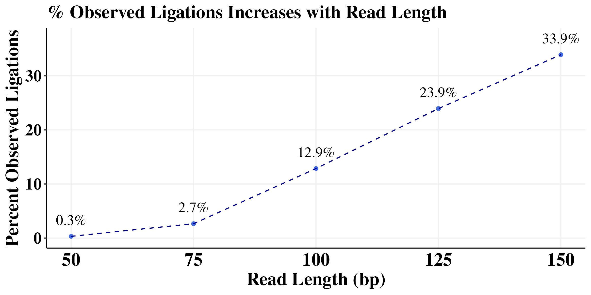
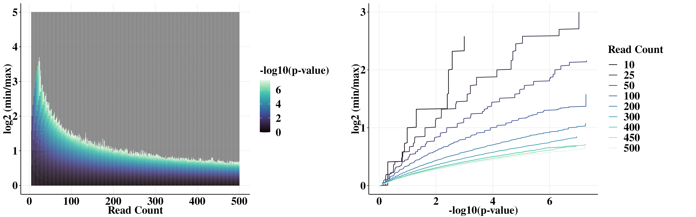

Supplemental Figures
================

- [Set the path](#set-the-path)
- [Supplemental Figure 1](#supplemental-figure-1)
- [Supplemental Figure 2](#supplemental-figure-2)
- [Supplemental Figure 3](#supplemental-figure-3)
- [Supplemental Figure 4](#supplemental-figure-4)
- [Supplemental Figure 5](#supplemental-figure-5)

``` r
library(foreach)
library(GenomicRanges)
library(readr)
library(rtracklayer)
library(scales)
library(plyranges)
library(nlme)
library(lme4)
library(viridis)
library(ggridges)
library(RColorBrewer)
library(cowplot)
library(gridExtra)
library(doParallel)
library(data.table)
library(Signac)
library(plyr)
library(dplyr)
library(ggplot2)
library(tidyverse)

num_cores = 8
registerDoParallel(cores=num_cores)
```

# Set the path

This is where we stored all those files in the protocol.

``` r
path <- "/aryeelab/users/corri/data/replicate_FF_results/"
```

# Supplemental Figure 1

stats_50bp.txt stats_75bp.txt stats_100bp.txt stats_125bp.txt  
stats_150bp.txt

Note to self: files moved from
“/data/aryee/corri/CTCF_paper_fastq_dif_length/” to
/aryeelab/users/corri/data/

``` r
dir <- "/aryeelab/users/corri/data/"

stats_files <- (vector(mode = "list", length = 5))
iter <- 1
for (read_len in c(50,75,100,125,150)){
  print(read_len)
  
  stats <- read_table2(paste0(dir,"stats_",read_len,"bp.txt"), col_names = FALSE)
  stats$read_length <- read_len
  stats_files[[iter]] <- stats
  iter <- iter + 1
}

stats_df <- bind_rows(stats_files) 
```

``` r
colnames(stats_df) <- c("Name","Number","Read_Length")


obs_lig <- stats_df %>%
  filter(Name %in% c("pair_types/uu","pair_types/Uu","pair_types/uU","pair_types/UR","pair_types/RU")) %>% 
  group_by(Read_Length) %>% 
  summarize(obs_lig = sum(Number))

unobs_lig <- stats_df %>%
  filter(Name %in% c("pair_types/UU")) %>% 
  group_by(Read_Length) %>% 
  summarize(unobs_lig = sum(Number))

all_types <- cbind(obs_lig,unobs_lig)[,c(1,2,4)]

all_types <- all_types %>% 
  mutate(obs_lig_freq = obs_lig / (obs_lig + unobs_lig))

RL_obs_lig <- all_types %>% 
  mutate(perc_obs_lig = obs_lig_freq * 100) %>% 
  ggplot(aes(x = Read_Length, y = perc_obs_lig,label =paste0(round(perc_obs_lig, 1), "%" ))) +
  geom_point(col =  "royalblue") +
  geom_text(hjust=0.5, vjust=-1.2, colour = "black", family = "Times New Roman",size = 5) +
  geom_line(col = "darkblue", linetype = "dashed") +
  xlab("Read Length (bp)") +
  ylab("Percent Observed Ligations")+
  theme_classic() +
  theme(panel.grid.major = element_line(color = "#f0f0f0",
                                        size = 0.5))+
  theme(plot.title = element_text(color = "black", family = "Times New Roman", size = 18, face = "bold"),
        axis.text.x = element_text(color = "black", family = "Times New Roman", size = 18,face = "bold"),
        axis.text.y = element_text(color = "black", family = "Times New Roman", size = 16,face = "bold"),
        axis.title.x = element_text(color = "black", family = "Times New Roman", size = 18,face = "bold"),
        axis.title.y = element_text(color = "black", family = "Times New Roman", size = 18,face = "bold"),
        axis.ticks.x=element_blank(),
        legend.text=element_text(color = "black", family = "Times New Roman", size =18,face = "bold"),
        legend.title=element_text(color = "black", family = "Times New Roman", size = 18,face = "bold"),
        strip.text.x = element_text(color = "black", family = "Times New Roman", size = 18,face = "bold"),
        strip.text.y = element_text(color = "black", family = "Times New Roman", size = 18,face = "bold"),
        strip.background=element_rect(colour="#f0f0f0",fill="#f0f0f0"))+
  ylim(c(0,37)) +
  ggtitle("% Observed Ligations Increases with Read Length")

RL_obs_lig 
#ggsave(paste0(path,"S_obs_lig.png"), width=8, height=4)
```



# Supplemental Figure 2

``` r
df_p <- readRDS(file = paste0(path, "df_p_1e8.RDS"))
```

min/max ratio by num_reads p-value grid:

``` r
p1 <- df_p %>% 
  mutate(log_pval = -log10(p)) %>% 
  ggplot(aes(num_reads, log_min_max, fill=log_pval)) + 
  geom_tile() +
  scale_fill_viridis(option = "mako")+
  ylab("log2 (min/max)")  +
  xlab("Read Count")+
  labs(fill = "-log10(p-value)")+
  theme_classic()+
  theme(panel.grid.major = element_line(color = "#f0f0f0",
                                        size = 0.5))+
  theme(plot.title = element_text(color = "black", family = "Times New Roman", size = 18, face = "bold"),
        axis.text.x = element_text(color = "black", family = "Times New Roman", size = 18,face = "bold"),
        axis.text.y = element_text(color = "black", family = "Times New Roman", size = 18,face = "bold"),
        axis.title.x = element_text(color = "black", family = "Times New Roman", size = 18,face = "bold"),
        axis.title.y = element_text(color = "black", family = "Times New Roman", size = 18,face = "bold"),
        axis.ticks.x=element_blank(),
        legend.text=element_text(color = "black", family = "Times New Roman", size =18,face = "bold"),
        legend.title=element_text(color = "black", family = "Times New Roman", size = 18,face = "bold"),
        strip.text.x = element_text(color = "black", family = "Times New Roman", size = 18,face = "bold"),
        strip.background=element_rect(colour="#f0f0f0",fill="#f0f0f0"))
```

Which log(min/max) value to choose for a given p-value cutoff?

``` r
p2 <- df_p %>% 
  filter(p != 0) %>% 
  mutate(log_p = -log10(p)) %>% 
  filter(num_reads %in% c(10, 25, 50,100,200,300,400, 450,500)) %>% 
  mutate(num_reads=factor(num_reads)) %>% 
  ggplot(aes(-log10(p), log_min_max, group=num_reads, color=num_reads)) + 
  geom_line() + 
  scale_color_viridis_d(option = "mako")+
  ylim(0,3)+
  ylab("log2 (min/max)")  +
  xlab("-log10(p-value)")+
  labs(color = "Read Count")+
  theme_classic()+
  theme(panel.grid.major = element_line(color = "#f0f0f0",
                                        size = 0.5))+
  theme(plot.title = element_text(color = "black", family = "Times New Roman", size = 18, face = "bold"),
        axis.text.x = element_text(color = "black", family = "Times New Roman", size = 18,face = "bold"),
        axis.text.y = element_text(color = "black", family = "Times New Roman", size = 18,face = "bold"),
        axis.title.x = element_text(color = "black", family = "Times New Roman", size = 18,face = "bold"),
        axis.title.y = element_text(color = "black", family = "Times New Roman", size = 18,face = "bold"),
        axis.ticks.x=element_blank(),
        legend.text=element_text(color = "black", family = "Times New Roman", size =18,face = "bold"),
        legend.title=element_text(color = "black", family = "Times New Roman", size = 18,face = "bold"),
        strip.text.x = element_text(color = "black", family = "Times New Roman", size = 18,face = "bold"),
        strip.background=element_rect(colour="#f0f0f0",fill="#f0f0f0"))
```

``` r
plot_grid(plotlist = list(p1,p2), align = "hv", axis = "tblr")
#ggsave(paste0(path,"S_FF_statistic.png"), width=16, height=5)
```



# Supplemental Figure 3

See Figure5.Rmd for the code to make this figure. Shown below for
reference.


# Supplemental Figure 4

See Figure5.Rmd for the code to make this figure. Shown below for
reference.


# Supplemental Figure 5


